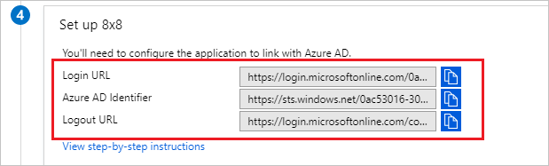
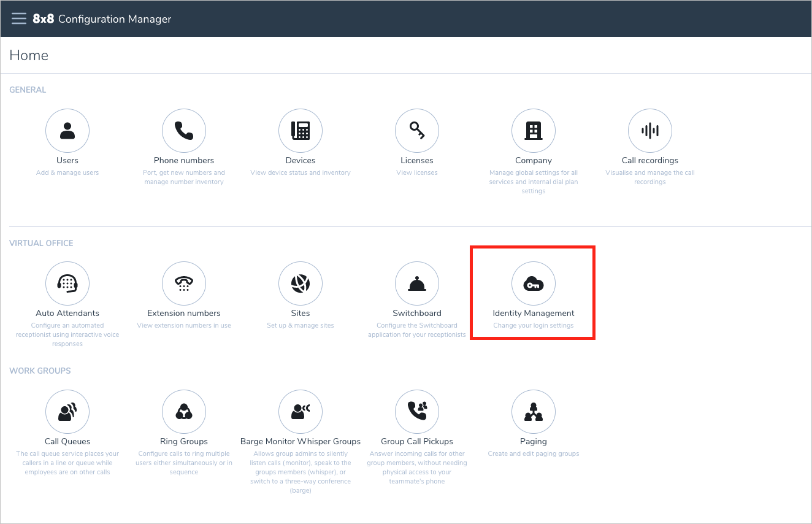
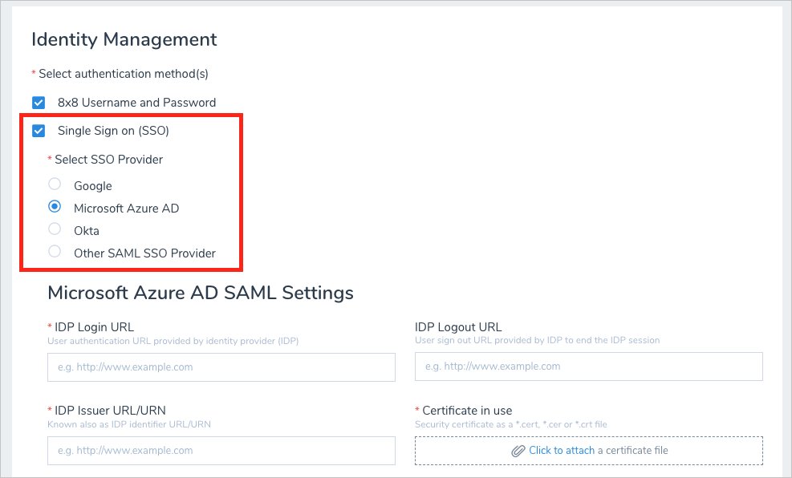
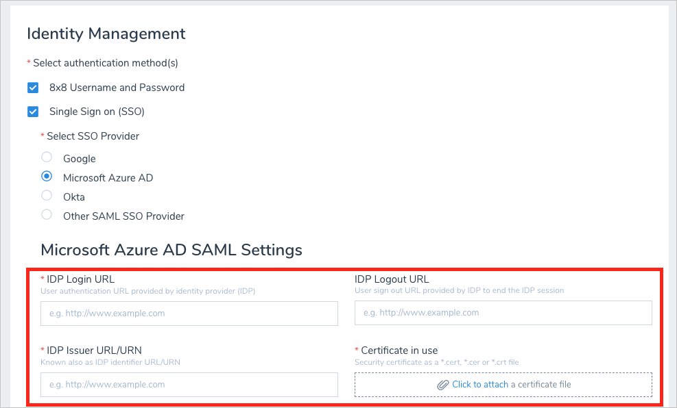

# Tutorial: Azure Active Directory single sign-on (SSO) integration with 8x8

In this tutorial, you'll learn how to integrate 8x8 with Azure Active Directory (Azure AD). When you integrate 8x8 with Azure AD, you can:

* Control in Azure AD who has access to 8x8.
* Enable your users to be automatically signed-in to 8x8 with their Azure AD accounts.
* Manage your accounts in one central location - the Azure portal.

To learn more about SaaS app integration with Azure AD, see [What is application access and single sign-on with Azure Active Directory](https://docs.microsoft.com/azure/active-directory/manage-apps/what-is-single-sign-on).

## Prerequisites

To get started, you need the following items:

* An Azure AD subscription. If you don't have a subscription, you can get a [free account](https://azure.microsoft.com/free/).
* An 8x8 subscription.

## Scenario description

In this tutorial, you configure and test Azure AD SSO in a test environment.

* 8x8 supports **SP and IDP** initiated SSO

* Once you configure 8x8 you can enforce session control, which protect exfiltration and infiltration of your organization’s sensitive data in real-time. Session control extend from Conditional Access. [Learn how to enforce session control with Microsoft Cloud App Security](https://docs.microsoft.com/cloud-app-security/proxy-deployment-any-app).

> [!NOTE]
> Identifier of this application is a fixed string value so only one instance can be configured in one tenant.

## Adding 8x8 from the gallery

To configure the integration of 8x8 into Azure AD, you need to add 8x8 from the gallery to your list of managed SaaS apps.

1. Sign in to the [Azure portal](https://portal.azure.com) using either a work or school account, or a personal Microsoft account.
1. On the left navigation pane, select the **Azure Active Directory** service.
1. Navigate to **Enterprise Applications** and then select **All Applications**.
1. To add new application, select **New application**.
1. In the **Add from the gallery** section, type **8x8** in the search box.
1. Select **8x8** from results panel and then add the app. Wait a few seconds while the app is added to your tenant.

## Configure and test Azure AD single sign-on for 8x8

Configure and test Azure AD SSO with 8x8 using a test user called **B.Simon**. For SSO to work, you need to establish a link relationship between an Azure AD user and the related user in 8x8.

To configure and test Azure AD SSO with 8x8, complete the following building blocks:

1. **[Configure Azure AD SSO](#configure-azure-ad-sso)** - to enable your users to use this feature.
    1. **[Create an Azure AD test user](#create-an-azure-ad-test-user)** - to test Azure AD single sign-on with B.Simon.
    1. **[Assign the Azure AD test user](#assign-the-azure-ad-test-user)** - to enable B.Simon to use Azure AD single sign-on.
1. **[Configure 8x8 SSO](#configure-8x8-sso)** - to configure the single sign-on settings on application side.
    1. **[Create 8x8 test user](#create-8x8-test-user)** - to have a counterpart of B.Simon in 8x8 that is linked to the Azure AD representation of user.
1. **[Test SSO](#test-sso)** - to verify whether the configuration works.

## Configure Azure AD SSO

Follow these steps to enable Azure AD SSO in the Azure portal.

1. In the [Azure portal](https://portal.azure.com/), on the **8x8** application integration page, find the **Manage** section and select **single sign-on**.
1. On the **Select a single sign-on method** page, select **SAML**.
1. On the **Set up single sign-on with SAML** page, click the edit/pen icon for **Basic SAML Configuration** to edit the settings.

   

1. On the **Basic SAML Configuration** section, perform the following steps:

    a. In the **Identifier** text box, type a URL: `https://sso.8x8.com/saml2`

    b. In the **Reply URL** text box, type a URL: `https://sso.8x8.com/saml2`

1. On the **Set up single sign-on with SAML** page, in the **SAML Signing Certificate** section,  find **Certificate (Base64)** and select **Download** to download the certificate and save it on your computer. You will use the certificate later in the tutorial in the **Configure 8x8 SSO** section.

	

1. On the **Set up 8x8** section, copy the URL(s) and you will use these URL values later in the tutorial.

	

### Create an Azure AD test user

In this section, you'll create a test user in the Azure portal called B.Simon.

1. From the left pane in the Azure portal, select **Azure Active Directory**, select **Users**, and then select **All users**.
1. Select **New user** at the top of the screen.
1. In the **User** properties, follow these steps:
   1. In the **Name** field, enter `B.Simon`.  
   1. In the **User name** field, enter the username@companydomain.extension. For example, `B.Simon@contoso.com`.
   1. Select the **Show password** check box, and then write down the value that's displayed in the **Password** box.
   1. Click **Create**.

### Assign the Azure AD test user

In this section, you'll enable B.Simon to use Azure single sign-on by granting access to 8x8.

1. In the Azure portal, select **Enterprise Applications**, and then select **All applications**.
1. In the applications list, select **8x8**.
1. In the app's overview page, find the **Manage** section and select **Users and groups**.

   

1. Select **Add user**, then select **Users and groups** in the **Add Assignment** dialog.

	

1. In the **Users and groups** dialog, select **B.Simon** from the Users list, then click the **Select** button at the bottom of the screen.
1. In the **Add Assignment** dialog, click the **Assign** button.

## Configure 8x8 SSO

The next part of the tutorial depends on what kind of subscription you have with 8x8.

* For 8x8 Editions and X Series customers using Configuration Manager for administration, refer to [Configure 8x8 Configuration Manager](#configure-8x8-configuration-manager).
* For Virtual Office customers using Account Manager for administration, refer to [Configure 8x8 Account Manager](#configure-8x8-account-manager).

### Configure 8x8 Configuration Manager

1. Log in to 8x8 [Configuration Manager](https://vo-cm.8x8.com/).

1. From the home page click **Identity Management**.

    

1. Check **Single Sign On (SSO)** then select **Microsoft Azure AD**.

    

1. Copy the three URLs and signing certificate from the **Set up Single Sign-On with SAML** page in Azure AD into the **Microsoft Azure AD SAML Settings** section in 8x8 Configuration Manager.

    

    a. Copy **Login URL** to **IDP Login URL**.

    b. Copy **Azure AD Identifier** to **IDP Issuer URL/URN**.

    c. Copy **Logout URL** to **IDP Logout URL**.

    d. Download **Certificate (Base64)** and upload to **Certificate**.

    e. Click **Save**.

### Configure 8x8 Account Manager

1. Sign-on to your 8x8 Virtual Office tenant as an administrator.

1. Select **Virtual Office Account Mgr** on Application Panel.

    

1. Select **Business** account to manage and click **Sign In** button.

    

1. Click **ACCOUNTS** tab in the menu list.

    

1. Click **Single Sign On** in the list of Accounts.

    

1. Select **Single Sign On** under Authentication methods and click **SAML**.

    

1. In the **SAML Single Sign on** section, perform the following steps:

    

    a. In the **Sign In URL** textbox, paste **Login URL** value which you have copied from the Azure portal.

    b. In the **Sign Out URL** textbox, paste **Logout URL** value which you have copied from the Azure portal.

    c. In the **Issuer URL** textbox, paste **Azure AD Identifier** value which you have copied from the Azure portal.

    d. Click **Browse** button to upload the certificate which you downloaded from Azure portal.

    e. Click the **Save** button.

### Create 8x8 test user

In this section, you create a user called Britta Simon in 8x8. Work with [8x8 support team](https://www.8x8.com/about-us/contact-us) to add the users in the 8x8 platform. Users must be created and activated before you use single sign-on.

## Test SSO

In this section, you test your Azure AD single sign-on configuration using the Access Panel.

When you click the 8x8 tile in the Access Panel, you should be automatically signed in to the 8x8 for which you set up SSO. For more information about the Access Panel, see [Introduction to the Access Panel](https://docs.microsoft.com/azure/active-directory/active-directory-saas-access-panel-introduction).

## Additional resources

- [ List of Tutorials on How to Integrate SaaS Apps with Azure Active Directory ](https://docs.microsoft.com/azure/active-directory/active-directory-saas-tutorial-list)

- [What is application access and single sign-on with Azure Active Directory? ](https://docs.microsoft.com/azure/active-directory/manage-apps/what-is-single-sign-on)

- [What is conditional access in Azure Active Directory?](https://docs.microsoft.com/azure/active-directory/conditional-access/overview)

- [Try 8x8 with Azure AD](https://aad.portal.azure.com/)

- [What is session control in Microsoft Cloud App Security?](https://docs.microsoft.com/cloud-app-security/proxy-intro-aad)

- [How to protect 8x8 with advanced visibility and controls](https://docs.microsoft.com/cloud-app-security/proxy-intro-aad)