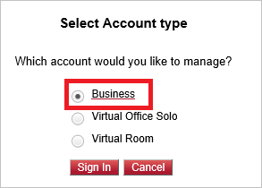
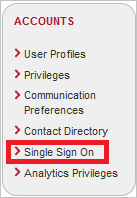
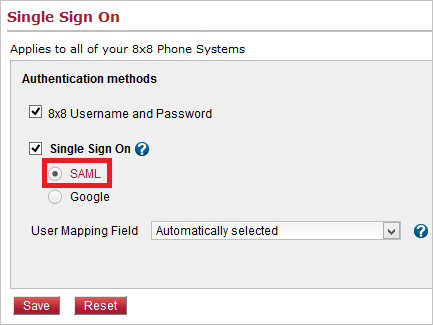
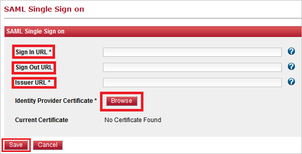

# Tutorial: Azure Active Directory integration with 8x8 Virtual Office

In this tutorial, you learn how to integrate 8x8 Virtual Office with Azure Active Directory (Azure AD).
Integrating 8x8 Virtual Office with Azure AD provides you with the following benefits:

* You can control in Azure AD who has access to 8x8 Virtual Office.
* You can enable your users to be automatically signed-in to 8x8 Virtual Office (Single Sign-On) with their Azure AD accounts.
* You can manage your accounts in one central location - the Azure portal.

If you want to know more details about SaaS app integration with Azure AD, see [What is application access and single sign-on with Azure Active Directory](https://docs.microsoft.com/azure/active-directory/active-directory-appssoaccess-whatis).
If you don't have an Azure subscription, [create a free account](https://azure.microsoft.com/free/) before you begin.

## Prerequisites

To configure Azure AD integration with 8x8 Virtual Office, you need the following items:

* An Azure AD subscription. If you don't have an Azure AD environment, you can get one-month trial [here](https://azure.microsoft.com/pricing/free-trial/)
* 8x8 Virtual Office single sign-on enabled subscription

## Scenario description

In this tutorial, you configure and test Azure AD single sign-on in a test environment.

* 8x8 Virtual Office supports **IDP** initiated SSO

* 8x8 Virtual Office supports **Just In Time** user provisioning

## Adding 8x8 Virtual Office from the gallery

To configure the integration of 8x8 Virtual Office into Azure AD, you need to add 8x8 Virtual Office from the gallery to your list of managed SaaS apps.

**To add 8x8 Virtual Office from the gallery, perform the following steps:**

1. In the **[Azure portal](https://portal.azure.com)**, on the left navigation panel, click **Azure Active Directory** icon.

	

2. Navigate to **Enterprise Applications** and then select the **All Applications** option.

	

3. To add new application, click **New application** button on the top of dialog.

	

4. In the search box, type **8x8 Virtual Office**, select **8x8 Virtual Office** from result panel then click **Add** button to add the application.

	 

## Configure and test Azure AD single sign-on

In this section, you configure and test Azure AD single sign-on with 8x8 Virtual Office based on a test user called **Britta Simon**.
For single sign-on to work, a link relationship between an Azure AD user and the related user in 8x8 Virtual Office needs to be established.

To configure and test Azure AD single sign-on with 8x8 Virtual Office, you need to complete the following building blocks:

1. **[Configure Azure AD Single Sign-On](#configure-azure-ad-single-sign-on)** - to enable your users to use this feature.
2. **[Configure 8x8 Virtual Office Single Sign-On](#configure-8x8-virtual-office-single-sign-on)** - to configure the Single Sign-On settings on application side.
3. **[Create an Azure AD test user](#create-an-azure-ad-test-user)** - to test Azure AD single sign-on with Britta Simon.
4. **[Assign the Azure AD test user](#assign-the-azure-ad-test-user)** - to enable Britta Simon to use Azure AD single sign-on.
5. **[Create 8x8 Virtual Office test user](#create-8x8-virtual-office-test-user)** - to have a counterpart of Britta Simon in 8x8 Virtual Office that is linked to the Azure AD representation of user.
6. **[Test single sign-on](#test-single-sign-on)** - to verify whether the configuration works.

### Configure Azure AD single sign-on

In this section, you enable Azure AD single sign-on in the Azure portal.

To configure Azure AD single sign-on with 8x8 Virtual Office, perform the following steps:

1. In the [Azure portal](https://portal.azure.com/), on the **8x8 Virtual Office** application integration page, select **Single sign-on**.

    

2. On the **Select a Single sign-on method** dialog, select **SAML/WS-Fed** mode to enable single sign-on.

    

3. On the **Set up Single Sign-On with SAML** page, click **Edit** icon to open **Basic SAML Configuration** dialog.

	

4. On the **Basic SAML Configuration** dialog, perform the following steps:

    

    a. In the **Identifier** text box, type a URL using the following pattern:
    `https://sso.8x8.com/saml2`

    b. In the **Reply URL** text box, type a URL using the following pattern:
    `https://sso.8x8.com/saml2`

4. On the **Set up Single Sign-On with SAML** page, in the **SAML Signing Certificate** section, click **Download** to download the **Certificate (Raw)** from the given options as per your requirement and save it on your computer.

	

6. On the **Set up 8x8 Virtual Office** section, copy the appropriate URL(s) as per your requirement.

	

	a. Login URL

	b. Azure Ad Identifier

	c. Logout URL

### Configure 8x8 Virtual Office Single Sign-On

1. Sign-on to your 8x8 Virtual Office tenant as an administrator.

1. Select **Virtual Office Account Mgr** on Application Panel.

    

1. Select **Business** account to manage and click **Sign In** button.

    

1. Click **ACCOUNTS** tab in the menu list.

   

1. Click **Single Sign On** in the list of Accounts.
  
   

1. Select **Single Sign On** under Authentication methods and click **SAML**.

   

1. In the **SAML Single Sign on** section, perform the following steps:

   

   a. In the **Sign In URL** textbox, paste **Login URL** value which you have copied from the Azure portal.

   b. In the **Sign Out URL** textbox, paste **Logout URL** value which you have copied from the Azure portal.

   c. In the **Issuer URL** textbox, paste **Azure AD Identifier** value which you have copied from the Azure portal.

   d. Click **Browse** button to upload the certificate which you downloaded from Azure portal.

   e. Click the **Save** button.

### Create an Azure AD test user 

The objective of this section is to create a test user in the Azure portal called Britta Simon.

1. In the Azure portal, in the left pane, select **Azure Active Directory**, select **Users**, and then select **All users**.

    

2. Select **New user** at the top of the screen.

    

3. In the User properties, perform the following steps.

    

    a. In the **Name** field enter **BrittaSimon**.
  
    b. In the **User name** field type **brittasimon\@yourcompanydomain.extension**  
    For example, BrittaSimon@contoso.com

    c. Select **Show password** check box, and then write down the value that's displayed in the Password box.

    d. Click **Create**.

### Assign the Azure AD test user

In this section, you enable Britta Simon to use Azure single sign-on by granting access to 8x8 Virtual Office.

1. In the Azure portal, select **Enterprise Applications**, select **All applications**, then select **8x8 Virtual Office**.

	

2. In the applications list, type and select **8x8 Virtual Office**.

	

3. In the menu on the left, select **Users and groups**.

    

4. Click the **Add user** button, then select **Users and groups** in the **Add Assignment** dialog.

    

5. In the **Users and groups** dialog select **Britta Simon** in the Users list, then click the **Select** button at the bottom of the screen.

6. If you are expecting any role value in the SAML assertion then in the **Select Role** dialog select the appropriate role for the user from the list, then click the **Select** button at the bottom of the screen.

7. In the **Add Assignment** dialog click the **Assign** button.

### Create 8x8 Virtual Office test user

In this section, a user called Britta Simon is created in 8x8 Virtual Office. 8x8 Virtual Office supports **just-in-time user provisioning**, which is enabled by default. There is no action item for you in this section. If a user doesn't already exist in 8x8 Virtual Office, a new one is created after authentication.

> [!NOTE]
> If you need to create a user manually, you need to contact the [8x8 Virtual Office support team](https://www.8x8.com/about-us/contact-us).

### Test single sign-on 

In this section, you test your Azure AD single sign-on configuration using the Access Panel.

When you click the 8x8 Virtual Office tile in the Access Panel, you should be automatically signed in to the 8x8 Virtual Office for which you set up SSO. For more information about the Access Panel, see [Introduction to the Access Panel](https://docs.microsoft.com/azure/active-directory/active-directory-saas-access-panel-introduction).

## Additional Resources

- [List of Tutorials on How to Integrate SaaS Apps with Azure Active Directory](https://docs.microsoft.com/azure/active-directory/active-directory-saas-tutorial-list)

- [What is application access and single sign-on with Azure Active Directory?](https://docs.microsoft.com/azure/active-directory/active-directory-appssoaccess-whatis)

- [What is Conditional Access in Azure Active Directory?](https://docs.microsoft.com/azure/active-directory/conditional-access/overview)

