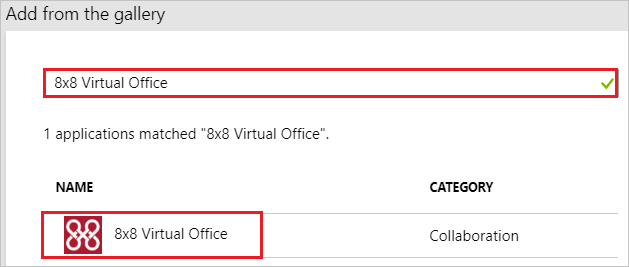
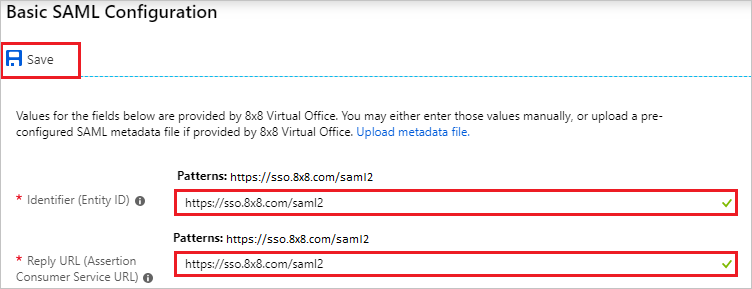
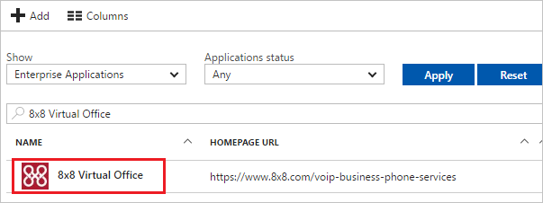

# Tutorial: Azure Active Directory integration with 8x8 Virtual Office

In this tutorial, you learn how to integrate 8x8 Virtual Office with Azure Active Directory (Azure AD).

Integrating 8x8 Virtual Office with Azure AD provides you with the following benefits:

- You can control in Azure AD who has access to 8x8 Virtual Office.
- You can enable your users to automatically get signed-on to 8x8 Virtual Office (Single Sign-On) with their Azure AD accounts.
- You can manage your accounts in one central location - the Azure portal.

If you want to know more details about SaaS app integration with Azure AD, see [what is application access and single sign-on with Azure Active Directory](../manage-apps/what-is-single-sign-on.md)

## Prerequisites

To configure Azure AD integration with 8x8 Virtual Office, you need the following items:

- An Azure AD subscription
- A 8x8 Virtual Office single sign-on enabled subscription

> [!NOTE]
> To test the steps in this tutorial, we do not recommend using a production environment.

To test the steps in this tutorial, you should follow these recommendations:

- Do not use your production environment, unless it is necessary.
- If you don't have an Azure AD trial environment, you can [get a one-month trial](https://azure.microsoft.com/pricing/free-trial/).

## Scenario description

In this tutorial, you test Azure AD single sign-on in a test environment. 
The scenario outlined in this tutorial consists of two main building blocks:

1. Adding 8x8 Virtual Office from the gallery
2. Configuring and testing Azure AD single sign-on

## Adding 8x8 Virtual Office from the gallery

To configure the integration of 8x8 Virtual Office into Azure AD, you need to add 8x8 Virtual Office from the gallery to your list of managed SaaS apps.

**To add 8x8 Virtual Office from the gallery, perform the following steps:**

1. In the **[Azure portal](https://portal.azure.com)**, on the left navigation panel, click **Azure Active Directory** icon. 

	![The Azure Active Directory button][1]

2. Navigate to **Enterprise applications**. Then go to **All applications**.

	![The Enterprise applications blade][2]
	
3. To add new application, click **New application** button on the top of dialog.

	![The New application button][3]

4. In the search box, type **8x8 Virtual Office**, select **8x8 Virtual Office** from result panel then click **Add** button to add the application.

	

## Configure and test Azure AD single sign-on

In this section, you configure and test Azure AD single sign-on with 8x8 Virtual Office based on a test user called "Britta Simon".

For single sign-on to work, Azure AD needs to know what the counterpart user in 8x8 Virtual Office is to a user in Azure AD. In other words, a link relationship between an Azure AD user and the related user in 8x8 Virtual Office needs to be established.

To configure and test Azure AD single sign-on with 8x8 Virtual Office, you need to complete the following building blocks:

1. **[Configuring Azure AD Single Sign-On](#configuring-azure-ad-single-sign-on)** - to enable your users to use this feature.
2. **[Creating an Azure AD test user](#creating-an-azure-ad-test-user)** - to test Azure AD single sign-on with Britta Simon.
3. **[Creating a 8x8 Virtual Office test user](#creating-a-8x8-virtual-office-test-user)** - to have a counterpart of Britta Simon in 8x8 Virtual Office that is linked to the Azure AD representation of user.
4. **[Assigning the Azure AD test user](#assigning-the-azure-ad-test-user)** - to enable Britta Simon to use Azure AD single sign-on.
5. **[Testing single sign-on](#testing-single-sign-on)** - to verify whether the configuration works.

### Configuring Azure AD single sign-on

In this section, you enable Azure AD single sign-on in the Azure portal and configure single sign-on in your 8x8 Virtual Office application.

**To configure Azure AD single sign-on with 8x8 Virtual Office, perform the following steps:**

1. In the Azure portal, on the **8x8 Virtual Office** application integration page, click **Single sign-on**.

	![Configure single sign-on link][4]

2. On the **Select a Single sign-on method** dialog, Click **Select** for **SAML** mode to enable single sign-on.

    

3. On the **Set up Single Sign-On with SAML** page, click **Edit** icon to open **Basic SAML Configuration** dialog.

	

4. On the **Basic SAML Configuration** section, perform the following steps:

	

    a. In the **Identifier** textbox, type a URL: `https://sso.8x8.com/saml2`

	b. In the **Reply URL** textbox, type a URL: `https://sso.8x8.com/saml2`

5. On the **SAML Signing Certificate** page, in the **SAML Signing Certificate** section, click **Download** to download **Certificate (Raw)** and then save certificate file on your computer.

	 

6. On the **Set up 8x8 Virtual Office** section, copy the appropriate URL as per your requirement.

	a. Login URL

	b. Azure AD Identifier

	c. Logout URL

	

7. Sign-on to your 8x8 Virtual Office tenant as an administrator.

8. Select **Virtual Office Account Mgr** on Application Panel.

    

9. Select **Business** account to manage and click **Sign In** button.

    

10. Click **ACCOUNTS** tab in the menu list.

    

11. Click **Single Sign On** in the list of Accounts.
  
    

12. Select **Single Sign On** under Authentication methods and click **SAML**.

    

13. In the **SAML Single Sign on** section, perform the following steps:

	

	a. In the **Sign In URL** textbox, paste **Login URL** value which you have copied from the Azure portal.

	b. In the **Sign Out URL** textbox, paste **Logout URL** value which you have copied from the Azure portal.

	c. In the **Issuer URL** textbox, paste **Azure AD Identifier** value which you have copied from the Azure portal.

	d. Click **Browse** button to upload the certificate which you downloaded from Azure portal.

	e. Click the **Save** button.

### Creating an Azure AD test user

The objective of this section is to create a test user in the Azure portal called Britta Simon.

1. In the Azure portal, in the left pane, select **Azure Active Directory**, select **Users**, and then select **All users**.

	![Create Azure AD User][100]

2. Select **New user** at the top of the screen.

	 

3. In the User properties, perform the following steps.

	

    a. In the **Name** field, enter **BrittaSimon**.
  
    b. In the **User name** field, type **brittasimon@yourcompanydomain.extension**  
    For example, BrittaSimon@contoso.com

    c. Select **Properties**, select the **Show password** check box, and then write down the value that's displayed in the Password box.

    d. Select **Create**.
  
### Creating a 8x8 Virtual Office test user

The objective of this section is to create a user called Britta Simon in 8x8 Virtual Office. 8x8 Virtual Office supports just-in-time provisioning, which is by default enabled.

There is no action item for you in this section. A new user is created during an attempt to access 8x8 Virtual Office if it doesn't exist yet.

> [!NOTE]
> If you need to create a user manually, you need to contact the [8x8 Virtual Office support team](https://www.8x8.com/about-us/contact-us).

### Assigning the Azure AD test user

In this section, you enable Britta Simon to use Azure single sign-on by granting access to 8x8 Virtual Office.

1. In the Azure portal, select **Enterprise Applications**, select **All applications**.

	![Assign User][201]

2. In the applications list, select **8x8 Virtual Office**.

	 

3. In the menu on the left, click **Users and groups**.

	![Assign User][202]

4. Click **Add** button. Then select **Users and groups** on **Add Assignment** dialog.

	![Assign User][203]

5. In the **Users and groups** dialog select **Britta Simon** in the Users list, then click the **Select** button at the bottom of the screen.

6. In the **Add Assignment** dialog select the **Assign** button.

### Testing single sign-on

In this section, you test your Azure AD single sign-on configuration using the Access Panel.

When you click the 8x8 Virtual Office tile in the Access Panel, you should get automatically signed-on to your 8x8 Virtual Office application.
For more information about the Access Panel, see [Introduction to the Access Panel](../user-help/active-directory-saas-access-panel-introduction.md).

## Additional resources

* [List of Tutorials on How to Integrate SaaS Apps with Azure Active Directory](tutorial-list.md)
* [What is application access and single sign-on with Azure Active Directory?](../manage-apps/what-is-single-sign-on.md)

<!--Image references-->

[1]: common/tutorial_general_01.png
[2]: common/tutorial_general_02.png
[3]: common/tutorial_general_03.png
[4]: common/tutorial_general_04.png

[100]: common/tutorial_general_100.png

[201]: common/tutorial_general_201.png
[202]: common/tutorial_general_202.png
[203]: common/tutorial_general_203.png
