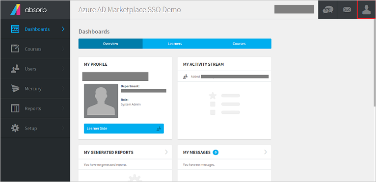
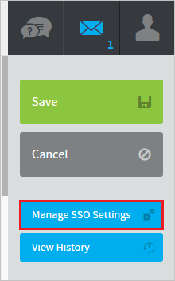
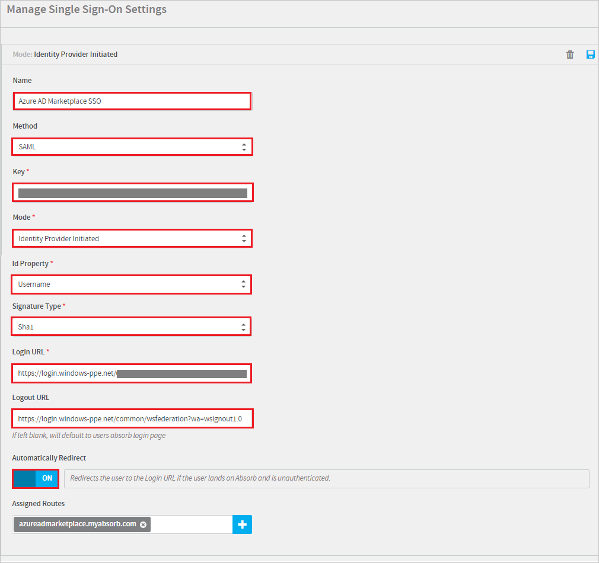
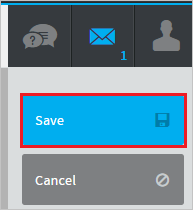
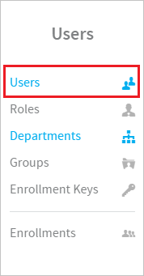
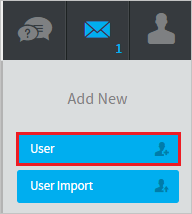

# Tutorial: Azure Active Directory integration with Absorb LMS

In this tutorial, you learn how to integrate Absorb LMS with Azure Active Directory (Azure AD).
Integrating Absorb LMS with Azure AD provides you with the following benefits:

* You can control in Azure AD who has access to Absorb LMS.
* You can enable your users to be automatically signed-in to Absorb LMS (Single Sign-On) with their Azure AD accounts.
* You can manage your accounts in one central location - the Azure portal.

If you want to know more details about SaaS app integration with Azure AD, see [What is application access and single sign-on with Azure Active Directory](https://docs.microsoft.com/azure/active-directory/active-directory-appssoaccess-whatis).
If you don't have an Azure subscription, [create a free account](https://azure.microsoft.com/free/) before you begin.

## Prerequisites

To configure Azure AD integration with Absorb LMS, you need the following items:

* An Azure AD subscription. If you don't have an Azure AD environment, you can get a [free account](https://azure.microsoft.com/free/)
* Absorb LMS single sign-on enabled subscription

## Scenario description

In this tutorial, you configure and test Azure AD single sign-on in a test environment.

* Absorb LMS supports **IDP** initiated SSO

## Adding Absorb LMS from the gallery

To configure the integration of Absorb LMS into Azure AD, you need to add Absorb LMS from the gallery to your list of managed SaaS apps.

**To add Absorb LMS from the gallery, perform the following steps:**

1. In the **[Azure portal](https://portal.azure.com)**, on the left navigation panel, click **Azure Active Directory** icon.

	

2. Navigate to **Enterprise Applications** and then select the **All Applications** option.

	

3. To add new application, click **New application** button on the top of dialog.

	

4. In the search box, type **Absorb LMS**, select **Absorb LMS** from result panel then click **Add** button to add the application.

	 

## Configure and test Azure AD single sign-on

In this section, you configure and test Azure AD single sign-on with Absorb LMS based on a test user called **Britta Simon**.
For single sign-on to work, a link relationship between an Azure AD user and the related user in Absorb LMS needs to be established.

To configure and test Azure AD single sign-on with Absorb LMS, you need to complete the following building blocks:

1. **[Configure Azure AD Single Sign-On](#configure-azure-ad-single-sign-on)** - to enable your users to use this feature.
2. **[Configure Absorb LMS Single Sign-On](#configure-absorb-lms-single-sign-on)** - to configure the Single Sign-On settings on application side.
3. **[Create an Azure AD test user](#create-an-azure-ad-test-user)** - to test Azure AD single sign-on with Britta Simon.
4. **[Assign the Azure AD test user](#assign-the-azure-ad-test-user)** - to enable Britta Simon to use Azure AD single sign-on.
5. **[Create Absorb LMS test user](#create-absorb-lms-test-user)** - to have a counterpart of Britta Simon in Absorb LMS that is linked to the Azure AD representation of user.
6. **[Test single sign-on](#test-single-sign-on)** - to verify whether the configuration works.

### Configure Azure AD single sign-on

In this section, you enable Azure AD single sign-on in the Azure portal.

To configure Azure AD single sign-on with Absorb LMS, perform the following steps:

1. In the [Azure portal](https://portal.azure.com/), on the **Absorb LMS** application integration page, select **Single sign-on**.

    

2. On the **Select a Single sign-on method** dialog, select **SAML/WS-Fed** mode to enable single sign-on.

    

3. On the **Set up Single Sign-On with SAML** page, click **Edit** icon to open **Basic SAML Configuration** dialog.

	

4. On the **Set up Single Sign-On with SAML** page, click **Edit** button to open **Basic SAML Configuration** dialog.

    

	If you are using **Absorb 5 - UI** use the following configuration:

	a. In the **Identifier** text box, type a URL using the following pattern:
    `https://company.myabsorb.com/account/saml`

    b. In the **Reply URL** text box, type a URL using the following pattern:
    `https://company.myabsorb.com/account/saml`

	If you are using **Absorb 5 - New Learner Experience** use the following configuration:

	a. In the **Identifier** text box, type a URL using the following pattern:
    `https://company.myabsorb.com/api/rest/v2/authentication/saml`

    b. In the **Reply URL** text box, type a URL using the following pattern:
    `https://company.myabsorb.com/api/rest/v2/authentication/saml`

	> [!NOTE]
	> These values are not real. Update these values with the actual Identifier and Reply URL. Contact [Absorb LMS Client support team](https://support.absorblms.com/hc/) to get these values. You can also refer to the patterns shown in the **Basic SAML Configuration** section in the Azure portal.

5. The following screenshot shows the list of default attributes, where as **nameidentifier** is mapped with **user.userprincipalname**.

	

6. On the **Set up Single Sign-On with SAML** page, in the **SAML Signing Certificate** section, click **Download** to download the **Federation Metadata XML** from the given options as per your requirement and save it on your computer.

	

7. On the **Set up Absorb LMS** section, copy the appropriate URL(s) as per your requirement.

	

	a. Login URL

	b. Azure AD Identifier

	c. Logout URL

### Configure Absorb LMS Single Sign-On

1. In a new web browser window, sign in to your Absorb LMS company site as an administrator.

2. Select the **Account** button at the top right.

	

3. In the Account pane, select **Portal Settings**.

	

4. Select the **Manage SSO Settings** tab.

	

5. On the **Manage Single Sign-On Settings** page, do the following:

	

    a. In the **Name** textbox, enter the name like Azure AD Marketplace SSO.

    b. Select **SAML** as a **Method**.

	c. In Notepad, open the certificate that you downloaded from the Azure portal. Remove the **---BEGIN CERTIFICATE---** and **---END CERTIFICATE---** tags. Then, in the **Key** box, paste the remaining content.

    d. In the **Mode** box, select **Identity Provider Initiated**.

	e. In the **Id Property** box, select the attribute that you configured as the user identifier in Azure AD. For example, if *nameidentifier* is selected in Azure AD, select **Username**.

    f. Select **Sha256** as a **Signature Type**.

	g. In the **Login URL** box, paste the **User Access URL** from the application's **Properties** page of the Azure portal.

	h. In the **Logout URL**, paste the **Sign-Out URL** value that you copied from the **Configure sign-on** window of the Azure portal.

    i. Toggle **Automatically Redirect** to **On**.

6. Select **Save.**

	

### Create an Azure AD test user

The objective of this section is to create a test user in the Azure portal called Britta Simon.

1. In the Azure portal, in the left pane, select **Azure Active Directory**, select **Users**, and then select **All users**.

    

2. Select **New user** at the top of the screen.

    

3. In the User properties, perform the following steps.

    

    a. In the **Name** field enter **BrittaSimon**.
  
    b. In the **User name** field type `brittasimon\@yourcompanydomain.extension`  
    For example, BrittaSimon@contoso.com

    c. Select **Show password** check box, and then write down the value that's displayed in the Password box.

    d. Click **Create**.

### Assign the Azure AD test user

In this section, you enable Britta Simon to use Azure single sign-on by granting access to Absorb LMS.

1. In the Azure portal, select **Enterprise Applications**, select **All applications**, then select **Absorb LMS**.

	

2. In the applications list, type and select **Absorb LMS**.

	

3. In the menu on the left, select **Users and groups**.

    

4. Click the **Add user** button, then select **Users and groups** in the **Add Assignment** dialog.

    

5. In the **Users and groups** dialog select **Britta Simon** in the Users list, then click the **Select** button at the bottom of the screen.

6. If you are expecting any role value in the SAML assertion then in the **Select Role** dialog select the appropriate role for the user from the list, then click the **Select** button at the bottom of the screen.

7. In the **Add Assignment** dialog click the **Assign** button.

### Create Absorb LMS test user

For Azure AD users to sign in to Absorb LMS, they must be set up in Absorb LMS. In the case of Absorb LMS, provisioning is a manual task.

**To configure user provisioning, perform the following steps:**

1. Sign in to your Absorb LMS company site as an administrator.

2. In the **Users** pane, select **Users**.

    

3. Select **User** tab.

    

4. On the **Add User** page, do the following:

	

	a. In the **First Name** box, type the first name, such as **Britta**.

	b. In the **Last Name** box, type the last name, such as **Simon**.

	c. In the **Username** box, type a full name, such as **Britta Simon**.

	d. In the **Password** box, type user password.

	e. In the **Confirm Password** box, retype the password.

	f. Set the **Is Active** toggle to **Active**.

5. Select **Save.**

	

	> [!NOTE]
	> By Default, User Provisioning is not enabled in SSO. If the customer wants to enable this feature, they have to set it up as mentioned in [this](https://support.absorblms.com/hc/en-us/articles/360014083294-Incoming-SAML-2-0-SSO-Account-Provisioning) documentation. Also please note that User Provisioing is only available on **Absorb 5 - New Learner Experience** with ACS URL-`https://company.myabsorb.com/api/rest/v2/authentication/saml`

### Test single sign-on

In this section, you test your Azure AD single sign-on configuration using the Access Panel.

When you click the Absorb LMS tile in the Access Panel, you should be automatically signed in to the Absorb LMS for which you set up SSO. For more information about the Access Panel, see [Introduction to the Access Panel](https://docs.microsoft.com/azure/active-directory/active-directory-saas-access-panel-introduction).

## Additional resources

- [List of Tutorials on How to Integrate SaaS Apps with Azure Active Directory](https://docs.microsoft.com/azure/active-directory/active-directory-saas-tutorial-list)

- [What is application access and single sign-on with Azure Active Directory?](https://docs.microsoft.com/azure/active-directory/active-directory-appssoaccess-whatis)

- [What is Conditional Access in Azure Active Directory?](https://docs.microsoft.com/azure/active-directory/conditional-access/overview)
