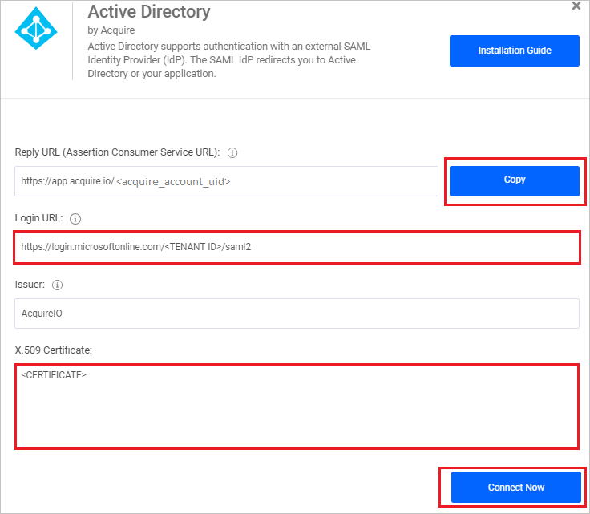
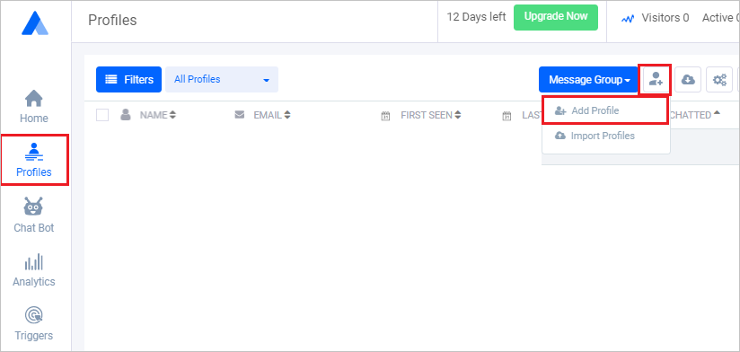

# Tutorial: Integrate AcquireIO with Azure Active Directory

In this tutorial, you'll learn how to integrate AcquireIO with Azure Active Directory (Azure AD). When you integrate AcquireIO with Azure AD, you can:

* Control in Azure AD who has access to AcquireIO.
* Enable your users to be automatically signed-in to AcquireIO with their Azure AD accounts.
* Manage your accounts in one central location - the Azure portal.

To learn more about SaaS app integration with Azure AD, see [What is application access and single sign-on with Azure Active Directory](https://docs.microsoft.com/azure/active-directory/active-directory-appssoaccess-whatis).

## Prerequisites

To get started, you need the following items:

* An Azure AD subscription. If you don't have a subscription, you can get a [free account](https://azure.microsoft.com/free/).
* AcquireIO single sign-on (SSO) enabled subscription.

## Scenario description

In this tutorial, you configure and test Azure AD SSO in a test environment. AcquireIO supports **IDP** initiated SSO.

## Adding AcquireIO from the gallery

To configure the integration of AcquireIO into Azure AD, you need to add AcquireIO from the gallery to your list of managed SaaS apps.

1. Sign in to the [Azure portal](https://portal.azure.com) using either a work or school account, or a personal Microsoft account.
1. On the left navigation pane, select the **Azure Active Directory** service.
1. Navigate to **Enterprise Applications** and then select **All Applications**.
1. To add new application, select **New application**.
1. In the **Add from the gallery** section, type **AcquireIO** in the search box.
1. Select **AcquireIO** from results panel and then add the app. Wait a few seconds while the app is added to your tenant.

## Configure and test Azure AD single sign-on

Configure and test Azure AD SSO with AcquireIO using a test user called **B.Simon**. For SSO to work, you need to establish a link relationship between an Azure AD user and the related user in AcquireIO.

To configure and test Azure AD SSO with AcquireIO, complete the following building blocks:

1. **[Configure Azure AD SSO](#configure-azure-ad-sso)** to enable your users to use this feature.
2. **[Configure AcquireIO](#configure-acquireio)** to configure the SSO settings on application side.
3. **[Create an Azure AD test user](#create-an-azure-ad-test-user)** to test Azure AD single sign-on with B.Simon.
4. **[Assign the Azure AD test user](#assign-the-azure-ad-test-user)** to enable B.Simon to use Azure AD single sign-on.
5. **[Create AcquireIO test user](#create-acquireio-test-user)** to have a counterpart of B.Simon in AcquireIO that is linked to the Azure AD representation of user.
6. **[Test SSO](#test-sso)** to verify whether the configuration works.

### Configure Azure AD SSO

Follow these steps to enable Azure AD SSO in the Azure portal.

1. In the [Azure portal](https://portal.azure.com/), on the **AcquireIO** application integration page, find the **Manage** section and select **Single sign-on**.
1. On the **Select a Single sign-on method** page, select **SAML**.
1. On the **Set up Single Sign-On with SAML** page, click the edit/pen icon for **Basic SAML Configuration** to edit the settings.

   

4. On the **Basic SAML Configuration** section, perform the following step:

    In the **Reply URL** text box, type a URL using the following pattern:
    `https://app.acquire.io/ad/<acquire_account_uid>`

	> [!NOTE]
	> The value is not real. You will get the actual Reply URL which is explained later in the **Configure AcquireIO** section of the tutorial. You can also refer to the patterns shown in the **Basic SAML Configuration** section in the Azure portal.

1. On the **Set up Single Sign-On with SAML** page, in the **SAML Signing Certificate** section, find **Certificate (Base64)** and select **Download** to download the certificate and save it on your computer.

   

1. On the **Set up AcquireIO** section, copy the appropriate URL(s) based on your requirement.

   

### Configure AcquireIO

1. In a different web browser window, sign in to AcquireIO as an Administrator.

2. From the left side of menu, click on **App Store**.

	 

3. Scroll down upto **Active Directory** and click on **Install**.

    

4. On the Active Directory pop-up, perform the following steps:

    

	a. Click **Copy** to copy the Reply URL for your instance and paste it in **Reply URL** textbox in **Basic SAML Configuration** section on Azure portal.

    b. In the **Login URL** textbox, paste the value of **Login URL**, which you have copied from Azure portal.

	c. Open the Base64 encoded certificate in Notepad, copy its content and paste it in the **X.509 Certificate** text box.

	d. Click **Connect Now**.

### Create an Azure AD test user

In this section, you'll create a test user in the Azure portal called B.Simon.

1. From the left pane in the Azure portal, select **Azure Active Directory**, select **Users**, and then select **All users**.
1. Select **New user** at the top of the screen.
1. In the **User** properties, follow these steps:
   1. In the **Name** field, enter `B.Simon`.  
   1. In the **User name** field, enter the username@companydomain.extension. For example, `B.Simon@contoso.com`.
   1. Select the **Show password** check box, and then write down the value that's displayed in the **Password** box.
   1. Click **Create**.

### Assign the Azure AD test user

In this section, you'll enable B.Simon to use Azure single sign-on by granting access to AcquireIO.

1. In the Azure portal, select **Enterprise Applications**, and then select **All applications**.
1. In the applications list, select **AcquireIO**.
1. In the app's overview page, find the **Manage** section and select **Users and groups**.

   

1. Select **Add user**, then select **Users and groups** in the **Add Assignment** dialog.

	

1. In the **Users and groups** dialog, select **B.Simon** from the Users list, then click the **Select** button at the bottom of the screen.
1. If you're expecting any role value in the SAML assertion, in the **Select Role** dialog, select the appropriate role for the user from the list and then click the **Select** button at the bottom of the screen.
1. In the **Add Assignment** dialog, click the **Assign** button.

### Create AcquireIO test user

To enable Azure AD users to sign in to AcquireIO, they must be provisioned into AcquireIO. In AcquireIO, provisioning is a manual task.

**To provision a user account, perform the following steps:**

1. In a different web browser window, sign in to AcquireIO as an Administrator.

2. From the left side of menu, click **Profiles** and navigate to **Add Profile**.

	 

3. On the **Add customer** pop-up, perform the following steps:

    

    a. In **Name** text box, enter the name of user like **B.simon**.

    b. In **Email** text box, enter the email of user like **B.simon@contoso.com**.

    c. Click **Submit**.

### Test SSO

When you select the AcquireIO tile in the Access Panel, you should be automatically signed in to the AcquireIO for which you set up SSO. For more information about the Access Panel, see [Introduction to the Access Panel](https://docs.microsoft.com/azure/active-directory/active-directory-saas-access-panel-introduction).

## Additional Resources

- [List of Tutorials on How to Integrate SaaS Apps with Azure Active Directory](https://docs.microsoft.com/azure/active-directory/active-directory-saas-tutorial-list)

- [What is application access and single sign-on with Azure Active Directory?](https://docs.microsoft.com/azure/active-directory/active-directory-appssoaccess-whatis)

- [What is conditional access in Azure Active Directory?](https://docs.microsoft.com/azure/active-directory/conditional-access/overview)