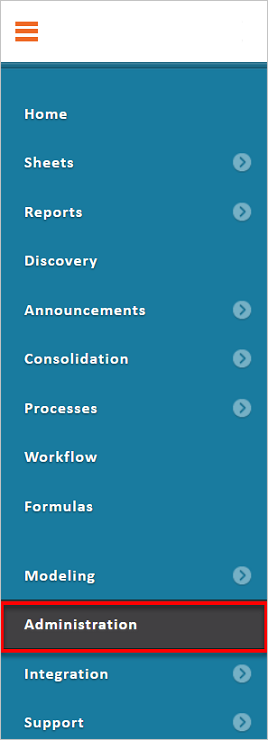
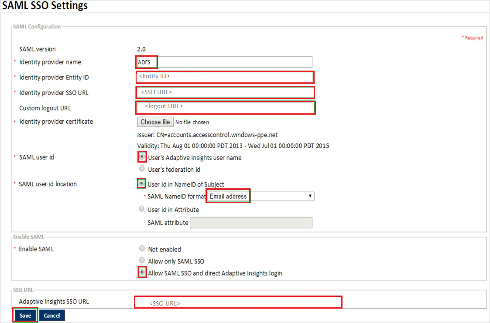
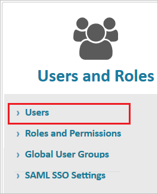

# Tutorial: Integrate Adaptive Insights with Azure Active Directory

In this tutorial, you'll learn how to integrate Adaptive Insights with Azure Active Directory (Azure AD). When you integrate Adaptive Insights with Azure AD, you can:

* Control in Azure AD who has access to Adaptive Insights.
* Enable your users to be automatically signed-in to Adaptive Insights with their Azure AD accounts.
* Manage your accounts in one central location - the Azure portal.

## Prerequisites

To get started, you need the following items:

* An Azure AD subscription. If you don't have a subscription, you can get a [free account](https://azure.microsoft.com/free/).
* Adaptive Insights single sign-on (SSO) enabled subscription.

## Scenario description

In this tutorial, you configure and test Azure AD SSO in a test environment.

* Adaptive Insights supports **IDP** initiated SSO

## Add Adaptive Insights from the gallery

To configure the integration of Adaptive Insights into Azure AD, you need to add Adaptive Insights from the gallery to your list of managed SaaS apps.

1. Sign in to the Azure portal using either a work or school account, or a personal Microsoft account.
1. On the left navigation pane, select the **Azure Active Directory** service.
1. Navigate to **Enterprise Applications** and then select **All Applications**.
1. To add new application, select **New application**.
1. In the **Add from the gallery** section, type **Adaptive Insights** in the search box.
1. Select **Adaptive Insights** from results panel and then add the app. Wait a few seconds while the app is added to your tenant.

## Configure and test Azure AD SSO for Adaptive Insights

Configure and test Azure AD SSO with Adaptive Insights using a test user called **B.Simon**. For SSO to work, you need to establish a link relationship between an Azure AD user and the related user in Adaptive Insights.

To configure and test Azure AD SSO with Adaptive Insights, perform the following steps:

1. **[Configure Azure AD SSO](#configure-azure-ad-sso)** - to enable your users to use this feature.
    1. **[Create an Azure AD test user](#create-an-azure-ad-test-user)** - to test Azure AD single sign-on with B.Simon.
    1. **[Assign the Azure AD test user](#assign-the-azure-ad-test-user)** - to enable B.Simon to use Azure AD single sign-on.
1. **[Configure Adaptive Insights SSO](#configure-adaptive-insights-sso)** - to configure the single sign-on settings on application side.
    1. **[Create Adaptive Insights test user](#create-adaptive-insights-test-user)** - to have a counterpart of B.Simon in Adaptive Insights that is linked to the Azure AD representation of user.
1. **[Test SSO](#test-sso)** - to verify whether the configuration works.

### Configure Azure AD SSO

Follow these steps to enable Azure AD SSO in the Azure portal.

1. In the Azure portal, on the **Adaptive Insights** application integration page, find the **Manage** section and select **Single sign-on**.
1. On the **Select a Single sign-on method** page, select **SAML**.
1. On the **Set up Single Sign-On with SAML** page, click the pencil icon for **Basic SAML Configuration** to edit the settings.

   

1. On the **Basic SAML Configuration** section, perform the following steps:

    a. In the **Identifier** text box, type a URL using the following pattern:
    `https://login.adaptiveinsights.com:443/samlsso/<unique-id>`

    b. In the **Reply URL** text box, type a URL using the following pattern:
    `https://login.adaptiveinsights.com:443/samlsso/<unique-id>`

	> [!NOTE]
	> You can get Identifier(Entity ID) and Reply URL values from the Adaptive Insights’s **SAML SSO Settings** page.

4. On the **Set up Single Sign-On with SAML** page, in the **SAML Signing Certificate** section,  find **Certificate (Base64)** and select **Download** to download the certificate and save it on your computer.

	

6. On the **Set up Adaptive Insights** section, copy the appropriate URL(s) based on your requirement.

	

### Create an Azure AD test user

In this section, you'll create a test user in the Azure portal called B.Simon.

1. From the left pane in the Azure portal, select **Azure Active Directory**, select **Users**, and then select **All users**.
1. Select **New user** at the top of the screen.
1. In the **User** properties, follow these steps:
   1. In the **Name** field, enter `B.Simon`.  
   1. In the **User name** field, enter the username@companydomain.extension. For example, `B.Simon@contoso.com`.
   1. Select the **Show password** check box, and then write down the value that's displayed in the **Password** box.
   1. Click **Create**.

### Assign the Azure AD test user

In this section, you'll enable B.Simon to use Azure single sign-on by granting access to Adaptive Insights.

1. In the Azure portal, select **Enterprise Applications**, and then select **All applications**.
1. In the applications list, select **Adaptive Insights**.
1. In the app's overview page, find the **Manage** section and select **Users and groups**.
1. Select **Add user**, then select **Users and groups** in the **Add Assignment** dialog.
1. In the **Users and groups** dialog, select **B.Simon** from the Users list, then click the **Select** button at the bottom of the screen.
1. If you are expecting a role to be assigned to the users, you can select it from the **Select a role** dropdown. If no role has been set up for this app, you see "Default Access" role selected.
1. In the **Add Assignment** dialog, click the **Assign** button.

### Configure Adaptive Insights SSO

1. In a different web browser window, sign in to your Adaptive Insights company site as an administrator.

2. Go to **Administration**.

	

3. In the **Users and Roles** section, click **SAML SSO Settings**.

	

4. On the **SAML SSO Settings** page, perform the following steps:

	

	a. In the **Identity provider name** textbox, type a name for your configuration.

	b. Paste the **Azure AD Identifier** value copied from Azure portal into the **Identity provider Entity ID** textbox.

	c. Paste the **Login URL** value copied from Azure portal into the **Identity provider SSO URL** textbox.

	d. Paste the **Logout URL** value copied from Azure portal into the **Custom logout URL** textbox.

	e. To upload your downloaded certificate, click **Choose file**.

	f. Select the following, for:

     * **SAML user id**, select **User’s Adaptive Insights user name**.

     * **SAML user id location**, select **User id in NameID of Subject**.

     * **SAML NameID format**, select **Email address**.

     * **Enable SAML**, select **Allow SAML SSO and direct Adaptive Insights login**.

	g. Copy **Adaptive Insights SSO URL** and paste into the **Identifier(Entity ID)** and **Reply URL** textboxes in the **Basic SAML Configuration** section in the Azure portal.

	h. Click **Save**.

### Create Adaptive Insights test user

To enable Azure AD users to sign in to Adaptive Insights, they must be provisioned into Adaptive Insights. In the case of Adaptive Insights, provisioning is a manual task.

**To configure user provisioning, perform the following steps:**

1. Sign in to your **Adaptive Insights** company site as an administrator.

2. Go to **Administration**.

   

3. In the **Users and Roles** section, click **Users**.

   

4. In the **New User** section, perform the following steps:

   

   a. Type the **Name**, **Username**, **Email**, **Password** of a valid Azure Active Directory user you want to provision into the related textboxes.

   b. Select a **Role**.

   c. Click **Submit**.

> [!NOTE]
> You can use any other Adaptive Insights user account creation tools or APIs provided by Adaptive Insights to provision Azure AD user accounts.

### Test SSO 

In this section, you test your Azure AD single sign-on configuration with following options.

* Click on Test this application in Azure portal and you should be automatically signed in to the Adaptive Insights for which you set up the SSO.

* You can use Microsoft My Apps. When you click the Adaptive Insights tile in the My Apps, you should be automatically signed in to the Adaptive Insights for which you set up the SSO. For more information about the My Apps, see [Introduction to the My Apps](../user-help/my-apps-portal-end-user-access.md).

## Next steps

Once you configure Adaptive Insights you can enforce session control, which protects exfiltration and infiltration of your organization’s sensitive data in real time. Session control extends from Conditional Access. [Learn how to enforce session control with Microsoft Cloud App Security](/cloud-app-security/proxy-deployment-any-app).