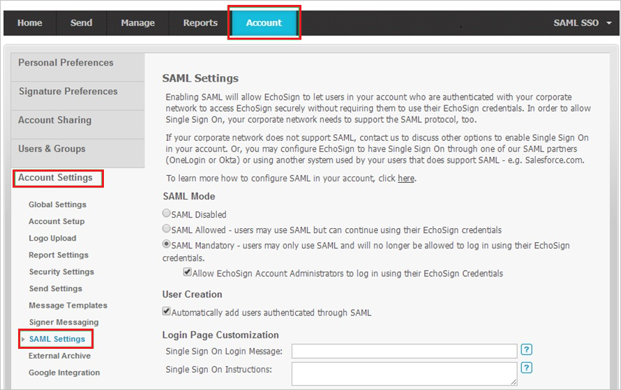
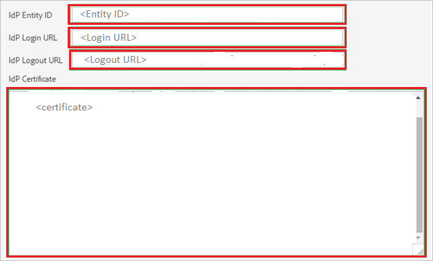
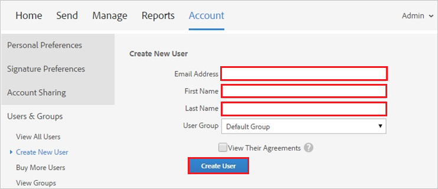

# Tutorial: Microsoft Entra SSO integration with Adobe Sign

In this tutorial, you'll learn how to integrate Adobe Sign with Microsoft Entra ID. When you integrate Adobe Sign with Microsoft Entra ID, you can:

* Control in Microsoft Entra ID who has access to Adobe Sign.
* Enable your users to be automatically signed-in to Adobe Sign with their Microsoft Entra accounts.
* Manage your accounts in one central location.

## Prerequisites

To get started, you need the following items:
 
* A Microsoft Entra subscription. If you don't have a subscription, you can get a [free account](https://azure.microsoft.com/free/).
* Adobe Sign single sign-on (SSO)-enabled subscription.

## Scenario description

In this tutorial, you configure and test Microsoft Entra single sign-on in a test environment.

* Adobe Sign supports **SP** initiated SSO.

## Add Adobe Sign from the gallery

To configure the integration of Adobe Sign into Microsoft Entra ID, you need to add Adobe Sign from the gallery to your list of managed SaaS apps.

1. Sign in to the [Microsoft Entra admin center](https://entra.microsoft.com) as at least a [Cloud Application Administrator](../roles/permissions-reference.md#cloud-application-administrator).
1. Browse to **Identity** > **Applications** > **Enterprise applications** > **New application**.
1. In the **Add from the gallery** section, type **Adobe Sign** in the search box.
1. Select **Adobe Sign** from results panel and then add the app. Wait a few seconds while the app is added to your tenant.

 Alternatively, you can also use the [Enterprise App Configuration Wizard](https://portal.office.com/AdminPortal/home?Q=Docs#/azureadappintegration). In this wizard, you can add an application to your tenant, add users/groups to the app, assign roles, as well as walk through the SSO configuration as well. [Learn more about Microsoft 365 wizards.](/microsoft-365/admin/misc/azure-ad-setup-guides)

## Configure and test Microsoft Entra SSO for Adobe Sign

In this section, you configure and test Microsoft Entra single sign-on with Adobe Sign based on a test user called **Britta Simon**.
For single sign-on to work, a link relationship between a Microsoft Entra user and the related user in Adobe Sign needs to be established.

To configure and test Microsoft Entra single sign-on with Adobe Sign, you need to perform the following steps:

1. **[Configure Microsoft Entra SSO](#configure-azure-ad-sso)** - to enable your users to use this feature.
    1. **[Create a Microsoft Entra test user](#create-an-azure-ad-test-user)** - to test Microsoft Entra single sign-on with Britta Simon.
    1. **[Assign the Microsoft Entra test user](#assign-the-azure-ad-test-user)** - to enable Britta Simon to use Microsoft Entra single sign-on.
1. **[Configure Adobe Sign SSO](#configure-adobe-sign-sso)** - to configure the Single Sign-On settings on application side.
    1. **[Create Adobe Sign test user](#create-adobe-sign-test-user)** - to have a counterpart of Britta Simon in Adobe Sign that is linked to the Microsoft Entra representation of user.
1. **[Test SSO](#test-sso)** - to verify whether the configuration works.

## Configure Microsoft Entra SSO

In this section, you enable Microsoft Entra single sign-on.

To configure Microsoft Entra single sign-on with Adobe Sign, perform the following steps:

1. Sign in to the [Microsoft Entra admin center](https://entra.microsoft.com) as at least a [Cloud Application Administrator](../roles/permissions-reference.md#cloud-application-administrator).
1. Browse to **Identity** > **Applications** > **Enterprise applications** > **Adobe Sign** application integration page, select **Single sign-on**.

1. On the **Select a Single sign-on method** dialog, select **SAML/WS-Fed** mode to enable single sign-on.

1. On the **Set up Single Sign-On with SAML** page, click pencil icon to open **Basic SAML Configuration** dialog.

    

1. On the **Basic SAML Configuration** section, perform the following steps:

    a. In the **Sign on URL** text box, type a URL using the following pattern:
    `https://<companyname>.echosign.com/`

    b. In the **Identifier (Entity ID)** text box, type a URL using the following pattern:
    `https://<companyname>.echosign.com`

    > [!NOTE]
    > These values are not real. Update these values with the actual Sign on URL and Identifier. Contact [Adobe Sign Client support team](https://helpx.adobe.com/support.html) to get these values. You can also refer to the patterns shown in the **Basic SAML Configuration** section.

1. On the **Set up Single Sign-On with SAML** page, in the **SAML Signing Certificate** section, click **Download** to download the **Certificate (Base64)** from the given options as per your requirement and save it on your computer.

    

1. On the **Set up Adobe Sign** section, copy the appropriate URL(s) as per your requirement.

    

### Create a Microsoft Entra test user 

In this section, you'll create a test user called B.Simon.

1. Sign in to the [Microsoft Entra admin center](https://entra.microsoft.com) as at least a [User Administrator](../roles/permissions-reference.md#user-administrator).
1. Browse to **Identity** > **Users** > **All users**.
1. Select **New user** > **Create new user**, at the top of the screen.
1. In the **User** properties, follow these steps:
   1. In the **Display name** field, enter `B.Simon`.  
   1. In the **User principal name** field, enter the username@companydomain.extension. For example, `B.Simon@contoso.com`.
   1. Select the **Show password** check box, and then write down the value that's displayed in the **Password** box.
   1. Select **Review + create**.
1. Select **Create**.

### Assign the Microsoft Entra test user

In this section, you'll enable B.Simon to use single sign-on by granting access to Adobe Sign.

1. Sign in to the [Microsoft Entra admin center](https://entra.microsoft.com) as at least a [Cloud Application Administrator](../roles/permissions-reference.md#cloud-application-administrator).
1. Browse to **Identity** > **Applications** > **Enterprise applications** > **Adobe Sign**.
1. In the app's overview page, select **Users and groups**.
1. Select **Add user/group**, then select **Users and groups** in the **Add Assignment** dialog.
   1. In the **Users and groups** dialog, select **B.Simon** from the Users list, then click the **Select** button at the bottom of the screen.
   1. If you are expecting a role to be assigned to the users, you can select it from the **Select a role** dropdown. If no role has been set up for this app, you see "Default Access" role selected.
   1. In the **Add Assignment** dialog, click the **Assign** button.

## Configure Adobe Sign SSO

1. Before configuration, contact the [Adobe Sign Client support team](https://helpx.adobe.com/support.html) to add your domain in the Adobe Sign allowlist. Here's how to add the domain:

    a. The [Adobe Sign Client support team](https://helpx.adobe.com/support.html) sends you a randomly generated token. For your domain, the token will be like the following: **adobe-sign-verification= xxxxxxxxxxxxxxxxxxxxxxxxxxxxxxx**

    b. Publish the verification token in a DNS text record, and notify the [Adobe Sign Client support team](https://helpx.adobe.com/support.html).

    > [!NOTE]
    > This can take a few days, or longer. Note that DNS propagation delays mean that a value published in DNS might not be visible for an hour or more. Your IT administrator should be knowledgeable about how to publish this token in a DNS text record.

    c. When you notify the [Adobe Sign Client support team](https://helpx.adobe.com/support.html) through the support ticket, after the token is published, they validate the domain and add it to your account.

    d. Generally, here's how to publish the token on a DNS record:

    * Sign in to your domain account
    * Find the page for updating the DNS record. This page might be called DNS Management, Name Server Management, or Advanced Settings.
    * Find the TXT records for your domain.
    * Add a TXT record with the full token value supplied by Adobe.
    * Save your changes.

1. In a different web browser window, sign in to your Adobe Sign company site as an administrator.

1. In the SAML menu, select **Account Settings** > **SAML Settings**.

    

1. In the **SAML Settings** section, perform the following steps:

    

   

   a. Under **SAML Mode**, select **SAML Mandatory**.

   b. Select **Allow Echosign Account Administrators to log in using their Echosign Credentials**.

   c. Under **User Creation**, select **Automatically add users authenticated through SAML**.

   d. Paste **Microsoft Entra Identifier** into the **Idp Entity ID** text box.

   e. Paste **Login URL** into the **Idp Login URL** text box.

   f. Paste **Logout URL** into the **Idp Logout URL** text box.

   g. Open your downloaded **Certificate(Base64)** file in Notepad. Copy the content of it into your clipboard, and then paste it to the **IdP Certificate** text box.

   h. Select **Save Changes**.

### Create Adobe Sign test user

To enable Microsoft Entra users to sign in to Adobe Sign, they must be provisioned into Adobe Sign. This is a manual task.

>[!NOTE]
>You can use any other Adobe Sign user account creation tools or APIs provided by Adobe Sign to provision Microsoft Entra user accounts. 

1. Sign in to your **Adobe Sign** company site as an administrator.

2. In the menu on the top, select **Account**. Then, in the left pane, select **Users & Groups** > **Create a new user**.

    

3. In the **Create New User** section, perform the following steps:

    

    a. Type the **Email Address**, **First Name**, and **Last Name** of a valid Microsoft Entra account you want to provision into the related text boxes.

    b. Select **Create User**.

>[!NOTE]
>The Microsoft Entra account holder receives an email that includes a link to confirm the account, before it becomes active. 

### Test SSO

In this section, you test your Microsoft Entra single sign-on configuration with following options. 

* Click on **Test this application**, this will redirect to Adobe Sign Sign-on URL where you can initiate the login flow. 

* Go to Adobe Sign Sign-on URL directly and initiate the login flow from there.

* You can use Microsoft My Apps. When you click the Adobe Sign tile in the My Apps, you should be automatically signed in to the Adobe Sign for which you set up the SSO. For more information about the My Apps, see [Introduction to the My Apps](https://support.microsoft.com/account-billing/sign-in-and-start-apps-from-the-my-apps-portal-2f3b1bae-0e5a-4a86-a33e-876fbd2a4510).

## Next steps

Once you configure Adobe Sign you can enforce session control, which protects exfiltration and infiltration of your organization’s sensitive data in real time. Session control extends from Conditional Access. [Learn how to enforce session control with Microsoft Defender for Cloud Apps](/cloud-app-security/proxy-deployment-any-app).
