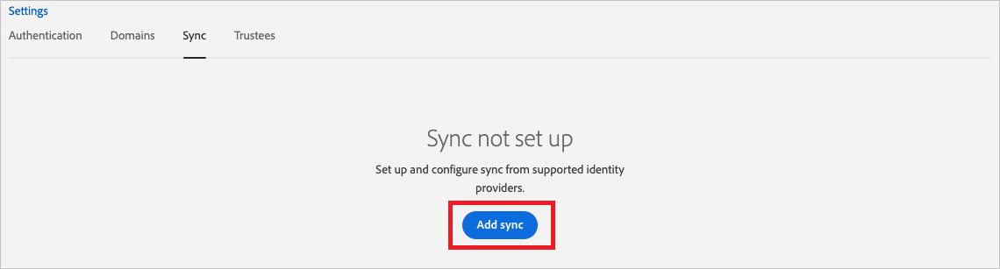
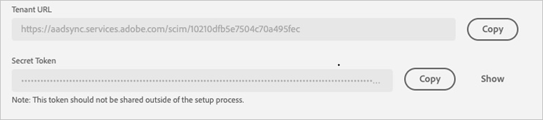

# Tutorial: Configure Adobe Identity Management for automatic user provisioning

This tutorial describes the steps you need to perform in both Adobe Identity Management and Microsoft Entra ID to configure automatic user provisioning. When configured, Microsoft Entra ID automatically provisions and de-provisions users and groups to Adobe Identity Management using the Microsoft Entra provisioning service. For important details on what this service does, how it works, and frequently asked questions, see [Automate user provisioning and deprovisioning to SaaS applications with Microsoft Entra ID](../app-provisioning/user-provisioning.md). 

## Capabilities supported
> [!div class="checklist"]
> * Create users in Adobe Identity Management
> * Remove users in Adobe Identity Management when they do not require access anymore
> * Keep user attributes synchronized between Microsoft Entra ID and Adobe Identity Management
> * Provision groups and group memberships in Adobe Identity Management
> * Single sign-on to Adobe Identity Management (recommended)

## Prerequisites

The scenario outlined in this tutorial assumes that you already have the following prerequisites:

* [A Microsoft Entra tenant](../develop/quickstart-create-new-tenant.md).
* A user account in Microsoft Entra ID with [permission](../roles/permissions-reference.md) to configure provisioning (for example, Application Administrator, Cloud Application administrator, Application Owner, or Global Administrator). 
* A federated directory in the [Adobe Admin Console](https://adminconsole.adobe.com/) with verified domains.
* Review the [adobe documentation](https://helpx.adobe.com/enterprise/admin-guide.html/enterprise/using/add-azure-sync.ug.html) on user provisioning 

> [!NOTE]
> If your organization uses the User Sync Tool or a UMAPI integration, you must first pause the integration. Then, add Microsoft Entra automatic provisioning to automate user management. Once Microsoft Entra automatic provisioning is configured and running, you can completely remove the User Sync Tool or UMAPI integration.

> [!NOTE]
> This integration is also available to use from Microsoft Entra US Government Cloud environment. You can find this application in the Microsoft Entra US Government Cloud Application Gallery and configure it in the same way as you do from public cloud.

## Step 1: Plan your provisioning deployment
1. Learn about [how the provisioning service works](../app-provisioning/user-provisioning.md).
2. Determine who will be in [scope for provisioning](../app-provisioning/define-conditional-rules-for-provisioning-user-accounts.md).
3. Determine what data to [map between Microsoft Entra ID and Adobe Identity Management](../app-provisioning/customize-application-attributes.md). 

## Step 2: Configure Adobe Identity Management to support provisioning with Microsoft Entra ID

1. Login to [Adobe Admin Console](https://adminconsole.adobe.com/). Navigate to **Settings > Directory Details > Sync**. 

2. Click **Add Sync**.

    

3. Select **Sync users from Microsoft Azure** and click **Next**.

    

4. Copy and save the **Tenant URL** and the **Secret token**. These values will be entered in the **Tenant URL** and **Secret Token** fields in the Provisioning tab of your Adobe Identity Management application.

    

## Step 3: Add Adobe Identity Management from the Microsoft Entra application gallery

Add Adobe Identity Management from the Microsoft Entra application gallery to start managing provisioning to Adobe Identity Management. If you have previously setup Adobe Identity Management for SSO, you can use the same application. However it is recommended that you create a separate app when testing out the integration initially. Learn more about adding an application from the gallery [here](../manage-apps/add-application-portal.md). 

## Step 4: Define who will be in scope for provisioning 

The Microsoft Entra provisioning service allows you to scope who will be provisioned based on assignment to the application and or based on attributes of the user / group. If you choose to scope who will be provisioned to your app based on assignment, you can use the following [steps](../manage-apps/assign-user-or-group-access-portal.md) to assign users and groups to the application. If you choose to scope who will be provisioned based solely on attributes of the user or group, you can use a scoping filter as described [here](../app-provisioning/define-conditional-rules-for-provisioning-user-accounts.md). 

* If you need additional roles, you can [update the application manifest](../develop/howto-add-app-roles-in-azure-ad-apps.md) to add new roles.

* If you need additional roles, you can [update the application manifest](../develop/howto-add-app-roles-in-azure-ad-apps.md) to add new roles.

## Step 5: Configure automatic user provisioning to Adobe Identity Management 

This section guides you through the steps to configure the Microsoft Entra provisioning service to create, update, and disable users and/or groups in TestApp based on user and/or group assignments in Microsoft Entra ID.

> [!VIDEO https://www.youtube.com/embed/k2_fk7BY8Ow]

### To configure automatic user provisioning for Adobe Identity Management in Microsoft Entra ID:

1. Sign in to the [Microsoft Entra admin center](https://entra.microsoft.com) as at least a [Cloud Application Administrator](../roles/permissions-reference.md#cloud-application-administrator).
1. Browse to **Identity** > **Applications** > **Enterprise applications**

    

1. In the applications list, select **Adobe Identity Management**.

    

3. Select the **Provisioning** tab.

    

4. Set the **Provisioning Mode** to **Automatic**.

    

5. Under the **Admin Credentials** section, input your Adobe Identity Management Tenant URL and Secret Token retrieved earlier from Step 2. Click **Test Connection** to ensure Microsoft Entra ID can connect to Adobe Identity Management. If the connection fails, ensure your Adobe Identity Management account has Admin permissions and try again.

    

6. In the **Notification Email** field, enter the email address of a person or group who should receive the provisioning error notifications and select the **Send an email notification when a failure occurs** check box.

    

7. Select **Save**.

8. Under the **Mappings** section, select **Synchronize Microsoft Entra users to Adobe Identity Management**.

9. Review the user attributes that are synchronized from Microsoft Entra ID to Adobe Identity Management in the **Attribute-Mapping** section. The attributes selected as **Matching** properties are used to match the user accounts in Adobe Identity Management for update operations. If you choose to change the [matching target attribute](../app-provisioning/customize-application-attributes.md), you will need to ensure that the Adobe Identity Management API supports filtering users based on that attribute. Select the **Save** button to commit any changes.

   |Attribute|Type|Supported for filtering|Required by Adobe Identity Management
   |---|---|---|---|
   |userName|String|&check;|&check;   
   |active|Boolean||
   |emails[type eq "work"].value|String||
   |addresses[type eq "work"].country|String||
   |name.givenName|String||
   |name.familyName|String||
   |urn:ietf:params:scim:schemas:extension:Adobe:2.0:User:emailAliases|String||
   |urn:ietf:params:scim:schemas:extension:Adobe:2.0:User:eduRole|String||

    > [!NOTE]
    > The **eduRole** field accepts values like `Teacher or Student`, anything else will be ignored.

10. Under the **Mappings** section, select **Synchronize Microsoft Entra groups to Adobe Identity Management**.

11. Review the group attributes that are synchronized from Microsoft Entra ID to Adobe Identity Management in the **Attribute-Mapping** section. The attributes selected as **Matching** properties are used to match the groups in Adobe Identity Management for update operations. Select the **Save** button to commit any changes.

      |Attribute|Type|Supported for filtering|Required by Adobe Identity Management
      |---|---|---|---|
      |displayName|String|&check;|&check;
      |members|Reference||

12. To configure scoping filters, refer to the following instructions provided in the [Scoping filter tutorial](../app-provisioning/define-conditional-rules-for-provisioning-user-accounts.md).

13. To enable the Microsoft Entra provisioning service for Adobe Identity Management, change the **Provisioning Status** to **On** in the **Settings** section.

    

14. Define the users and/or groups that you would like to provision to Adobe Identity Management by choosing the desired values in **Scope** in the **Settings** section.

    

15. When you are ready to provision, click **Save**.

    

This operation starts the initial synchronization cycle of all users and groups defined in **Scope** in the **Settings** section. The initial cycle takes longer to perform than subsequent cycles, which occur approximately every 40 minutes as long as the Microsoft Entra provisioning service is running. 

## Step 6: Monitor your deployment
Once you've configured provisioning, use the following resources to monitor your deployment:

* Use the [provisioning logs](../reports-monitoring/concept-provisioning-logs.md) to determine which users have been provisioned successfully or unsuccessfully.
* Check the [progress bar](../app-provisioning/application-provisioning-when-will-provisioning-finish-specific-user.md) to see the status of the provisioning cycle and how close it is to completion.
* If the provisioning configuration seems to be in an unhealthy state, the application will go into quarantine. Learn more about quarantine states [here](../app-provisioning/application-provisioning-quarantine-status.md).  

## Change log
* 07/18/2023 - The app was added to Gov Cloud.
* 08/15/2023 - Added support for Schema Discovery.

## More resources

* [Managing user account provisioning for Enterprise Apps](../app-provisioning/configure-automatic-user-provisioning-portal.md)
* [What is application access and single sign-on with Microsoft Entra ID?](../manage-apps/what-is-single-sign-on.md)

## Next steps

* [Learn how to review logs and get reports on provisioning activity](../app-provisioning/check-status-user-account-provisioning.md)
