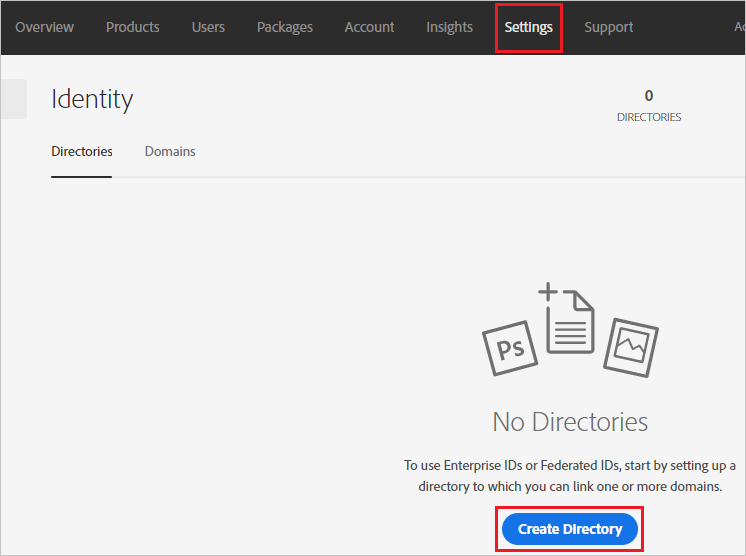
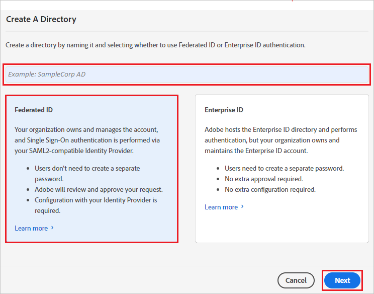
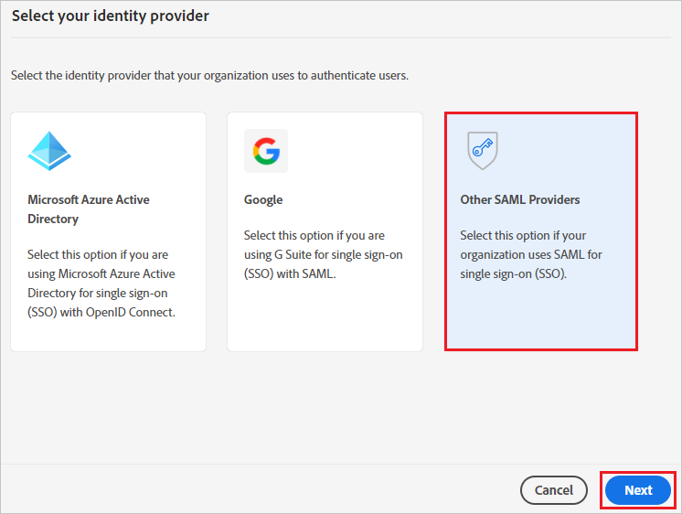
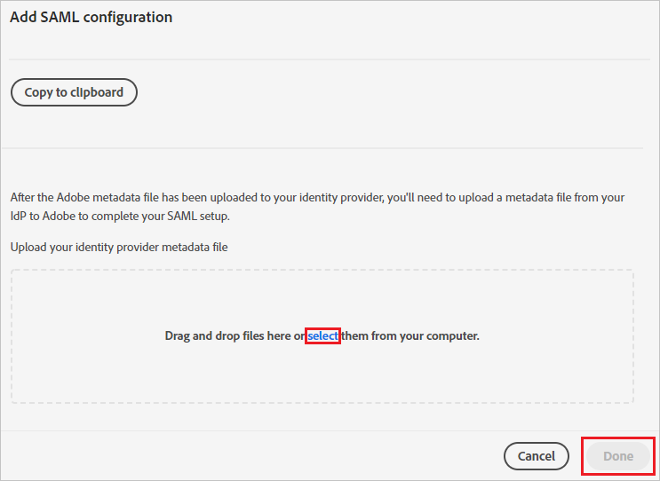
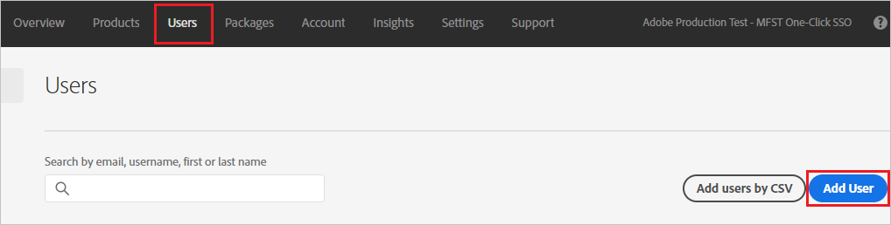
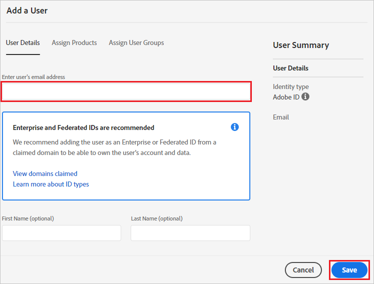

# Tutorial: Microsoft Entra SSO integration with Adobe Identity Management (SAML)

In this tutorial, you'll learn how to integrate Adobe Identity Management (SAML) with Microsoft Entra ID. When you integrate Adobe Identity Management (SAML) with Microsoft Entra ID, you can:

* Control in Microsoft Entra ID who has access to Adobe Identity Management (SAML).
* Enable your users to be automatically signed-in to Adobe Identity Management (SAML) with their Microsoft Entra accounts.
* Manage your accounts in one central location.

## Prerequisites

To get started, you need the following items:

* A Microsoft Entra subscription. If you don't have a subscription, you can get a [free account](https://azure.microsoft.com/free/).
* Adobe Identity Management (SAML) single sign-on (SSO) enabled subscription.

## Scenario description

In this tutorial, you configure and test Microsoft Entra SSO in a test environment.

* Adobe Identity Management (SAML) supports **SP** initiated SSO.
* Adobe Identity Management (SAML) supports [**automated** user provisioning and deprovisioning](adobe-identity-management-provisioning-tutorial.md) (recommended).

## Adding Adobe Identity Management (SAML) from the gallery

To configure the integration of Adobe Identity Management (SAML) into Microsoft Entra ID, you need to add Adobe Identity Management (SAML) from the gallery to your list of managed SaaS apps.

1. Sign in to the [Microsoft Entra admin center](https://entra.microsoft.com) as at least a [Cloud Application Administrator](../roles/permissions-reference.md#cloud-application-administrator).
1. Browse to **Identity** > **Applications** > **Enterprise applications** > **New application**.
1. In the **Add from the gallery** section, type **Adobe Identity Management (SAML)** in the search box.
1. Select **Adobe Identity Management (SAML)** from results panel and then add the app. Wait a few seconds while the app is added to your tenant.

 Alternatively, you can also use the [Enterprise App Configuration Wizard](https://portal.office.com/AdminPortal/home?Q=Docs#/azureadappintegration). In this wizard, you can add an application to your tenant, add users/groups to the app, assign roles, as well as walk through the SSO configuration as well. [Learn more about Microsoft 365 wizards.](/microsoft-365/admin/misc/azure-ad-setup-guides)

## Configure and test Microsoft Entra SSO for Adobe Identity Management (SAML)

Configure and test Microsoft Entra SSO with Adobe Identity Management (SAML) using a test user called **B.Simon**. For SSO to work, you need to establish a link relationship between a Microsoft Entra user and the related user in Adobe Identity Management (SAML).

To configure and test Microsoft Entra SSO with Adobe Identity Management (SAML), perform the following steps:

1. **[Configure Microsoft Entra SSO](#configure-azure-ad-sso)** - to enable your users to use this feature.
    1. **[Create a Microsoft Entra test user](#create-an-azure-ad-test-user)** - to test Microsoft Entra single sign-on with B.Simon.
    1. **[Assign the Microsoft Entra test user](#assign-the-azure-ad-test-user)** - to enable B.Simon to use Microsoft Entra single sign-on.
1. **[Configure Adobe Identity Management (SAML) SSO](#configure-adobe-identity-management-saml-sso)** - to configure the single sign-on settings on application side.
    1. **[Create Adobe Identity Management (SAML) test user](#create-adobe-identity-management-saml-test-user)** - to have a counterpart of B.Simon in Adobe Identity Management (SAML) that is linked to the Microsoft Entra representation of user.
1. **[Test SSO](#test-sso)** - to verify whether the configuration works.

## Configure Microsoft Entra SSO

Follow these steps to enable Microsoft Entra SSO.

1. Sign in to the [Microsoft Entra admin center](https://entra.microsoft.com) as at least a [Cloud Application Administrator](../roles/permissions-reference.md#cloud-application-administrator).
1. Browse to **Identity** > **Applications** > **Enterprise applications** > **Adobe Identity Management (SAML)** > **Single sign-on**.
1. On the **Select a single sign-on method** page, select **SAML**.
1. On the **Set up single sign-on with SAML** page, click the pencil icon for **Basic SAML Configuration** to edit the settings.

   

1. On the **Basic SAML Configuration** section, perform the following steps:

	a. In the **Sign on URL** text box, type the URL:
    `https://adobe.com`

    b. In the **Identifier (Entity ID)** text box, type a URL using the following pattern:
    `https://federatedid-na1.services.adobe.com/federated/saml/metadata/alias/<CUSTOM_ID>`

	> [!NOTE]
	> The Identifier value is not real. Update the value with the actual Identifier. Contact [Adobe Identity Management (SAML) Client support team](mailto:identity@adobe.com) to get the value. You can also refer to the patterns shown in the **Basic SAML Configuration** section.

1. On the **Set up single sign-on with SAML** page, in the **SAML Signing Certificate** section,  find **Federation Metadata XML** and select **Download** to download the certificate and save it on your computer.

	

1. On the **Set up Adobe Identity Management (SAML)** section, copy the appropriate URL(s) based on your requirement.

	

### Create a Microsoft Entra test user

In this section, you'll create a test user called B.Simon.

1. Sign in to the [Microsoft Entra admin center](https://entra.microsoft.com) as at least a [User Administrator](../roles/permissions-reference.md#user-administrator).
1. Browse to **Identity** > **Users** > **All users**.
1. Select **New user** > **Create new user**, at the top of the screen.
1. In the **User** properties, follow these steps:
   1. In the **Display name** field, enter `B.Simon`.  
   1. In the **User principal name** field, enter the username@companydomain.extension. For example, `B.Simon@contoso.com`.
   1. Select the **Show password** check box, and then write down the value that's displayed in the **Password** box.
   1. Select **Review + create**.
1. Select **Create**.

### Assign the Microsoft Entra test user

In this section, you'll enable B.Simon to use single sign-on by granting access to Adobe Identity Management (SAML).

1. Sign in to the [Microsoft Entra admin center](https://entra.microsoft.com) as at least a [Cloud Application Administrator](../roles/permissions-reference.md#cloud-application-administrator).
1. Browse to **Identity** > **Applications** > **Enterprise applications** > **Adobe Identity Management (SAML)**.
1. In the app's overview page, select **Users and groups**.
1. Select **Add user/group**, then select **Users and groups** in the **Add Assignment** dialog.
   1. In the **Users and groups** dialog, select **B.Simon** from the Users list, then click the **Select** button at the bottom of the screen.
   1. If you are expecting a role to be assigned to the users, you can select it from the **Select a role** dropdown. If no role has been set up for this app, you see "Default Access" role selected.
   1. In the **Add Assignment** dialog, click the **Assign** button.

## Configure Adobe Identity Management (SAML) SSO

1. In a different web browser window, sign in to your Adobe Identity Management (SAML) company site as an administrator

4. Go to the **Settings** tab and click on **Create Directory**.

    

5. Give the directory name in the text box and select **Federated ID**, click on **Next**.

    

6. Select the **Other SAML Providers** and click on **Next**.
 
    

7. Click on **select** to upload the **Metadata XML** file which you have downloaded.

    

8. Click on **Done**.

### Create Adobe Identity Management (SAML) test user

1. Go to the **Users** tab and click on **Add User**.

    

2. In the **Enter user’s email address** textbox, give the **email address**.

    

3. Click **Save**.

## Test SSO

In this section, you test your Microsoft Entra single sign-on configuration with following options.

* Click on **Test this application**, this will redirect to Adobe Identity Management (SAML) Sign-on URL where you can initiate the login flow.

* Go to Adobe Identity Management (SAML) Sign-on URL directly and initiate the login flow from there.

* You can use Microsoft My Apps. When you click the Adobe Identity Management (SAML) tile in the My Apps, this will redirect to Adobe Identity Management (SAML) Sign-on URL. For more information about the My Apps, see [Introduction to the My Apps](https://support.microsoft.com/account-billing/sign-in-and-start-apps-from-the-my-apps-portal-2f3b1bae-0e5a-4a86-a33e-876fbd2a4510).

## Next steps

Once you configure Adobe Identity Management (SAML) you can enforce session control, which protects exfiltration and infiltration of your organization’s sensitive data in real time. Session control extends from Conditional Access. [Learn how to enforce session control with Microsoft Defender for Cloud Apps](/cloud-app-security/proxy-deployment-any-app).
