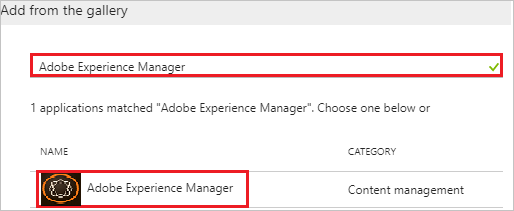
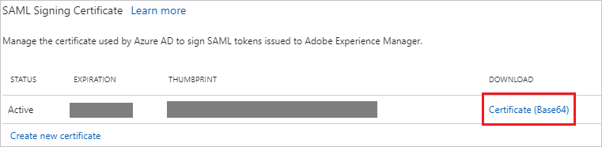
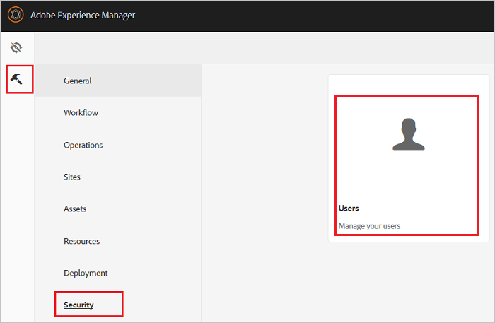
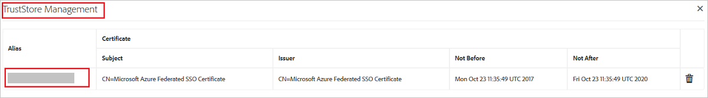
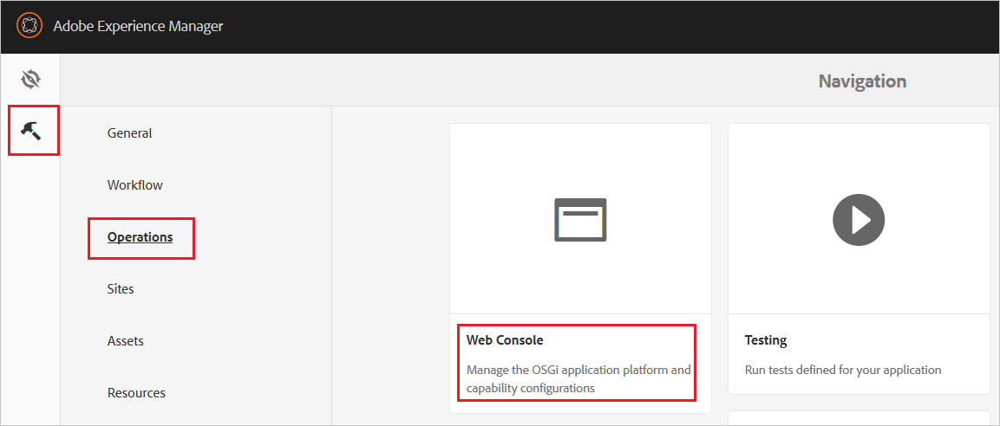
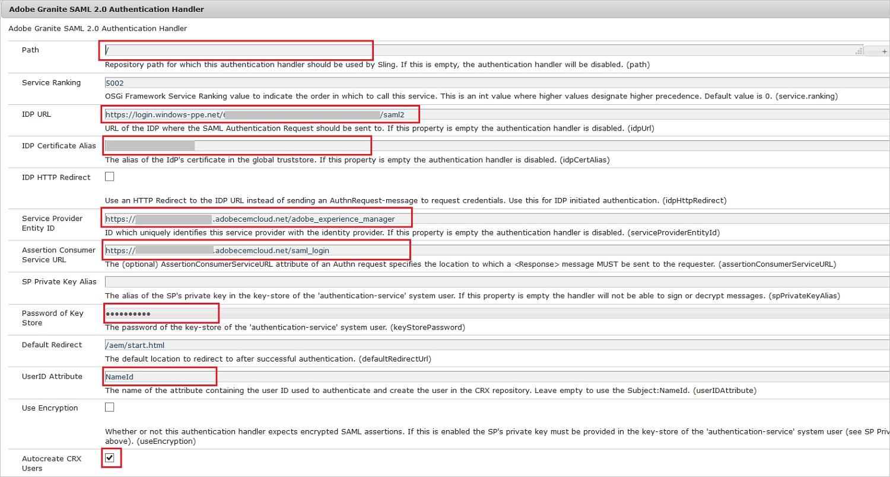

# Tutorial: Azure Active Directory integration with Adobe Experience Manager

In this tutorial, you learn how to integrate Adobe Experience Manager with Azure Active Directory (Azure AD).

Integrating Adobe Experience Manager with Azure AD provides you with the following benefits:

- You can control in Azure AD who has access to Adobe Experience Manager.
- You can enable your users to automatically get signed in to Adobe Experience Manager with their Azure AD accounts.
- You can manage your accounts in one central location--the Azure portal.

For more information about SaaS app integration with Azure AD, see [What is application access and single sign-on with Azure Active Directory?](../manage-apps/what-is-single-sign-on.md).

## Prerequisites

To configure Azure AD integration with Adobe Experience Manager, you need the following items:

- An Azure AD subscription
- An Adobe Experience Manager single sign-on enabled subscription

> [!NOTE]
> We don't recommend using a production environment to test the steps in this tutorial.

To test the steps in this tutorial, follow these recommendations:

- Don't use your production environment unless it's necessary.
- If you don't have an Azure AD trial environment, [get a free one-month trial](https://azure.microsoft.com/pricing/free-trial/).

## Scenario description
In this tutorial, you test Azure AD single sign-on in a test environment. 
The scenario that's outlined in this tutorial consists of two main building blocks:

1. Adding Adobe Experience Manager from the gallery
2. Configuring and testing Azure AD single sign-on

## Add Adobe Experience Manager from the gallery
To configure the integration of Adobe Experience Manager into Azure AD, you need to add Adobe Experience Manager from the gallery to your list of managed SaaS apps.

**To add Adobe Experience Manager from the gallery, take the following steps:**

1. In the [Azure portal](https://portal.azure.com), in the left pane, select the **Azure Active Directory** icon. 

	![The Azure Active Directory button][1]

2. Go to **Enterprise applications**. Then go to **All applications**.

	![The Enterprise applications blade][2]
	
3. To add a new application, select the **New application** button on the top of the dialog box.

	![The New application button][3]

4. In the search box, type **Adobe Experience Manager**. Select **Adobe Experience Manager** from the results panel, and then select the **Add** button to add the application.

	

## Configure and test Azure AD single sign-on

In this section, you configure and test Azure AD single sign-on with Adobe Experience Manager based on a test user called "Britta Simon."

For single sign-on to work, Azure AD needs to know who the counterpart user in Adobe Experience Manager is to a user in Azure AD. In other words, you need to establish a link between an Azure AD user and the related user in Adobe Experience Manager.

In Adobe Experience Manager, give the value **Username** the same value of the **user name** in Azure AD. Now you have established the link between the two users. 

To configure and test Azure AD single sign-on with Adobe Experience Manager, complete the following building blocks:

1. [Configure Azure AD single sign-on](#configure-azure-ad-single-sign-on) to enable your users to use this feature.
2. [Create an Azure AD test user](#create-an-azure-ad-test-user) to test Azure AD single sign-on with Britta Simon.
3. [Create an Adobe Experience Manager test user](#create-an-adobe-experience-manager-test-user) to have a counterpart of Britta Simon in Adobe Experience Manager that is linked to the Azure AD representation of user.
4. [Assign the Azure AD test user](#assign-the-azure-ad-test-user) to enable Britta Simon to use Azure AD single sign-on.
5. [Test single sign-on](#test-single-sign-on) to verify whether the configuration works.

### Configure Azure AD single sign-on

In this section, you enable Azure AD single sign-on in the Azure portal and configure single sign-on in your Adobe Experience Manager application.

**To configure Azure AD single sign-on with Adobe Experience Manager, take the following steps:**

1. In the Azure portal, on the **Adobe Experience Manager** application integration page, select **Single sign-on**.

	![Configure single sign-on link][4]

2. To enable single sign-on, in the **Single sign-on** dialog box, in the **Mode** drop-down menu, select **SAML-based Sign-on**.
 
	

3. In the **Adobe Experience Manager Domain and URLs** section, take the following steps if you want to configure the app in **IdP** mode:

	

    a. In the **Identifier** box, type a unique value that you define on your AEM server as well. 

	b. In the **Reply URL** box, type a URL with the following pattern: `https://<AEM Server Url>/saml_login`.

	> [!NOTE] 
	> These values are not real. Update these values with the actual identifier and reply URL. To get these values, contact the [Adobe Experience Manager support team](https://helpx.adobe.com/support/experience-manager.html).
 
4. Check **Show advanced URL settings**. Then take the following steps if you want to configure the application in **SP** initiated mode:

	

	In the **Sign On URL** box, type your Adobe Experience Manager server URL. 

5. In the **SAML Signing Certificate** section, select **Certificate (Base64)**. Then save the certificate file on your computer.

	 

6. To open the configuration sign-on window in the Adobe Experience Manager Configuration section,  select **Configure Adobe Experience Manager**. Copy the **SAML Sign-On Service URL**, **SAML Entity ID**, and **Sign-Out ID** from the Quick Reference section.

	 

7. Select **Save**.

	

8. In another browser window, open the **Adobe Experience Manager** admin portal.

9. Select **Settings** > **Security** > **Users**.

	

10. Select **Administrator** or any other relevant user.

	

11. Select **Account settings** > **Manage TrustStore**.

	

12. Under **Add Certificate from CER file**, click **Select Certificate File**. Browse to and select the certificate file, which you already downloaded from the Azure portal.

	

13. The certificate is added to the TrustStore. Note the alias of the certificate.

	

14. On the **Users** page, select **authentication-service**.

	

15. Select **Account settings** > **Create/Manage KeyStore**. Create KeyStore by supplying a password.

	

16. Go back to the admin screen. Then select **Settings** > **Operations** > **Web Console**.

	

	This opens the configuration page.

	

17. Find **Adobe Granite SAML 2.0 Authentication Handler**. Then select the **Add** icon.

	

19. Take the following actions on this page.

	

	a. In the **Path** box, enter **/**.

	b. In the **IDP URL** box, enter the **SAML Sign-On Service URL** value that you copied from the Azure portal.

	c. In the **IDP Certificate Alias** box, enter the **Certificate Alias** value that you added in TrustStore.

	d. In the **Security Provided Entity ID** box, enter the unique **SAML Entity ID** value that you configured in the Azure portal.

	e. In the **Assertion Consumer Service URL** box, enter the **Reply URL** value that you configured in the Azure portal.

	f. In the **Password of Key Store** box, enter the **Password** that you set in KeyStore.

	g. In the **User Attribute ID** box, enter the **Name ID** or another user ID that's relevant in your case.

	h. Select **Autocreate CRX Users**.

	i. In the **Logout URL** box, enter the unique **Sign-Out URL** value that you got from the Azure portal.

	j. Select **Save**.

> [!TIP]
> You can now read a concise version of these instructions inside the [Azure portal](https://portal.azure.com) while you are setting up the app. After you add this app from the **Active Directory** > **Enterprise Applications** section, select the **Single Sign-On** tab. Then access the embedded documentation through the **Configuration** section at the bottom. You can read more about the embedded documentation feature at [Azure AD embedded documentation]( https://go.microsoft.com/fwlink/?linkid=845985).

### Create an Azure AD test user

The objective of this section is to create a test user in the Azure portal called Britta Simon.

   ![Create an Azure AD test user][100]

**To create a test user in Azure AD, take the following steps:**

1. In the Azure portal, in the left pane, select the **Azure Active Directory** button.

    

2. To display the list of users, go to **Users and groups**, and then select **All users**.

    

3. To open the **User** dialog box, at the top of the **All Users** dialog box, select **Add**.

    

4. In the **User** dialog box, take the following steps:

    

    a. In the **Name** box, type **BrittaSimon**.

    b. In the **User name** box, type the email address of user Britta Simon.

    c. Select the **Show Password** check box. Then write down the value that's displayed in the **Password** box.

    d. Select **Create**.
  
### Create an Adobe Experience Manager test user

In this section, you create a user called Britta Simon in Adobe Experience Manager. If you selected the **Autocreate CRX Users** option, users are created automatically after successful authentication. 

If you want to create users manually, work with the [Adobe Experience Manager support team](https://helpx.adobe.com/support/experience-manager.html) to add the users in the Adobe Experience Manager platform. 

### Assign the Azure AD test user

In this section, you enable Britta Simon to use Azure single sign-on by granting them access to Adobe Experience Manager.

![Assign the user role][200] 

**To assign Britta Simon to Adobe Experience Manager, take the following steps:**

1. In the Azure portal, open the applications view. Next, go to the directory view, select **Enterprise applications**, and then select **All applications**.

	![Assign User][201] 

2. In the applications list, select **Adobe Experience Manager**.

	  

3. In the menu on the left, select **Users and groups**.

	![The "Users and groups" link][202]

4. Select the **Add** button. Then, in the **Add Assignment** dialog box, select **Users and groups**.

	![The Add Assignment pane][203]

5. In the **Users and groups** dialog box, select **Britta Simon** in the users list.

6. In the **Users and groups** dialog box, click the **Select** button.

7. In the **Add Assignment** dialog box, select the **Assign** button.
	
### Test single sign-on

In this section, you test your Azure AD single sign-on configuration by using the access panel.

When you select the Adobe Experience Manager tile in the access panel, you should get automatically signed in to your Adobe Experience Manager application.

For more information about the access panel, see [Introduction to the access panel](../user-help/active-directory-saas-access-panel-introduction.md). 

## Additional resources

* [List of tutorials on how to integrate SaaS apps with Azure Active Directory](tutorial-list.md)
* [What is application access and single sign-on with Azure Active Directory?](../manage-apps/what-is-single-sign-on.md)

<!--Image references-->

[1]: ./media/adobeexperiencemanager-tutorial/tutorial_general_01.png
[2]: ./media/adobeexperiencemanager-tutorial/tutorial_general_02.png
[3]: ./media/adobeexperiencemanager-tutorial/tutorial_general_03.png
[4]: ./media/adobeexperiencemanager-tutorial/tutorial_general_04.png

[100]: ./media/adobeexperiencemanager-tutorial/tutorial_general_100.png

[200]: ./media/adobeexperiencemanager-tutorial/tutorial_general_200.png
[201]: ./media/adobeexperiencemanager-tutorial/tutorial_general_201.png
[202]: ./media/adobeexperiencemanager-tutorial/tutorial_general_202.png
[203]: ./media/adobeexperiencemanager-tutorial/tutorial_general_203.png

