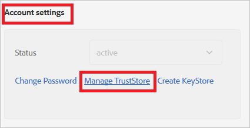
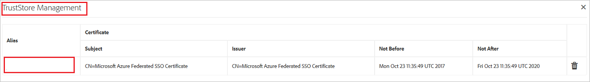
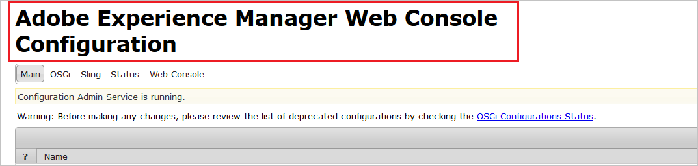
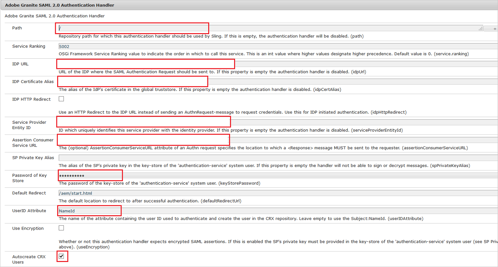

# Tutorial: Azure Active Directory integration with Adobe Experience Manager

In this tutorial, you'll learn how to integrate Adobe Experience Manager with Azure Active Directory (Azure AD). When you integrate Adobe Experience Manager with Azure AD, you can:

* Control in Azure AD who has access to Adobe Experience Manager.
* Enable your users to be automatically signed-in to Adobe Experience Manager with their Azure AD accounts.
* Manage your accounts in one central location - the Azure portal.

## Prerequisites

To get started, you need the following items:

* An Azure AD subscription. If you don't have a subscription, you can get a [free account](https://azure.microsoft.com/free/).
* Adobe Experience Manager single sign-on (SSO) enabled subscription.

## Scenario description

In this tutorial, you configure and test Azure AD SSO in a test environment.

* Adobe Experience Manager supports **SP and IDP** initiated SSO

* Adobe Experience Manager supports **Just In Time** user provisioning

## Adding Adobe Experience Manager from the gallery

To configure the integration of Adobe Experience Manager into Azure AD, you need to add Adobe Experience Manager from the gallery to your list of managed SaaS apps.

1. Sign in to the Azure portal using either a work or school account, or a personal Microsoft account.
1. On the left navigation pane, select the **Azure Active Directory** service.
1. Navigate to **Enterprise Applications** and then select **All Applications**.
1. To add new application, select **New application**.
1. In the **Add from the gallery** section, type **Adobe Experience Manager** in the search box.
1. Select **Adobe Experience Manager** from results panel and then add the app. Wait a few seconds while the app is added to your tenant.

 Alternatively, you can also use the [Enterprise App Configuration Wizard](https://portal.office.com/AdminPortal/home?Q=Docs#/azureadappintegration). In this wizard, you can add an application to your tenant, add users/groups to the app, assign roles, as well as walk through the SSO configuration as well. [Learn more about Microsoft 365 wizards.](/microsoft-365/admin/misc/azure-ad-setup-guides)

## Configure and test Azure AD SSO for Adobe Experience Manager

Configure and test Azure AD SSO with Adobe Experience Manager using a test user called **B.Simon**. For SSO to work, you need to establish a link relationship between an Azure AD user and the related user in Adobe Experience Manager.

To configure and test Azure AD SSO with Adobe Experience Manager, perform the following steps:

1. **[Configure Azure AD SSO](#configure-azure-ad-sso)** - to enable your users to use this feature.
    1. **[Create an Azure AD test user](#create-an-azure-ad-test-user)** - to test Azure AD single sign-on with B.Simon.
    1. **[Assign the Azure AD test user](#assign-the-azure-ad-test-user)** - to enable B.Simon to use Azure AD single sign-on.
2. **[Configure Adobe Experience Manager SSO](#configure-adobe-experience-manager-sso)** - to configure the Single Sign-On settings on application side.
    1. **[Create Adobe Experience Manager test user](#create-adobe-experience-manager-test-user)** - to have a counterpart of Britta Simon in Adobe Experience Manager that is linked to the Azure AD representation of user.
6. **[Test SSO](#test-sso)** - to verify whether the configuration works.

## Configure Azure AD SSO

Follow these steps to enable Azure AD SSO in the Azure portal.

1. In the Azure portal, on the **Adobe Experience Manager** application integration page, find the **Manage** section and select **single sign-on**.
1. On the **Select a single sign-on method** page, select **SAML**.
1. On the **Set up single sign-on with SAML** page, click the pencil icon for **Basic SAML Configuration** to edit the settings.

   

1. On the **Basic SAML Configuration** section, if you wish to configure the application in **IDP** initiated mode, enter the values for the following fields:

    a. In the **Identifier** text box, type a unique value that you define on your AEM server as well.

    b. In the **Reply URL** text box, type a URL using the following pattern:
    `https://<AEM Server Url>/saml_login`

    > [!NOTE]
    > The Reply URL value is not real. Update Reply URL value with the actual reply URL. To get this value, contact the [Adobe Experience Manager Client support team](https://helpx.adobe.com/support/experience-manager.html) to get this value. You can also refer to the patterns shown in the **Basic SAML Configuration** section in the Azure portal.

5. Click **Set additional URLs** and perform the following step if you wish to configure the application in **SP** initiated mode:

    In the **Sign-on URL** text box, type your Adobe Experience Manager server URL.

6. On the **Set up Single Sign-On with SAML** page, in the **SAML Signing Certificate** section, click **Download** to download the **Certificate (Base64)** from the given options as per your requirement and save it on your computer.

    

7. On the **Set up Adobe Experience Manager** section, copy the appropriate URL(s) as per your requirement.

    

### Create an Azure AD test user

In this section, you'll create a test user in the Azure portal called B.Simon.

1. From the left pane in the Azure portal, select **Azure Active Directory**, select **Users**, and then select **All users**.
1. Select **New user** at the top of the screen.
1. In the **User** properties, follow these steps:
   1. In the **Name** field, enter `B.Simon`.  
   1. In the **User name** field, enter the username@companydomain.extension. For example, `B.Simon@contoso.com`.
   1. Select the **Show password** check box, and then write down the value that's displayed in the **Password** box.
   1. Click **Create**.

### Assign the Azure AD test user

In this section, you'll enable B.Simon to use Azure single sign-on by granting access to Adobe Experience Manager.

1. In the Azure portal, select **Enterprise Applications**, and then select **All applications**.
1. In the applications list, select **Adobe Experience Manager**.
1. In the app's overview page, find the **Manage** section and select **Users and groups**.
1. Select **Add user**, then select **Users and groups** in the **Add Assignment** dialog.
1. In the **Users and groups** dialog, select **B.Simon** from the Users list, then click the **Select** button at the bottom of the screen.
1. If you are expecting a role to be assigned to the users, you can select it from the **Select a role** dropdown. If no role has been set up for this app, you see "Default Access" role selected.
1. In the **Add Assignment** dialog, click the **Assign** button.

## Configure Adobe Experience Manager SSO

1. In another browser window, open the **Adobe Experience Manager** admin portal.

2. Select **Settings** > **Security** > **Users**.

    

3. Select **Administrator** or any other relevant user.

    

4. Select **Account settings** > **Manage TrustStore**.

    

5. Under **Add Certificate from CER file**, click **Select Certificate File**. Browse to and select the certificate file, which you already downloaded from the Azure portal.

    

6. The certificate is added to the TrustStore. Note the alias of the certificate.

    

7. On the **Users** page, select **authentication-service**.

    

8. Select **Account settings** > **Create/Manage KeyStore**. Create KeyStore by supplying a password.

    

9. Go back to the admin screen. Then select **Settings** > **Operations** > **Web Console**.

    

    This opens the configuration page.

    

10. Find **Adobe Granite SAML 2.0 Authentication Handler**. Then select the **Add** icon.

    

11. Take the following actions on this page.

    

    a. In the **Path** box, enter **/**.

    b. In the **IDP URL** box, enter the **Login URL** value that you copied from the Azure portal.

    c. In the **IDP Certificate Alias** box, enter the **Certificate Alias** value that you added in TrustStore.

    d. In the **Security Provided Entity ID** box, enter the unique **Azure Ad Identifier** value that you configured in the Azure portal.

    e. In the **Assertion Consumer Service URL** box, enter the **Reply URL** value that you configured in the Azure portal.

    f. In the **Password of Key Store** box, enter the **Password** that you set in KeyStore.

    g. In the **User Attribute ID** box, enter the **Name ID** or another user ID that's relevant in your case.

    h. Select **Autocreate CRX Users**.

    i. In the **Logout URL** box, enter the unique **Logout URL** value that you got from the Azure portal.

    j. Select **Save**.

### Create Adobe Experience Manager test user

In this section, you create a user called Britta Simon in Adobe Experience Manager. If you selected the **Autocreate CRX Users** option, users are created automatically after successful authentication.

If you want to create users manually, work with the [Adobe Experience Manager support team](https://helpx.adobe.com/support/experience-manager.html) to add the users in the Adobe Experience Manager platform.

## Test SSO 

In this section, you test your Azure AD single sign-on configuration with following options. 

#### SP initiated:

* Click on **Test this application** in Azure portal. This will redirect to Adobe Experience Manager Sign on URL where you can initiate the login flow.  

* Go to Adobe Experience Manager Sign-on URL directly and initiate the login flow from there.

#### IDP initiated:

* Click on **Test this application** in Azure portal and you should be automatically signed in to the Adobe Experience Manager for which you set up the SSO 

You can also use Microsoft My Apps to test the application in any mode. When you click the Adobe Experience Manager tile in the My Apps, if configured in SP mode you would be redirected to the application sign on page for initiating the login flow and if configured in IDP mode, you should be automatically signed in to the Adobe Experience Manager for which you set up the SSO. For more information about the My Apps, see [Introduction to the My Apps](https://support.microsoft.com/account-billing/sign-in-and-start-apps-from-the-my-apps-portal-2f3b1bae-0e5a-4a86-a33e-876fbd2a4510).

## Next steps

Once you configure Adobe Experience Manager you can enforce session control, which protects exfiltration and infiltration of your organization’s sensitive data in real time. Session control extends from Conditional Access. [Learn how to enforce session control with Microsoft Defender for Cloud Apps](/cloud-app-security/proxy-deployment-any-app).
