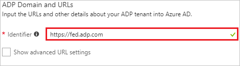
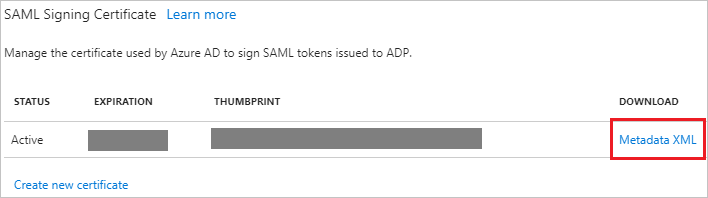
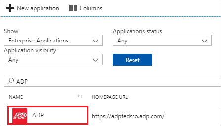

# Tutorial: Azure Active Directory integration with ADP

In this tutorial, you learn how to integrate ADP with Azure Active Directory (Azure AD).

Integrating ADP with Azure AD provides you with the following benefits:

- You can control in Azure AD who has access to ADP.
- You can enable your users to automatically get signed-on to ADP (Single Sign-On) with their Azure AD accounts.
- You can manage your accounts in one central location - the Azure portal.

If you want to know more details about SaaS app integration with Azure AD, see [what is application access and single sign-on with Azure Active Directory](../manage-apps/what-is-single-sign-on.md).

## Prerequisites

To configure Azure AD integration with ADP, you need the following items:

- An Azure AD subscription
- An ADP enabled subscription

> [!NOTE]
> To test the steps in this tutorial, we do not recommend using a production environment.

To test the steps in this tutorial, you should follow these recommendations:

- Do not use your production environment, unless it is necessary.
- If you don't have an Azure AD trial environment, you can [get a one-month trial](https://azure.microsoft.com/pricing/free-trial/).

## Scenario description
In this tutorial, you test Azure AD single sign-on in a test environment. 
The scenario outlined in this tutorial consists of two main building blocks:

1. Adding ADP from the gallery
2. Configuring and testing Azure AD single sign-on

## Adding ADP from the gallery
To configure the integration of ADP into Azure AD, you need to add ADP from the gallery to your list of managed SaaS apps.

**To add ADP from the gallery, perform the following steps:**

1.	Log on to your Microsoft Azure identity provider environment as an administrator.

2. In the **[Azure portal](https://portal.azure.com)**, on the left navigation panel, click **Azure Active Directory** icon. 

	![The Azure Active Directory button][1]

3. Navigate to **Enterprise applications**. Then go to **All applications**.

	![The Enterprise applications blade][2]
	
4. To add new application, click **New application** button on the top of dialog.

	![The New application button][3]

5. In the search box, type **ADP**, select **ADP** from result panel then click **Add** button to add the application.

	

## Configure and test Azure AD single sign-on

In this section, you configure and test Azure AD single sign-on with ADP based on a test user called "Britta Simon".

For single sign-on to work, Azure AD needs to know what the counterpart user in ADP is to a user in Azure AD. In other words, a link relationship between an Azure AD user and the related user in ADP needs to be established.

In ADP, assign the value of the **user name** in Azure AD as the value of the **Username** to establish the link relationship.

To configure and test Azure AD single sign-on with ADP, you need to complete the following building blocks:

1. **[Configure Azure AD Single Sign-On](#configure-azure-ad-single-sign-on)** - to enable your users to use this feature.
2. **[Create an Azure AD test user](#create-an-azure-ad-test-user)** - to test Azure AD single sign-on with Britta Simon.
3. **[Create an ADP test user](#create-an-adp-test-user)** - to have a counterpart of Britta Simon in ADP that is linked to the Azure AD representation of user.
4. **[Assign the Azure AD test user](#assign-the-azure-ad-test-user)** - to enable Britta Simon to use Azure AD single sign-on.
5. **[Test single sign-on](#test-single-sign-on)** - to verify whether the configuration works.

### Configure Azure AD single sign-on

In this section, you enable Azure AD single sign-on in the Azure portal and configure single sign-on in your ADP application.

**To configure Azure AD single sign-on with ADP, perform the following steps:**

1. In the Azure portal, on the **ADP** application integration page, click on **Properties tab** and perform the following steps: 

	

	a. Set the **Enabled for users to sign-in** field value to **Yes**.

	b. Copy the **User access URL** and you have to paste it in **Configure Sign-on URL section**, which is explained later in the tutorial.

	c. Set the **User assignment required** field value to **Yes**.

	d. Set the **Visible to users** field value to **No**.

2. Click **Single sign-on** on **ADP** application integration page.

	![Configure single sign-on link][4]

3. On the **Single sign-on** dialog, select **Mode** as	**SAML-based Sign-on** to enable single sign-on.
 
	

4. On the **ADP Domain and URLs** section, perform the following steps:

	

	In the **Identifier** textbox, type a URL: `https://fed.adp.com` 
	
5. The ADP application expects the SAML assertions in a specific format, which requires you to add custom attribute mappings to your SAML token attributes configuration. The following screenshot shows an example for this. The claim name will always be **"PersonImmutableID"** and the value of which we have mapped to **employeeid**. 

	Here the user mapping from Azure AD to ADP will be done on the **employeeid** but you can map this to a different value based on your application settings. So please work with [ADP support team](https://www.adp.com/contact-us/overview.aspx) first to use the correct identifier of a user and map that value with the **"PersonImmutableID"** claim.

    

6. In the **User Attributes** section on the **Single sign-on** dialog, configure SAML token attribute as shown in the image and perform the following steps:
	
	| Attribute Name | Attribute Value |
	| ------------------- | -------------------- |    
	| PersonImmutableID | user.employeeid |
	
	a. Click **Add attribute** to open the **Add Attribute** dialog.

	

	

	b. In the **Name** textbox, type the attribute name shown for that row.

	c. From the **Value** list, type the attribute value shown for that row.
	
	d. Click **Ok**.

	> [!NOTE] 
	> Before you can configure the SAML assertion, you need to contact your [ADP  support team](https://www.adp.com/contact-us/overview.aspx) and request the value of the unique identifier attribute for your tenant. You need this value to configure the custom claim for your application. 

7. On the **SAML Signing Certificate** section, click **Metadata XML** and then save the metadata file on your computer.

	 

8. To configure single sign-on on **ADP** side, you need to upload the downloaded **Metadata XML** on the [ADP website](https://adpfedsso.adp.com/public/login/index.fcc).

> [!NOTE]  
> This process may take a few days. 

### Configure your ADP service(s) for federated access

>[!Important]
> Your employees who require federated access to your ADP services must be assigned to the ADP service app and subsequently, users must be reassigned to the specific ADP service.
Upon receipt of confirmation from your ADP representative, configure your ADP service(s) and assign/manage users to control user access to the specific ADP service.

1. In the **[Azure portal](https://portal.azure.com)**, on the left navigation panel, click **Azure Active Directory** icon. 

	![The Azure Active Directory button][1]

2. Navigate to **Enterprise applications**. Then go to **All applications**.

	![The Enterprise applications blade][2]
	
3. To add new application, click **New application** button on the top of dialog.

	![The New application button][3]

4. In the search box, type **ADP**, select **ADP** from result panel then click **Add** button to add the application.

	

5. In the Azure portal, on your **ADP** application integration page, click on **Properties tab** and perform the following steps:  

	

	a.	Set the **Enabled for users to sign-in** field value to **Yes**.

	b.	Set the **User assignment required** field value to **Yes**.

	c.	Set the **Visible to users** field value to **Yes**.

6. Click **Single sign-on** on **ADP** application integration page.

	![Configure single sign-on link][4]

7. On the **Single sign-on** dialog, select **Mode** as	**Linked Sign-on**. to link your application to **ADP**.

	

8. Navigate to the **Configure Sign-on URL** section, perform the following steps:

	
                                                              
	a. Paste the **User access URL**, which you have copied from above **properties tab** (from the main ADP app).
                                                             
	b. Following are the 5 apps that support different **Relay State URLs**. You have to append the appropriate **Relay State URL** value for particular application manually to the **User access URL**.
	
	* **ADP Workforce Now**
		
	 	`<User access URL>?relaystate=https://fed.adp.com/saml/fedlanding.html?WFN`

	* **ADP Workforce Now Enhanced Time**
		
	 	`<User access URL>?relaystate=https://fed.adp.com/saml/fedlanding.html?EETDC2`
	
	* **ADP Vantage HCM**
		
	 	`<User access URL>?relaystate=https://fed.adp.com/saml/fedlanding.html?ADPVANTAGE`

	* **ADP Enterprise HR**

	 	`<User access URL>?relaystate=https://fed.adp.com/saml/fedlanding.html?PORTAL`

	* **MyADP**

	 	`<User access URL>?relaystate=https://fed.adp.com/saml/fedlanding.html?REDBOX`

9. **Save** your changes.

10. Upon receipt of confirmation from your ADP representative, begin test with one or two users.

	a. Assign few users to the ADP service App to test federated access.

    b. Test is successful when users access the ADP service app on the gallery and can access their ADP service.
 
11. On confirmation of a successful test, assign the federated ADP service to individual users or user groups, which is explained later in the tutorial and roll it out to your employees. 

### Create an Azure AD test user

The objective of this section is to create a test user in the Azure portal called Britta Simon.

   ![Create an Azure AD test user][100]

**To create a test user in Azure AD, perform the following steps:**

1. In the Azure portal, in the left pane, click the **Azure Active Directory** button.

    

2. To display the list of users, go to **Users and groups**, and then click **All users**.

    

3. To open the **User** dialog box, click **Add** at the top of the **All Users** dialog box.

    

4. In the **User** dialog box, perform the following steps:

    

    a. In the **Name** box, type **BrittaSimon**.

    b. In the **User name** box, type the email address of user Britta Simon.

    c. Select the **Show Password** check box, and then write down the value that's displayed in the **Password** box.

    d. Click **Create**.
 
### Create an ADP test user

The objective of this section is to create a user called Britta Simon in ADP. Work with [ADP support team](https://www.adp.com/contact-us/overview.aspx) to add the users in the ADP account.

### Assign the Azure AD test user

In this section, you enable Britta Simon to use Azure single sign-on by granting access to ADP.

![Assign the user role][200] 

**To assign Britta Simon to ADP, perform the following steps:**

1. In the Azure portal, open the applications view, and then navigate to the directory view and go to **Enterprise applications** then click **All applications**.

	![Assign User][201] 

2. In the applications list, select **ADP**.

	  

3. In the menu on the left, click **Users and groups**.

	![The "Users and groups" link][202]

4. Click **Add** button. Then select **Users and groups** on **Add Assignment** dialog.

	![The Add Assignment pane][203]

5. On **Users and groups** dialog, select **Britta Simon** in the Users list.

6. Click **Select** button on **Users and groups** dialog.

7. Click **Assign** button on **Add Assignment** dialog.
	
### Test single sign-on

In this section, you test your Azure AD single sign-on configuration using the Access Panel.

When you click the ADP tile in the Access Panel, you should get automatically signed-on to your ADP application.
For more information about the Access Panel, see [Introduction to the Access Panel](../user-help/active-directory-saas-access-panel-introduction.md). 

## Additional resources

* [List of Tutorials on How to Integrate SaaS Apps with Azure Active Directory](tutorial-list.md)
* [What is application access and single sign-on with Azure Active Directory?](../manage-apps/what-is-single-sign-on.md)

<!--Image references-->

[1]: ./media/adpfederatedsso-tutorial/tutorial_general_01.png
[2]: ./media/adpfederatedsso-tutorial/tutorial_general_02.png
[3]: ./media/adpfederatedsso-tutorial/tutorial_general_03.png
[4]: ./media/adpfederatedsso-tutorial/tutorial_general_04.png

[100]: ./media/adpfederatedsso-tutorial/tutorial_general_100.png

[200]: ./media/adpfederatedsso-tutorial/tutorial_general_200.png
[201]: ./media/adpfederatedsso-tutorial/tutorial_general_201.png
[202]: ./media/adpfederatedsso-tutorial/tutorial_general_202.png
[203]: ./media/adpfederatedsso-tutorial/tutorial_general_203.png

