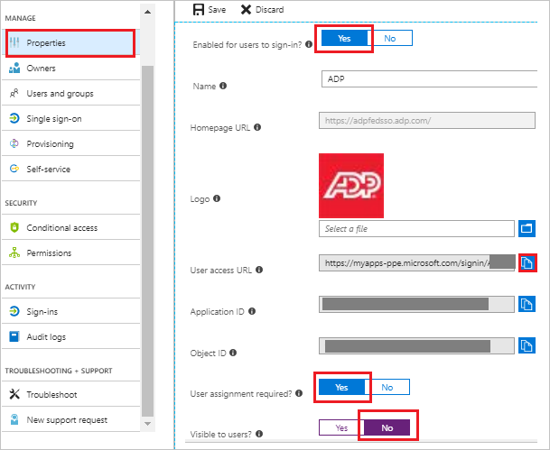
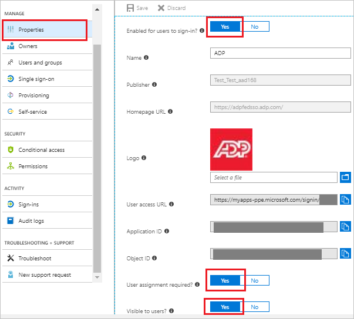
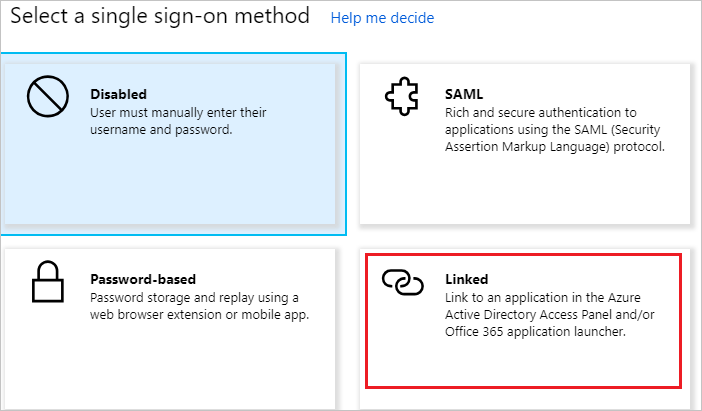
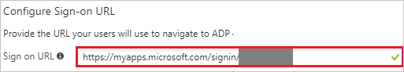

# Tutorial: Azure Active Directory integration with ADP

In this tutorial, you learn how to integrate ADP with Azure Active Directory (Azure AD).
Integrating ADP with Azure AD provides you with the following benefits:

* You can control in Azure AD who has access to ADP.
* You can enable your users to be automatically signed-in to ADP (Single Sign-On) with their Azure AD accounts.
* You can manage your accounts in one central location - the Azure portal.

If you want to know more details about SaaS app integration with Azure AD, see [What is application access and single sign-on with Azure Active Directory](https://docs.microsoft.com/azure/active-directory/active-directory-appssoaccess-whatis).
If you don't have an Azure subscription, [create a free account](https://azure.microsoft.com/free/) before you begin.

## Prerequisites

To configure Azure AD integration with ADP, you need the following items:

* An Azure AD subscription. If you don't have an Azure AD environment, you can get one-month trial [here](https://azure.microsoft.com/pricing/free-trial/)
* ADP single sign-on enabled subscription

## Scenario description

In this tutorial, you configure and test Azure AD single sign-on in a test environment.

* ADP supports **IDP** initiated SSO

## Adding ADP from the gallery

To configure the integration of ADP into Azure AD, you need to add ADP from the gallery to your list of managed SaaS apps.

**To add ADP from the gallery, perform the following steps:**

1. In the **[Azure portal](https://portal.azure.com)**, on the left navigation panel, click **Azure Active Directory** icon.

	

2. Navigate to **Enterprise Applications** and then select the **All Applications** option.

	

3. To add new application, click **New application** button on the top of dialog.

	

4. In the search box, type **ADP**, select **ADP** from result panel then click **Add** button to add the application.

	 

## Configure and test Azure AD single sign-on

In this section, you configure and test Azure AD single sign-on with ADP based on a test user called **Britta Simon**.
For single sign-on to work, a link relationship between an Azure AD user and the related user in ADP needs to be established.

To configure and test Azure AD single sign-on with ADP, you need to complete the following building blocks:

1. **[Configure Azure AD Single Sign-On](#configure-azure-ad-single-sign-on)** - to enable your users to use this feature.
2. **[Configure ADP Single Sign-On](#configure-adp-single-sign-on)** - to configure the Single Sign-On settings on application side.
3. **[Create an Azure AD test user](#create-an-azure-ad-test-user)** - to test Azure AD single sign-on with Britta Simon.
4. **[Assign the Azure AD test user](#assign-the-azure-ad-test-user)** - to enable Britta Simon to use Azure AD single sign-on.
5. **[Create ADP test user](#create-adp-test-user)** - to have a counterpart of Britta Simon in ADP that is linked to the Azure AD representation of user.
6. **[Test single sign-on](#test-single-sign-on)** - to verify whether the configuration works.

### Configure Azure AD single sign-on

In this section, you enable Azure AD single sign-on in the Azure portal.

To configure Azure AD single sign-on with ADP, perform the following steps:

1. In the Azure portal, on the **ADP** application integration page, click on **Properties tab** and perform the following steps: 

	

	a. Set the **Enabled for users to sign-in** field value to **Yes**.

	b. Copy the **User access URL** and you have to paste it in **Configure Sign-on URL section**, which is explained later in the tutorial.

	c. Set the **User assignment required** field value to **Yes**.

	d. Set the **Visible to users** field value to **No**.

2. In the [Azure portal](https://portal.azure.com/), on the **ADP** application integration page, select **Single sign-on**.

    

3. On the **Select a Single sign-on method** dialog, select **SAML/WS-Fed** mode to enable single sign-on.

    

4. On the **Set up Single Sign-On with SAML** page, click **Edit** icon to open **Basic SAML Configuration** dialog.

	

5. On the **Basic SAML Configuration** section, perform the following steps:

    

    In the **Identifier (Entity ID)** text box, type a URL:
    `https://fed.adp.com`

6. ADP application expects the SAML assertions in a specific format. Configure the following claims for this application. You can manage the values of these attributes from the **User Attributes** section on application integration page. On the **Set up Single Sign-On with SAML** page, click **Edit** button to open **User Attributes** dialog. The claim name will always be **"PersonImmutableID"** and the value of which we shown that to map with **employeeid**. 

	The user mapping from Azure AD to ADP will be done on the **employeeid** but you can map this to a different value based on your application settings. So please work with [ADP support team](https://www.adp.com/contact-us/overview.aspx) first to use the correct identifier of a user and map that value with the **"PersonImmutableID"** claim.

	

7. In the **User Claims** section on the **User Attributes** dialog, edit the claims by using **Edit icon** or add the claims by using **Add new claim** to configure SAML token attribute as shown in the image above and perform the following steps:
    
	| Name | Source Attribute | 
	| ---------------| --------------- |
	| PersonImmutableID  | user.employeeid |

	a. Click **Add new claim** to open the **Manage user claims** dialog.

	

	

	b. In the **Name** textbox, type the attribute name shown for that row.

	c. Leave the **Namespace** blank.

	d. Select Source as **Attribute**.

	e. From the **Source attribute** list, type the attribute value shown for that row.

	f. Click **Ok**

	g. Click **Save**.

	> [!NOTE] 
	> Before you can configure the SAML assertion, you need to contact your [ADP  support team](https://www.adp.com/contact-us/overview.aspx) and request the value of the unique user identifier attribute for your tenant. You need this value to configure the custom claim for your application. 

8. On the **Set up Single Sign-On with SAML** page, in the **SAML Signing Certificate** section, click **Download** to download the **Federation Metadata XML** from the given options as per your requirement and save it on your computer.

	

### Configure ADP Single Sign-On

To configure single sign-on on **ADP** side, you need to upload the downloaded **Metadata XML** on the [ADP website](https://adpfedsso.adp.com/public/login/index.fcc).

> [!NOTE]  
> This process may take a few days.

### Configure your ADP service(s) for federated access

>[!Important]
> Your employees who require federated access to your ADP services must be assigned to the ADP service app and subsequently, users must be reassigned to the specific ADP service.
Upon receipt of confirmation from your ADP representative, configure your ADP service(s) and assign/manage users to control user access to the specific ADP service.

1. In the **[Azure portal](https://portal.azure.com)**, on the left navigation panel, click **Azure Active Directory** icon.

	

2. Navigate to **Enterprise Applications** and then select the **All Applications** option.

	

3. To add new application, click **New application** button on the top of dialog.

	

4. In the search box, type **ADP**, select **ADP** from result panel then click **Add** button to add the application.

	 

5. In the Azure portal, on your **ADP** application integration page, click on **Properties tab** and perform the following steps:  

	

	a.	Set the **Enabled for users to sign-in** field value to **Yes**.

	b.	Set the **User assignment required** field value to **Yes**.

	c.	Set the **Visible to users** field value to **Yes**.

6. In the [Azure portal](https://portal.azure.com/), on the **ADP** application integration page, select **Single sign-on**.

    

7. On the **Select a Single sign-on method** dialog, select **Mode** as	**Linked**. to link your application to **ADP**.

    

8. Navigate to the **Configure Sign-on URL** section, perform the following steps:

    

    a. Paste the **User access URL**, which you have copied from above **properties tab** (from the main ADP app).
                                                             
	b. Following are the 5 apps that support different **Relay State URLs**. You have to append the appropriate **Relay State URL** value for particular application manually to the **User access URL**.
	
	* **ADP Workforce Now**
		
	 	`<User access URL>?relaystate=https://fed.adp.com/saml/fedlanding.html?WFN`

	* **ADP Workforce Now Enhanced Time**
		
	 	`<User access URL>?relaystate=https://fed.adp.com/saml/fedlanding.html?EETDC2`
	
	* **ADP Vantage HCM**
		
	 	`<User access URL>?relaystate=https://fed.adp.com/saml/fedlanding.html?ADPVANTAGE`

	* **ADP Enterprise HR**

	 	`<User access URL>?relaystate=https://fed.adp.com/saml/fedlanding.html?PORTAL`

	* **MyADP**

	 	`<User access URL>?relaystate=https://fed.adp.com/saml/fedlanding.html?REDBOX`

9. **Save** your changes.

10. Upon receipt of confirmation from your ADP representative, begin test with one or two users.

	a. Assign few users to the ADP service App to test federated access.

    b. Test is successful when users access the ADP service app on the gallery and can access their ADP service.
 
11. On confirmation of a successful test, assign the federated ADP service to individual users or user groups, which is explained later in the tutorial and roll it out to your employees.
 
### Create an Azure AD test user 

The objective of this section is to create a test user in the Azure portal called Britta Simon.

1. In the Azure portal, in the left pane, select **Azure Active Directory**, select **Users**, and then select **All users**.

    

2. Select **New user** at the top of the screen.

    

3. In the User properties, perform the following steps.

    

    a. In the **Name** field enter **BrittaSimon**.
  
    b. In the **User name** field type **brittasimon\@yourcompanydomain.extension**  
    For example, BrittaSimon@contoso.com

    c. Select **Show password** check box, and then write down the value that's displayed in the Password box.

    d. Click **Create**.

### Assign the Azure AD test user

In this section, you enable Britta Simon to use Azure single sign-on by granting access to ADP.

1. In the Azure portal, select **Enterprise Applications**, select **All applications**, then select **ADP**.

	

2. In the applications list, type and select **ADP**.

	

3. In the menu on the left, select **Users and groups**.

    

4. Click the **Add user** button, then select **Users and groups** in the **Add Assignment** dialog.

    

5. In the **Users and groups** dialog select **Britta Simon** in the Users list, then click the **Select** button at the bottom of the screen.

6. If you are expecting any role value in the SAML assertion then in the **Select Role** dialog select the appropriate role for the user from the list, then click the **Select** button at the bottom of the screen.

7. In the **Add Assignment** dialog click the **Assign** button.

### Create ADP test user

The objective of this section is to create a user called Britta Simon in ADP. Work with [ADP support team](https://www.adp.com/contact-us/overview.aspx) to add the users in the ADP account. 

### Test single sign-on 

In this section, you test your Azure AD single sign-on configuration using the Access Panel.

When you click the ADP tile in the Access Panel, you should be automatically signed in to the ADP for which you set up SSO. For more information about the Access Panel, see [Introduction to the Access Panel](https://docs.microsoft.com/azure/active-directory/active-directory-saas-access-panel-introduction).

## Additional Resources

- [List of Tutorials on How to Integrate SaaS Apps with Azure Active Directory](https://docs.microsoft.com/azure/active-directory/active-directory-saas-tutorial-list)

- [What is application access and single sign-on with Azure Active Directory?](https://docs.microsoft.com/azure/active-directory/active-directory-appssoaccess-whatis)

- [What is Conditional Access in Azure Active Directory?](https://docs.microsoft.com/azure/active-directory/conditional-access/overview)

