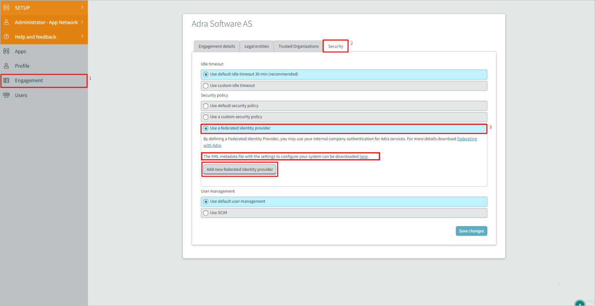
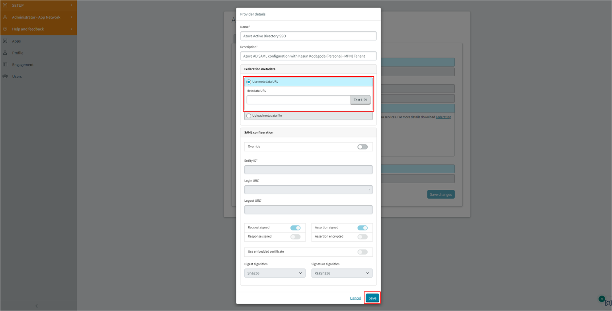

# Tutorial: Microsoft Entra SSO integration with Adra by Trintech

In this tutorial, you'll learn how to integrate Adra by Trintech with Microsoft Entra ID. When you integrate Adra by Trintech with Microsoft Entra ID, you can:

* Control in Microsoft Entra ID who has access to Adra by Trintech.
* Enable your users to be automatically signed-in to Adra by Trintech with their Microsoft Entra accounts.
* Manage your accounts in one central location.

## Prerequisites

To get started, you need the following items:

* A Microsoft Entra subscription. If you don't have a subscription, you can get a [free account](https://azure.microsoft.com/free/).
* Adra by Trintech single sign-on (SSO) enabled subscription.
* Along with Cloud Application Administrator, Application Administrator can also add or manage applications in Microsoft Entra ID.
For more information, see [Azure built-in roles](../roles/permissions-reference.md).

## Scenario description

In this tutorial, you configure and test Microsoft Entra SSO in a test environment.

* Adra by Trintech supports **SP** and **IDP** initiated SSO.

## Add Adra by Trintech from the gallery

To configure the integration of Adra by Trintech into Microsoft Entra ID, you need to add Adra by Trintech from the gallery to your list of managed SaaS apps.

1. Sign in to the [Microsoft Entra admin center](https://entra.microsoft.com) as at least a [Cloud Application Administrator](../roles/permissions-reference.md#cloud-application-administrator).
1. Browse to **Identity** > **Applications** > **Enterprise applications** > **New application**.
1. In the **Add from the gallery** section, type **Adra by Trintech** in the search box.
1. Select **Adra by Trintech** from results panel and then add the app. Wait a few seconds while the app is added to your tenant.

 Alternatively, you can also use the [Enterprise App Configuration Wizard](https://portal.office.com/AdminPortal/home?Q=Docs#/azureadappintegration). In this wizard, you can add an application to your tenant, add users/groups to the app, assign roles, as well as walk through the SSO configuration as well. [Learn more about Microsoft 365 wizards.](/microsoft-365/admin/misc/azure-ad-setup-guides)

## Configure and test Microsoft Entra SSO for Adra by Trintech

Configure and test Microsoft Entra SSO with Adra by Trintech using a test user called **B.Simon**. For SSO to work, you need to establish a link relationship between a Microsoft Entra user and the related user in Adra by Trintech.

To configure and test Microsoft Entra SSO with Adra by Trintech, perform the following steps:

1. **[Configure Microsoft Entra SSO](#configure-azure-ad-sso)** - to enable your users to use this feature.
   1. **[Create a Microsoft Entra test user](#create-an-azure-ad-test-user)** - to test Microsoft Entra single sign-on with B.Simon.
   1. **[Assign the Microsoft Entra test user](#assign-the-azure-ad-test-user)** - to enable B.Simon to use Microsoft Entra single sign-on.
1. **[Configure Adra by Trintech SSO](#configure-adra-by-trintech-sso)** - to configure the single sign-on settings on application side.
   1. **[Create Adra by Trintech test user](#create-adra-by-trintech-test-user)** - to have a counterpart of B.Simon in Adra by Trintech that is linked to the Microsoft Entra representation of user.
1. **[Test SSO](#test-sso)** - to verify whether the configuration works.

## Configure Microsoft Entra SSO

Follow these steps to enable Microsoft Entra SSO.

1. Sign in to the [Microsoft Entra admin center](https://entra.microsoft.com) as at least a [Cloud Application Administrator](../roles/permissions-reference.md#cloud-application-administrator).
1. Browse to **Identity** > **Applications** > **Enterprise applications** > **Adra by Trintech** > **Single sign-on**.
1. On the **Select a single sign-on method** page, select **SAML**.
1. On the **Set up single sign-on with SAML** page, click the pencil icon for **Basic SAML Configuration** to edit the settings.

   

1. On the **Basic SAML Configuration** section, if you have **Service Provider metadata file** and wish to configure in **IDP** initiated mode, perform the following steps:

	a. Click **Upload metadata file**.

   

	b. Click on **folder logo** to select the metadata file and click **Upload**.

	

	c. After the metadata file is successfully uploaded, the **Identifier** and **Reply URL** values get auto populated in **Basic SAML Configuration** section.

   d. In the **Sign-on URL** text box, type the URL:
      `https://login.adra.com`

   e. In the **Relay state** text box, type the URL:
      `https://setup.adra.com` 

   f. In the **Logout URL** text box, type the URL:
      `https://login.adra.com/Saml/SLOServiceSP`

   > [!Note]
	> You will get the **Service Provider metadata file** from the **Configure Adra by Trintech SSO** section, which is explained later in the tutorial. If the **Identifier** and **Reply URL** values do not get auto populated, then fill in the values manually according to your requirement.

1. On the **Set up single sign-on with SAML** page, In the **SAML Signing Certificate** section, click copy button to copy **App Federation Metadata Url** and save it on your computer.

	

### Create a Microsoft Entra test user

In this section, you'll create a test user called B.Simon.

1. Sign in to the [Microsoft Entra admin center](https://entra.microsoft.com) as at least a [User Administrator](../roles/permissions-reference.md#user-administrator).
1. Browse to **Identity** > **Users** > **All users**.
1. Select **New user** > **Create new user**, at the top of the screen.
1. In the **User** properties, follow these steps:
   1. In the **Display name** field, enter `B.Simon`.  
   1. In the **User principal name** field, enter the username@companydomain.extension. For example, `B.Simon@contoso.com`.
   1. Select the **Show password** check box, and then write down the value that's displayed in the **Password** box.
   1. Select **Review + create**.
1. Select **Create**.

### Assign the Microsoft Entra test user

In this section, you'll enable B.Simon to use single sign-on by granting access to Adra by Trintech.

1. Sign in to the [Microsoft Entra admin center](https://entra.microsoft.com) as at least a [Cloud Application Administrator](../roles/permissions-reference.md#cloud-application-administrator).
1. Browse to **Identity** > **Applications** > **Enterprise applications** > **Adra by Trintech**.
1. In the app's overview page, select **Users and groups**.
1. Select **Add user/group**, then select **Users and groups** in the **Add Assignment** dialog.
   1. In the **Users and groups** dialog, select **B.Simon** from the Users list, then click the **Select** button at the bottom of the screen.
   1. If you are expecting a role to be assigned to the users, you can select it from the **Select a role** dropdown. If no role has been set up for this app, you see "Default Access" role selected.
   1. In the **Add Assignment** dialog, click the **Assign** button.

## Configure Adra by Trintech SSO

1. Log in to your Adra by Trintech company site as an administrator.

1. Go to **Engagement** > **Security** Tab > **Security Policy** > select **Use a federated identity provider** button.

1. Download the **Service Provider metadata file** by clicking **here** in the Adra page and upload this metadata file.

   

1. Click on the **Add a new federated identity provider** button and perform the following steps:

   

   a. Enter a valid **Name** and **Description** values in the textbox.

   b. In the **Metadata URL** textbox, paste the **App Federation Metadata Url** which you've copied and click on the **Test URL** button.

   c. Click **Save** to save the SAML configuration..

### Create Adra by Trintech test user

In this section, you create a user called Britta Simon at Adra by Trintech. Work with [Adra by Trintech support team](mailto:support@adra.com) to add the users in the Adra by Trintech platform. Users must be created and activated before you use single sign-on.

## Test SSO 

In this section, you test your Microsoft Entra single sign-on configuration with following options. 

#### SP initiated:

* Click on **Test this application**, this will redirect to Adra by Trintech Sign-on URL where you can initiate the login flow.  

* Go to Adra by Trintech Sign-on URL directly and initiate the login flow from there.

#### IDP initiated:

* Click on **Test this application**, and you should be automatically signed in to the Adra by Trintech for which you set up the SSO. 

You can also use Microsoft My Apps to test the application in any mode. When you click the Adra by Trintech tile in the My Apps, if configured in SP mode you would be redirected to the application sign-on page for initiating the login flow and if configured in IDP mode, you should be automatically signed in to the Adra by Trintech for which you set up the SSO. For more information, see [Microsoft Entra My Apps](/azure/active-directory/manage-apps/end-user-experiences#azure-ad-my-apps).

## Next steps

Once you configure Adra by Trintech you can enforce session control, which protects exfiltration and infiltration of your organization’s sensitive data in real time. Session control extends from Conditional Access. [Learn how to enforce session control with Microsoft Defender for Cloud Apps](/cloud-app-security/proxy-deployment-any-app).
