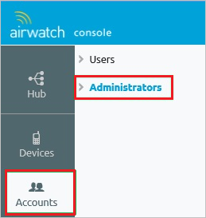
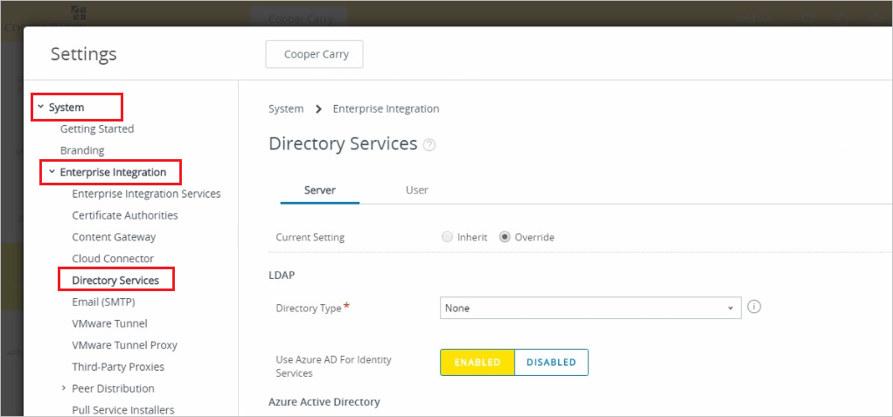
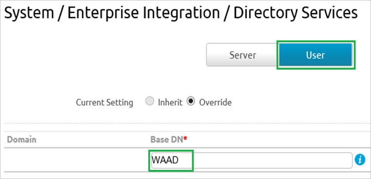
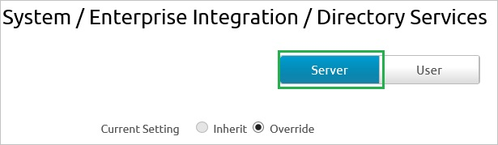
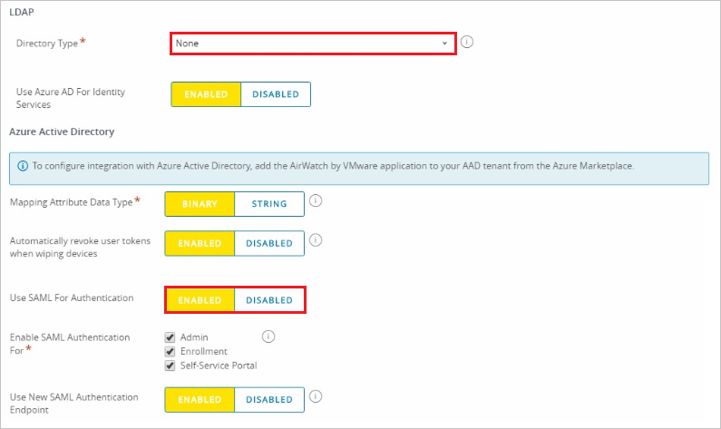
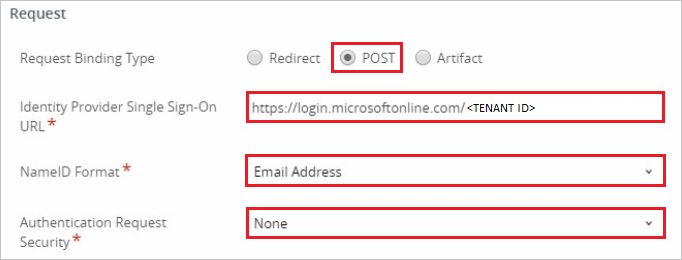
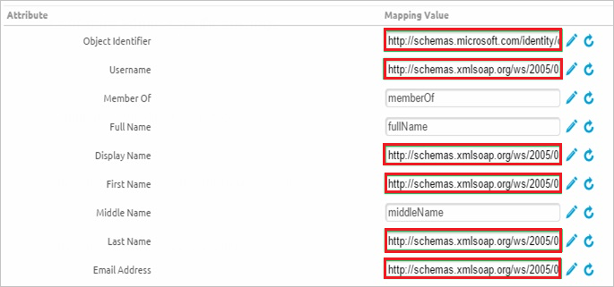
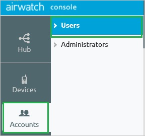
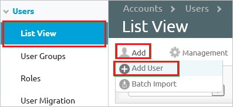
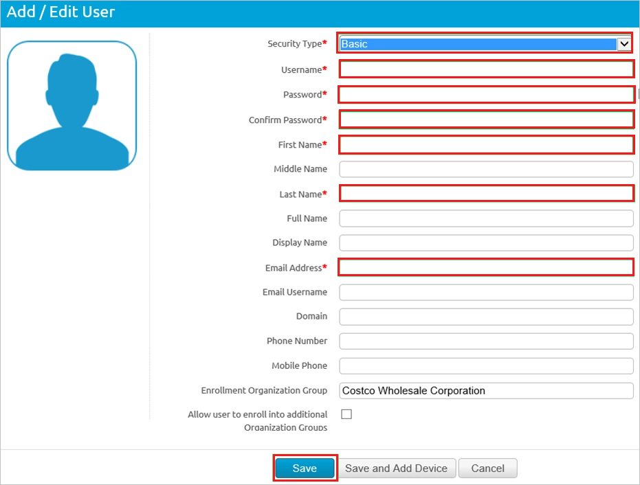

# Tutorial: Azure Active Directory integration with AirWatch

In this tutorial, you learn how to integrate AirWatch with Azure Active Directory (Azure AD).
Integrating AirWatch with Azure AD provides you with the following benefits:

* You can control in Azure AD who has access to AirWatch.
* You can enable your users to be automatically signed-in to AirWatch (Single Sign-On) with their Azure AD accounts.
* You can manage your accounts in one central location - the Azure portal.

If you want to know more details about SaaS app integration with Azure AD, see [What is application access and single sign-on with Azure Active Directory](https://docs.microsoft.com/azure/active-directory/active-directory-appssoaccess-whatis).
If you don't have an Azure subscription, [create a free account](https://azure.microsoft.com/free/) before you begin.

## Prerequisites

To configure Azure AD integration with AirWatch, you need the following items:

* An Azure AD subscription. If you don't have an Azure AD environment, you can get one-month trial [here](https://azure.microsoft.com/pricing/free-trial/)
* AirWatch single sign-on enabled subscription

## Scenario description

In this tutorial, you configure and test Azure AD single sign-on in a test environment.

* AirWatch supports **SP** initiated SSO

## Adding AirWatch from the gallery

To configure the integration of AirWatch into Azure AD, you need to add AirWatch from the gallery to your list of managed SaaS apps.

**To add AirWatch from the gallery, perform the following steps:**

1. In the **[Azure portal](https://portal.azure.com)**, on the left navigation panel, click **Azure Active Directory** icon.

	

2. Navigate to **Enterprise Applications** and then select the **All Applications** option.

	

3. To add new application, click **New application** button on the top of dialog.

	

4. In the search box, type **AirWatch**, select **AirWatch** from result panel then click **Add** button to add the application.

	 

## Configure and test Azure AD single sign-on

In this section, you configure and test Azure AD single sign-on with AirWatch based on a test user called **Britta Simon**.
For single sign-on to work, a link relationship between an Azure AD user and the related user in AirWatch needs to be established.

To configure and test Azure AD single sign-on with AirWatch, you need to complete the following building blocks:

1. **[Configure Azure AD Single Sign-On](#configure-azure-ad-single-sign-on)** - to enable your users to use this feature.
2. **[Configure AirWatch Single Sign-On](#configure-airwatch-single-sign-on)** - to configure the Single Sign-On settings on application side.
3. **[Create an Azure AD test user](#create-an-azure-ad-test-user)** - to test Azure AD single sign-on with Britta Simon.
4. **[Create AirWatch test user](#create-airwatch-test-user)** - to have a counterpart of Britta Simon in AirWatch that is linked to the Azure AD representation of user.
5. **[Assign the Azure AD test user](#assign-the-azure-ad-test-user)** - to enable Britta Simon to use Azure AD single sign-on.
6. **[Test single sign-on](#test-single-sign-on)** - to verify whether the configuration works.

### Configure Azure AD single sign-on

In this section, you enable Azure AD single sign-on in the Azure portal.

To configure Azure AD single sign-on with AirWatch, perform the following steps:

1. In the [Azure portal](https://portal.azure.com/), on the **AirWatch** application integration page, select **Single sign-on**.

    

2. On the **Select a Single sign-on method** dialog, select **SAML/WS-Fed** mode to enable single sign-on.

    

3. On the **Set up Single Sign-On with SAML** page, click **Edit** icon to open **Basic SAML Configuration** dialog.

	

4. On the **Basic SAML Configuration** section, perform the following steps:

    

	a. In the **Sign on URL** text box, type a URL using the following pattern:
    `https://<subdomain>.awmdm.com/AirWatch/Login?gid=companycode`

    b. In the **Identifier (Entity ID)** text box, type the value as:
    `AirWatch`

	> [!NOTE]
	> This value is not the real. Update this value with the actual Sign-on URL. Contact [AirWatch Client support team](https://www.air-watch.com/company/contact-us/) to get this value. You can also refer to the patterns shown in the **Basic SAML Configuration** section in the Azure portal.

5. AirWatch application expects the SAML assertions in a specific format. Configure the following claims for this application. You can manage the values of these attributes from the **User Attributes** section on application integration page. On the **Set up Single Sign-On with SAML** page, click **Edit** button to open **User Attributes** dialog.

	

6. In the **User Claims** section on the **User Attributes** dialog, edit the claims by using **Edit icon** or add the claims by using **Add new claim** to configure SAML token attribute as shown in the image above and perform the following steps:

	| Name |  Source Attribute|
	|---------------|----------------|
	| UID | user.userprincipalname |
    | | |

	a. Click **Add new claim** to open the **Manage user claims** dialog.

	

	

	b. In the **Name** textbox, type the attribute name shown for that row.

	c. Leave the **Namespace** blank.

	d. Select Source as **Attribute**.

	e. From the **Source attribute** list, type the attribute value shown for that row.

	f. Click **Ok**

	g. Click **Save**.

7. On the **Set up Single Sign-On with SAML** page, in the **SAML Signing Certificate** section, click **Download** to download the **Federation Metadata XML** from the given options as per your requirement and save it on your computer.

	

8. On the **Set up AirWatch** section, copy the appropriate URL(s) as per your requirement.

	

	a. Login URL

	b. Azure Ad Identifier

	c. Logout URL

### Configure AirWatch Single Sign-On

1. In a different web browser window, log in to your AirWatch company site as an administrator.

2. In the left navigation pane, click **Accounts**, and then click **Administrators**.

   

3. Expand the **Settings** menu, and then click **Directory Services**.

   

4. Click the **User** tab, in the **Base DN** textbox, type your domain name, and then click **Save**.

   

5. Click the **Server** tab.

   

6. Perform the following steps:

	   

    a. As **Directory Type**, select **None**.

    b. Select **Use SAML For Authentication**.

    c. To upload the downloaded certificate, click **Upload**.

7. In the **Request** section, perform the following steps:

      

    a. As **Request Binding Type**, select **POST**.

    b. In the Azure portal, on the **Configure single sign-on at Airwatch** dialog page, copy the **Login URL** value, and then paste it into the **Identity Provider Single Sign On URL** textbox.

    c. As **NameID Format**, select **Email Address**.

    d. Click **Save**.

8. Click the **User** tab again.

    

9. In the **Attribute** section, perform the following steps:

    

    a. In the **Object Identifier** textbox, type `http://schemas.microsoft.com/identity/claims/objectidentifier`.

    b. In the **Username** textbox, type `http://schemas.xmlsoap.org/ws/2005/05/identity/claims/emailaddress`.

    c. In the **Display Name** textbox, type `http://schemas.xmlsoap.org/ws/2005/05/identity/claims/givenname`.

    d. In the **First Name** textbox, type `http://schemas.xmlsoap.org/ws/2005/05/identity/claims/givenname`.

    e. In the **Last Name** textbox, type `http://schemas.xmlsoap.org/ws/2005/05/identity/claims/surname`.

    f. In the **Email** textbox, type `http://schemas.xmlsoap.org/ws/2005/05/identity/claims/emailaddress`.

    g. Click **Save**.

### Create an Azure AD test user 

The objective of this section is to create a test user in the Azure portal called Britta Simon.

1. In the Azure portal, in the left pane, select **Azure Active Directory**, select **Users**, and then select **All users**.

    

2. Select **New user** at the top of the screen.

    

3. In the User properties, perform the following steps.

    

    a. In the **Name** field enter **BrittaSimon**.
  
    b. In the **User name** field type **brittasimon\@yourcompanydomain.extension**  
    For example, BrittaSimon@contoso.com

    c. Select **Show password** check box, and then write down the value that's displayed in the Password box.

    d. Click **Create**.

### Assign the Azure AD test user

In this section, you enable Britta Simon to use Azure single sign-on by granting access to AirWatch.

1. In the Azure portal, select **Enterprise Applications**, select **All applications**, then select **AirWatch**.

	

2. In the applications list, select **AirWatch**.

	

3. In the menu on the left, select **Users and groups**.

    

4. Click the **Add user** button, then select **Users and groups** in the **Add Assignment** dialog.

    

5. In the **Users and groups** dialog select **Britta Simon** in the Users list, then click the **Select** button at the bottom of the screen.

6. If you are expecting any role value in the SAML assertion then in the **Select Role** dialog select the appropriate role for the user from the list, then click the **Select** button at the bottom of the screen.

7. In the **Add Assignment** dialog click the **Assign** button.

### Create AirWatch test user

To enable Azure AD users to log in to AirWatch, they must be provisioned in to AirWatch. In the case of AirWatch, provisioning is a manual task.

**To configure user provisioning, perform the following steps:**

1. Log in to your **AirWatch** company site as administrator.

2. In the navigation pane on the left side, click **Accounts**, and then click **Users**.
  
   

3. In the **Users** menu, click **List View**, and then click **Add \> Add User**.
  
   

4. On the **Add / Edit User** dialog, perform the following steps:

   

   a. Type the **Username**, **Password**, **Confirm Password**, **First Name**, **Last Name**, **Email Address** of a valid Azure Active Directory account you want to provision into the related textboxes.

   b. Click **Save**.

> [!NOTE]
> You can use any other AirWatch user account creation tools or APIs provided by AirWatch to provision AAD user accounts.

### Test single sign-on

In this section, you test your Azure AD single sign-on configuration using the Access Panel.

When you click the AirWatch tile in the Access Panel, you should be automatically signed in to the AirWatch for which you set up SSO. For more information about the Access Panel, see [Introduction to the Access Panel](https://docs.microsoft.com/azure/active-directory/active-directory-saas-access-panel-introduction).

## Additional Resources

- [List of Tutorials on How to Integrate SaaS Apps with Azure Active Directory](https://docs.microsoft.com/azure/active-directory/active-directory-saas-tutorial-list)

- [What is application access and single sign-on with Azure Active Directory?](https://docs.microsoft.com/azure/active-directory/active-directory-appssoaccess-whatis)

- [What is Conditional Access in Azure Active Directory?](https://docs.microsoft.com/azure/active-directory/conditional-access/overview)
