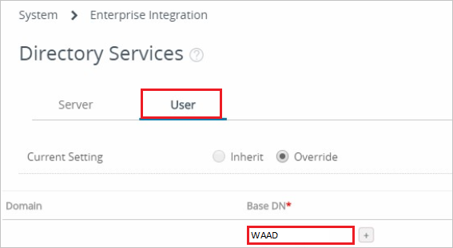
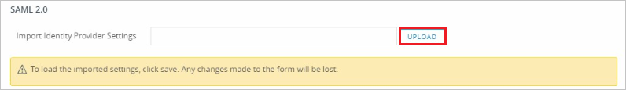
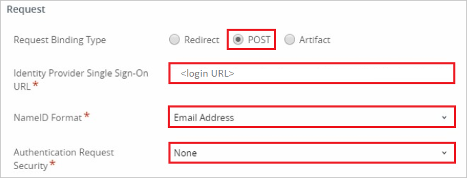
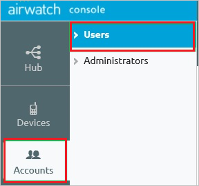
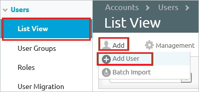

# Tutorial: Integrate AirWatch with Azure Active Directory

In this tutorial, you'll learn how to integrate AirWatch with Azure Active Directory (Azure AD). When you integrate AirWatch with Azure AD, you can:

* Control in Azure AD who has access to AirWatch.
* Enable your users to be automatically signed-in to AirWatch with their Azure AD accounts.
* Manage your accounts in one central location - the Azure portal.

## Prerequisites

To get started, you need the following items:
 
* An Azure AD subscription. If you don't have a subscription, you can get a [free account](https://azure.microsoft.com/free/).
* AirWatch single sign-on (SSO)-enabled subscription.

> [!NOTE]
> Identifier of this application is a fixed string value so only one instance can be configured in one tenant.

## Scenario description

In this tutorial, you configure and test Azure AD SSO in a test environment. 

* AirWatch supports **SP** initiated SSO.

## Add AirWatch from the gallery

To configure the integration of AirWatch into Azure AD, you need to add AirWatch from the gallery to your list of managed SaaS apps.

1. Sign in to the Azure portal using either a work or school account, or a personal Microsoft account.
1. On the left navigation pane, select the **Azure Active Directory** service.
1. Navigate to **Enterprise Applications** and then select **All Applications**.
1. To add new application, select **New application**.
1. In the **Add from the gallery** section, type **AirWatch** in the search box.
1. Select **AirWatch** from results panel and then add the app. Wait a few seconds while the app is added to your tenant.

 Alternatively, you can also use the [Enterprise App Configuration Wizard](https://portal.office.com/AdminPortal/home?Q=Docs#/azureadappintegration). In this wizard, you can add an application to your tenant, add users/groups to the app, assign roles, as well as walk through the SSO configuration as well. [Learn more about Microsoft 365 wizards.](/microsoft-365/admin/misc/azure-ad-setup-guides)

## Configure and test Azure AD SSO for AirWatch

Configure and test Azure AD SSO with AirWatch using a test user called **B.Simon**. For SSO to work, you need to establish a link relationship between an Azure AD user and the related user in AirWatch.

To configure and test Azure AD SSO with AirWatch, perform the following steps:

1. **[Configure Azure AD SSO](#configure-azure-ad-sso)** - to enable your users to use this feature.
    1. **[Create an Azure AD test user](#create-an-azure-ad-test-user)** - to test Azure AD single sign-on with B.Simon.
    1. **[Assign the Azure AD test user](#assign-the-azure-ad-test-user)** - to enable B.Simon to use Azure AD single sign-on.
1. **[Configure AirWatch SSO](#configure-airwatch-sso)** - to configure the single sign-on settings on application side.
    1. **[Create AirWatch test user](#create-airwatch-test-user)** - to have a counterpart of B.Simon in AirWatch that is linked to the Azure AD representation of user.
1. **[Test SSO](#test-sso)** - to verify whether the configuration works.

### Configure Azure AD SSO

Follow these steps to enable Azure AD SSO in the Azure portal.

1. In the Azure portal, on the **AirWatch** application integration page, find the **Manage** section and select **Single sign-on**.
1. On the **Select a Single sign-on method** page, select **SAML**.
1. On the **Set up Single Sign-On with SAML** page, click the pencil icon for **Basic SAML Configuration** to edit the settings.

   

1. On the **Basic SAML Configuration** page, enter the values for the following fields:

   a. In the **Identifier (Entity ID)** text box, type the value as:
    `AirWatch`

   b. In the **Reply URL** text box, type a URL using one of the following patterns:

   | Reply URL|
   |-----------|
   | `https://<SUBDOMAIN>.awmdm.com/<COMPANY_CODE>` |
   | `https://<SUBDOMAIN>.airwatchportals.com/<COMPANY_CODE>` |
   |

   c. In the **Sign on URL** text box, type a URL using the following pattern:
    `https://<subdomain>.awmdm.com/AirWatch/Login?gid=companycode`

	> [!NOTE]
	> These values are not the real. Update these values with the actual Reply URL and Sign-on URL. Contact [AirWatch Client support team](https://www.vmware.com/in/support/acquisitions/airwatch.html) to get these values. You can also refer to the patterns shown in the **Basic SAML Configuration** section in the Azure portal.

1. AirWatch application expects the SAML assertions in a specific format. Configure the following claims for this application. You can manage the values of these attributes from the **User Attributes** section on application integration page. On the **Set up Single Sign-On with SAML** page, click **Edit** button to open **User Attributes** dialog.

	

1. In the **User Claims** section on the **User Attributes** dialog, edit the claims by using **Edit icon** or add the claims by using **Add new claim** to configure SAML token attribute as shown in the image above and perform the following steps:

	| Name |  Source Attribute|
	|---------------|----------------|
	| UID | user.userprincipalname |
    | | |

	a. Click **Add new claim** to open the **Manage user claims** dialog.

	b. In the **Name** textbox, type the attribute name shown for that row.

	c. Leave the **Namespace** blank.

	d. Select Source as **Attribute**.

	e. From the **Source attribute** list, type the attribute value shown for that row.

	f. Click **Ok**

	g. Click **Save**.

1. On the **Set up Single Sign-On with SAML** page, in the **SAML Signing Certificate** section, find **Federation Metadata XML** and select **Download** to download the Metadata XML and save it on your computer.

   

1. On the **Set up AirWatch** section, copy the appropriate URL(s) based on your requirement.

   

### Create an Azure AD test user

In this section, you'll create a test user in the Azure portal called B.Simon.

1. From the left pane in the Azure portal, select **Azure Active Directory**, select **Users**, and then select **All users**.
1. Select **New user** at the top of the screen.
1. In the **User** properties, follow these steps:
   1. In the **Name** field, enter `B.Simon`.  
   1. In the **User name** field, enter the username@companydomain.extension. For example, `B.Simon@contoso.com`.
   1. Select the **Show password** check box, and then write down the value that's displayed in the **Password** box.
   1. Click **Create**.

### Assign the Azure AD test user

In this section, you'll enable B.Simon to use Azure single sign-on by granting access to AirWatch.

1. In the Azure portal, select **Enterprise Applications**, and then select **All applications**.
1. In the applications list, select **AirWatch**.
1. In the app's overview page, find the **Manage** section and select **Users and groups**.
1. Select **Add user**, then select **Users and groups** in the **Add Assignment** dialog.
1. In the **Users and groups** dialog, select **B.Simon** from the Users list, then click the **Select** button at the bottom of the screen.
1. If you are expecting a role to be assigned to the users, you can select it from the **Select a role** dropdown. If no role has been set up for this app, you see "Default Access" role selected.
1. In the **Add Assignment** dialog, click the **Assign** button.

### Configure AirWatch SSO

1. In a different web browser window, sign in to your AirWatch company site as an administrator.

1. On the settings page. Select **Settings > Enterprise Integration > Directory Services**.

   

1. Click the **User** tab, in the **Base DN** textbox, type your domain name, and then click **Save**.

   

1. Click the **Server** tab.

   

1. Perform the following steps on the **LDAP** section:

	   

    a. As **Directory Type**, select **None**.

    b. Select **Use SAML For Authentication**.

1. On the **SAML 2.0** section, to upload the downloaded certificate, click **Upload**.

    

1. In the **Request** section, perform the following steps:

      

    a. As **Request Binding Type**, select **POST**.

    b. In the Azure portal, on the **Configure single sign-on at AirWatch** dialog page, copy the **Login URL** value, and then paste it into the **Identity Provider Single Sign On URL** textbox.

    c. As **NameID Format**, select **Email Address**.

    d. As **Authentication Request Security**, select **None**.

    e. Click **Save**.

1. Click the **User** tab again.

    

1. In the **Attribute** section, perform the following steps:

    

    a. In the **Object Identifier** textbox, type `http://schemas.microsoft.com/identity/claims/objectidentifier`.

    b. In the **Username** textbox, type `http://schemas.xmlsoap.org/ws/2005/05/identity/claims/emailaddress`.

    c. In the **Display Name** textbox, type `http://schemas.xmlsoap.org/ws/2005/05/identity/claims/givenname`.

    d. In the **First Name** textbox, type `http://schemas.xmlsoap.org/ws/2005/05/identity/claims/givenname`.

    e. In the **Last Name** textbox, type `http://schemas.xmlsoap.org/ws/2005/05/identity/claims/surname`.

    f. In the **Email** textbox, type `http://schemas.xmlsoap.org/ws/2005/05/identity/claims/emailaddress`.

    g. Click **Save**.

### Create AirWatch test user

To enable Azure AD users to sign in to AirWatch, they must be provisioned in to AirWatch. In the case of AirWatch, provisioning is a manual task.

**To configure user provisioning, perform the following steps:**

1. Sign in to your **AirWatch** company site as administrator.

2. In the navigation pane on the left side, click **Accounts**, and then click **Users**.
  
   

3. In the **Users** menu, click **List View**, and then click **Add > Add User**.
  
   

4. On the **Add / Edit User** dialog, perform the following steps:

   

   a. Type the **Username**, **Password**, **Confirm Password**, **First Name**, **Last Name**, **Email Address** of a valid Azure Active Directory account you want to provision into the related textboxes.

   b. Click **Save**.

> [!NOTE]
> You can use any other AirWatch user account creation tools or APIs provided by AirWatch to provision Azure AD user accounts.

### Test SSO

In this section, you test your Azure AD single sign-on configuration with following options. 

* Click on **Test this application** in Azure portal. This will redirect to AirWatch Sign-on URL where you can initiate the login flow. 

* Go to AirWatch Sign-on URL directly and initiate the login flow from there.

* You can use Microsoft My Apps. When you click the AirWatch tile in the My Apps, this will redirect to AirWatch Sign-on URL. For more information about the My Apps, see [Introduction to the My Apps](https://support.microsoft.com/account-billing/sign-in-and-start-apps-from-the-my-apps-portal-2f3b1bae-0e5a-4a86-a33e-876fbd2a4510).

## Next steps

Once you configure AirWatch you can enforce session control, which protects exfiltration and infiltration of your organization’s sensitive data in real time. Session control extends from Conditional Access. [Learn how to enforce session control with Microsoft Defender for Cloud Apps](/cloud-app-security/proxy-deployment-any-app).
