# Tutorial: Azure Active Directory single sign-on (SSO) integration with Akamai

In this tutorial, you'll learn how to integrate Akamai with Azure Active Directory (Azure AD). When you integrate Akamai with Azure AD, you can:

* Control in Azure AD who has access to Akamai.
* Enable your users to be automatically signed-in to Akamai with their Azure AD accounts.
* Manage your accounts in one central location - the Azure portal.

To learn more about SaaS app integration with Azure AD, see [What is application access and single sign-on with Azure Active Directory](https://docs.microsoft.com/azure/active-directory/active-directory-appssoaccess-whatis).

Azure Active Directory and Akamai Enterprise Application Access integration allows seamless access to legacy applications hosted in the cloud or on-premises. The integrated solution takes advantages of all the modern capabilities of Azure Active Directory like [Azure AD conditional access](https://docs.microsoft.com/azure/active-directory/active-directory-conditional-access-azure-portal), [Azure AD Identity Protection](https://docs.microsoft.com/azure/active-directory/active-directory-identityprotection) and [Azure AD Identity Governance](https://docs.microsoft.com/azure/active-directory/governance/identity-governance-overview) for legacy applications access without app modifications or agents installation.

The below image describes, where Akamai EAA fits into the broader Hybrid Secure Access scenario

### Key Authentication Scenarios

Apart from Azure Active Directory native integration support for modern authentication protocols like Open ID Connect, SAML and WS-Fed, Akamai EAA extends secure access for legacy-based authentication apps for both internal and external access with Azure AD, enabling modern scenarios (e.g. password-less access) to these applications. This includes:

* Header-based authentication apps
* Remote Desktop
* SSH (Secure Shell)
* Kerberos authentication apps
* VNC (Virtual Network Computing)
* Anonymous auth or no inbuilt authentication apps
* NTLM authentication apps (protection with dual prompts for the user)
* Forms-Based Application (protection with dual prompts for the user)

### Integration Scenarios

Microsoft and Akamai EAA partnership allows the flexibility to meet your business requirements by supporting multiple integration scenarios based on your business requirement. These could be used to provide zero-day coverage across all applications and gradually classify and configure appropriate policy classifications.

#### Integration Scenario 1

Akamai EAA is configured as a single application on the Azure AD. Admin can configure the CA Policy on the Application and once the conditions are satisfied users can gain access to the Akamai EAA Portal.

**Pros**:

• You need to only configure IDP once

**Cons**:

• Users end up having two applications portals

• Single Common CA Policy coverage for all Applications.

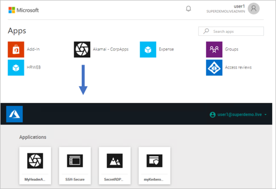

#### Integration Scenario 2

Akamai EAA Application is set up individually on the Azure AD Portal. Admin can configure Individual he CA Policy on the Application(s) and once the conditions are satisfied users can directly be redirected to the specific application.

**Pros**:

• You can define individual CA Policies

• All Apps are represented on the 0365 Waffle and myApps.microsoft.com Panel.

**Cons**:

• You need to configure multiple IDP.

## Prerequisites

To get started, you need the following items:

* An Azure AD subscription. If you don't have a subscription, you can get a [free account](https://azure.microsoft.com/free/).
* Akamai single sign-on (SSO) enabled subscription.

## Scenario description

In this tutorial, you configure and test Azure AD SSO in a test environment.

- Akamai supports IDP initiated SSO

#### Important

All the setup listed below are same for the **Integration Scenario 1** and **Scenario 2**. For the **Integration scenario 2** you have setup Individual IDP in the Akamai EAA and the URL property needs to be modified to point to the application URL.

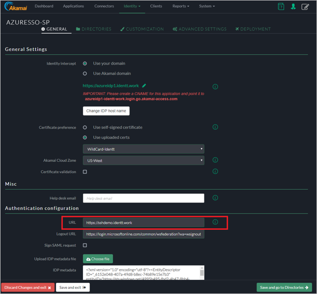

## Adding Akamai from the gallery

To configure the integration of Akamai into Azure AD, you need to add Akamai from the gallery to your list of managed SaaS apps.

1. Sign in to the [Azure portal](https://portal.azure.com) using either a work or school account, or a personal Microsoft account.
1. On the left navigation pane, select the **Azure Active Directory** service.
1. Navigate to **Enterprise Applications** and then select **All Applications**.
1. To add new application, select **New application**.
1. In the **Add from the gallery** section, type **Akamai** in the search box.
1. Select **Akamai** from results panel and then add the app. Wait a few seconds while the app is added to your tenant.

## Configure and test Azure AD single sign-on for Akamai

Configure and test Azure AD SSO with Akamai using a test user called **B.Simon**. For SSO to work, you need to establish a link relationship between an Azure AD user and the related user in Akamai.

To configure and test Azure AD SSO with Akamai, complete the following building blocks:

1. **[Configure Azure AD SSO](#configure-azure-ad-sso)** - to enable your users to use this feature.
    * **[Create an Azure AD test user](#create-an-azure-ad-test-user)** - to test Azure AD single sign-on with B.Simon.
    * **[Assign the Azure AD test user](#assign-the-azure-ad-test-user)** - to enable B.Simon to use Azure AD single sign-on.
1. **[Configure Akamai SSO](#configure-akamai-sso)** - to configure the single sign-on settings on application side.
    * **[Setting up IDP](#setting-up-idp)**
    * **[Header Based Authentication](#header-based-authentication)**
    * **[Remote Desktop](#remote-desktop)**
    * **[SSH](#ssh)**
    * **[Kerberos Authentication](#kerberos-authentication)**
    * **[Create Akamai test user](#create-akamai-test-user)** - to have a counterpart of B.Simon in Akamai that is linked to the Azure AD representation of user.
1. **[Test SSO](#test-sso)** - to verify whether the configuration works.

## Configure Azure AD SSO

Follow these steps to enable Azure AD SSO in the Azure portal.

1. In the [Azure portal](https://portal.azure.com/), on the **Akamai** application integration page, find the **Manage** section and select **single sign-on**.
1. On the **Select a single sign-on method** page, select **SAML**.
1. On the **Set up single sign-on with SAML** page, click the edit/pen icon for **Basic SAML Configuration** to edit the settings.

   

1. On the **Basic SAML Configuration** section, if you wish to configure the application in **IDP** initiated mode, enter the values for the following fields:

    a. In the **Identifier** text box, type a URL using the following pattern:
    `https://<Yourapp>.login.go.akamai-access.com/saml/sp/response`

    b. In the **Reply URL** text box, type a URL using the following pattern:
    `https:// <Yourapp>.login.go.akamai-access.com/saml/sp/response`

	> [!NOTE]
	> These values are not real. Update these values with the actual Identifier and Reply URL. Contact [Akamai Client support team](https://www.akamai.com/us/en/contact-us/) to get these values. You can also refer to the patterns shown in the **Basic SAML Configuration** section in the Azure portal.

1. On the **Set up single sign-on with SAML** page, in the **SAML Signing Certificate** section,  find **Federation Metadata XML** and select **Download** to download the certificate and save it on your computer.

	

1. On the **Set up Akamai** section, copy the appropriate URL(s) based on your requirement.

	

### Create an Azure AD test user

In this section, you'll create a test user in the Azure portal called B.Simon.

1. From the left pane in the Azure portal, select **Azure Active Directory**, select **Users**, and then select **All users**.
1. Select **New user** at the top of the screen.
1. In the **User** properties, follow these steps:
   1. In the **Name** field, enter `B.Simon`.  
   1. In the **User name** field, enter the username@companydomain.extension. For example, `B.Simon@contoso.com`.
   1. Select the **Show password** check box, and then write down the value that's displayed in the **Password** box.
   1. Click **Create**.

### Assign the Azure AD test user

In this section, you'll enable B.Simon to use Azure single sign-on by granting access to Akamai.

1. In the Azure portal, select **Enterprise Applications**, and then select **All applications**.
1. In the applications list, select **Akamai**.
1. In the app's overview page, find the **Manage** section and select **Users and groups**.

   

1. Select **Add user**, then select **Users and groups** in the **Add Assignment** dialog.

	

1. In the **Users and groups** dialog, select **B.Simon** from the Users list, then click the **Select** button at the bottom of the screen.
1. If you're expecting any role value in the SAML assertion, in the **Select Role** dialog, select the appropriate role for the user from the list and then click the **Select** button at the bottom of the screen.
1. In the **Add Assignment** dialog, click the **Assign** button.

## Configure Akamai SSO

### Setting up IDP

**AKAMAI EAA IDP Configuration**

1. Sign in to **Akamai Enterprise Application Access** console.
1. On the **Akamai EAA console**, Select **Identity** > **Identity Providers** and click **Add Identity Provider**.

	

1. On the **Create New Identity Provider** perform the following steps:

	

	a. Specify the **Unique Name**.

	b. Choose **Third Party SAML** and click **Create Identity Provider and Configure**.

### General Settings

1. **Identity Intercept** - Specify the name of the (SP base URL–will be used for Azure AD Configuration)

    > [!NOTE]
    > You can choose to have your own custom domain (will require a DNS entry and a Certificate). In this example we are going to use the Akamai Domain.

1. **Akamai Cloud Zone** - Select the Appropriate cloud zone.
1. **Certificate Validation** - Check Akamai Documentation (optional)

	

### Authentication Configuration

1. URL – Specify the URL same as your identity intercept ( this is where users are redirect after authentication).
2. Logout URL : Update the logout URL.
3. Sign SAML Request: default unchecked.
4. For the IDP Metadata File, add the Application in the Azure AD Console.

	

### Session Settings

Leave the settings as default.

### Directories

Skip the directory configuration.

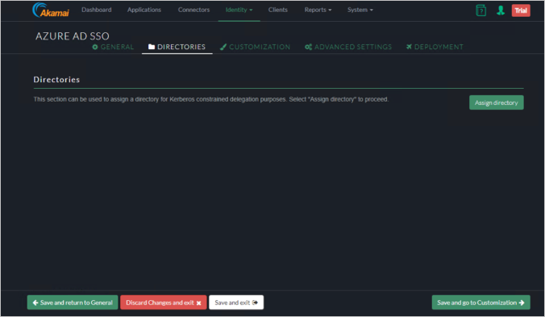

### Customization UI

You could add customization to IDP.

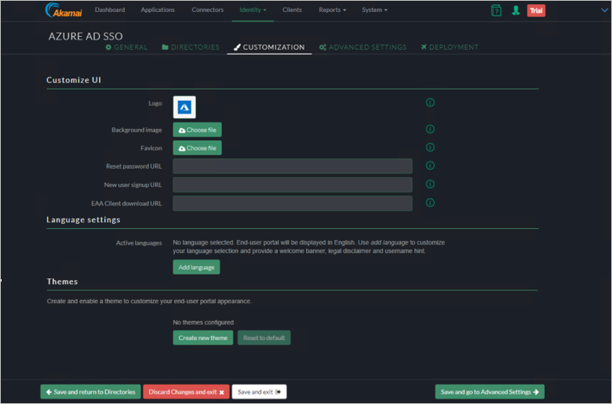

### Advanced Settings

Skip Advance settings / refer Akamai documentation for more details.

### Deployment

1. Click on Deploy Identity Provider.

    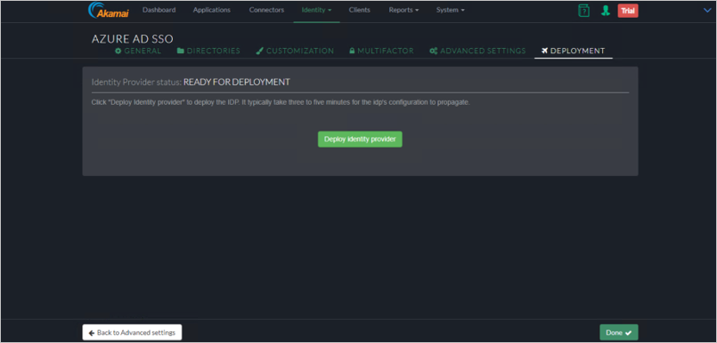

2. Verify the deployment was successful

### Header Based Authentication

Akamai Header Based Authentication

1. Choose **Custom HTTP** form the Add Applications Wizard.

    

2. Enter **Application Name** and **Description**.

    

    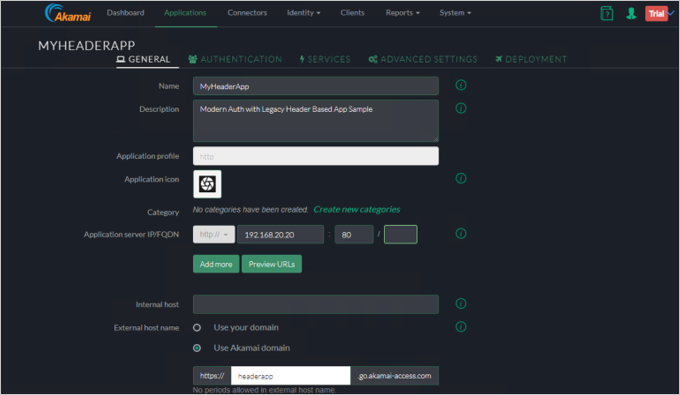

    

#### Authentication

1. Select **Authentication** tab.

    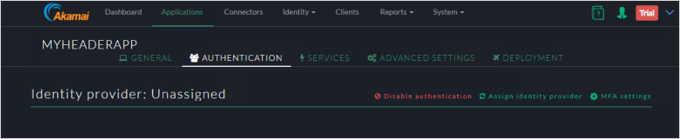

2. Assign the **Identity provider**

    

#### Services

Click Save and Go to Authentication.

#### Advanced Settings

1. Under the **Customer HTTP Headers**, specify the **CustomerHeader** and **SAML Attribute**.

    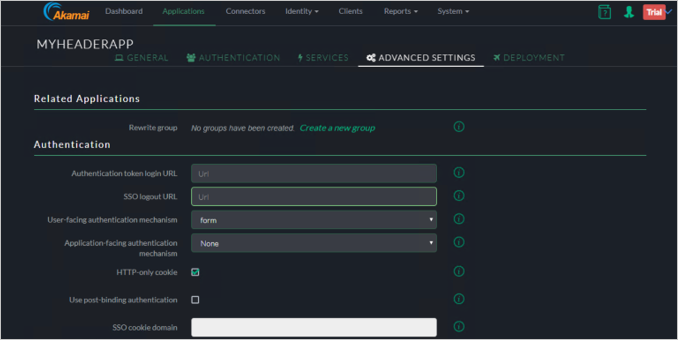

1. Click **Save and go to Deployment** button.

    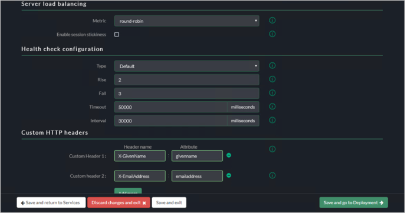

#### Deploy the Application

1. Click **Deploy Application** button.

    

1. Verify the Application was deployed successfully.

    

1. End-User Experience.

    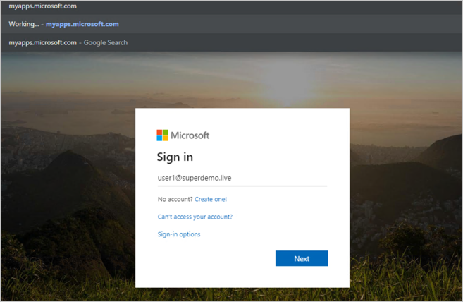

    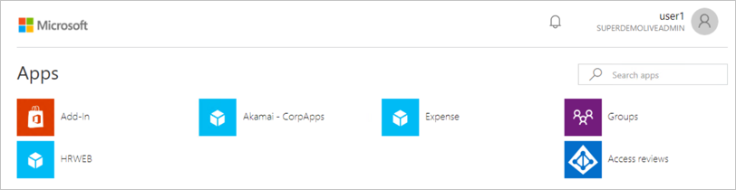

1. Conditional Access.

    

    

#### Remote Desktop

1. Choose **RDP** from the ADD Applications Wizard.

    

1. Enter **Application Name** and **Description**.

    

    

1. Specify the Connector that will be servicing this.

    

#### Authentication

Click **Save and go to Services**.

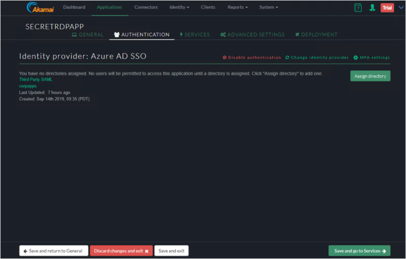

#### Services

Click **Save and go to Advanced Settings**.

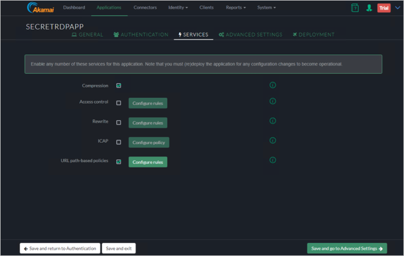

#### Advanced Settings

1. Click **Save and go to Deployment**.

    

    

    

1. End-User Experience

    

    

1. Conditional Access

    

    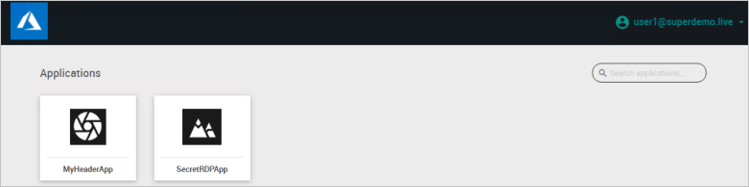

    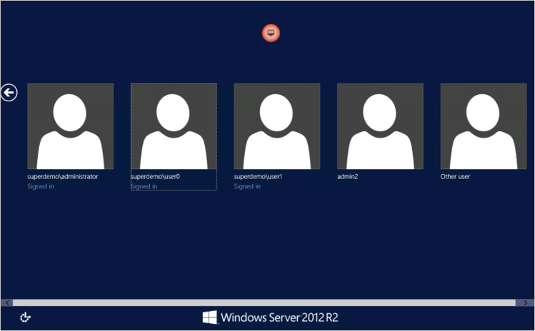

1. Alternatively, you can also directly Type the RDP Application URL.

#### SSH

1. Go to Add Applications, Choose **SSH**.

    

1. Enter **Application Name** and **Description**.

    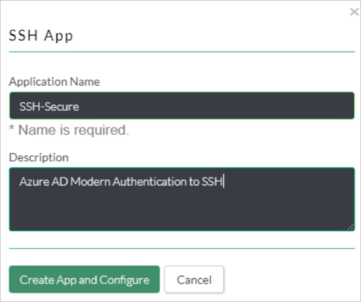

1. Configure Application Identity.

    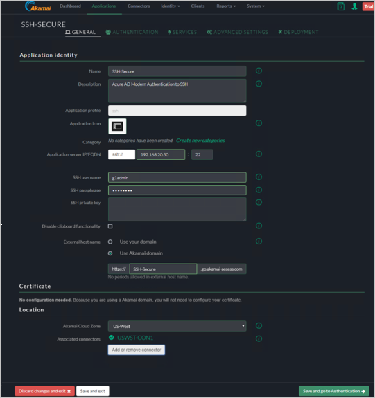

    a. Specify Name / Description.

    b. Specify Application Server IP/FQDN and port for SSH.

    c. Specify SSH username / passphrase *Check Akamai EAA.

    d. Specify the External host Name.

    e. Specify the Location for the connector and choose the connector.

#### Authentication

Click on **Save and go to Services**.

#### Services

Click **Save and go to Advanced Settings**.

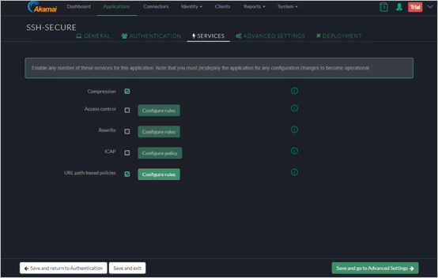

#### Advanced Settings

Click Save and to go Deployment

#### Deployment

1. Click **Deploy application**.

    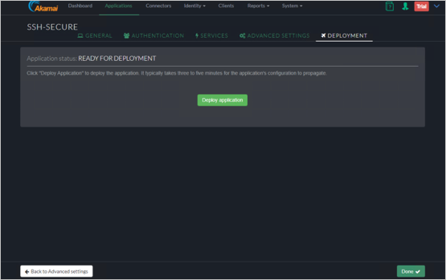

1. End-User Experience

    

    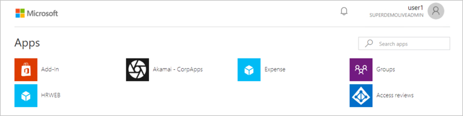

1. Conditional Access

    

    

    

    

### Kerberos Authentication

In the below example we will publish an Internal web server [http://frp-app1.superdemo.live](http://frp-app1.superdemo.live/) and enable SSO using KCD

#### General Tab

#### Authentication Tab

Assign the Identity Provider

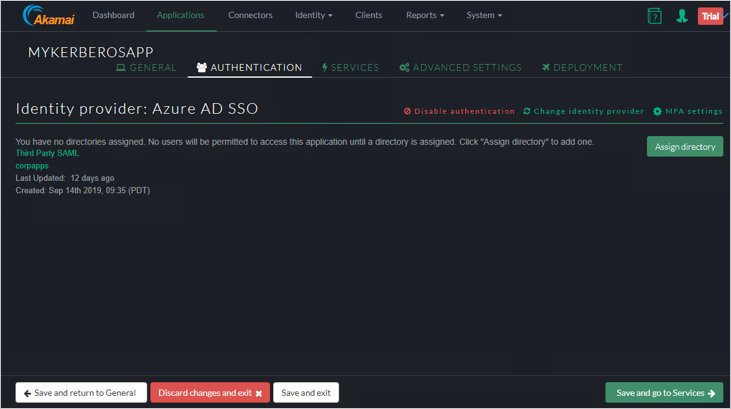

#### Services Tab

#### Advanced Settings

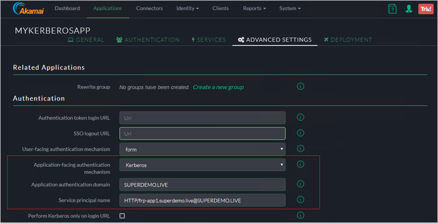

> [!NOTE]
> The SPN for the Web Server has be  in SPN@Domain Format ex: `HTTP/frp-app1.superdemo.live@SUPERDEMO.LIVE` for this demo. Leave rest of the settings to default.

#### Deployment Tab

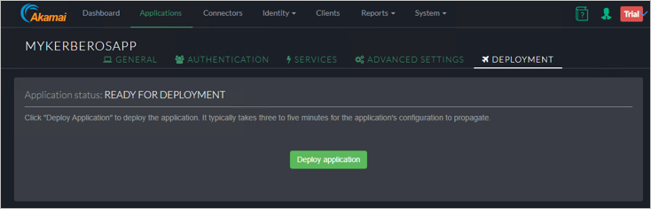

#### Adding Directory

1. Select **AD** from the dropdown.

    

1. Provide the necessary data.

    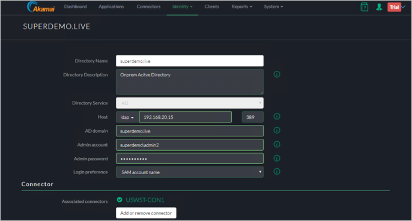

1. Verify the Directory Creation.

    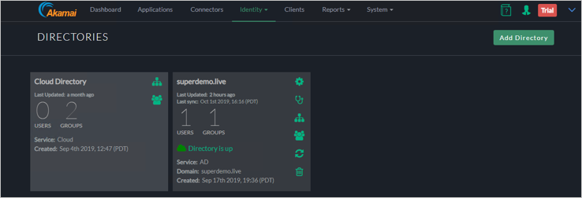

1. Add the Groups/OUs who would be require access.

    

1. In the below the Group is called EAAGroup and has 1 Member.

    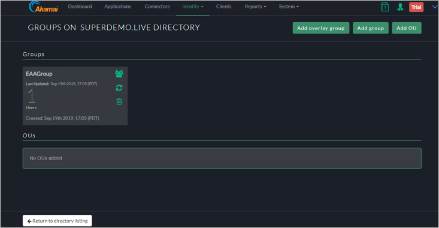

1. Add the Directory to you Identity Provider by clicking **Identity** > **Identity Providers** and click on the **Directories** Tab and Click on **Assign directory**.

    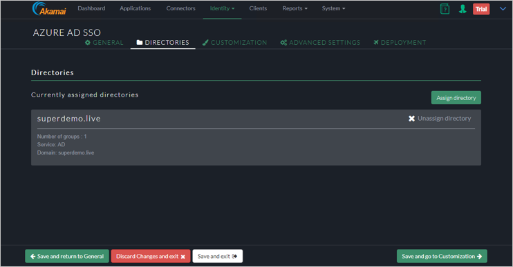

### Configure KCD Delegation for EAA Walkthrough

#### Step 1: Create an Account 

1. In the example we will use an account called **EAADelegation**. You can perform this using the **Active Directory users and computer** Snappin.

    

    > [!NOTE]
    > The user name has to be in a specific format based on the **Identity Intercept Name**. From the figure 1 we see it is **corpapps.login.go.akamai-access.com**

1. User logon Name will be:`HTTP/corpapps.login.go.akamai-access.com`

    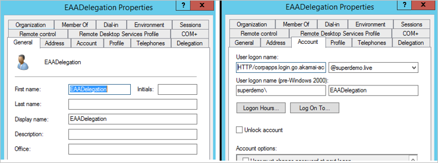

#### Step 2: Configure the SPN for this account

1. Based on this sample the SPN will be as below.

2. setspn -s **Http/corpapps.login.go.akamai-access.com eaadelegation**

    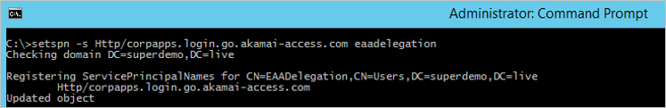

#### Step 3: Configure Delegation

1. For the EAADelegation account click on the Delegation tab.

    

    * Specify use any authentication Protocol
    * Click Add and Add the App Pool Account for the Kerberos Website. It should automatically resolve to correct SPN if configured correctly.

#### Step 4: Create a Keytab File for AKAMAI EAA

1. Here is the generic Syntax.

1. ktpass /out ActiveDirectorydomain.keytab  /princ `HTTP/yourloginportalurl@ADDomain.com`  /mapuser serviceaccount@ADdomain.com /pass +rdnPass  /crypto All /ptype KRB5_NT_PRINCIPAL

1. Example explained

    | Snippet | Explanation |
    | - | - |
    | Ktpass /out EAADemo.keytab | // Name of the output Keytab file |
    | /princ HTTP/corpapps.login.go.akamai-access.com@superdemo.live | // HTTP/yourIDPName@YourdomainName |
    | /mapuser eaadelegation@superdemo.live | // EAA Delegation account |
    | /pass RANDOMPASS | // EAA Delegation account Password |
    | /crypto All ptype KRB5_NT_PRINCIPAL | // consult Akamai EAA documentation |
    | | |

1. Ktpass /out EAADemo.keytab  /princ HTTP/corpapps.login.go.akamai-access.com@superdemo.live /mapuser eaadelegation@superdemo.live /pass RANDOMPASS /crypto All ptype KRB5_NT_PRINCIPAL

    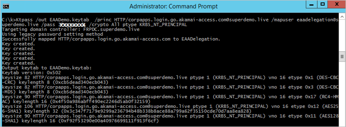

#### Step 5: Import Keytab in the AKAMAI EAA Console

1. Click **System** > **Keytabs**.

    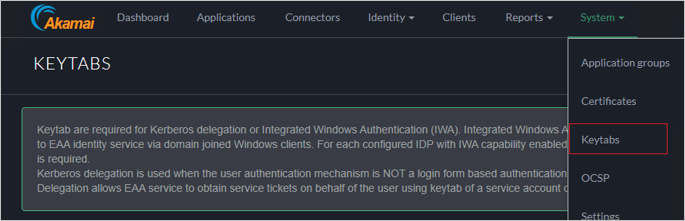

1. In the Keytab Type choose **Kerberos Delegation**.

    

1. Ensure the Keytab shows up as Deployed and Verified.

    

1. User Experience

    

    

1. Conditional Access

    

    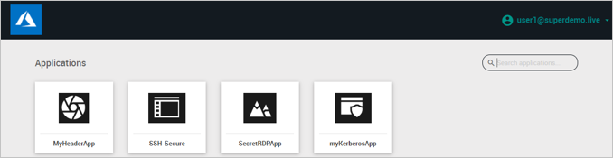

    

### Create Akamai test user

In this section, you create a user called B.Simon in Akamai. Work with [Akamai Client support team](https://www.akamai.com/us/en/contact-us/) to add the users in the Akamai platform. Users must be created and activated before you use single sign-on. 

## Test SSO

In this section, you test your Azure AD single sign-on configuration using the Access Panel.

When you click the Akamai tile in the Access Panel, you should be automatically signed in to the Akamai for which you set up SSO. For more information about the Access Panel, see [Introduction to the Access Panel](https://docs.microsoft.com/azure/active-directory/active-directory-saas-access-panel-introduction).

## Additional resources

- [ List of Tutorials on How to Integrate SaaS Apps with Azure Active Directory ](https://docs.microsoft.com/azure/active-directory/active-directory-saas-tutorial-list)

- [What is application access and single sign-on with Azure Active Directory? ](https://docs.microsoft.com/azure/active-directory/active-directory-appssoaccess-whatis)

- [What is conditional access in Azure Active Directory?](https://docs.microsoft.com/azure/active-directory/conditional-access/overview)

- [Try Akamai with Azure AD](https://aad.portal.azure.com/)