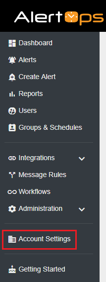
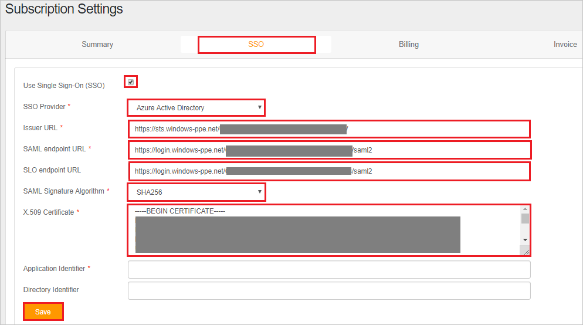
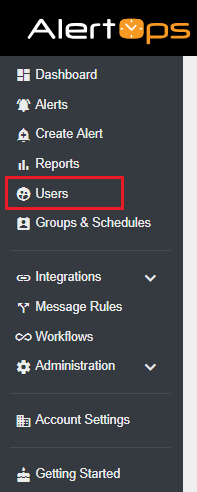
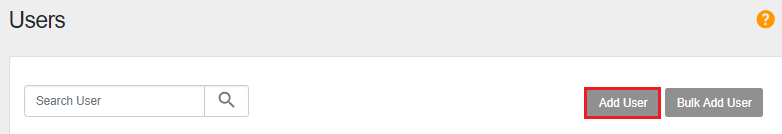
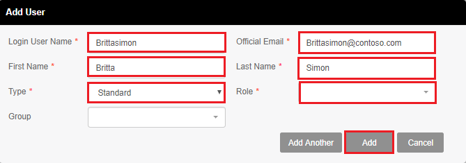

# Tutorial: Integrate AlertOps with Azure Active Directory

In this tutorial, you'll learn how to integrate AlertOps with Azure Active Directory (Azure AD). When you integrate AlertOps with Azure AD, you can:

* Control in Azure AD who has access to AlertOps.
* Enable your users to be automatically signed-in to AlertOps with their Azure AD accounts.
* Manage your accounts in one central location - the Azure portal.

To learn more about SaaS app integration with Azure AD, see [What is application access and single sign-on with Azure Active Directory](https://docs.microsoft.com/azure/active-directory/active-directory-appssoaccess-whatis).

## Prerequisites

To get started, you need the following items:

* An Azure AD subscription. If you don't have a subscription, you can get a [free account](https://azure.microsoft.com/free/).
* AlertOps single sign-on (SSO) enabled subscription.

## Scenario description

In this tutorial, you configure and test Azure AD SSO in a test environment. AlertOps supports **SP and IDP** initiated SSO.

## Adding AlertOps from the gallery

To configure the integration of AlertOps into Azure AD, you need to add AlertOps from the gallery to your list of managed SaaS apps.

1. Sign in to the [Azure portal](https://portal.azure.com) using either a work or school account, or a personal Microsoft account.
1. On the left navigation pane, select the **Azure Active Directory** service.
1. Navigate to **Enterprise Applications** and then select **All Applications**.
1. To add new application, select **New application**.
1. In the **Add from the gallery** section, type **AlertOps** in the search box.
1. Select **AlertOps** from results panel and then add the app. Wait a few seconds while the app is added to your tenant.

## Configure and test Azure AD single sign-on

Configure and test Azure AD SSO with AlertOps using a test user called **Britta Simon**. For SSO to work, you need to establish a link relationship between an Azure AD user and the related user in AlertOps.

To configure and test Azure AD SSO with AlertOps, complete the following building blocks:

1. **[Configure Azure AD SSO](#configure-azure-ad-sso)** to enable your users to use this feature.
2. **[Configure AlertOps](#configure-alertops)** to configure the SSO settings on application side.
3. **[Create an Azure AD test user](#create-an-azure-ad-test-user)** to test Azure AD single sign-on with Britta Simon.
4. **[Assign the Azure AD test user](#assign-the-azure-ad-test-user)** to enable Britta Simon to use Azure AD single sign-on.
5. **[Create AlertOps test user](#create-alertops-test-user)** to have a counterpart of Britta Simon in AlertOps that is linked to the Azure AD representation of user.
6. **[Test SSO](#test-sso)** to verify whether the configuration works.

### Configure Azure AD SSO

Follow these steps to enable Azure AD SSO in the Azure portal.

1. In the [Azure portal](https://portal.azure.com/), on the **AlertOps** application integration page, find the **Manage** section and select **Single sign-on**.
1. On the **Select a Single sign-on method** page, select **SAML**.
1. On the **Set up Single Sign-On with SAML** page, click the edit/pen icon for **Basic SAML Configuration** to edit the settings.

   

1. On the **Basic SAML Configuration** section, if you wish to configure the application in **IDP** initiated mode, perform the following steps:

    1. In the **Identifier** text box, type a URL using the following pattern:
    `https://<SUBDOMAIN>.alertops.com`

    1. In the **Reply URL** text box, type a URL using the following pattern:
    `https://<SUBDOMAIN>.alertops.com/login.aspx`

1. Click **Set additional URLs** and perform the following step if you wish to configure the application in **SP** initiated mode:

    In the **Sign-on URL** text box, type a URL using the following pattern:
    `https://<SUBDOMAIN>.alertops.com/login.aspx`

	> [!NOTE]
	> These values are not real. Update these values with the actual Identifier, Reply URL and Sign-on URL. Contact [AlertOps Client support team](mailto:support@alertops.com) to get these values. You can also refer to the patterns shown in the **Basic SAML Configuration** section in the Azure portal.

1. On the **Set up Single Sign-On with SAML** page, in the **SAML Signing Certificate** section, find **Certificate (Base64)** and select **Download** to download the certificate and save it on your computer.

   

1. On the **Set up AlertOps** section, copy the appropriate URL(s) based on your requirement.

   

### Configure AlertOps

1. To automate the configuration within AlertOps, you need to install **My Apps Secure Sign-in browser extension** by clicking **Install the extension**.

	

2. After adding extension to the browser, click on **Setup AlertOps** will direct you to the AlertOps application. From there, provide the admin credentials to sign into AlertOps. The browser extension will automatically configure the application for you and automate steps 3-5.

	

3. If you want to setup AlertOps manually, open a new web browser window and sign into your AlertOps company site as an administrator and perform the following steps:

4. Click on the **Account settings** from the left navigation panel.

    

5. On the **Subscription Settings** page select **SSO** and perform the following steps:

    

    a. Select **Use Single Sign-On(SSO)** checkbox.

    b. Select **Azure Active Directory** as an **SSO Provider** from the dropdown.

    c. In the **Issuer URL** textbox, use the identifier value, which you have used in the **Basic SAML Configuration** section in the Azure portal.

    d. In the **SAML endpoint URL** textbox, paste the **Login URL** value, which you have copied from the Azure portal.

    e. In the **SLO endpoint URL** textbox, paste the **Login URL** value, which you have copied from the Azure portal.

    f. Select **SHA256** as a **SAML Signature Algorithm** from the dropdown.

    g. Open your downloaded Certificate(Base64) file in Notepad. Copy the content of it into your clipboard, and then paste it to the X.509 Certificate text box.

### Create an Azure AD test user

In this section, you'll create a test user in the Azure portal called Britta Simon.

1. From the left pane in the Azure portal, select **Azure Active Directory**, select **Users**, and then select **All users**.
1. Select **New user** at the top of the screen.
1. In the **User** properties, follow these steps:
   1. In the **Name** field, enter `Britta Simon`.  
   1. In the **User name** field, enter the username@companydomain.extension. For example, `BrittaSimon@contoso.com`.
   1. Select the **Show password** check box, and then write down the value that's displayed in the **Password** box.
   1. Click **Create**.

### Assign the Azure AD test user

In this section, you'll enable Britta Simon to use Azure single sign-on by granting access to AlertOps.

1. In the Azure portal, select **Enterprise Applications**, and then select **All applications**.
1. In the applications list, select **AlertOps**.
1. In the app's overview page, find the **Manage** section and select **Users and groups**.

   

1. Select **Add user**, then select **Users and groups** in the **Add Assignment** dialog.

	

1. In the **Users and groups** dialog, select **Britta Simon** from the Users list, then click the **Select** button at the bottom of the screen.
1. If you're expecting any role value in the SAML assertion, in the **Select Role** dialog, select the appropriate role for the user from the list and then click the **Select** button at the bottom of the screen.
1. In the **Add Assignment** dialog, click the **Assign** button.

### Create AlertOps test user

1. In a different browser window, sign in to your AlertOps company site as administrator.

2. Click on the **Users** from the left navigation panel.

    

3. Select **Add User**.

    

4. On the **Add User** dialog, perform the following steps:

    

    a. In the **Login User Name** textbox, enter the user name of the user like **Brittasimon**.

    b. In the **Official Email** textbox, enter the email address of the user like **Brittasimon\@contoso.com**.

    c. In the **First Name** textbox, enter the first name of user like **Britta**.

    d. In the **Last Name** textbox, enter the first name of user like **Simon**.

    e. Select the **Type** value from the dropdown as per your organization.

    f. Select the **Role** of the user from the dropdown as per your organization.

    g. Select **Add**.

### Test SSO

When you select the AlertOps tile in the Access Panel, you should be automatically signed in to the AlertOps for which you set up SSO. For more information about the Access Panel, see [Introduction to the Access Panel](https://docs.microsoft.com/azure/active-directory/active-directory-saas-access-panel-introduction).

## Additional Resources

- [List of Tutorials on How to Integrate SaaS Apps with Azure Active Directory](https://docs.microsoft.com/azure/active-directory/active-directory-saas-tutorial-list)

- [What is application access and single sign-on with Azure Active Directory?](https://docs.microsoft.com/azure/active-directory/active-directory-appssoaccess-whatis)

- [What is Conditional Access in Azure Active Directory?](https://docs.microsoft.com/azure/active-directory/conditional-access/overview)