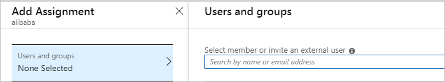
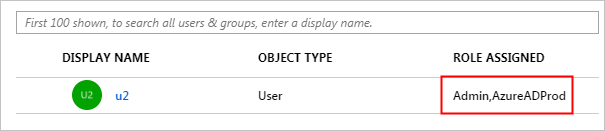
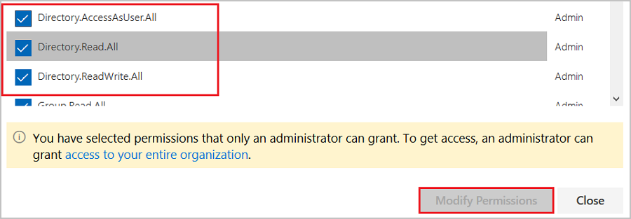
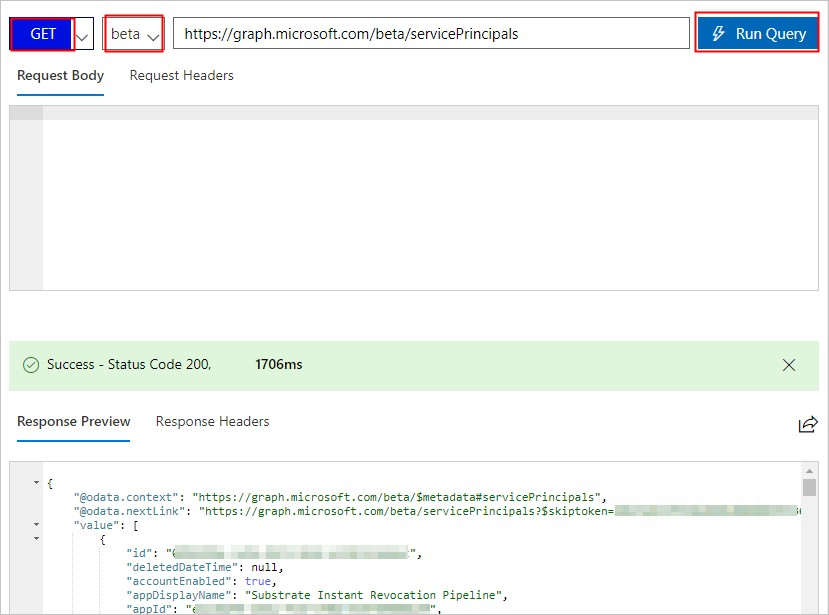
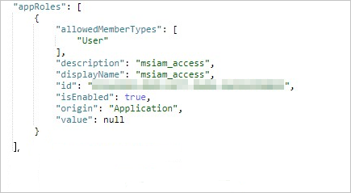
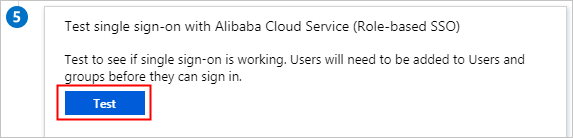
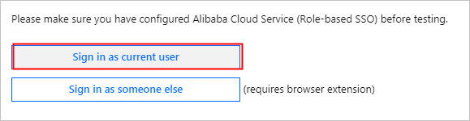
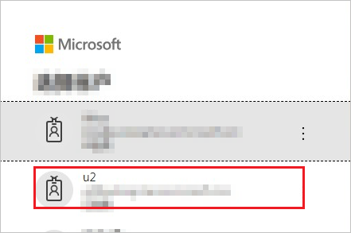
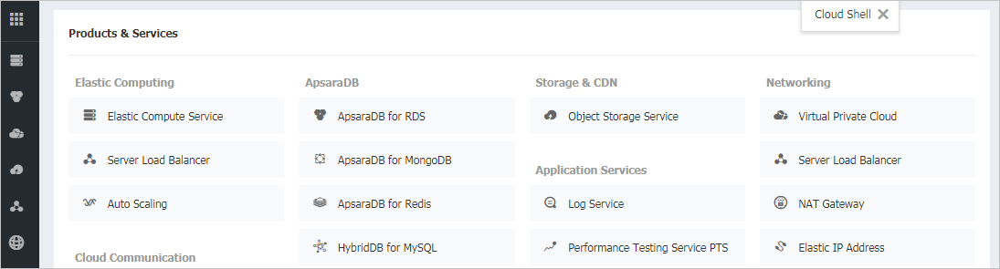

# Tutorial: Azure Active Directory single sign-on (SSO) integration with Alibaba Cloud Service (Role-based SSO)

In this tutorial, you'll learn how to integrate Alibaba Cloud Service (Role-based SSO) with Azure Active Directory (Azure AD). When you integrate Alibaba Cloud Service (Role-based SSO) with Azure AD, you can:

* Control in Azure AD who has access to Alibaba Cloud Service (Role-based SSO).
* Enable your users to be automatically signed-in to Alibaba Cloud Service (Role-based SSO) with their Azure AD accounts.
* Manage your accounts in one central location - the Azure portal.

To learn more about SaaS app integration with Azure AD, see [What is application access and single sign-on with Azure Active Directory](https://docs.microsoft.com/azure/active-directory/active-directory-appssoaccess-whatis).

## Prerequisites

To get started, you need the following items:

* An Azure AD subscription. If you don't have a subscription, you can get a [free account](https://azure.microsoft.com/free/).
* Alibaba Cloud Service (Role-based SSO) single sign-on (SSO) enabled subscription.

## Scenario description

In this tutorial, you configure and test Azure AD SSO in a test environment.

* Alibaba Cloud Service (Role-based SSO) supports **IDP** initiated SSO

## Adding Alibaba Cloud Service (Role-based SSO) from the gallery

To configure the integration of Alibaba Cloud Service (Role-based SSO) into Azure AD, you need to add Alibaba Cloud Service (Role-based SSO) from the gallery to your list of managed SaaS apps.

1. Sign in to the [Azure portal](https://portal.azure.com) using either a work or school account, or a personal Microsoft account.
1. On the left navigation pane, select the **Azure Active Directory** service.
1. Navigate to **Enterprise Applications** and then select **All Applications**.
1. To add new application, select **New application**.
1. In the **Add from the gallery** section, type **Alibaba Cloud Service (Role-based SSO)** in the search box.
1. Select **Alibaba Cloud Service (Role-based SSO)** from results panel and then add the app. Wait a few seconds while the app is added to your tenant.
5. On the **Alibaba Cloud Service (Role-based SSO)** page, click **Properties** in the left-side navigation pane, and copy the **object ID** and save it on your computer for subsequent use.

	


## Configure and test Azure AD single sign-on for Alibaba Cloud Service (Role-based SSO)

Configure and test Azure AD SSO with Alibaba Cloud Service (Role-based SSO) using a test user called **B.Simon**. For SSO to work, you need to establish a link relationship between an Azure AD user and the related user in Alibaba Cloud Service (Role-based SSO).

To configure and test Azure AD SSO with Alibaba Cloud Service (Role-based SSO), complete the following building blocks:

1. **[Configure Azure AD SSO](#configure-azure-ad-sso)** - to enable your users to use this feature.
	1. **[Create an Azure AD test user](#create-an-azure-ad-test-user)** - to test Azure AD single sign-on with Britta Simon.
	1. **[Assign the Azure AD test user](#assign-the-azure-ad-test-user)** - to enable Britta Simon to use Azure AD single sign-on.
2. **[Configure Role-Based Single Sign-On in Alibaba Cloud Service](#configure-role-based-single-sign-on-in-alibaba-cloud-service)** - to enable your users to use this feature.
	1. **[Configure Alibaba Cloud Service (Role-based SSO) SSO](#configure-alibaba-cloud-service-role-based-sso-sso)** - to configure the Single Sign-On settings on application side.
	1. **[Create Alibaba Cloud Service (Role-based SSO) test user](#create-alibaba-cloud-service-role-based-sso-test-user)** - to have a counterpart of Britta Simon in Alibaba Cloud Service (Role-based SSO) that is linked to the Azure AD representation of user.
3. **[Test single SSO](#test-sso)** - to verify whether the configuration works.

## Configure Azure AD SSO

Follow these steps to enable Azure AD SSO in the Azure portal.

1. In the [Azure portal](https://portal.azure.com/), on the **Alibaba Cloud Service (Role-based SSO)** application integration page, find the **Manage** section and select **single sign-on**.
1. On the **Select a single sign-on method** page, select **SAML**.
1. On the **Set up single sign-on with SAML** page, click the edit/pen icon for **Basic SAML Configuration** to edit the settings.

   

4. On the **Basic SAML Configuration** section, if you have **Service Provider metadata file**, perform the following steps:

	>[!NOTE]
	>You will get the Service Provider metadata from this [URL](https://signin.alibabacloud.com/saml-role/sp-metadata.xml)

	a. Click **Upload metadata file**.

	b. Click on **folder logo** to select the metadata file and click **Upload**.

	c. Once the metadata file is successfully uploaded, the **Identifier** and **Reply URL** values get auto populated in Alibaba Cloud Service (Role-based SSO) section textbox:

	> [!Note]
	> If the **Identifier** and **Reply URL** values do not get auto populated, then fill in the values manually according to your requirement.

1. Alibaba Cloud Service (Role-based SSO) require roles to be configured in Azure AD. The role claim is pre-configured so you don't have to configure it but you still need to create them in Azure AD using this [article](https://docs.microsoft.com/azure/active-directory/develop/active-directory-enterprise-app-role-management).

1. On the **Set up single sign-on with SAML** page, in the **SAML Signing Certificate** section,  find **Federation Metadata XML** and select **Download** to download the certificate and save it on your computer.

	

1. On the **Set up Alibaba Cloud Service (Role-based SSO)** section, copy the appropriate URL(s) based on your requirement.

	

### Create an Azure AD test user

In this section, you'll create a test user in the Azure portal called B.Simon.

1. From the left pane in the Azure portal, select **Azure Active Directory**, select **Users**, and then select **All users**.
1. Select **New user** at the top of the screen.
1. In the **User** properties, follow these steps:
   1. In the **Name** field, enter `B.Simon`.  
   1. In the **User name** field, enter the username@companydomain.extension. For example, `B.Simon@contoso.com`.
   1. Select the **Show password** check box, and then write down the value that's displayed in the **Password** box.
   1. Click **Create**.

### Assign the Azure AD test user

In this section, you'll enable B.Simon to use Azure single sign-on by granting access to Alibaba Cloud Service (Role-based SSO).

1. In the Azure portal, select **Enterprise Applications**, and then select **All applications**.
1. In the applications list, select **Alibaba Cloud Service (Role-based SSO)**.
1. In the app's overview page, find the **Manage** section and select **Users and groups**.

   

1. Select **Add user**, then select **Users and groups** in the **Add Assignment** dialog.

	

1. On the **Users and groups** tab, select u2 from the user list, and click **Select**. Then, click **Assign**.

	

1. View the assigned role and test Alibaba Cloud Service (Role-based SSO).

	

	>[!NOTE]
	>After you assign the user (u2), the created role is automatically attached to the user. If you have created multiple roles, you need to attach the appropriate role to the user as needed. If you want to implement role-based SSO from Azure AD to multiple Alibaba Cloud accounts, repeat the preceding steps.

## Configure Role-Based Single Sign-On in Alibaba Cloud Service

1. Sign in to the Alibaba Cloud [RAM console](https://account.alibabacloud.com/login/login.htm?oauth_callback=https%3A%2F%2Fram.console.aliyun.com%2F%3Fspm%3Da2c63.p38356.879954.8.7d904e167h6Yg9) by using Account1.

2. In the left-side navigation pane, select **SSO**.

3. On the **Role-based SSO** tab, click **Create IdP**.

4. On the displayed page, enter `AAD` in the IdP Name field, enter a description in 
the **Note** field, click **Upload** to upload the federation metadata file you downloaded before, and click **OK**.

5. After the IdP is successfully created, click **Create RAM Role**.

6. In the **RAM Role Name** field enter `AADrole`, select `AAD` from the **Select IdP** drop-down list and click OK.

	>[!NOTE]
	>You can grant permission to the role as needed. After creating the IdP and the corresponding role, we recommend that you save the ARNs of the IdP and the role for subsequent use. You can obtain the ARNs on the IdP information page and the role information page.

7. Associate the Alibaba Cloud RAM role (AADrole) with the Azure AD user (u2):
To associate the RAM role with the Azure AD user, you must create a role in Azure AD by following these steps:

	a. Sign on to the [Microsoft Graph Explorer](https://developer.microsoft.com/graph/graph-explorer).

	b. Click **modify permissions** to obtain required permissions for creating a role.

	

	c. Select the following permissions from the list and click **Modify Permissions**, as shown in the following figure.

	

	>[!NOTE]
	>After permissions are granted, log on to the Graph Explorer again.

	d. On the Graph Explorer page, select **GET** from the first drop-down list and **beta** from the second drop-down list. Then enter `https://graph.microsoft.com/beta/servicePrincipals` in the field next to the drop-down lists, and click **Run Query**.

	

	>[!NOTE]
	>If you are using multiple directories, you can enter `https://graph.microsoft.com/beta/contoso.com/servicePrincipals` in the field of the query.

	e. In the **Response Preview** section, extract the appRoles property from the 'Service Principal' for subsequent use.

	

	>[!NOTE]
	>You can locate the appRoles property by entering `https://graph.microsoft.com/beta/servicePrincipals/<objectID>` in the field of the query. Note that the `objectID` is the object ID you have copied from the Azure AD **Properties** page.

	f. Go back to the Graph Explorer, change the method from **GET** to **PATCH**, paste the following content into the **Request Body** section, and click **Run Query**:
	```
	{ 
  	"appRoles": [
    	{ 
      	"allowedMemberTypes":[
        	"User"
      	],
      	"description": "msiam_access",
      	"displayName": "msiam_access",
      	"id": "41be2db8-48d9-4277-8e86-f6d22d35****",
      	"isEnabled": true,
      	"origin": "Application",
      	"value": null
    	},
    	{ "allowedMemberTypes": [
        	"User"
    	],
    	"description": "Admin,AzureADProd",
    	"displayName": "Admin,AzureADProd",
    	"id": "68adae10-8b6b-47e6-9142-6476078cdbce",
    	"isEnabled": true,
    	"origin": "ServicePrincipal",
    	"value": "acs:ram::187125022722****:role/aadrole,acs:ram::187125022722****:saml-provider/AAD"
    	}
  	]
	}
	```
	> [!NOTE]
	> The `value` is the ARNs of the IdP and the role you created in the RAM console. Here, you can add multiple roles as needed. Azure AD will send the value of these roles as the claim value in SAML response. However, you can only add new roles after the `msiam_access` part for the patch operation. To smooth the creation process, we recommend that you use an ID generator, such as GUID Generator, to generate IDs in real time.

	g. After the 'Service Principal' is patched with the required role, attach the role with the Azure AD user (u2) by following the steps of **Assign the Azure AD test user** section of the tutorial.

### Configure Alibaba Cloud Service (Role-based SSO) SSO

To configure single sign-on on **Alibaba Cloud Service (Role-based SSO)** side, you need to send the downloaded **Federation Metadata XML** and appropriate copied URLs from Azure portal to [Alibaba Cloud Service (Role-based SSO) support team](https://www.aliyun.com/service/). They set this setting to have the SAML SSO connection set properly on both sides.

### Create Alibaba Cloud Service (Role-based SSO) test user

In this section, you create a user called Britta Simon in Alibaba Cloud Service (Role-based SSO). Work with [Alibaba Cloud Service (Role-based SSO) support team](https://www.aliyun.com/service/) to add the users in the Alibaba Cloud Service (Role-based SSO) platform. Users must be created and activated before you use single sign-on.

## Test SSO 

After the preceding configurations are completed, test Alibaba Cloud Service (Role-based SSO) by following these steps:

1. In the Azure portal, go to the **Alibaba Cloud Service (Role-based SSO)** page, select **Single sign-on**, and click **Test**.

	

2. Click **Sign in as current user**.

	

3. On the account selection page, select u2.

	

4. The following page is displayed, indicating that role-based SSO is successful.

	

## Additional resources

- [ List of Tutorials on How to Integrate SaaS Apps with Azure Active Directory ](https://docs.microsoft.com/azure/active-directory/active-directory-saas-tutorial-list)

- [What is application access and single sign-on with Azure Active Directory? ](https://docs.microsoft.com/azure/active-directory/active-directory-appssoaccess-whatis)

- [What is conditional access in Azure Active Directory?](https://docs.microsoft.com/azure/active-directory/conditional-access/overview)

- [Try Alibaba Cloud Service (Role-based SSO) with Azure AD](https://aad.portal.azure.com/)

