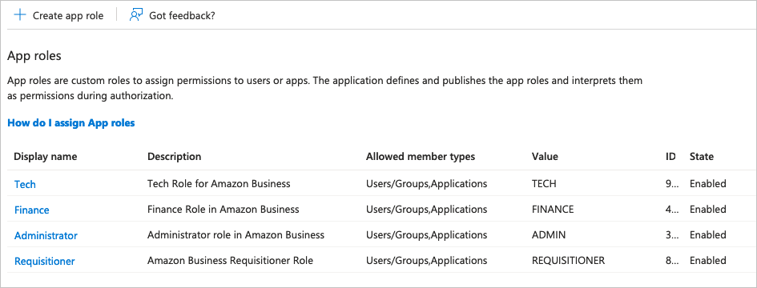
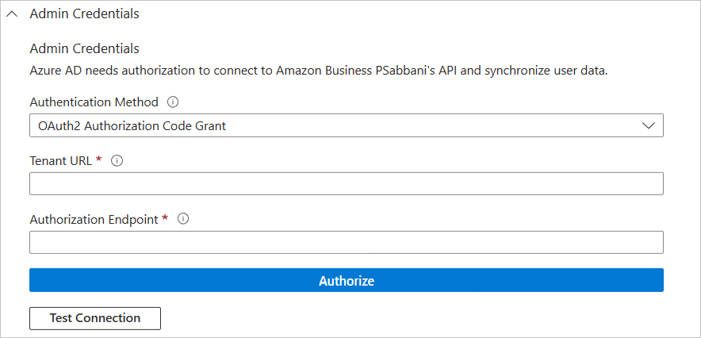

# Tutorial: Configure Amazon Business for automatic user provisioning

This tutorial describes the steps you need to perform in both Amazon Business and Microsoft Entra ID to configure automatic user provisioning. When configured, Microsoft Entra ID automatically provisions and deprovisions users and groups to [Amazon Business](https://www.amazon.com/b2b/info/amazon-business?layout=landing) using the Microsoft Entra provisioning service. For important details on what this service does, how it works, and frequently asked questions, see [Automate user provisioning and deprovisioning to SaaS applications with Microsoft Entra ID](../app-provisioning/user-provisioning.md). 

## Supported capabilities
> [!div class="checklist"]
> * Create users in Amazon Business.
> * Remove users in Amazon Business when they do not require access anymore.
> * Assign Amazon Business roles to user.
> * Keep user attributes synchronized between Microsoft Entra ID and Amazon Business.
> * Provision groups and group memberships in Amazon Business.
> * [Single sign-on](amazon-business-tutorial.md) to Amazon Business (recommended).

## Prerequisites

The scenario outlined in this tutorial assumes that you already have the following prerequisites:

* [A Microsoft Entra tenant](../develop/quickstart-create-new-tenant.md). 
* A user account in Microsoft Entra ID with [permission](../roles/permissions-reference.md) to configure provisioning (for example, Application Administrator, Cloud Application administrator, Application Owner, or Global Administrator).
* An Amazon Business account.
* A user account in Amazon Business with Admin permissions (Admin on all Legal Entity groups in your Amazon Business account).

## Step 1: Plan your provisioning deployment
1. Learn about [how the provisioning service works](../app-provisioning/user-provisioning.md).
1. Determine who will be in [scope for provisioning](../app-provisioning/define-conditional-rules-for-provisioning-user-accounts.md).
1. Determine what data to [map between Microsoft Entra ID and Amazon Business](../app-provisioning/customize-application-attributes.md).

## Step 2: Configure Amazon Business to support provisioning with Microsoft Entra ID

Before configuring and enabling the provisioning service, you need to identify a default group for both users and groups. We recommend you to

* Follow the principle of least privilege by having REQUISITIONER only permissions for the default users group.
* Follow the group naming convention referenced below for ease of referencing the groups throughout this document. 
   * Default SCIM Parent Group
      * This is the root of your SCIM directory in AmazonBusiness. All SCIM groups are placed directly under this default group. You may select an existing group as the default SCIM parent group. 
   * Default SCIM Users Group
      * Users who are assigned to your Amazon Business app will be placed into this group by default with a Requisitioner role. It is recommended to have this group at the same level as the Default SCIM Parent Group.
      * If a user is provisioned without a group assignment, they will be placed into this group by default with a Requisitioner role.

Once you identify/create the Default SCIM Groups, send a URL link for both these groups to your Account Manager. An Amazon Business Integrations Specialist initializes both the groups for your SCIM integration. It is necessary to complete this step before proceeding to the next step.

## Step 3: Add Amazon Business from the Microsoft Entra application gallery

Add Amazon Business from the Microsoft Entra application gallery to start managing provisioning to Amazon Business. If you have previously setup Amazon Business for SSO, you can use the same application. However it's recommended that you create a separate app when testing out the integration initially. Learn more about adding an application from the gallery [here](../manage-apps/add-application-portal.md). 

## Step 4: Define who will be in scope for provisioning 

The Microsoft Entra provisioning service allows you to scope who will be provisioned based on assignment to the application and or based on attributes of the user / group. If you choose to scope who will be provisioned to your app based on assignment, you can use the following [steps](../manage-apps/assign-user-or-group-access-portal.md) to assign users and groups to the application. If you choose to scope who will be provisioned based solely on attributes of the user or group, you can use a scoping filter as described [here](../app-provisioning/define-conditional-rules-for-provisioning-user-accounts.md). 

* When assigning users and groups to Amazon Business, you must select a role other than **Default Access**. Users with the Default Access role are excluded from provisioning and will be marked as not effectively entitled in the provisioning logs. If the only role available on the application is the default access role, you can [update the application manifest](../develop/howto-add-app-roles-in-azure-ad-apps.md) to add other roles.
* Start small. Test with a small set of users and groups before rolling out to everyone. When scope for provisioning is set to assigned users and groups, you can control this by assigning one or two users or groups to the app. When scope is set to all users and groups, you can specify an [attribute based scoping filter](../app-provisioning/define-conditional-rules-for-provisioning-user-accounts.md).
* You can [update the application manifest](../develop/howto-add-app-roles-in-azure-ad-apps.md) to add Amazon Business roles. The user can have one of the following roles:
   * **Requisitioner** (to place orders or submits order requests for approval).
   * **Administrator** (to manage people, groups, roles and approvals. View orders. Run order reports)
   * **Finance** (to access invoices, credit notes, analytics, and order history).
   * **Tech** (to set up system integrations with the programs used at work).

## Step 5: Configure automatic user provisioning to Amazon Business

This section guides you through the steps to configure the Microsoft Entra provisioning service to create, update, and disable users and/or groups in Amazon Business based on user and/or group assignments in Microsoft Entra ID.

### To configure automatic user provisioning for Amazon Business in Microsoft Entra ID:

1. Sign in to the [Microsoft Entra admin center](https://entra.microsoft.com) as at least a [Cloud Application Administrator](../roles/permissions-reference.md#cloud-application-administrator).
1. Browse to **Identity** > **Applications** > **Enterprise applications**

	

1. In the applications list, select **Amazon Business**.

	

1. Select the **Provisioning** tab.

	

1. Set the **Provisioning Mode** to **Automatic**.

	

1. Under the **Admin Credentials** section, input your Amazon Business Tenant URL, Authorization Endpoint. Click **Test Connection** to ensure Microsoft Entra ID can connect to Amazon Business. If the connection fails, ensure your Amazon Business account has Admin permissions and try again.

 	

   For **Tenant URL** and **Authorization endpoint** values please use the table below

   |Country|Tenant URL|Authorization endpoint
   |---|---|---|
   |Canada|https://na.business-api.amazon.com/scim/v2/|https://www.amazon.ca/b2b/abws/oauth?state=1&redirect_uri=https://portal.azure.com/TokenAuthorize&applicationId=amzn1.sp.solution.ee27ec8c-1ee9-4c6b-9e68-26bdc37479d3|
   |Germany|https://eu.business-api.amazon.com/scim/v2/|https://www.amazon.de/b2b/abws/oauth?state=1&redirect_uri=https://portal.azure.com/TokenAuthorize&applicationId=amzn1.sp.solution.ee27ec8c-1ee9-4c6b-9e68-26bdc37479d3|
   |Spain|https://eu.business-api.amazon.com/scim/v2/|https://www.amazon.es/b2b/abws/oauth?state=1&redirect_uri=https://portal.azure.com/TokenAuthorize&applicationId=amzn1.sp.solution.ee27ec8c-1ee9-4c6b-9e68-26bdc37479d3|
   |France|https://eu.business-api.amazon.com/scim/v2/|https://www.amazon.fr/b2b/abws/oauth?state=1&redirect_uri=https://portal.azure.com/TokenAuthorize&applicationId=amzn1.sp.solution.ee27ec8c-1ee9-4c6b-9e68-26bdc37479d3|
   |GB/UK|https://eu.business-api.amazon.com/scim/v2/|https://www.amazon.co.uk/b2b/abws/oauth?state=1&redirect_uri=https://portal.azure.com/TokenAuthorize&applicationId=amzn1.sp.solution.ee27ec8c-1ee9-4c6b-9e68-26bdc37479d3|
   |India|https://eu.business-api.amazon.com/scim/v2/|https://www.amazon.in/b2b/abws/oauth?state=1&redirect_uri=https://portal.azure.com/TokenAuthorize&applicationId=amzn1.sp.solution.ee27ec8c-1ee9-4c6b-9e68-26bdc37479d3|
   |Italy|https://eu.business-api.amazon.com/scim/v2/|https://www.amazon.it/b2b/abws/oauth?state=1&redirect_uri=https://portal.azure.com/TokenAuthorize&applicationId=amzn1.sp.solution.ee27ec8c-1ee9-4c6b-9e68-26bdc37479d3|
   |Japan|https://jp.business-api.amazon.com/scim/v2/|https://www.amazon.co.jp/b2b/abws/oauth?state=1&redirect_uri=https://portal.azure.com/TokenAuthorize&applicationId=amzn1.sp.solution.ee27ec8c-1ee9-4c6b-9e68-26bdc37479d3|
   |Mexico|https://na.business-api.amazon.com/scim/v2/|https://www.amazon.com.mx/b2b/abws/oauth?state=1&redirect_uri=https://portal.azure.com/TokenAuthorize&applicationId=amzn1.sp.solution.ee27ec8c-1ee9-4c6b-9e68-26bdc37479d3|
   |US|https://na.business-api.amazon.com/scim/v2/|https://www.amazon.com/b2b/abws/oauth?state=1&redirect_uri=https://portal.azure.com/TokenAuthorize&applicationId=amzn1.sp.solution.ee27ec8c-1ee9-4c6b-9e68-26bdc37479d3|

1. In the **Notification Email** field, enter the email address of a person or group who should receive the provisioning error notifications and select the **Send an email notification when a failure occurs** check box.

	

1. Select **Save**.

1. Under the **Mappings** section, select **Synchronize Microsoft Entra users to Amazon Business**.

1. Review the user attributes that are synchronized from Microsoft Entra ID to Amazon Business in the **Attribute-Mapping** section. The attributes selected as **Matching** properties are used to match the user accounts in Amazon Business for update operations. If you choose to change the [matching target attribute](../app-provisioning/customize-application-attributes.md), you'll need to ensure that the Amazon Business API supports filtering users based on that attribute. Select the **Save** button to commit any changes.

   |Attribute|Type|Supported for filtering|Required by Amazon Business|
   |---|---|---|---|
   |userName|String|&check;|&check;
   |active|Boolean||
   |emails[type eq "work"].value|String||
   |name.givenName|String||
   |name.familyName|String||
   |externalId|String||
   |roles|List of appRoleAssignments [appRoleAssignments]||

1. Under the **Mappings** section, select **Synchronize Microsoft Entra groups to Amazon Business**.

1. Review the group attributes that are synchronized from Microsoft Entra ID to Amazon Business in the **Attribute-Mapping** section. The attributes selected as **Matching** properties are used to match the groups in Amazon Business for update operations. Select the **Save** button to commit any changes.

   |Attribute|Type|Supported for filtering|Required by Amazon Business|
   |---|---|---|---|
   |displayName|String|&check;|&check;
   |members|Reference||

1. To configure scoping filters, refer to the following instructions provided in the [Scoping filter tutorial](../app-provisioning/define-conditional-rules-for-provisioning-user-accounts.md).

1. To enable the Microsoft Entra provisioning service for Amazon Business, change the **Provisioning Status** to **On** in the **Settings** section.

	

1. Define the users and/or groups that you would like to provision to Amazon Business by choosing the desired values in **Scope** in the **Settings** section.

	

1. When you're ready to provision, click **Save**.

	

This operation starts the initial synchronization cycle of all users and groups defined in **Scope** in the **Settings** section. The initial cycle takes longer to perform than subsequent cycles, which occur approximately every 40 minutes as long as the Microsoft Entra provisioning service is running. 

## Step 6: Monitor your deployment

Once you've configured provisioning, use the following resources to monitor your deployment:

* Use the [provisioning logs](../reports-monitoring/concept-provisioning-logs.md) to determine which users have been provisioned successfully or unsuccessfully
* Check the [progress bar](../app-provisioning/application-provisioning-when-will-provisioning-finish-specific-user.md) to see the status of the provisioning cycle and how close it's to completion
* If the provisioning configuration seems to be in an unhealthy state, the application goes into quarantine. Learn more about quarantine states [here](../app-provisioning/application-provisioning-quarantine-status.md).

## Feature limitations

* Flat structure is created on the Amazon Business account, that is, all pushed groups are at the same level under the Default SCIM Group. Nested structure/hierarchy is not supported.
* Group names will be same in Azure and Amazon Business account.
* As new groups will be created on the Amazon Business Account, Admins need to re-configure the business settings (for example, turning on purchasing, updating shared settings, adding guided buying policies, etc.) for the new groups as needed.
* Deleting old Groups / removing users from old groups in Amazon Business results in losing visibility into orders placed with that old Group, hence it is recommended to 
   * Not delete the old groups/assignments, and
   * Turn off purchasing for the old groups.
* Email / Username Update - Updating email and / or username via SCIM is not supported at this time. 
* Password Sync - Password sync is not supported.

## Troubleshooting tips

* If Amazon Business administrators have only logged in using SSO or don’t know their passwords, they can use the forgot password flow to reset their password and then sign in to Amazon Business.
* If Admin and Requisitioner roles have already been applied to customer in a group, assigning Finance or Tech roles will not result in updates on Amazon Business side.
* Customers with MASE accounts (Multiple Account Same Email) who delete one of their accounts can see errors that account doesn't exist when provisioning new users for short amount of time (24-48 hours).
* Customers cannot be removed immediately via Provision on Demand. Provisioning must be turned on and the removal will happen 40 mins after the action is taken.

## More resources

* [Managing user account provisioning for Enterprise Apps](../app-provisioning/configure-automatic-user-provisioning-portal.md)
* [What is application access and single sign-on with Microsoft Entra ID?](../manage-apps/what-is-single-sign-on.md)

## Next steps

* [Learn how to review logs and get reports on provisioning activity](../app-provisioning/check-status-user-account-provisioning.md)
