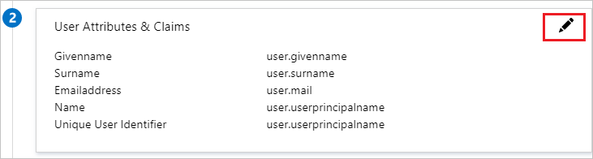
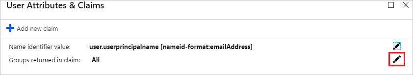
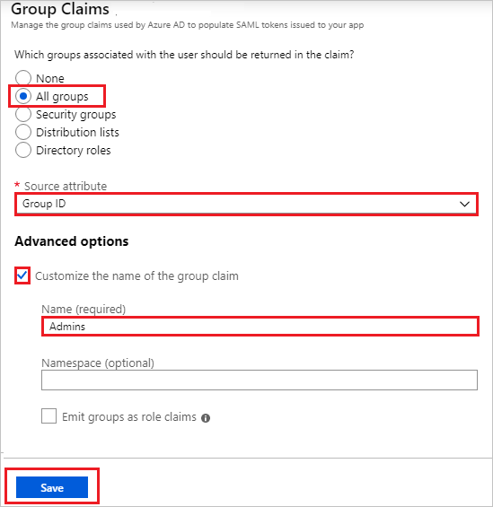
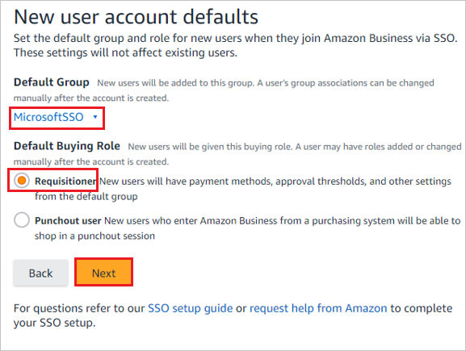
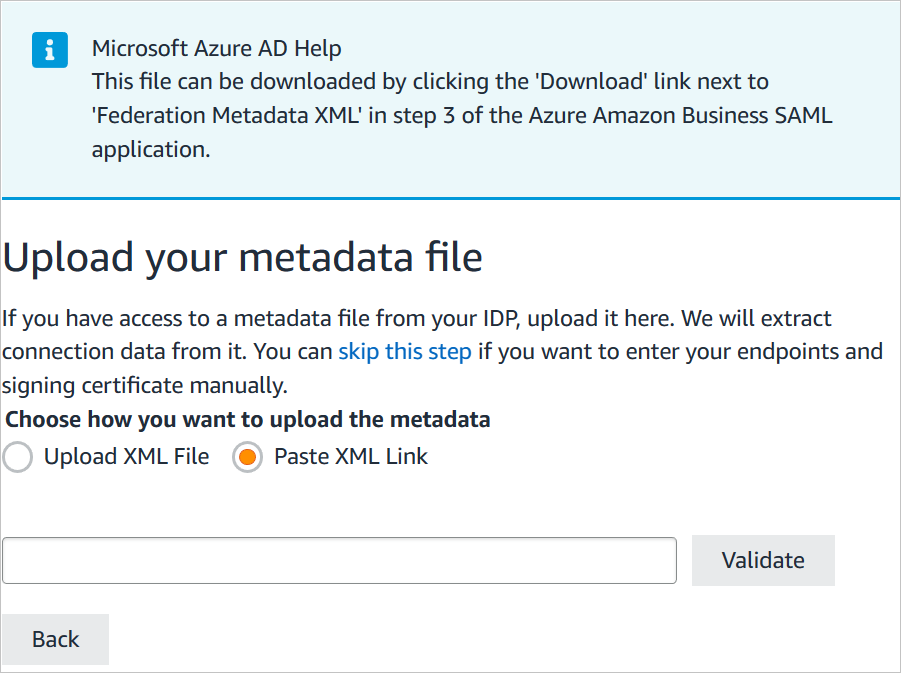
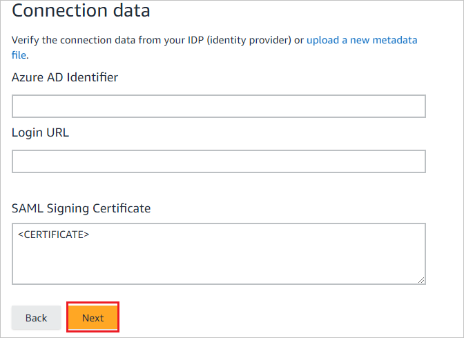
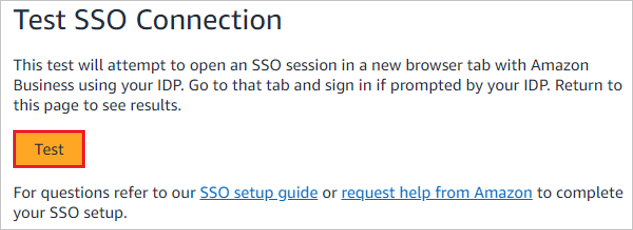
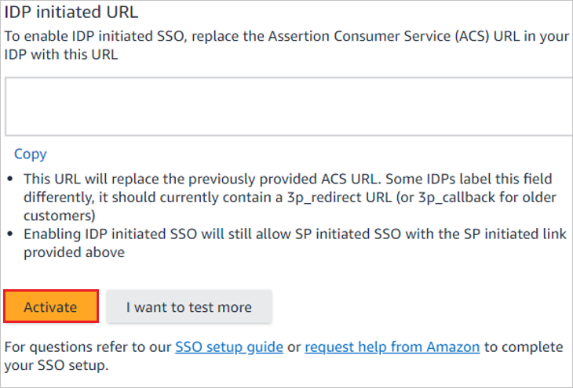
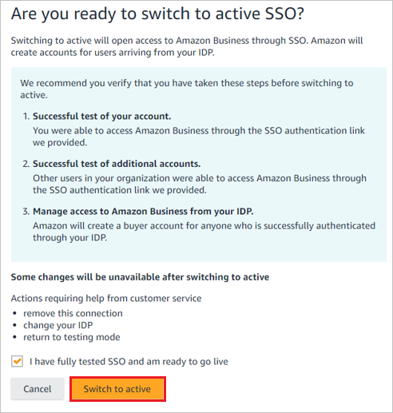
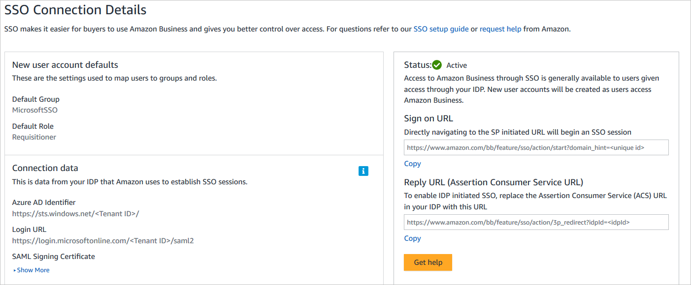

# Tutorial: Integrate Amazon Business with Microsoft Entra ID

In this tutorial, you'll learn how to integrate Amazon Business with Microsoft Entra ID. When you integrate Amazon Business with Microsoft Entra ID, you can:

* Control in Microsoft Entra ID who has access to Amazon Business.
* Enable your users to be automatically signed-in to Amazon Business with their Microsoft Entra accounts.
* Manage your accounts in one central location.

> [!VIDEO https://www.microsoft.com/en-us/videoplayer/embed/RE5cbi8]

## Prerequisites

To get started, you need the following items:

* A Microsoft Entra subscription. If you don't have a subscription, you can get a [free account](https://azure.microsoft.com/free/).
* An Amazon Business single sign-on (SSO) enabled subscription. Go to the [Amazon Business](https://www.amazon.com/business/register/org/landing?ref_=ab_reg_mlp) page to create an Amazon Business account.

## Scenario description

In this tutorial, you configure and test Microsoft Entra SSO in an existing Amazon Business account.

* Amazon Business supports **SP and IDP** initiated SSO.
* Amazon Business supports **Just In Time** user provisioning.

> [!NOTE]
> Identifier of this application is a fixed string value so only one instance can be configured in one tenant.

## Add Amazon Business from the gallery

To configure the integration of Amazon Business into Microsoft Entra ID, you need to add Amazon Business from the gallery to your list of managed SaaS apps.

1. Sign in to the [Microsoft Entra admin center](https://entra.microsoft.com) as at least a [Cloud Application Administrator](../roles/permissions-reference.md#cloud-application-administrator).
1. Browse to **Identity** > **Applications** > **Enterprise applications** > **New application**.
1. In the **Add from the gallery** section, type **Amazon Business** in the search box.
1. Select **Amazon Business** from results panel and then add the app. Wait a few seconds while the app is added to your tenant.

 Alternatively, you can also use the [Enterprise App Configuration Wizard](https://portal.office.com/AdminPortal/home?Q=Docs#/azureadappintegration). In this wizard, you can add an application to your tenant, add users/groups to the app, assign roles, as well as walk through the SSO configuration as well. [Learn more about Microsoft 365 wizards.](/microsoft-365/admin/misc/azure-ad-setup-guides)

## Configure and test Microsoft Entra SSO for Amazon Business

Configure and test Microsoft Entra SSO with Amazon Business using a test user called **B.Simon**. For SSO to work, you need to establish a link relationship between a Microsoft Entra user and the related user in Amazon Business.

To configure and test Microsoft Entra SSO with Amazon Business, perform the following steps:

1. **[Configure Microsoft Entra SSO](#configure-azure-ad-sso)** - to enable your users to use this feature.
    1. **[Create a Microsoft Entra test user](#create-an-azure-ad-test-user)** - to test Microsoft Entra single sign-on with B.Simon.
    1. **[Assign the Microsoft Entra test user](#assign-the-azure-ad-test-user)** - to enable B.Simon to use Microsoft Entra single sign-on.
1. **[Configure Amazon Business SSO](#configure-amazon-business-sso)** - to configure the single sign-on settings on application side.
    1. **[Create Amazon Business test user](#create-amazon-business-test-user)** - to have a counterpart of B.Simon in Amazon Business that is linked to the Microsoft Entra representation of user.
1. **[Test SSO](#test-sso)** - to verify whether the configuration works.

## Configure Microsoft Entra SSO

Follow these steps to enable Microsoft Entra SSO.

1. Sign in to the [Microsoft Entra admin center](https://entra.microsoft.com) as at least a [Cloud Application Administrator](../roles/permissions-reference.md#cloud-application-administrator).
1. Browse to **Identity** > **Applications** > **Enterprise applications** > **Amazon Business** application integration page, find the **Manage** section and select **Single sign-on**.
1. On the **Select a Single sign-on method** page, select **SAML**.
1. On the **Set up Single Sign-On with SAML** page, click the pencil icon for **Basic SAML Configuration** to edit the settings.

    

1. On the **Basic SAML Configuration** section, if you wish to configure in **IDP** initiated mode, perform the following steps:

    1. In the **Identifier (Entity ID)** text box, type one of the following URLs:

       | URL | Region |
       |-|-|
       | `https://www.amazon.com`| North America |
       | `https://www.amazon.co.jp`| East Asia |
       | `https://www.amazon.de`| Europe |

    1. In the **Reply URL** text box, type a URL using one of the following patterns:

       | URL | Region |
       |-|-|
       | `https://www.amazon.com/bb/feature/sso/action/3p_redirect?idpid={idpid}`| North America |
       | `https://www.amazon.co.jp/bb/feature/sso/action/3p_redirect?idpid={idpid}`| East Asia |
       | `https://www.amazon.de/bb/feature/sso/action/3p_redirect?idpid={idpid}`| Europe |

       > [!NOTE]
       > The Reply URL value is not real. Update this value with the actual Reply URL. You will get the `<idpid>` value from the Amazon Business SSO configuration section, which is explained later in the tutorial. You can also refer to the patterns shown in the **Basic SAML Configuration** section.

1. If you want to configure the application in **SP** initiated mode, you will need to add the full URL provided in the Amazon Business configuration to the **Sign-on URL** in the **Set additional URLs** section.

1. The following screenshot shows the list of default attributes. Edit the attributes by clicking on the **pencil** icon in the **User Attributes & Claims** section.

    

1. Edit Attributes and copy **Namespace** value of these attributes into the Notepad.

    

1. In addition to above, Amazon Business application expects few more attributes to be passed back in SAML response. In the **User Attributes & Claims** section on the **Group Claims** dialog, perform the following steps:

    1. Click the **pen** next to **Groups returned in claim**.

        

        

    1. Select **All Groups** from the radio list.

    1. Select **Group ID** as **Source attribute**.

    1. Check **Customize the name of the group claim** checkbox and enter the group name according to your Organization requirement.

    1. Click **Save**.

1. On the **Set up single sign-on with SAML** page, In the **SAML Signing Certificate** section, click copy button to copy **App Federation Metadata Url** and save it on your computer.

    

1. On the **Set up Amazon Business** section, copy the appropriate URL(s) based on your requirement.

    

### Create a Microsoft Entra test user

In this section, you'll create a test user called B.Simon.

> [!NOTE]
> Administrators need to create the test users in their tenant if needed. Following steps show how to create a test user.

1. Sign in to the [Microsoft Entra admin center](https://entra.microsoft.com) as at least a [User Administrator](../roles/permissions-reference.md#user-administrator).
1. Browse to **Identity** > **Users** > **All users**.
1. Select **New user** > **Create new user**, at the top of the screen.
1. In the **User** properties, follow these steps:
   1. In the **Display name** field, enter `B.Simon`.  
   1. In the **User principal name** field, enter the username@companydomain.extension. For example, `B.Simon@contoso.com`.
   1. Select the **Show password** check box, and then write down the value that's displayed in the **Password** box.
   1. Select **Review + create**.
1. Select **Create**.

### Create a Microsoft Entra Security Group in the Azure portal

1. Browse to **Identity** > **Groups** > **All Groups**.

    

1. Click **New group**:

    

1. Fill in **Group type**, **Group name**, **Group description**, **Membership type**. Click on the arrow to select members, then search for or click on the member you will like to add to the group. Click on **Select** to add the selected members, then click on **Create**.

    

### Assign the Microsoft Entra test user

In this section, you'll enable B.Simon to use single sign-on by granting access to Amazon Business.

1. Sign in to the [Microsoft Entra admin center](https://entra.microsoft.com) as at least a [Cloud Application Administrator](../roles/permissions-reference.md#cloud-application-administrator).
1. Browse to **Identity** > **Applications** > **Enterprise applications** > **Amazon Business**.
1. In the app's overview page, find the **Manage** section and select **Users and groups**.
1. Select **Add user**, then select **Users and groups** in the **Add Assignment** dialog.
1. In the **Users and groups** dialog, select **B.Simon** from the Users list, then click the **Select** button at the bottom of the screen.
1. If you're expecting any role value in the SAML assertion, in the **Select Role** dialog, select the appropriate role for the user from the list and then click the **Select** button at the bottom of the screen.
1. In the **Add Assignment** dialog, click the **Assign** button.

    >[!NOTE]
    > If you do not assign the users in the Microsoft Entra ID, you get the following error.

    

### Assign the Microsoft Entra Security Group in the Azure portal

1. Sign in to the [Microsoft Entra admin center](https://entra.microsoft.com) as at least a [Cloud Application Administrator](../roles/permissions-reference.md#cloud-application-administrator).
1. Browse to **Identity** > **Applications** > **Enterprise applications** > **Amazon Business**.
2. In the applications list, type and select **Amazon Business**.
3. In the menu on the left, select **Users and groups**.
4. Click the **Add user**.
5. Search for the Security Group you want to use, then click on the group to add it to the Select members section. Click **Select**, then click **Assign**.

    

    > [!NOTE]
    > Check the notifications in the menu bar to be notified that the Group was successfully assigned to the Enterprise application.

## Configure Amazon Business SSO

1. In a different web browser window, sign in to your up Amazon Business company site as an administrator

1. Click on the **User Profile** and select **Business Settings**.

    

1. On the **System integrations** wizard, select **Single Sign-On (SSO)**.

    

1. On the **Set up SSO** wizard, select the provider according to your Organizational requirements and click **Next**.

    

    > [!NOTE]
    > Although Microsoft ADFS is a listed option, it won't work with Microsoft Entra SSO.

1. On the **New user account defaults** wizard, select the **Default Group** and then select **Default Buying Role** according to user role in your Organization and click **Next**.

    

1. On the **Upload your metadata file** wizard, choose **Paste XML Link** option to paste the **App Federation Metadata URL** value,. and click **Validate**.

    

    >[!NOTE]
    > Alternatively, you can also upload the **Federation Metadata XML** file by clicking on the **Upload XML File** option.

1. After uploading the downloaded metadata file, the fields in the **Connection data** section will populate automatically. After that click **Next**.

    

1. On the **Upload your Attribute statement** wizard, click **Skip**.

    

1. On the **Attribute mapping** wizard, add the requirement fields by clicking the **+ Add a field** option. Add the attribute values including the namespace, which you have copied from the **User Attributes & Claims** section of Azure portal into the  **SAML AttributeName** field, and click **Next**.

    

1. On the **Amazon connection data** wizard, please confirm your IDP has configured and click **Continue**.

    

1. Please check the **Status** of the steps which have been configured and click **Start testing**.

    

1. On the **Test SSO Connection** wizard, click **Test**.

    

1. On the **IDP initiated URL** wizard, before you click **Activate**, copy the value which is assigned to **idpid** and paste into the **idpid** parameter in the **Reply URL** in the **Basic SAML Configuration** section.

    

1. On the **Are you ready to switch to active  SSO?** wizard, check **I have fully tested SSO and am ready to go live** checkbox and click on **Switch to active**.

    

1. Finally in the **SSO Connection details** section the **Status** is shown as **Active**.

    

    > [!NOTE]
    > If you want to configure the application in **SP** initiated mode, complete the following step, paste the sign-on URL from the screenshot above in the **Sign-on URL** text box of the **Set additional URLs** section. Use the following format:
    >
    > `https://www.amazon.<TLD>/bb/feature/sso/action/start?domain_hint=<UNIQUE_ID>`

### Create Amazon Business test user

In this section, a user called B.Simon is created in Amazon Business. Amazon Business supports just-in-time user provisioning, which is enabled by default. There is no action item for you in this section. If a user doesn't already exist in Amazon Business, a new one is created after authentication.

## Test SSO

In this section, you test your Microsoft Entra single sign-on configuration with following options. 

#### SP initiated:

* Click on **Test this application**, this will redirect to Amazon Business Sign-on URL where you can initiate the login flow.  

* Go to the Amazon Business Single Sign-on URL directly and initiate the login flow from there.

#### IDP initiated:

* Click on **Test this application**, and you should be automatically signed in to the Amazon Business for which you set up the SSO. 

You can also use Microsoft My Apps to test the application in any mode. When you click the Amazon Business tile in the My Apps, if configured in SP mode you would be redirected to the application sign-on page for initiating the login flow and if configured in IDP mode, you should be automatically signed in to the Amazon Business for which you set up the SSO. For more information about the My Apps, see [Introduction to the My Apps](https://support.microsoft.com/account-billing/sign-in-and-start-apps-from-the-my-apps-portal-2f3b1bae-0e5a-4a86-a33e-876fbd2a4510).

## Next steps

Once you configure Amazon Business you can enforce session control, which protects exfiltration and infiltration of your organization’s sensitive data in real time. Session control extends from Conditional Access. [Learn how to enforce session control with Microsoft Defender for Cloud Apps](/cloud-app-security/proxy-deployment-aad).
