# Tutorial: Integrate Amazon Business with Azure Active Directory

In this tutorial, you'll learn how to integrate Amazon Business with Azure Active Directory (Azure AD). When you integrate [Amazon Business](https://www.amazon.com/b2b/info/amazon-business?layout=landing) with Azure AD, you can:

* Control in Azure AD who has access to Amazon Business.
* Enable your users to be automatically signed-in to Amazon Business with their Azure AD accounts.
* Manage your accounts in one central location - the Azure portal.

To learn more about SaaS app integration with Azure AD, see [What is application access and single sign-on with Azure Active Directory](https://docs.microsoft.com/azure/active-directory/active-directory-appssoaccess-whatis).

## Prerequisites

To get started, you need the following items:

* An Azure AD subscription. If you don't have a subscription, you can get one-month free trial [here](https://azure.microsoft.com/pricing/free-trial/).
* An Amazon Business single sign-on (SSO) enabled subscription. Go to the [Amazon Business](https://www.amazon.com/business/register/org/landing?ref_=ab_reg_mlp) page to create an Amazon Business account.

## Scenario description

In this tutorial, you configure and test Azure AD SSO in an existing Amazon Business account.

* Amazon Business supports **SP and IDP** initiated SSO
* Amazon Business supports **Just In Time** user provisioning

## Adding Amazon Business from the gallery

To configure the integration of Amazon Business into Azure AD, you need to add Amazon Business from the gallery to your list of managed SaaS apps.

1. Sign in to the [Azure portal](https://portal.azure.com) using either a work or school account, or a personal Microsoft account.
1. On the left navigation pane, select the **Azure Active Directory** service.
1. Navigate to **Enterprise Applications** and then select **All Applications**.
1. To add new application, select **New application**.
1. In the **Add from the gallery** section, type **Amazon Business** in the search box.
1. Select **Amazon Business** from results panel and then add the app. Wait a few seconds while the app is added to your tenant.

## Configure and test Azure AD single sign-on

Configure and test Azure AD SSO with Amazon Business using a test user called **B.Simon**.

To configure and test Azure AD SSO with Amazon Business, complete the following building steps:

1. **[Configure Azure AD SSO](#configure-azure-ad-sso)** - to enable your users to use this feature.
2. **[Configure Amazon Business SSO](#configure-amazon-business-sso)** - to configure the Single Sign-On settings on application side.
3. **[Create an Azure AD test user](#create-an-azure-ad-test-user)** - to test Azure AD single sign-on with B.Simon.
4. **[Assign the Azure AD test user](#assign-the-azure-ad-test-user)** - to enable B.Simon to use Azure AD single sign-on.
5. **[Create Amazon Business test user](#create-amazon-business-test-user)** - to have a counterpart of B.Simon in Amazon Business that is linked to the Azure AD representation of user.
6. **[Test SSO](#test-sso)** - to verify whether the configuration works.

### Configure Azure AD SSO

Follow these steps to enable Azure AD SSO in the Azure portal.

1. In the [Azure portal](https://portal.azure.com/), on the **Amazon Business** application integration page, find the **Manage** section and select **Single sign-on**.
1. On the **Select a Single sign-on method** page, select **SAML**.
1. On the **Set up Single Sign-On with SAML** page, click the edit/pen icon for **Basic SAML Configuration** to edit the settings.

   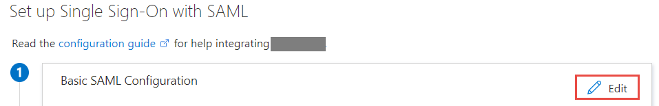

1. On the **Basic SAML Configuration** section, if you wish to configure in **IDP** initiated mode, perform the following steps:

	1. In the **Identifier (Entity ID)** text box, type a URL using one of the following patterns:
	
	   | | |
	   |-|-|
	   | `https://www.amazon.com`| North America |
	   | `https://www.amazon.co.jp`| East Asia |
	   | `https://www.amazon.de`| Europe |

	1. In the **Reply URL** text box, type a URL using one of the following patterns:
	
	   | | |
	   |-|-|
	   | `https://www.amazon.com/bb/feature/sso/action/3p_redirect?idpid={idpid}`| North America |
	   | `https://www.amazon.co.jp/bb/feature/sso/action/3p_redirect?idpid={idpid}`| East Asia |
	   | `https://www.amazon.de/bb/feature/sso/action/3p_redirect?idpid={idpid}`| Europe |

	   > [!NOTE]
       > The Reply URL value is not real. Update this value with the actual Reply URL. You will get the `<idpid>` value from the Amazon Business SSO configuration section, which is explained later in the tutorial. You can also refer to the patterns shown in the **Basic SAML Configuration** section in the Azure portal.

1. If you want to configure the application in **SP** initiated mode, you will need to add the full URL provided in the Amazon Business configuration to the **Sign-on URL** in the **Set additional URLs** section.

1. The following screenshot shows the list of default attributes. Edit the attributes by clicking on the **Edit** icon in the **User Attributes & Claims** section.

	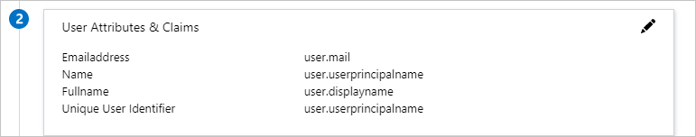

1. Edit Attributes and copy **Namespace** value of these attributes into the Notepad.

	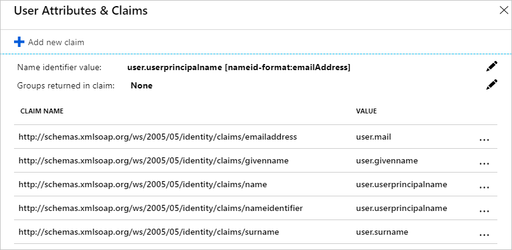

1. In addition to above, Amazon Business application expects few more attributes to be passed back in SAML response. In the **User Attributes & Claims** section on the **Group Claims** dialog, perform the following steps:

	a. Click the **pen** next to **Groups returned in claim**.

	

	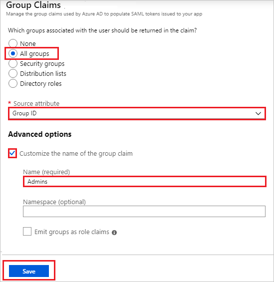

	b. Select **All Groups** from the radio list.

	c. Select **Group ID** as **Source attribute**.

	d. Check **Customize the name of the group claim** checkbox and enter the group name according to your Organization requirement.

	e. Click **Save**.

1. On the **Set up Single Sign-On with SAML** page, in the **SAML Signing Certificate** section,  find **Metadata XML** and select **Download** to download the certificate and save it on your computer.

	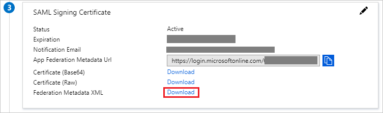

1. On the **Set up Amazon Business** section, copy the appropriate URL(s) based on your requirement.

	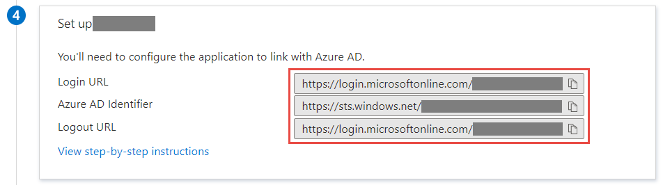

### Configure Amazon Business SSO

1. In a different web browser window, sign in to your Amazon Business company site as an administrator.

1. Click on the **User Profile** and select **Business Settings**.

	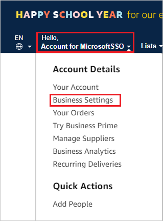

1. On the **System integrations** wizard, select **Single Sign-On (SSO)**.

	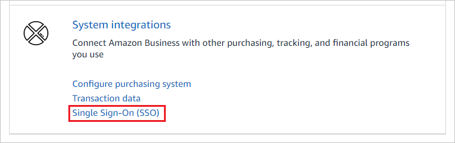

1. On the **Set up SSO** wizard, select the provider according to your Organizational requirements and click **Next**.

	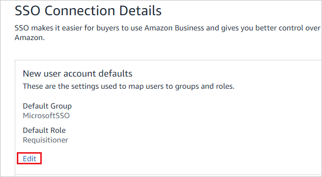
	
	> [!NOTE]
	> Although Microsoft ADFS is a listed option, it won't work with Azure AD SSO.

1. On the **New user account defaults** wizard, select the **Default Group** and then select **Default Buying Role** according to user role in your Organization and click **Next**.

	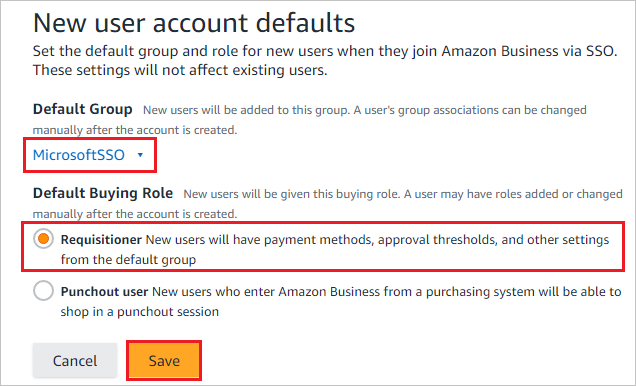

1. On the **Upload your metadata file** wizard, click **Browse** to upload the **Metadata XML** file, which you have downloaded from the Azure portal and click **Upload**.

	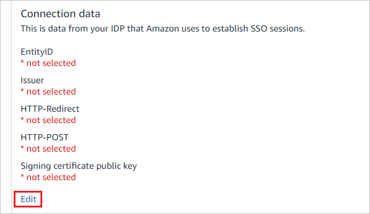

1. After uploading the downloaded metadata file, the fields in the **Connection data** section will populate automatically. After that click **Next**.

	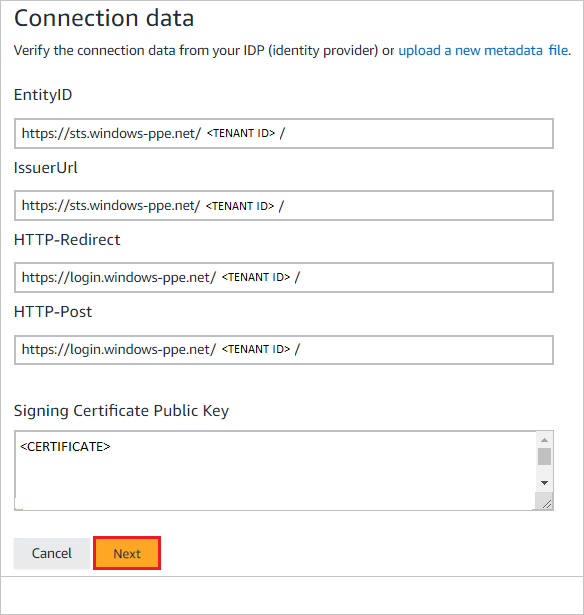

1. On the **Upload your Attribute statement** wizard, click **Skip**.

	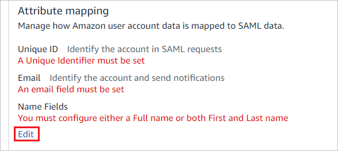

1. On the **Attribute mapping** wizard, add the requirement fields by clicking the **+ Add a field** option. Add the attribute values including the namespace, which you have copied from the **User Attributes & Claims** section of Azure portal into the  **SAML AttributeName** field, and click **Next**.

	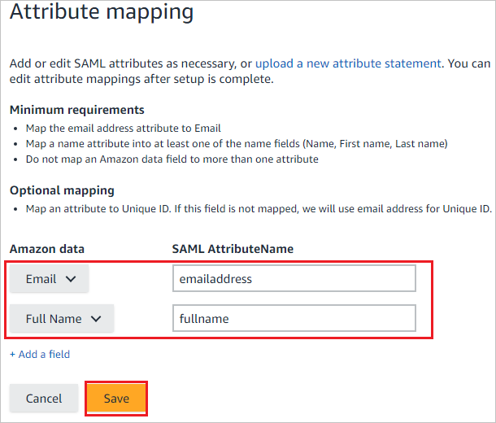

1. On the **Amazon connection data** wizard, click **Next**.

	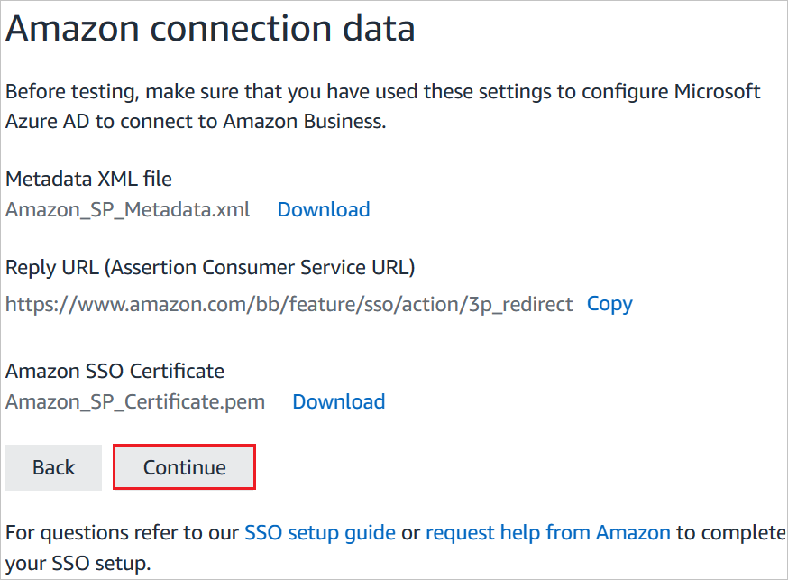

1. Please check the **Status** of the steps which have been configured and click **Start testing**.

	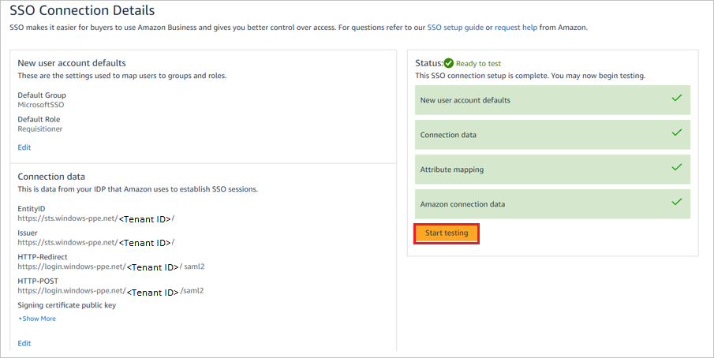

1. On the **Test SSO Connection** wizard, click **Test**.

	

1. On the **IDP initiated URL** wizard, before you click **Activate**, copy the value which is assigned to **idpid** and paste into the **idpid** parameter in the **Reply URL** in the **Basic SAML Configuration** section in the Azure portal.

	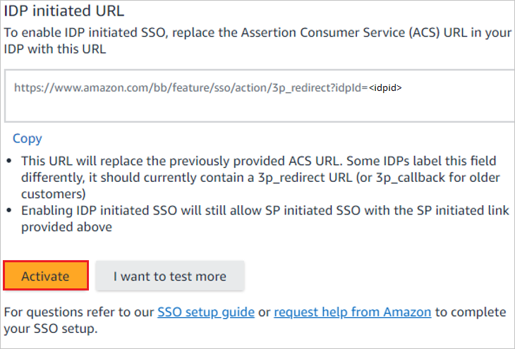

1. On the **Are you ready to switch to active  SSO?** wizard, check **I have fully tested SSO and am ready to go live** checkbox and click on **Switch to active**.

	

1. Finally in the **SSO Connection details** section the **Status** is shown as **Active**.

	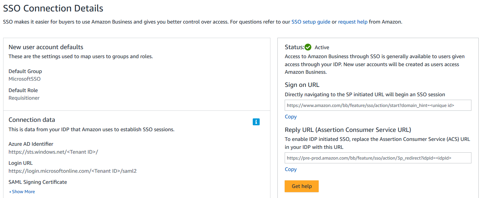
	
	> [!NOTE]
	> If you want to configure the application in **SP** initiated mode, complete the following step, paste the sign-on URL from the screenshot above in the **Sign-on URL** text box of the **Set additional URLs** section in the Azure portal. Use the following format:
	>
	> `https://www.amazon.<TLD>/bb/feature/sso/action/start?domain_hint=<uniqueid>`
    
### Create an Azure AD test user

In this section, you'll create a test user in the Azure portal called B.Simon.

> [!NOTE]
> Adminstrators need to create the test users in their tenant if needed. Following steps show how to create a test user.

1. From the left pane in the Azure portal, select **Azure Active Directory**, select **Users**, and then select **All users**.
1. Select **New user** at the top of the screen.
1. In the **User** properties, follow these steps:
   1. In the **Name** field, enter `B.Simon`.  
   1. In the **User name** field, enter the username@companydomain.extension. For example, `B.Simon@contoso.com`.
   1. Select the **Show password** check box, and then write down the value that's displayed in the **Password** box.
   1. Click **Create**.

### Create an Azure AD Security Group in the Azure portal

1. Click on **Azure Active Directory > All Groups**.

	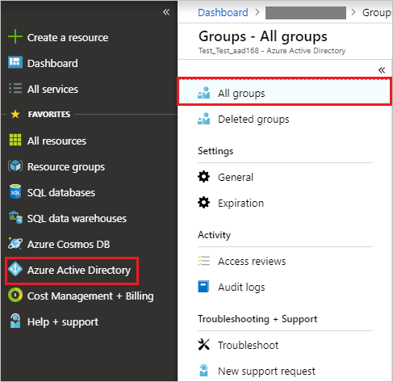

1. Click **New group**:

	

1. Fill in **Group type**, **Group name**, **Group description**, **Membership type**. Click on the arrow to select members, then search for or click on the member you will like to add to the group. Click on **Select** to add the selected members, then click on **Create**.

	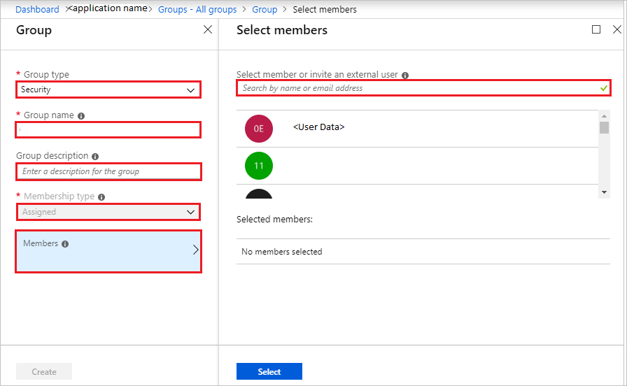

### Assign the Azure AD test user

In this section, you'll enable B.Simon to use Azure single sign-on by granting access to Amazon Business.

1. In the Azure portal, select **Enterprise Applications**, and then select **All applications**.
1. In the applications list, select **Amazon Business**.
1. In the app's overview page, find the **Manage** section and select **Users and groups**.

   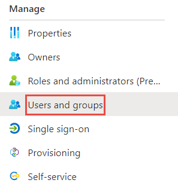

1. Select **Add user**, then select **Users and groups** in the **Add Assignment** dialog.

	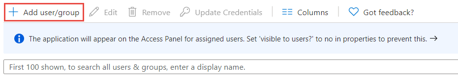

1. In the **Users and groups** dialog, select **B.Simon** from the Users list, then click the **Select** button at the bottom of the screen.
1. If you're expecting any role value in the SAML assertion, in the **Select Role** dialog, select the appropriate role for the user from the list and then click the **Select** button at the bottom of the screen.
1. In the **Add Assignment** dialog, click the **Assign** button.

	>[!NOTE]
	> If you do not assign the users in the Azure AD, you get the following error.

	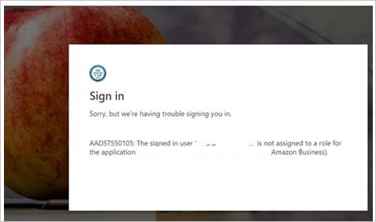

### Assign the Azure AD Security Group in the Azure portal

1. In the Azure portal, select **Enterprise Applications**, select **All applications**, then select **Amazon Business**.

	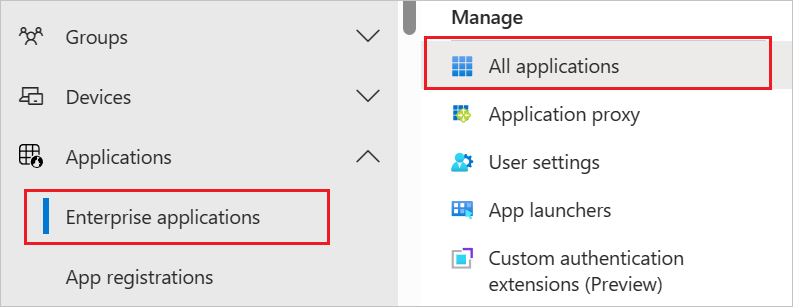

2. In the applications list, type and select **Amazon Business**.

	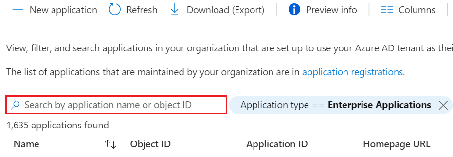

3. In the menu on the left, select **Users and groups**.

    

4. Click the **Add user**.

    

5. Search for the Security Group you want to use, then click on the group to add it to the Select members section. Click **Select**, then click **Assign**.

    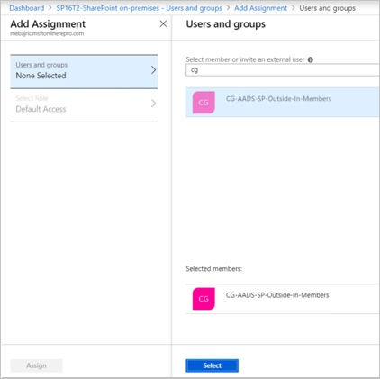

	> [!NOTE]
	> Check the notifications in the menu bar to be notified that the Group was successfully assigned to the Enterprise application in the Azure portal.

### Create Amazon Business test user

In this section, a user called B.Simon is created in Amazon Business. Amazon Business supports just-in-time user provisioning, which is enabled by default. There is no action item for you in this section. If a user doesn't already exist in Amazon Business, a new one is created after authentication.

### Test SSO

In this section, you test your Azure AD single sign-on configuration using the Access Panel.

When you click the Amazon Business tile in the Access Panel, you should be automatically signed in to the Amazon Business for which you set up SSO. For more information about the Access Panel, see [Introduction to the Access Panel](https://docs.microsoft.com/azure/active-directory/active-directory-saas-access-panel-introduction).

## Additional Resources

- [ List of Tutorials on How to Integrate SaaS Apps with Azure Active Directory ](https://docs.microsoft.com/azure/active-directory/active-directory-saas-tutorial-list)

- [What is application access and single sign-on with Azure Active Directory? ](https://docs.microsoft.com/azure/active-directory/active-directory-appssoaccess-whatis)

- [What is conditional access in Azure Active Directory?](https://docs.microsoft.com/azure/active-directory/conditional-access/overview)
