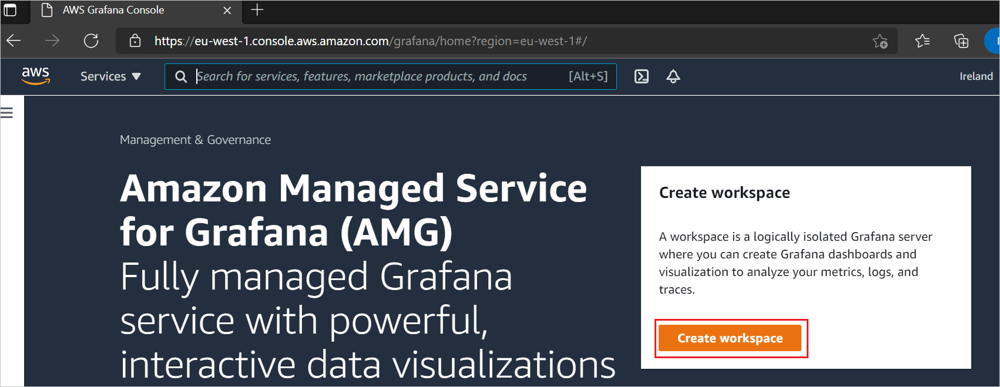
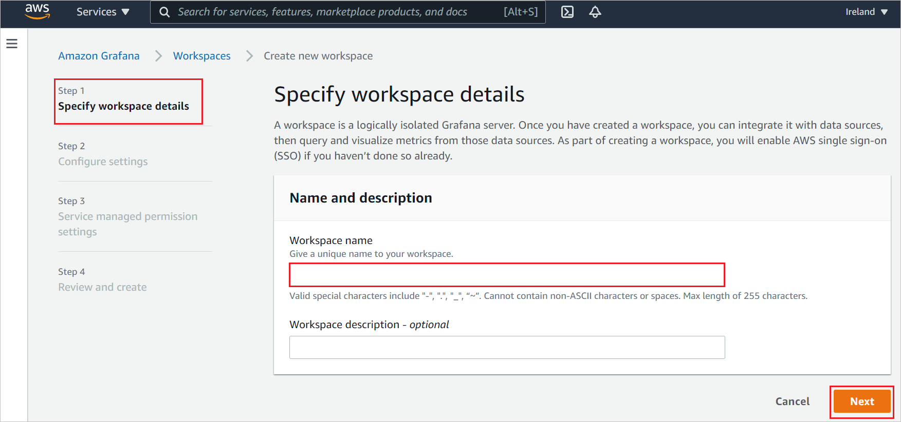
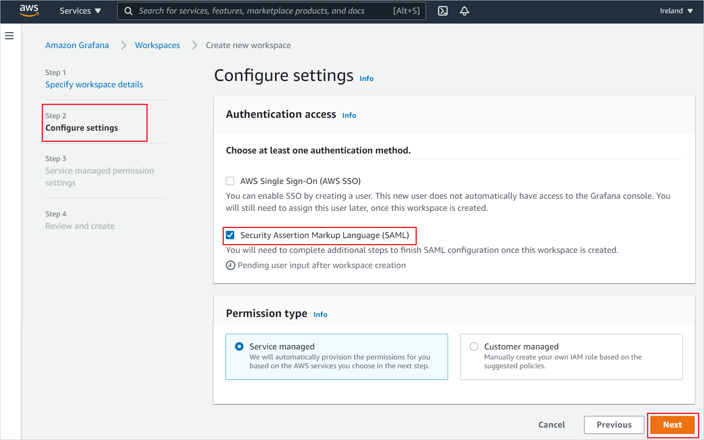
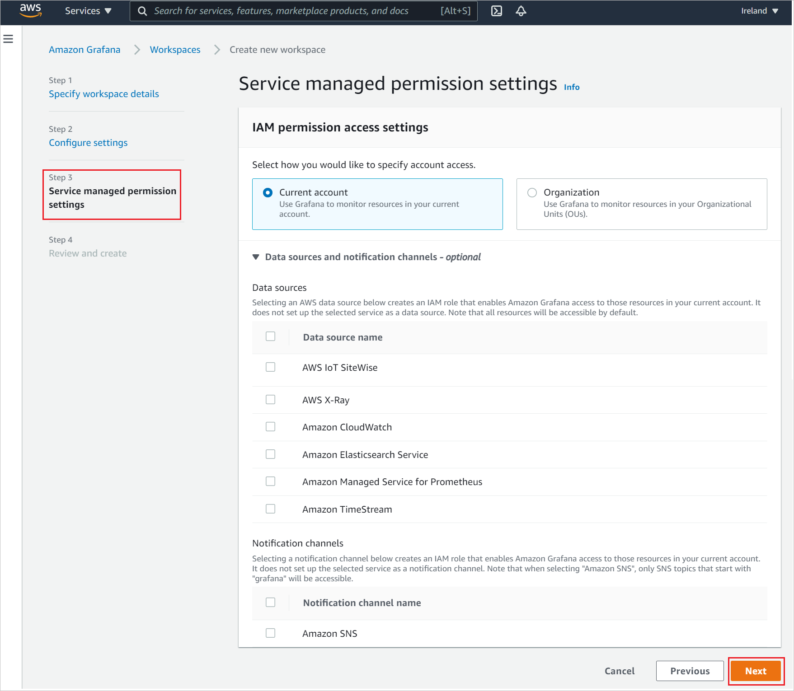
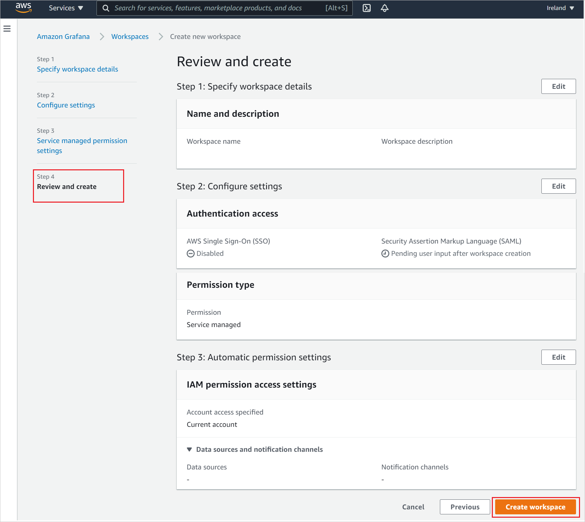
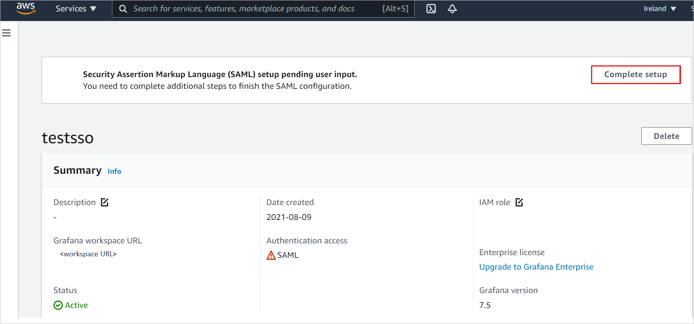
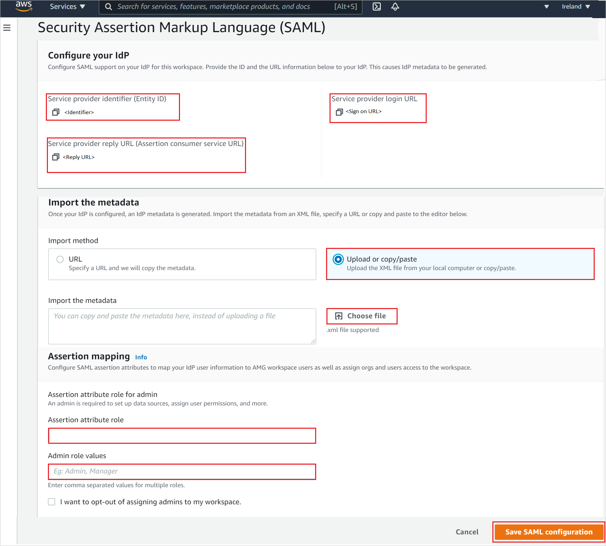

# Tutorial: Azure Active Directory single sign-on (SSO) integration with Amazon Managed Grafana

In this tutorial, you'll learn how to integrate Amazon Managed Grafana with Azure Active Directory (Azure AD). When you integrate Amazon Managed Grafana with Azure AD, you can:

* Control in Azure AD who has access to Amazon Managed Grafana.
* Enable your users to be automatically signed-in to Amazon Managed Grafana with their Azure AD accounts.
* Manage your accounts in one central location - the Azure portal.

## Prerequisites

To get started, you need the following items:

* An Azure AD subscription. If you don't have a subscription, you can get a [free account](https://azure.microsoft.com/free/).
* Amazon Web Services (AWS) [free account](https://aws.amazon.com/free/).
* Amazon Managed Grafana single sign-on (SSO) enabled subscription.

## Scenario description

In this tutorial, you configure and test Azure AD SSO in a test environment.

* Amazon Managed Grafana supports **SP** initiated SSO.
* Amazon Managed Grafana supports **Just In Time** user provisioning.

## Add Amazon Managed Grafana from the gallery

To configure the integration of Amazon Managed Grafana into Azure AD, you need to add Amazon Managed Grafana from the gallery to your list of managed SaaS apps.

1. Sign in to the Azure portal using either a work or school account, or a personal Microsoft account.
1. On the left navigation pane, select the **Azure Active Directory** service.
1. Navigate to **Enterprise Applications** and then select **All Applications**.
1. To add new application, select **New application**.
1. In the **Add from the gallery** section, type **Amazon Managed Grafana** in the search box.
1. Select **Amazon Managed Grafana** from results panel and then add the app. Wait a few seconds while the app is added to your tenant.

 Alternatively, you can also use the [Enterprise App Configuration Wizard](https://portal.office.com/AdminPortal/home?Q=Docs#/azureadappintegration). In this wizard, you can add an application to your tenant, add users/groups to the app, assign roles, as well as walk through the SSO configuration as well. [Learn more about Microsoft 365 wizards.](/microsoft-365/admin/misc/azure-ad-setup-guides)

## Configure and test Azure AD SSO for Amazon Managed Grafana

Configure and test Azure AD SSO with Amazon Managed Grafana using a test user called **B.Simon**. For SSO to work, you need to establish a link relationship between an Azure AD user and the related user in Amazon Managed Grafana.

To configure and test Azure AD SSO with Amazon Managed Grafana, perform the following steps:

1. **[Configure Azure AD SSO](#configure-azure-ad-sso)** - to enable your users to use this feature.
    1. **[Create an Azure AD test user](#create-an-azure-ad-test-user)** - to test Azure AD single sign-on with B.Simon.
    1. **[Assign the Azure AD test user](#assign-the-azure-ad-test-user)** - to enable B.Simon to use Azure AD single sign-on.
1. **[Configure Amazon Managed Grafana SSO](#configure-amazon-managed-grafana-sso)** - to configure the single sign-on settings on application side.
    1. **[Create Amazon Managed Grafana test user](#create-amazon-managed-grafana-test-user)** - to have a counterpart of B.Simon in Amazon Managed Grafana that is linked to the Azure AD representation of user.
1. **[Test SSO](#test-sso)** - to verify whether the configuration works.

## Configure Azure AD SSO

Follow these steps to enable Azure AD SSO in the Azure portal.

1. In the Azure portal, on the **Amazon Managed Grafana** application integration page, find the **Manage** section and select **single sign-on**.
1. On the **Select a single sign-on method** page, select **SAML**.
1. On the **Set up single sign-on with SAML** page, click the pencil icon for **Basic SAML Configuration** to edit the settings.

   

1. On the **Basic SAML Configuration** section, perform the following steps:

	a. In the **Identifier (Entity ID)** text box, type a URL using the following pattern:
    `https://<namespace>.grafana-workspace.<region>.amazonaws.com/saml/metadata`

	b. In the **Sign on URL** text box, type a URL using the following pattern:
    `https://<namespace>.grafana-workspace.<region>.amazonaws.com/login/saml`

	> [!NOTE]
	> These values are not real. Update these values with the actual Identifier and Sign on URL. Contact [Amazon Managed Grafana Client support team](https://aws.amazon.com/contact-us/) to get these values. You can also refer to the patterns shown in the **Basic SAML Configuration** section in the Azure portal.

1. Amazon Managed Grafana application expects the SAML assertions in a specific format, which requires you to add custom attribute mappings to your SAML token attributes configuration. The following screenshot shows the list of default attributes.

	

1. In addition to above, Amazon Managed Grafana application expects few more attributes to be passed back in SAML response which are shown below. These attributes are also pre populated but you can review them as per your requirements.
	
	| Name | Source attribute |
	| ----------| --------- |
	| displayName | user.displayname |
	| mail | user.userprincipalname |

1. On the **Set up single sign-on with SAML** page, in the **SAML Signing Certificate** section,  find **Federation Metadata XML** and select **Download** to download the certificate and save it on your computer.

	

1. On the **Set up Amazon Managed Grafana** section, copy the appropriate URL(s) based on your requirement.

	

### Create an Azure AD test user

In this section, you'll create a test user in the Azure portal called B.Simon.

1. From the left pane in the Azure portal, select **Azure Active Directory**, select **Users**, and then select **All users**.
1. Select **New user** at the top of the screen.
1. In the **User** properties, follow these steps:
   1. In the **Name** field, enter `B.Simon`.  
   1. In the **User name** field, enter the username@companydomain.extension. For example, `B.Simon@contoso.com`.
   1. Select the **Show password** check box, and then write down the value that's displayed in the **Password** box.
   1. Click **Create**.

### Assign the Azure AD test user

In this section, you'll enable B.Simon to use Azure single sign-on by granting access to Amazon Managed Grafana.

1. In the Azure portal, select **Enterprise Applications**, and then select **All applications**.
1. In the applications list, select **Amazon Managed Grafana**.
1. In the app's overview page, find the **Manage** section and select **Users and groups**.
1. Select **Add user**, then select **Users and groups** in the **Add Assignment** dialog.
1. In the **Users and groups** dialog, select **B.Simon** from the Users list, then click the **Select** button at the bottom of the screen.
1. If you are expecting a role to be assigned to the users, you can select it from the **Select a role** dropdown. If no role has been set up for this app, you see "Default Access" role selected.
1. In the **Add Assignment** dialog, click the **Assign** button.

## Configure Amazon Managed Grafana SSO

1. Log in to your Amazon Managed Grafana Console as an administrator.

1. Click **Create workspace**. 

	

1. In the **Specify workspace details** page, type a unique **Workspace name** and click **Next**.

	

1. In the **Configure settings** page, select **Security Assertion Markup Language(SAML)** checkbox and enable **Service managed** as permission type and click **Next**.

	

1. In the **Service managed permission settings**, select **Current account** and click **Next**.

	

1. In the **Review and create** page, verify all the workspace details and click **Create workspace**.

	

1. After creating workspace, click **Complete setup** to complete the SAML configuration.

	

1. In the **Security Assertion Markup Language(SAML)** page, perform the following steps.

	

	1. Copy **Service provider identifier(Entity ID)** value, paste this value into the **Identifier** text box in the **Basic SAML Configuration** section in the Azure portal.

	1. Copy **Service provider reply URL(Assertion consumer service URL)** value, paste this value into the **Reply URL** text box in the **Basic SAML Configuration** section in the Azure portal.

	1. Copy **Service provider login URL** value, paste this value into the **Sign on URL** text box in the **Basic SAML Configuration** section in the Azure portal.

	1. Open the downloaded **Federation Metadata XML** from the Azure portal into Notepad and upload the XML file by clicking **Choose file** option.

	1. In the **Assertion mapping** section, fill the required values according to your requirement.

	1. Click **Save SAML configuration**.

### Create Amazon Managed Grafana test user

In this section, a user called Britta Simon is created in Amazon Managed Grafana. Amazon Managed Grafana supports just-in-time user provisioning, which is enabled by default. There is no action item for you in this section. If a user doesn't already exist in Amazon Managed Grafana, a new one is created after authentication.

## Test SSO 

In this section, you test your Azure AD single sign-on configuration with following options. 

* Click on **Test this application** in Azure portal. This will redirect to Amazon Managed Grafana Sign-on URL where you can initiate the login flow. 

* Go to Amazon Managed Grafana Sign-on URL directly and initiate the login flow from there.

* You can use Microsoft My Apps. When you click the Amazon Managed Grafana tile in the My Apps, this will redirect to Amazon Managed Grafana Sign-on URL. For more information about the My Apps, see [Introduction to the My Apps](https://support.microsoft.com/account-billing/sign-in-and-start-apps-from-the-my-apps-portal-2f3b1bae-0e5a-4a86-a33e-876fbd2a4510).

## Next steps

Once you configure Amazon Managed Grafana you can enforce session control, which protects exfiltration and infiltration of your organization’s sensitive data in real time. Session control extends from Conditional Access. [Learn how to enforce session control with Microsoft Defender for Cloud Apps](/cloud-app-security/proxy-deployment-aad).
