# Tutorial: Microsoft Entra SSO integration with AWS Single-Account Access

In this tutorial, you'll learn how to integrate AWS Single-Account Access with Microsoft Entra ID. When you integrate AWS Single-Account Access with Microsoft Entra ID, you can:

* Control in Microsoft Entra ID who has access to AWS Single-Account Access.
* Enable your users to be automatically signed-in to AWS Single-Account Access with their Microsoft Entra accounts.
* Manage your accounts in one central location.

<a name='understanding-the-different-aws-applications-in-the-azure-ad-application-gallery'></a>

## Understanding the different AWS applications in the Microsoft Entra application gallery
Use the information below to make a decision between using the AWS Single Sign-On and AWS Single-Account Access applications in the Microsoft Entra application gallery.

**AWS Single Sign-On**

[AWS Single Sign-On](./aws-single-sign-on-tutorial.md) was added to the Microsoft Entra application gallery in February 2021. It makes it easy to manage access centrally to multiple AWS accounts and AWS applications, with sign-in through Microsoft Entra ID. Federate Microsoft Entra ID with AWS SSO once, and use AWS SSO to manage permissions across all of your AWS accounts from one place. AWS SSO provisions permissions automatically and keeps them current as you update policies and access assignments. End users can authenticate with their Microsoft Entra credentials to access the AWS Console, Command Line Interface, and AWS SSO integrated applications.

**AWS Single-Account Access**

[AWS Single-Account Access]() has been used by customers over the past several years and enables you to federate Microsoft Entra ID to a single AWS account and use Microsoft Entra ID to manage access to AWS IAM roles. AWS IAM administrators define roles and policies in each AWS account. For each AWS account, Microsoft Entra administrators federate to AWS IAM, assign users or groups to the account, and configure Microsoft Entra ID to send assertions that authorize role access.  

| Feature | AWS Single Sign-On | AWS Single-Account Access |
|:--- |:---:|:---:|
|Conditional Access| Supports a single Conditional Access policy for all AWS accounts. | Supports a single Conditional Access policy for all accounts or custom policies per account|
| CLI access | Supported | Supported|
| Privileged  Identity Management | Not yet supported | Not yet supported |
| Centralize account management | Centralize account management in AWS. | Centralize account management in Microsoft Entra ID (will likely require a Microsoft Entra enterprise application per account). |
| SAML certificate| Single certificate| Separate certificates per app / account | 

## AWS Single-Account Access architecture


You can configure multiple identifiers for multiple instances. For example:

* `https://signin.aws.amazon.com/saml#1`

* `https://signin.aws.amazon.com/saml#2`

With these values, Microsoft Entra ID removes the value of **#**, and sends the correct value `https://signin.aws.amazon.com/saml` as the audience URL in the SAML token.

We recommend this approach for the following reasons:

- Each application provides you with a unique X509 certificate. Each instance of an AWS app instance can then have a different certificate expiry date, which can be managed on an individual AWS account basis. Overall certificate rollover is easier in this case.

- You can enable user provisioning with an AWS app in Microsoft Entra ID, and then our service fetches all the roles from that AWS account. You don't have to manually add or update the AWS roles on the app.

- You can assign the app owner individually for the app. This person can manage the app directly in Microsoft Entra ID.

> [!Note]
> Make sure you use a gallery application only.

## Prerequisites

To get started, you need the following items:

* A Microsoft Entra subscription. If you don't have a subscription, you can get a [free account](https://azure.microsoft.com/free/).
* An AWS IAM IdP enabled subscription.
* Along with Cloud Application Administrator, Application Administrator can also add or manage applications in Microsoft Entra ID.
For more information, see [Azure built-in roles](../roles/permissions-reference.md).

> [!Note]
> Roles should not be manually edited in Microsoft Entra ID when doing role imports.

## Scenario description

In this tutorial, you configure and test Microsoft Entra SSO in a test environment.

* AWS Single-Account Access supports **SP and IDP** initiated SSO.

> [!NOTE]
> Identifier of this application is a fixed string value so only one instance can be configured in one tenant.

## Adding AWS Single-Account Access from the gallery

To configure the integration of AWS Single-Account Access into Microsoft Entra ID, you need to add AWS Single-Account Access from the gallery to your list of managed SaaS apps.

1. Sign in to the [Microsoft Entra admin center](https://entra.microsoft.com) as at least a [Cloud Application Administrator](../roles/permissions-reference.md#cloud-application-administrator).
1. Browse to **Identity** > **Applications** > **Enterprise applications** > **New application**.
1. In the **Add from the gallery** section, type **AWS Single-Account Access** in the search box.
1. Select **AWS Single-Account Access** from results panel and then add the app. Wait a few seconds while the app is added to your tenant.

 Alternatively, you can also use the [Enterprise App Configuration Wizard](https://portal.office.com/AdminPortal/home?Q=Docs#/azureadappintegration). In this wizard, you can add an application to your tenant, add users/groups to the app, assign roles, as well as walk through the SSO configuration as well. [Learn more about Microsoft 365 wizards.](/microsoft-365/admin/misc/azure-ad-setup-guides)

Alternatively, you can also use the [Enterprise App Configuration Wizard](https://portal.office.com/AdminPortal/home?Q=Docs#/azureadappintegration). In this wizard, you can add an application to your tenant, add users/groups to the app, assign roles, as well as walk through the SSO configuration as well. You can learn more about O365 wizards [here](/microsoft-365/admin/misc/azure-ad-setup-guides?view=o365-worldwide&preserve-view=true).

<a name='configure-and-test-azure-ad-sso-for-aws-single-account-access'></a>

## Configure and test Microsoft Entra SSO for AWS Single-Account Access

Configure and test Microsoft Entra SSO with AWS Single-Account Access using a test user called **B.Simon**. For SSO to work, you need to establish a link relationship between a Microsoft Entra user and the related user in AWS Single-Account Access.

To configure and test Microsoft Entra SSO with AWS Single-Account Access, perform the following steps:

1. **[Configure Microsoft Entra SSO](#configure-azure-ad-sso)** - to enable your users to use this feature.
    1. **[Create a Microsoft Entra test user](#create-an-azure-ad-test-user)** - to test Microsoft Entra single sign-on with B.Simon.
    1. **[Assign the Microsoft Entra test user](#assign-the-azure-ad-test-user)** - to enable B.Simon to use Microsoft Entra single sign-on.
1. **[Configure AWS Single-Account Access SSO](#configure-aws-single-account-access-sso)** - to configure the single sign-on settings on application side.
    1. **[Create AWS Single-Account Access test user](#create-aws-single-account-access-test-user)** - to have a counterpart of B.Simon in AWS Single-Account Access that is linked to the Microsoft Entra representation of user.
    1. **[How to configure role provisioning in AWS Single-Account Access](#how-to-configure-role-provisioning-in-aws-single-account-access)**
1. **[Test SSO](#test-sso)** - to verify whether the configuration works.

<a name='configure-azure-ad-sso'></a>

## Configure Microsoft Entra SSO

Follow these steps to enable Microsoft Entra SSO.

1. Sign in to the [Microsoft Entra admin center](https://entra.microsoft.com) as at least a [Cloud Application Administrator](../roles/permissions-reference.md#cloud-application-administrator).
1. Browse to **Identity** > **Applications** > **Enterprise applications** > **AWS Single-Account Access** > **Single sign-on**.
1. On the **Select a single sign-on method** page, select **SAML**.
1. On the **Set up single sign-on with SAML** page, click the pencil icon for **Basic SAML Configuration** to edit the settings.

   

1. In the **Basic SAML Configuration** section, update both **Identifier (Entity ID)** and **Reply URL** with the same default value: `https://signin.aws.amazon.com/saml`. You must select **Save** to save the configuration changes.

1. When you are configuring more than one instance, provide an identifier value. From second instance onwards, use the following format, including a **#** sign to specify a unique SPN value.

    `https://signin.aws.amazon.com/saml#2`

1. AWS application expects the SAML assertions in a specific format, which requires you to add custom attribute mappings to your SAML token attributes configuration. The following screenshot shows the list of default attributes.

	

1. In addition to above, AWS application expects few more attributes to be passed back in SAML response which are shown below. These attributes are also pre populated but you can review them as per your requirements.
	
	| Name  | Source attribute  | Namespace |
	| --------------- | --------------- | --------------- |
	| RoleSessionName | user.userprincipalname | `https://aws.amazon.com/SAML/Attributes` |
	| Role | user.assignedroles |  `https://aws.amazon.com/SAML/Attributes` |
	| SessionDuration | "provide a value between 900 seconds (15 minutes) to 43200 seconds (12 hours)" |  `https://aws.amazon.com/SAML/Attributes` |

    > [!NOTE]
    > AWS expects roles for users assigned to the application. Please set up these roles in Microsoft Entra ID so that users can be assigned the appropriate roles. To understand how to configure roles in Microsoft Entra ID, see [here](../develop/howto-add-app-roles-in-azure-ad-apps.md#app-roles-ui)

1. On the **Set up single sign-on with SAML** page, in the **SAML Signing Certificate** (Step 3) dialog box, select **Add a certificate**.

    

1. Generate a new SAML signing certificate, and then select **New Certificate**. Enter an email address for certificate notifications.
   
     

1. In the **SAML Signing Certificate** section, find **Federation Metadata XML** and select **Download** to download the certificate and save it on your computer.

    

1. In the **Set up AWS Single-Account Access** section, copy the appropriate URL(s) based on your requirement.

    

<a name='create-an-azure-ad-test-user'></a>

### Create a Microsoft Entra test user

In this section, you'll create a test user called B.Simon.

1. Sign in to the [Microsoft Entra admin center](https://entra.microsoft.com) as at least a [User Administrator](../roles/permissions-reference.md#user-administrator).
1. Browse to **Identity** > **Users** > **All users**.
1. Select **New user** > **Create new user**, at the top of the screen.
1. In the **User** properties, follow these steps:
   1. In the **Display name** field, enter `B.Simon`.  
   1. In the **User principal name** field, enter the username@companydomain.extension. For example, `B.Simon@contoso.com`.
   1. Select the **Show password** check box, and then write down the value that's displayed in the **Password** box.
   1. Select **Review + create**.
1. Select **Create**.

<a name='assign-the-azure-ad-test-user'></a>

### Assign the Microsoft Entra test user

In this section, you'll enable B.Simon to use single sign-on by granting access to AWS Single-Account Access.

1. Sign in to the [Microsoft Entra admin center](https://entra.microsoft.com) as at least a [Cloud Application Administrator](../roles/permissions-reference.md#cloud-application-administrator).
1. Browse to **Identity** > **Applications** > **Enterprise applications** > **AWS Single-Account Access**.
1. In the app's overview page, select **Users and groups**.
1. Select **Add user/group**, then select **Users and groups** in the **Add Assignment** dialog.
   1. In the **Users and groups** dialog, select **B.Simon** from the Users list, then click the **Select** button at the bottom of the screen.
   1. If you are expecting a role to be assigned to the users, you can select it from the **Select a role** dropdown. If no role has been set up for this app, you see "Default Access" role selected.
   1. In the **Add Assignment** dialog, click the **Assign** button.

## Configure AWS Single-Account Access SSO

1. In a different browser window, sign-on to your AWS company site as an administrator.

1. In AWS home page, search for **IAM** and click it.

    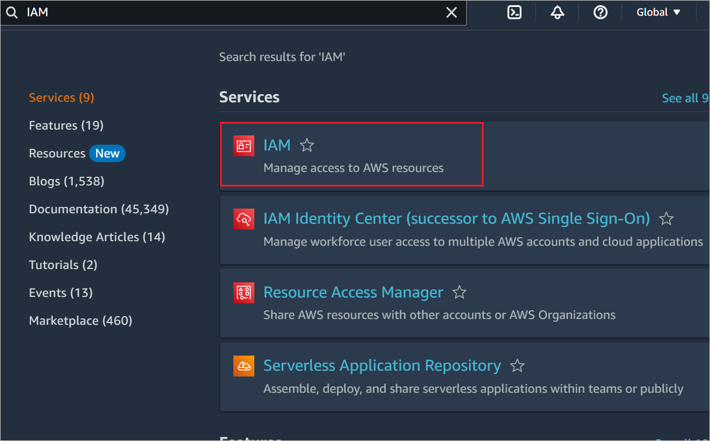

1. Go to **Access management** -> **Identity Providers** and click **Add provider** button.

    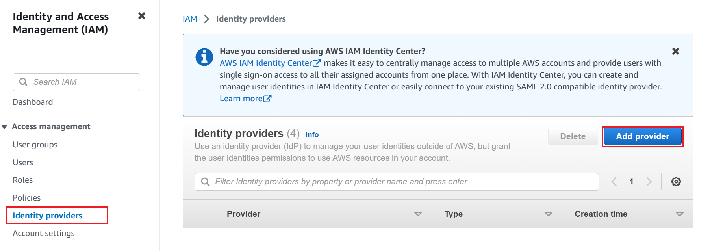

1. In the **Add an Identity provider** page, perform the following steps:

    

    a. For **Provider type**, select **SAML**.

    b. For **Provider name**, type a provider name (for example: *WAAD*).

    c. To upload your downloaded **metadata file**, select **Choose file**.

    d. Click **Add provider**.

1. Select **Roles** > **Create role**.

    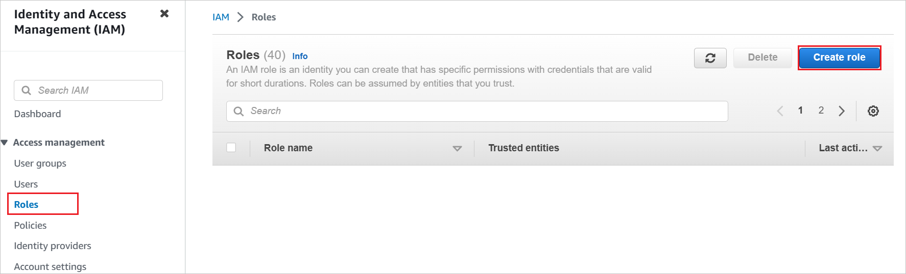

1. On the **Create role** page, perform the following steps:  

    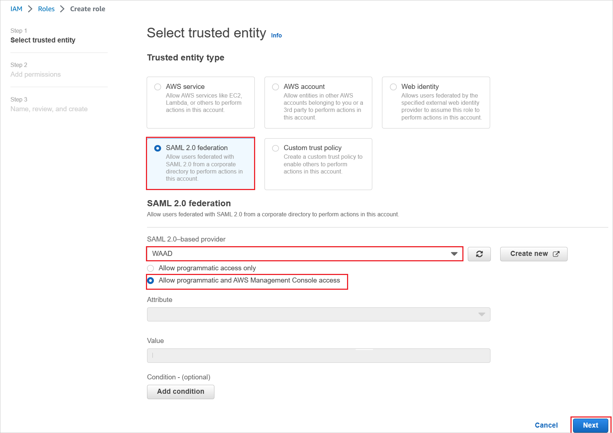


    a. Choose **Trusted entity type**, select **SAML 2.0 federation**.

    b. Under **SAML 2.0 based provider**, select the **SAML provider** you created previously (for example: *WAAD*).

    c. Select **Allow programmatic and AWS Management Console access**.
  
    d. Select **Next**.

1. On the **Permissions policies** dialog box, attach the appropriate policy, per your organization. Then select **Next**.  

    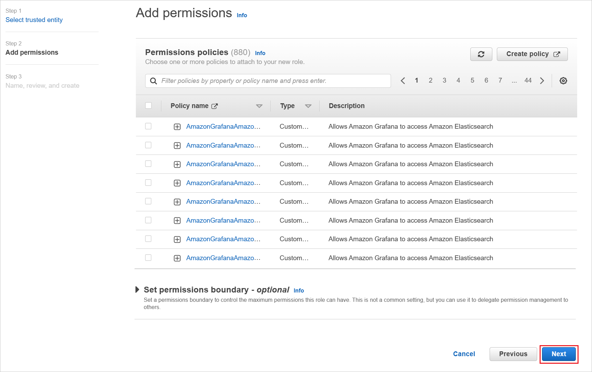

1. On the **Review** dialog box, perform the following steps:

    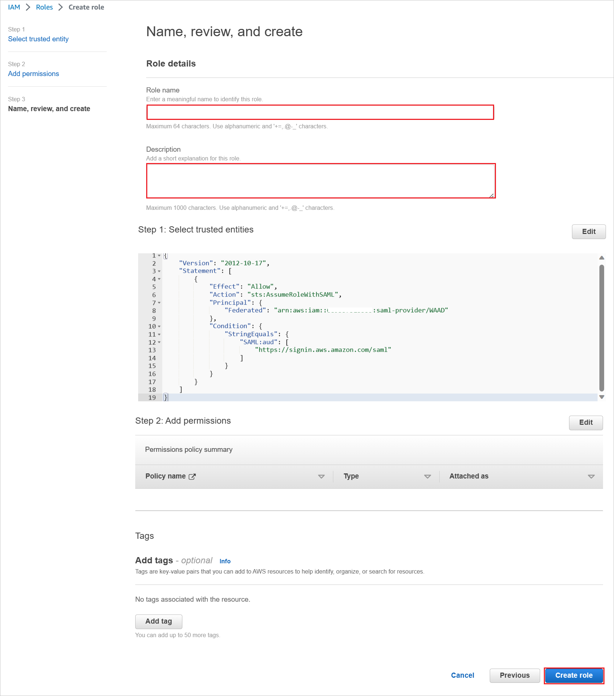

    a. In **Role name**, enter your role name.

    b. In **Description**, enter the role description.

    c. Select **Create role**.

    d. Create as many roles as needed and map them to the identity provider.

1. Use AWS service account credentials for fetching the roles from the AWS account in Microsoft Entra user provisioning. For this, open the AWS console home.

1. In the IAM section, select **Policies** and click **Create policy**.

    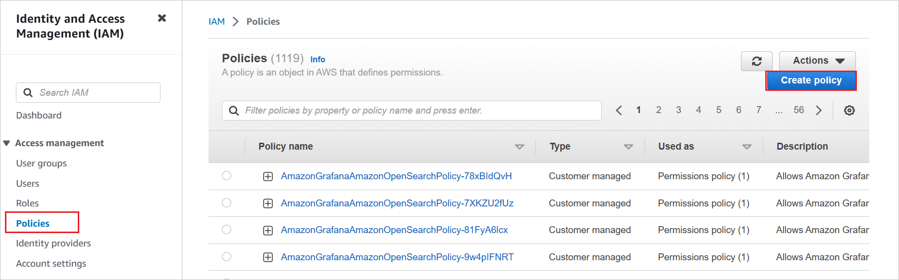

1. Create your own policy to fetch all the roles from AWS accounts.

    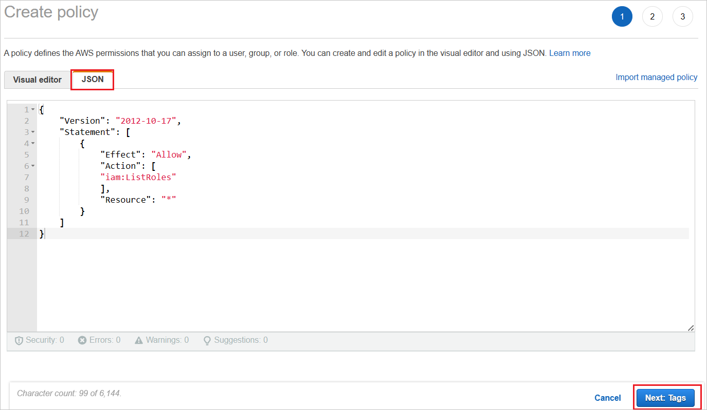

    a. In **Create policy**, select the **JSON** tab.

    b. In the policy document, add the following JSON:

    ```json
    {
        "Version": "2012-10-17",
        "Statement": [
            {
                "Effect": "Allow",
                "Action": [
                "iam:ListRoles"
                ],
                "Resource": "*"
            }
        ]
    }
    ```

    c. Click **Next: Tags**.

1. You can also add the required tags in the below page and click **Next: Review**.

    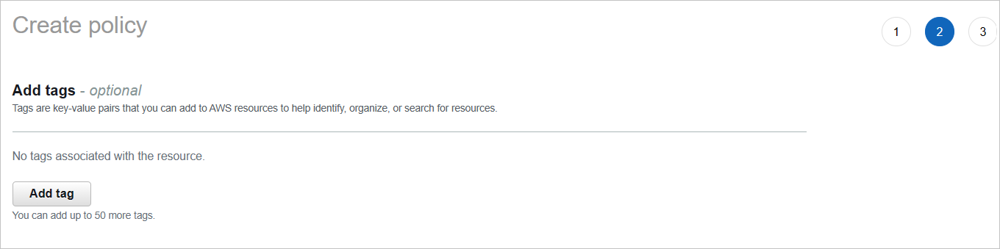

1. Define the new policy.

    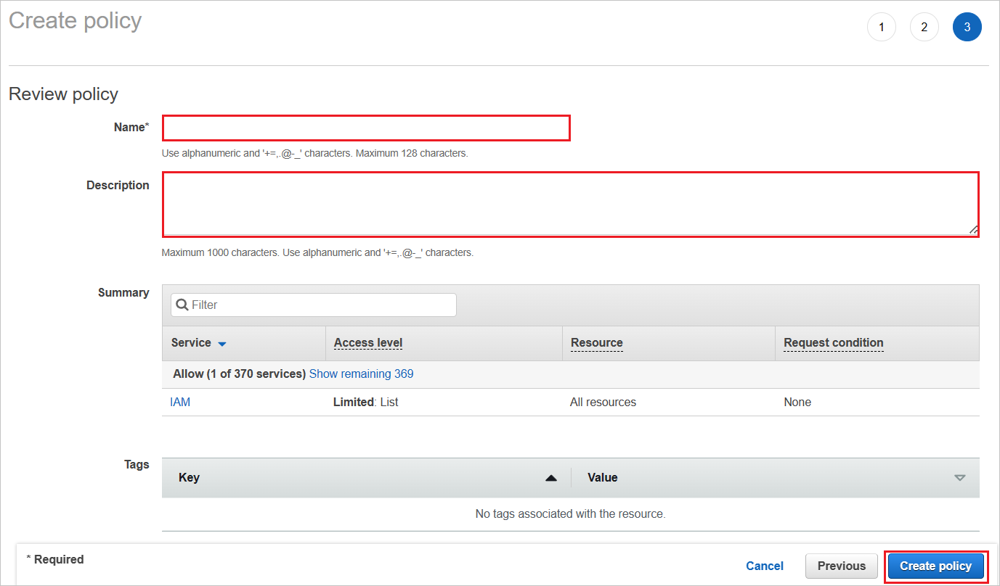

    a. For **Name**, enter **AzureAD_SSOUserRole_Policy**.

    b. For **Description**, enter **This policy will allow to fetch the roles from AWS accounts**.

    c. Select **Create policy**.

1. Create a new user account in the AWS IAM service.

    a. In the AWS IAM console, select **Users** and click **Add users**.

    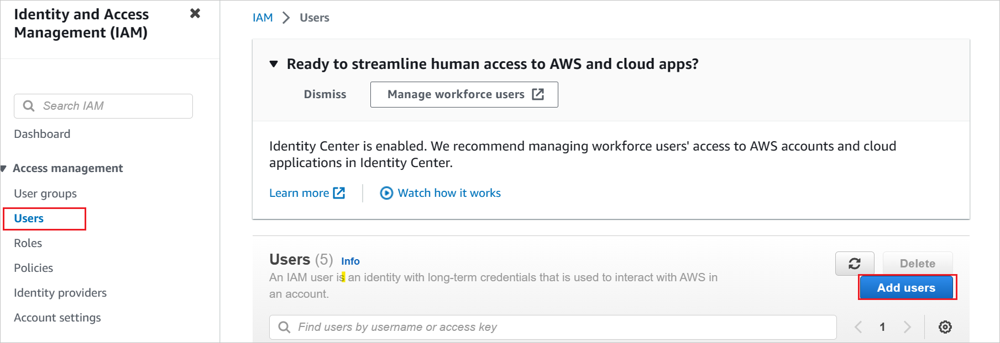

    b. In the **Specify user details** section, enter the user name as **AzureADRoleManager** and select **Next**.

    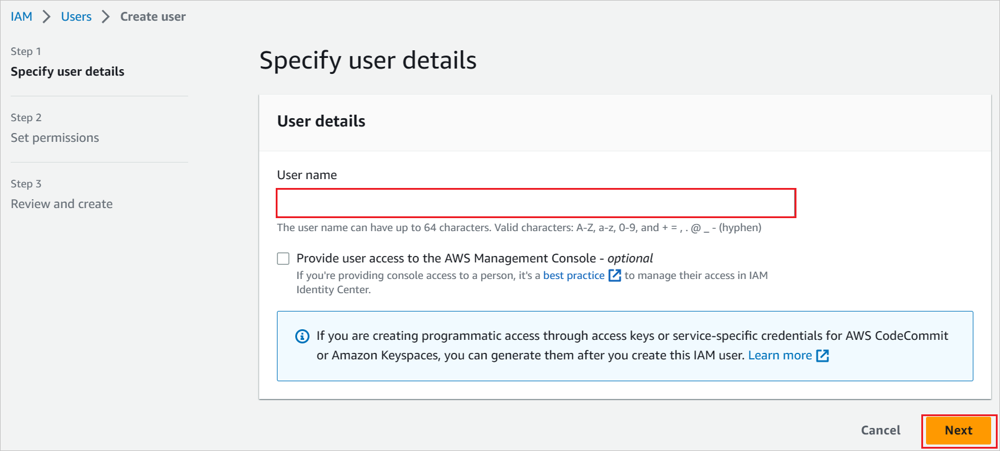

    c. Create a new policy for this user.

    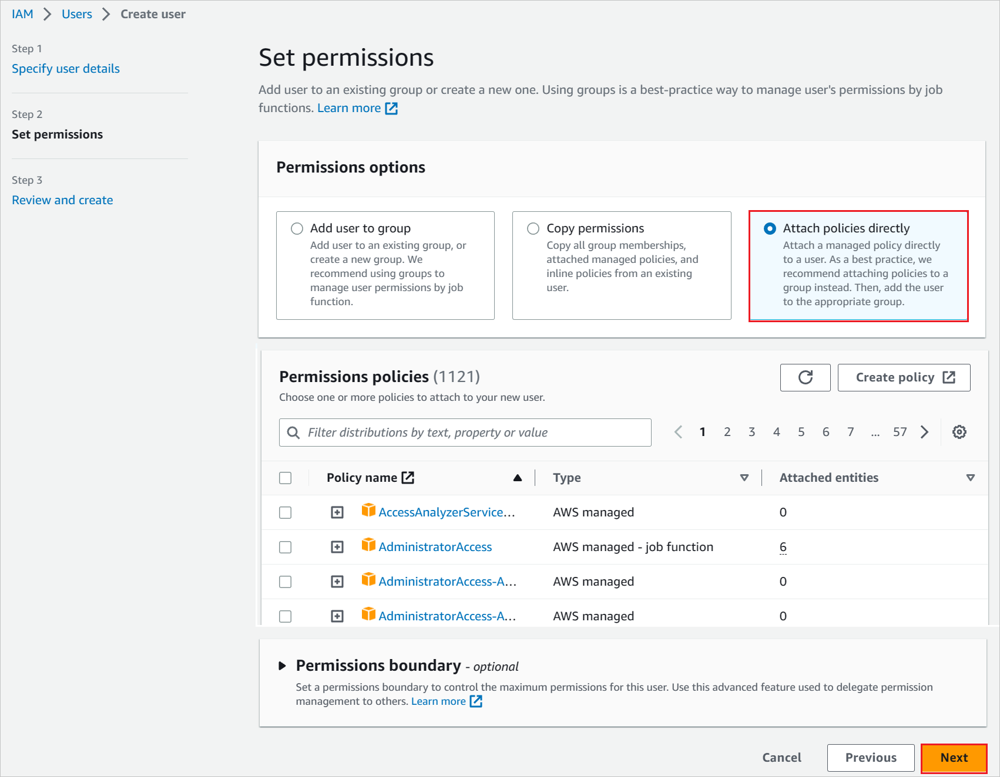

    d. Select **Attach existing policies directly**.

    e. Search for the newly created policy in the filter section **AzureAD_SSOUserRole_Policy**.

    f. Select the policy, and then select **Next**.

1. Review your choices and select **Create user**.

1. To download the user credentials of a user, enable the console access in **Security credentials** tab.

    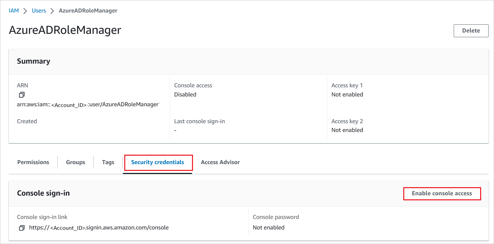

1. Enter these credentials into the Microsoft Entra user provisioning section to fetch the roles from the AWS console.

    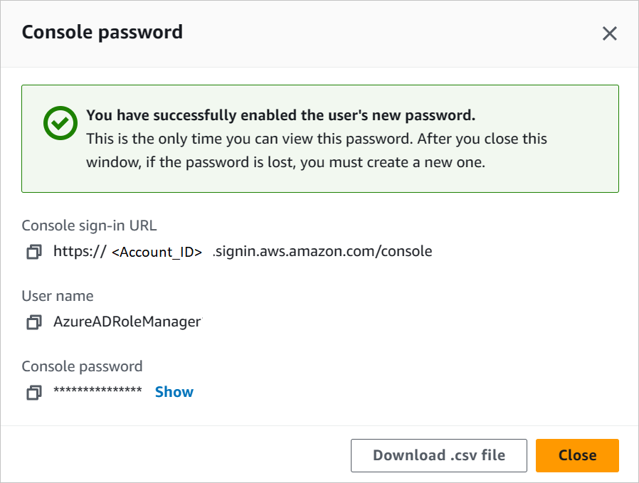


> [!NOTE]
> AWS has a set of permissions/limts are required to configure AWS SSO. To know more information on AWS limits, please refer [this](https://docs.aws.amazon.com/singlesignon/latest/userguide/limits.html) page.

### How to configure role provisioning in AWS Single-Account Access

1. In the Microsoft Entra management portal, in the AWS app, go to **Provisioning**.

    

2. Enter the access key and secret in the **clientsecret** and **Secret Token** fields, respectively.

    

    a. Enter the AWS user access key in the **clientsecret** field.

    b. Enter the AWS user secret in the **Secret Token** field.

    c. Select **Test Connection**.

    d. Save the setting by selecting **Save**.

3. In the **Settings** section, for **Provisioning Status**, select **On**. Then select **Save**.

    

> [!NOTE]
> The provisioning service imports roles only from AWS to Microsoft Entra ID. The service does not provision users and groups from Microsoft Entra ID to AWS.

> [!NOTE]
> After you save the provisioning credentials, you must wait for the initial sync cycle to run. Sync usually takes around 40 minutes to finish. You can see the status at the bottom of the **Provisioning** page, under **Current Status**.

### Create AWS Single-Account Access test user

The objective of this section is to create a user called B.Simon in AWS Single-Account Access. AWS Single-Account Access doesn't need a user to be created in their system for SSO, so you don't need to perform any action here.

## Test SSO

In this section, you test your Microsoft Entra single sign-on configuration with following options. 

#### SP initiated:

* Click on **Test this application**, this will redirect to AWS Single-Account Access Sign on URL where you can initiate the login flow.  

* Go to AWS Single-Account Access Sign-on URL directly and initiate the login flow from there.

#### IDP initiated:

* Click on **Test this application**, and you should be automatically signed in to the AWS Single-Account Access for which you set up the SSO. 

You can also use Microsoft My Apps to test the application in any mode. When you click the AWS Single-Account Access tile in the My Apps, if configured in SP mode you would be redirected to the application sign on page for initiating the login flow and if configured in IDP mode, you should be automatically signed in to the AWS Single-Account Access for which you set up the SSO. For more information about the My Apps, see [Introduction to the My Apps](https://support.microsoft.com/account-billing/sign-in-and-start-apps-from-the-my-apps-portal-2f3b1bae-0e5a-4a86-a33e-876fbd2a4510).

## Known issues

* AWS Single-Account Access provisioning integration cannot be used in the AWS China regions.
 
* In the **Provisioning** section, the **Mappings** subsection shows a "Loading..." message, and never displays the attribute mappings. The only provisioning workflow supported today is the import of roles from AWS into Microsoft Entra ID for selection during a user or group assignment. The attribute mappings for this are predetermined, and aren't configurable.

* The **Provisioning** section only supports entering one set of credentials for one AWS tenant at a time. All imported roles are written to the `appRoles` property of the Microsoft Entra ID [`servicePrincipal` object](/graph/api/resources/serviceprincipal) for the AWS tenant.

  Multiple AWS tenants (represented by `servicePrincipals`) can be added to Microsoft Entra ID from the gallery for provisioning. There's a known issue, however, with not being able to automatically write all of the imported roles from the multiple AWS `servicePrincipals` used for provisioning into the single `servicePrincipal` used for SSO.

  As a workaround, you can use the [Microsoft Graph API](/graph/api/resources/serviceprincipal) to extract all of the `appRoles` imported into each AWS `servicePrincipal` where provisioning is configured. You can subsequently add these role strings to the AWS `servicePrincipal` where SSO is configured.

* Roles must meet the following requirements to be eligible to be imported from AWS into Microsoft Entra ID:

  * Roles must have exactly one saml-provider defined in AWS
  * The combined length of the ARN(Amazon Resource Name) for the role and the ARN for the associated saml-provider must be less than 240 characters.

## Change log

* 01/12/2020 - Increased role length limit from 119 characters to 239 characters.

## Next steps

Once you configure AWS Single-Account Access you can enforce Session Control, which protects exfiltration and infiltration of your organization's sensitive data in real time. Session Control extends from Conditional Access. [Learn how to enforce session control with Microsoft Defender for Cloud Apps](/cloud-app-security/proxy-deployment-aad).

[11]: ./media/amazon-web-service-tutorial/ic795031.png
[12]: ./media/amazon-web-service-tutorial/ic795032.png
[13]: ./media/amazon-web-service-tutorial/ic795033.png
[14]: ./media/amazon-web-service-tutorial/ic795034.png
[15]: ./media/amazon-web-service-tutorial/ic795035.png
[16]: ./media/amazon-web-service-tutorial/ic795022.png
[17]: ./media/amazon-web-service-tutorial/ic795023.png
[18]: ./media/amazon-web-service-tutorial/ic795024.png
[19]: ./media/amazon-web-service-tutorial/ic795025.png
[32]: ./media/amazon-web-service-tutorial/ic7950251.png
[33]: ./media/amazon-web-service-tutorial/ic7950252.png
[35]: ./media/amazon-web-service-tutorial/tutorial_amazonwebservices_provisioning.png
[34]: ./media/amazon-web-service-tutorial/ic7950253.png
[36]: ./media/amazon-web-service-tutorial/tutorial_amazonwebservices_securitycredentials.png
[37]: ./media/amazon-web-service-tutorial/tutorial_amazonwebservices_securitycredentials_continue.png
[38]: ./media/amazon-web-service-tutorial/tutorial_amazonwebservices_createnewaccesskey.png
[39]: ./media/amazon-web-service-tutorial/tutorial_amazonwebservices_provisioning_automatic.png
[40]: ./media/amazon-web-service-tutorial/tutorial_amazonwebservices_provisioning_testconnection.png
[41]: ./media/amazon-web-service-tutorial/tutorial_amazonwebservices_provisioning_on.png
