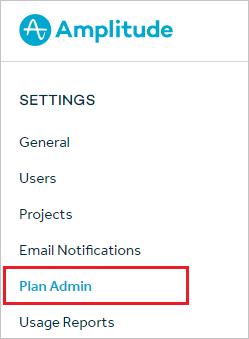
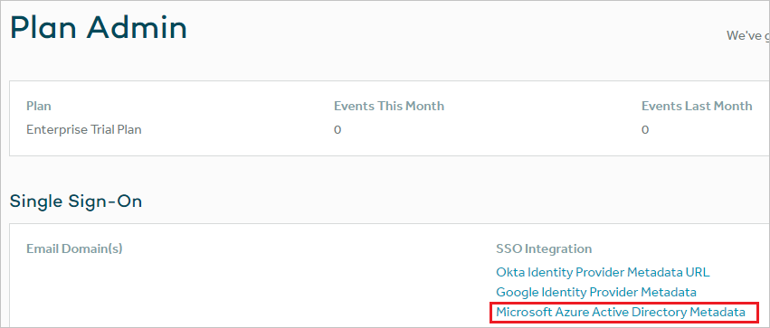
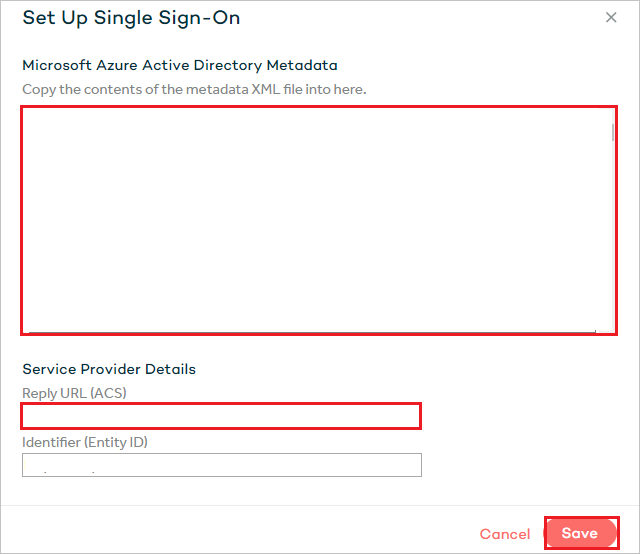

# Tutorial: Azure Active Directory single sign-on (SSO) integration with Amplitude

In this tutorial, you'll learn how to integrate Amplitude with Azure Active Directory (Azure AD). When you integrate Amplitude with Azure AD, you can:

* Control in Azure AD who has access to Amplitude.
* Enable your users to be automatically signed-in to Amplitude with their Azure AD accounts.
* Manage your accounts in one central location - the Azure portal.

## Prerequisites

To get started, you need the following items:

* An Azure AD subscription. If you don't have a subscription, you can get a [free account](https://azure.microsoft.com/free/).
* Amplitude single sign-on (SSO) enabled subscription.

## Scenario description

In this tutorial, you configure and test Azure AD SSO in a test environment.

* Amplitude supports **SP and IDP** initiated SSO.
* Amplitude supports **Just In Time** user provisioning.

> [!NOTE]
> Identifier of this application is a fixed string value so only one instance can be configured in one tenant.

## Add Amplitude from the gallery

To configure the integration of Amplitude into Azure AD, you need to add Amplitude from the gallery to your list of managed SaaS apps.

1. Sign in to the Azure portal using either a work or school account, or a personal Microsoft account.
1. On the left navigation pane, select the **Azure Active Directory** service.
1. Navigate to **Enterprise Applications** and then select **All Applications**.
1. To add new application, select **New application**.
1. In the **Add from the gallery** section, type **Amplitude** in the search box.
1. Select **Amplitude** from results panel and then add the app. Wait a few seconds while the app is added to your tenant.

## Configure and test Azure AD SSO for Amplitude

Configure and test Azure AD SSO with Amplitude using a test user called **B.Simon**. For SSO to work, you need to establish a link relationship between an Azure AD user and the related user in Amplitude.

To configure and test Azure AD SSO with Amplitude, perform the following steps:

1. **[Configure Azure AD SSO](#configure-azure-ad-sso)** - to enable your users to use this feature.
    1. **[Create an Azure AD test user](#create-an-azure-ad-test-user)** - to test Azure AD single sign-on with B.Simon.
    1. **[Assign the Azure AD test user](#assign-the-azure-ad-test-user)** - to enable B.Simon to use Azure AD single sign-on.
1. **[Configure Amplitude SSO](#configure-amplitude-sso)** - to configure the single sign-on settings on application side.
    1. **[Create Amplitude test user](#create-amplitude-test-user)** - to have a counterpart of B.Simon in Amplitude that is linked to the Azure AD representation of user.
1. **[Test SSO](#test-sso)** - to verify whether the configuration works.

## Configure Azure AD SSO

Follow these steps to enable Azure AD SSO in the Azure portal.

1. In the Azure portal, on the **Amplitude** application integration page, find the **Manage** section and select **single sign-on**.
1. On the **Select a single sign-on method** page, select **SAML**.
1. On the **Set up single sign-on with SAML** page, click the pencil icon for **Basic SAML Configuration** to edit the settings.

   

1. On the **Basic SAML Configuration** section, if you wish to configure the application in **IDP** initiated mode, perform the following steps:

    a. In the **Identifier** text box, type the URL:
    `https://amplitude.com/saml/sso/metadata`

    b. In the **Reply URL** text box, type a URL using the following pattern:
    `https://analytics.amplitude.com/saml/sso/<UNIQUE_ID>`

    > [!NOTE]
	> The Reply URL value is not real. You will get the Reply URL value later in this tutorial.

1. Click **Set additional URLs** and perform the following step if you wish to configure the application in **SP** initiated mode:

    In the **Sign-on URL** text box, type the URL:
    `https://analytics.amplitude.com/sso`

1. On the **Set up single sign-on with SAML** page, in the **SAML Signing Certificate** section,  find **Federation Metadata XML** and select **Download** to download the certificate and save it on your computer.

	

1. On the **Set up Amplitude** section, copy the appropriate URL(s) based on your requirement.

	

### Create an Azure AD test user

In this section, you'll create a test user in the Azure portal called B.Simon.

1. From the left pane in the Azure portal, select **Azure Active Directory**, select **Users**, and then select **All users**.
1. Select **New user** at the top of the screen.
1. In the **User** properties, follow these steps:
   1. In the **Name** field, enter `B.Simon`.  
   1. In the **User name** field, enter the username@companydomain.extension. For example, `B.Simon@contoso.com`.
   1. Select the **Show password** check box, and then write down the value that's displayed in the **Password** box.
   1. Click **Create**.

### Assign the Azure AD test user

In this section, you'll enable B.Simon to use Azure single sign-on by granting access to Amplitude.

1. In the Azure portal, select **Enterprise Applications**, and then select **All applications**.
1. In the applications list, select **Amplitude**.
1. In the app's overview page, find the **Manage** section and select **Users and groups**.
1. Select **Add user**, then select **Users and groups** in the **Add Assignment** dialog.
1. In the **Users and groups** dialog, select **B.Simon** from the Users list, then click the **Select** button at the bottom of the screen.
1. If you're expecting any role value in the SAML assertion, in the **Select Role** dialog, select the appropriate role for the user from the list and then click the **Select** button at the bottom of the screen.
1. In the **Add Assignment** dialog, click the **Assign** button.

## Configure Amplitude SSO

1. To automate the configuration within Amplitude, you need to install **My Apps Secure Sign-in browser extension** by clicking **Install the extension**.

	

1. After adding extension to the browser, click on **Set up Amplitude** will direct you to the Amplitude application. From there, provide the admin credentials to sign into Amplitude. The browser extension will automatically configure the application for you and automate steps 3-6.

	

1. If you want to setup Amplitude manually, open a new web browser window and sign into your Amplitude company site as an administrator and perform the following steps:

1. Click on the **Plan Admin** from the left navigation bar.

	

1. Select **Microsoft Azure Active Directory Metadata** from the **SSO Integration**.

	

1. On the **Set Up Single Sign-On** section, perform the following steps:

	

	a. Open the downloaded **Metadata Xml** from Azure portal in notepad, paste the content into the **Microsoft Azure Active Directory Metadata** textbox.

	b. Copy the **Reply URL (ACS)** value and paste it into the **Reply URL** textbox of **Basic SAML Configuration** in the Azure portal.

	c. Click **Save**

### Create Amplitude test user

In this section, a user called B.Simon is created in Amplitude. Amplitude supports just-in-time user provisioning, which is enabled by default. There is no action item for you in this section. If a user doesn't already exist in Amplitude, a new one is created after authentication.

> [!Note]
> If you need to create a user manually, contact [Amplitude support team](https://amplitude.zendesk.com).

## Test SSO

In this section, you test your Azure AD single sign-on configuration with following options. 

#### SP initiated:

* Click on **Test this application** in Azure portal. This will redirect to Amplitude Sign on URL where you can initiate the login flow.  

* Go to Amplitude Sign-on URL directly and initiate the login flow from there.

#### IDP initiated:

* Click on **Test this application** in Azure portal and you should be automatically signed in to the Amplitude for which you set up the SSO. 

You can also use Microsoft My Apps to test the application in any mode. When you click the Amplitude tile in the My Apps, if configured in SP mode you would be redirected to the application sign on page for initiating the login flow and if configured in IDP mode, you should be automatically signed in to the Amplitude for which you set up the SSO. For more information about the My Apps, see [Introduction to the My Apps](../user-help/my-apps-portal-end-user-access.md).

## Next steps

Once you configure Amplitude you can enforce session control, which protects exfiltration and infiltration of your organization’s sensitive data in real time. Session control extends from Conditional Access. [Learn how to enforce session control with Microsoft Cloud App Security](/cloud-app-security/proxy-deployment-aad).
