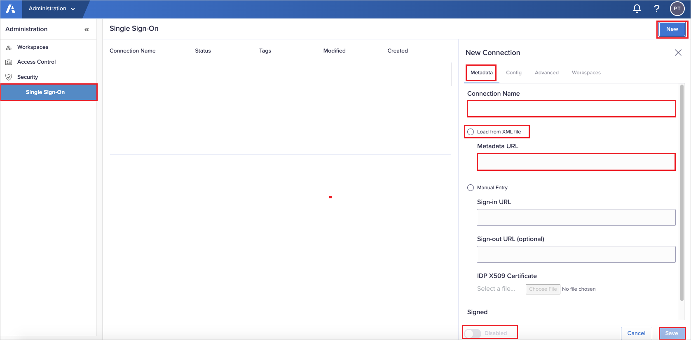
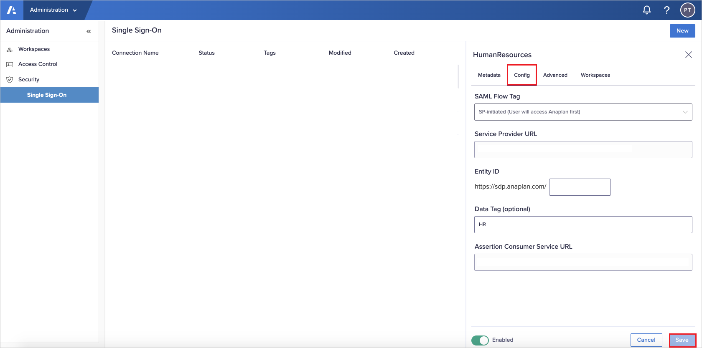
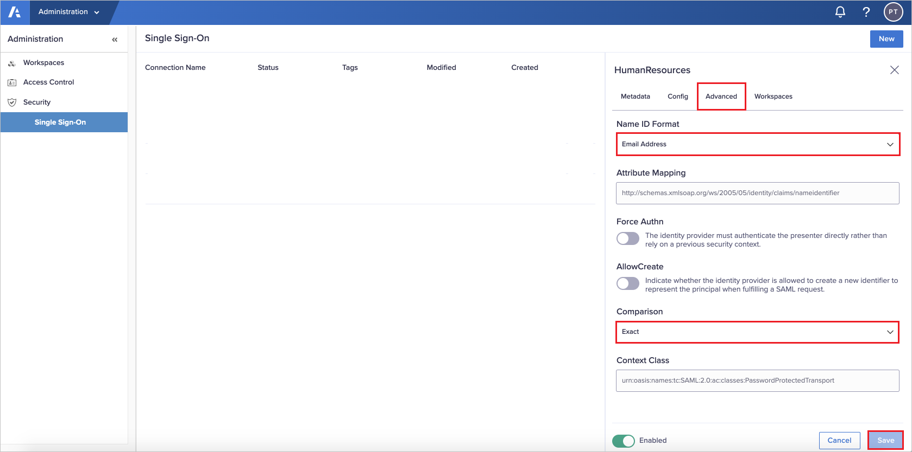

# Tutorial: Azure AD SSO integration with Anaplan

In this tutorial, you'll learn how to integrate Anaplan with Azure Active Directory (Azure AD). When you integrate Anaplan with Azure AD, you can:

* Control in Azure AD who has access to Anaplan.
* Enable your users to be automatically signed-in to Anaplan with their Azure AD accounts.
* Manage your accounts in one central location - the Azure portal.

## Prerequisites

To get started, you need the following items:

* An Azure AD subscription. If you don't have a subscription, you can get a [free account](https://azure.microsoft.com/free/).
* Anaplan single sign-on (SSO) enabled subscription.

## Scenario description

In this tutorial, you configure and test Azure AD single sign-on in a test environment.

* Anaplan supports **SP** initiated SSO.

## Add Anaplan from the gallery

To configure the integration of Anaplan into Azure AD, you need to add Anaplan from the gallery to your list of managed SaaS apps.

1. Sign in to the Azure portal using either a work or school account, or a personal Microsoft account.
1. On the left navigation pane, select the **Azure Active Directory** service.
1. Navigate to **Enterprise Applications** and then select **All Applications**.
1. To add new application, select **New application**.
1. In the **Add from the gallery** section, type **Anaplan** in the search box.
1. Select **Anaplan** from results panel and then add the app. Wait a few seconds while the app is added to your tenant.

 Alternatively, you can also use the [Enterprise App Configuration Wizard](https://portal.office.com/AdminPortal/home?Q=Docs#/azureadappintegration). In this wizard, you can add an application to your tenant, add users/groups to the app, assign roles, as well as walk through the SSO configuration as well. [Learn more about Microsoft 365 wizards.](/microsoft-365/admin/misc/azure-ad-setup-guides)

## Configure and test Azure AD SSO for Anaplan

Configure and test Azure AD SSO with Anaplan using a test user called **B.Simon**. For SSO to work, you need to establish a link relationship between an Azure AD user and the related user in Anaplan.

To configure and test Azure AD SSO with Anaplan, perform the following steps:

1. **[Configure Azure AD SSO](#configure-azure-ad-sso)** - to enable your users to use this feature.
    1. **[Create an Azure AD test user](#create-an-azure-ad-test-user)** - to test Azure AD single sign-on with B.Simon.
    1. **[Assign the Azure AD test user](#assign-the-azure-ad-test-user)** - to enable B.Simon to use Azure AD single sign-on.
1. **[Configure Anaplan SSO](#configure-anaplan-sso)** - to configure the single sign-on settings on application side.
    1. **[Create Anaplan test user](#create-anaplan-test-user)** - to have a counterpart of B.Simon in Anaplan that is linked to the Azure AD representation of user.
1. **[Test SSO](#test-sso)** - to verify whether the configuration works.

## Configure Azure AD SSO

Follow these steps to enable Azure AD SSO in the Azure portal.

1. In the Azure portal, on the **Anaplan** application integration page, find the **Manage** section and select **single sign-on**.
1. On the **Select a single sign-on method** page, select **SAML**.
1. On the **Set up single sign-on with SAML** page, click the pencil icon for **Basic SAML Configuration** to edit the settings.

   

4. On the **Basic SAML Configuration** section, perform the following steps:

    a. In the **Sign on URL** text box, type a URL using the following pattern:
    `https://sdp.anaplan.com/frontdoor/saml/<tenant name>`

    b. In the **Identifier (Entity ID)** text box, type a URL using the following pattern:
    `https://<subdomain>.anaplan.com`

    > [!NOTE]
    > These values are not real. Update these values with the actual Sign on URL and Identifier. Contact [Anaplan Client support team](mailto:support@anaplan.com) to get these values. You can also refer to the patterns shown in the **Basic SAML Configuration** section in the Azure portal.

5. On the **Set up Single Sign-On with SAML** page, in the **SAML Signing Certificate** section, click **Download** to download the **Federation Metadata XML** from the given options as per your requirement and save it on your computer.

    

6. On the **Set up Anaplan** section, copy the appropriate URL(s) as per your requirement.

    

### Create an Azure AD test user 

In this section, you'll create a test user in the Azure portal called B.Simon.

1. From the left pane in the Azure portal, select **Azure Active Directory**, select **Users**, and then select **All users**.
1. Select **New user** at the top of the screen.
1. In the **User** properties, follow these steps:
   1. In the **Name** field, enter `B.Simon`.  
   1. In the **User name** field, enter the username@companydomain.extension. For example, `B.Simon@contoso.com`.
   1. Select the **Show password** check box, and then write down the value that's displayed in the **Password** box.
   1. Click **Create**.

### Assign the Azure AD test user

In this section, you'll enable B.Simon to use Azure single sign-on by granting access to Anaplan.

1. In the Azure portal, select **Enterprise Applications**, and then select **All applications**.
1. In the applications list, select **Anaplan**.
1. In the app's overview page, find the **Manage** section and select **Users and groups**.
1. Select **Add user**, then select **Users and groups** in the **Add Assignment** dialog.
1. In the **Users and groups** dialog, select **B.Simon** from the Users list, then click the **Select** button at the bottom of the screen.
1. If you are expecting a role to be assigned to the users, you can select it from the **Select a role** dropdown. If no role has been set up for this app, you see "Default Access" role selected.
1. In the **Add Assignment** dialog, click the **Assign** button.

## Configure Anaplan SSO

1. Login to Anaplan website as an administrator.

1. In Administration page, navigate to **Security > Single Sign-On**.

1. Click **New**.

1. Perform the following steps in the **Metadata** tab:

    

    a. Enter a **Connection Name**, should match the name of your connection in the identity provider interface.

    b. Select **Load from XML file** and enter the URL of the metadata XML file with your configuration information in the **Metadata URL** textbox.

    C. Enabled the **Signed** toggle.

    d. Click **Save** to create the connection.

1. When you upload a **metadata XML** file in the **Metadata** tab, the values in **Config** tab pre-populate with the information from that upload. You can skip this tab in your connection setup and click **Save**.

    

1. Perform the following steps in the **Advanced** tab:

    

    a. Select **Name ID Format** as Email Address from the dropdown and keep the remaining values as default.

    b. Click **Save**.

1. In the **Workspaces** tab, specify the workspaces that will use the identity provider from the dropdown and Click **Save**. 

    

    > [!NOTE]
    > Workspace connections are unique. If you have another connection already configured with a workspace, you cannot associate that workspace with a new connection.
To access the original connection and update it, remove the workspace from the connection and then reassociate it with the new connection.

### Create Anaplan test user

In this section, you create a user called Britta Simon in Anaplan. Work with [Anaplan support team](mailto:support@anaplan.com) to add the users in the Anaplan platform. Users must be created and activated before you use single sign-on.

## Test SSO

In this section, you test your Azure AD single sign-on configuration with following options. 

* Click on **Test this application** in Azure portal. This will redirect to Anaplan Sign-on URL where you can initiate the login flow. 

* Go to Anaplan Sign-on URL directly and initiate the login flow from there.

* You can use Microsoft My Apps. When you click the Anaplan tile in the My Apps, this will redirect to Anaplan Sign-on URL. For more information about the My Apps, see [Introduction to the My Apps](https://support.microsoft.com/account-billing/sign-in-and-start-apps-from-the-my-apps-portal-2f3b1bae-0e5a-4a86-a33e-876fbd2a4510).

## Next steps

Once you configure Anaplan you can enforce session control, which protects exfiltration and infiltration of your organization’s sensitive data in real time. Session control extends from Conditional Access. [Learn how to enforce session control with Microsoft Defender for Cloud Apps](/cloud-app-security/proxy-deployment-any-app).
