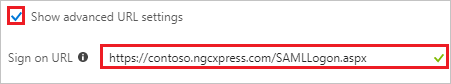
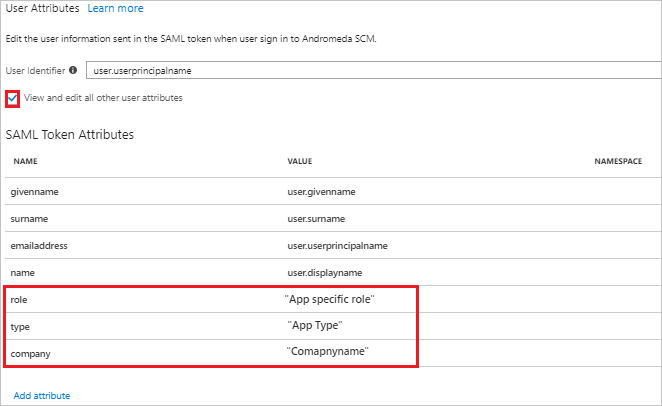
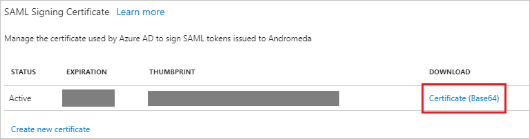

# Tutorial: Azure Active Directory integration with Andromeda

In this tutorial, you learn how to integrate Andromeda with Azure Active Directory (Azure AD).

Integrating Andromeda with Azure AD provides you with the following benefits:

- You can control in Azure AD who has access to Andromeda.
- You can enable your users to automatically get signed-on to Andromeda (Single Sign-On) with their Azure AD accounts.
- You can manage your accounts in one central location - the Azure portal.

If you want to know more details about SaaS app integration with Azure AD, see [what is application access and single sign-on with Azure Active Directory](../manage-apps/what-is-single-sign-on.md).

## Prerequisites

To configure Azure AD integration with Andromeda, you need the following items:

- An Azure AD subscription
- An Andromeda single sign-on enabled subscription

> [!NOTE]
> To test the steps in this tutorial, we do not recommend using a production environment.

To test the steps in this tutorial, you should follow these recommendations:

- Do not use your production environment, unless it is necessary.
- If you don't have an Azure AD trial environment, you can [get a one-month trial](https://azure.microsoft.com/pricing/free-trial/).

## Scenario description
In this tutorial, you test Azure AD single sign-on in a test environment. 
The scenario outlined in this tutorial consists of two main building blocks:

1. Adding Andromeda from the gallery
2. Configuring and testing Azure AD single sign-on

## Adding Andromeda from the gallery
To configure the integration of Andromeda into Azure AD, you need to add Andromeda from the gallery to your list of managed SaaS apps.

**To add Andromeda from the gallery, perform the following steps:**

1. In the **[Azure portal](https://portal.azure.com)**, on the left navigation panel, click **Azure Active Directory** icon. 

	![The Azure Active Directory button][1]

2. Navigate to **Enterprise applications**. Then go to **All applications**.

	![The Enterprise applications blade][2]
	
3. To add new application, click **New application** button on the top of dialog.

	![The New application button][3]

4. In the search box, type **Andromeda**, select **Andromeda** from result panel then click **Add** button to add the application.

	

## Configure and test Azure AD single sign-on

In this section, you configure and test Azure AD single sign-on with Andromeda based on a test user called "Britta Simon".

For single sign-on to work, Azure AD needs to know what the counterpart user in Andromeda is to a user in Azure AD. In other words, a link relationship between an Azure AD user and the related user in Andromeda needs to be established.

To configure and test Azure AD single sign-on with Andromeda, you need to complete the following building blocks:

1. **[Configure Azure AD Single Sign-On](#configure-azure-ad-single-sign-on)** - to enable your users to use this feature.
2. **[Create an Azure AD test user](#create-an-azure-ad-test-user)** - to test Azure AD single sign-on with Britta Simon.
3. **[Create an Andromeda test user](#create-an-andromeda-test-user)** - to have a counterpart of Britta Simon in Andromeda that is linked to the Azure AD representation of user.
4. **[Assign the Azure AD test user](#assign-the-azure-ad-test-user)** - to enable Britta Simon to use Azure AD single sign-on.
5. **[Test single sign-on](#test-single-sign-on)** - to verify whether the configuration works.

### Configure Azure AD single sign-on

In this section, you enable Azure AD single sign-on in the Azure portal and configure single sign-on in your Andromeda application.

**To configure Azure AD single sign-on with Andromeda, perform the following steps:**

1. In the Azure portal, on the **Andromeda** application integration page, click **Single sign-on**.

	![Configure single sign-on link][4]

2. On the **Single sign-on** dialog, select **Mode** as	**SAML-based Sign-on** to enable single sign-on.
 
	

3. On the **Andromeda Domain and URLs** section, perform the following steps if you wish to configure the application in **IDP** initiated mode:

    

    a. In the **Identifier** textbox, type a URL using the following pattern: `https://<tenantURL>.ngcxpress.com/`

	b. In the **Reply URL** textbox, type a URL using the following pattern: `https://<tenantURL>.ngcxpress.com/SAMLConsumer.aspx`

4. Check **Show advanced URL settings** and perform the following step if you wish to configure the application in **SP** initiated mode:

    

    In the **Sign-on URL** textbox, type a URL using the following pattern: `https://<tenantURL>.ngcxpress.com/SAMLLogon.aspx`
	 
	> [!NOTE] 
	> The preceding value is not real value. You will update the value with the actual Identifier, Reply URL, and Sign-On URL which is explained later in the tutorial.

5. Andromeda application expects the SAML assertions in a specific format. Configure the following claims for this application. You can manage the values of these attributes from the **User Attributes** section on application integration page. The following screenshot shows an example for this.
    
	

	> [!Important]
	> Clear out the NameSpace definitions while setting these up.
	
6. In the **User Attributes** section on the **Single sign-on** dialog, configure SAML token attribute as shown in the image and perform the following steps:
	
	| Attribute Name | Attribute Value |
	| -------------- | -------------------- |    
	| role 		  | App specific role |
	| type 		  | App Type |
	| company       | CompanyName    |

	> [!NOTE]
	> There are not real values. These values are only for demo purpose, please use your organization roles.

	a. Click **Add attribute** to open the **Add Attribute** dialog.

	

	

	b. In the **Name** textbox, type the attribute name shown for that row.

	c. From the **Value** list, type the attribute value shown for that row.

	d. Leave the **Namespace** blank.
	
	e. Click **Ok**.

7. On the **SAML Signing Certificate** section, click **Certificate (Base64)** and then save the certificate file on your computer.

	 

8. Click **Save** button.

	
	
9. On the **Andromeda Configuration** section, click **Configure Andromeda** to open **Configure sign-on** window. Copy the **SAML Single Sign-On Service URL** from the **Quick Reference section.**

	

10. Sign-on to your Andromeda company site as administrator.

11. On the top of the menubar click **Admin** and navigate to **Administration**.

	

12. On the left side of tool bar under **Interfaces** section, click **SAML Configuration**.

	

13. On the **SAML Configuration** section page, perform the following steps:

	

	a. Check **Enable SSO with SAML**.

	b. Under **Andromeda Information** section, copy the **SP Identity** value and paste it into the **Identifier** textbox of **Andromeda Domain and URLs** section.

	c. Copy the **Consumer URL** value and paste it into the **Reply URL** textbox of **Andromeda Domain and URLs** section.

	d. Copy the **Logon URL** value and paste it into the **Sign-on URL** textbox of **Andromeda Domain and URLs** section.

	e. Under **SAML Identity Provider** section, type your IDP Name.

	f. In the **Single Sign On End Point** textbox, paste the value of **SAML Single Sign-On Service URL** which, you have copied from the Azure portal.

	g. Open the downloaded **Base64 encoded certificate** from Azure portal in notepad, paste it into the **X 509 Certificate** textbox.
	
	h. Map the following attributes with the respective value to facilitate SSO login from Azure AD. The **User ID** attribute is required for logging in. For provisioning, **Email**, **Company**, **UserType**, and **Role** are required. In this section, we define attributes mapping (name and values) which correlate to those defined within Azure portal

	

	i. Click **Save**.

> [!TIP]
> You can now read a concise version of these instructions inside the [Azure portal](https://portal.azure.com), while you are setting up the app!  After adding this app from the **Active Directory > Enterprise Applications** section, simply click the **Single Sign-On** tab and access the embedded documentation through the **Configuration** section at the bottom. You can read more about the embedded documentation feature here: [Azure AD embedded documentation]( https://go.microsoft.com/fwlink/?linkid=845985)

### Create an Azure AD test user

The objective of this section is to create a test user in the Azure portal called Britta Simon.

   ![Create an Azure AD test user][100]

**To create a test user in Azure AD, perform the following steps:**

1. In the Azure portal, in the left pane, click the **Azure Active Directory** button.

    

2. To display the list of users, go to **Users and groups**, and then click **All users**.

    

3. To open the **User** dialog box, click **Add** at the top of the **All Users** dialog box.

    

4. In the **User** dialog box, perform the following steps:

    

    a. In the **Name** box, type **BrittaSimon**.

    b. In the **User name** box, type the email address of user Britta Simon.

    c. Select the **Show Password** check box, and then write down the value that's displayed in the **Password** box.

    d. Click **Create**.
 
### Create an Andromeda test user

The objective of this section is to create a user called Britta Simon in Andromeda. Andromeda supports just-in-time provisioning, which is by default enabled. There is no action item for you in this section. A new user is created during an attempt to access Andromeda if it doesn't exist yet.

>[!Note]
>If you need to create a user manually, contact [Andromeda Client support team](https://www.ngcsoftware.com/support/).

### Assign the Azure AD test user

In this section, you enable Britta Simon to use Azure single sign-on by granting access to Andromeda.

![Assign the user role][200] 

**To assign Britta Simon to Andromeda, perform the following steps:**

1. In the Azure portal, open the applications view, and then navigate to the directory view and go to **Enterprise applications** then click **All applications**.

	![Assign User][201] 

2. In the applications list, select **Andromeda**.

	  

3. In the menu on the left, click **Users and groups**.

	![The "Users and groups" link][202]

4. Click **Add** button. Then select **Users and groups** on **Add Assignment** dialog.

	![The Add Assignment pane][203]

5. On **Users and groups** dialog, select **Britta Simon** in the Users list.

6. Click **Select** button on **Users and groups** dialog.

7. Click **Assign** button on **Add Assignment** dialog.
	
### Test single sign-on

In this section, you test your Azure AD single sign-on configuration using the Access Panel.

When you click the Andromeda tile in the Access Panel, you should get automatically signed-on to your Andromeda application.
For more information about the Access Panel, see [Introduction to the Access Panel](../user-help/active-directory-saas-access-panel-introduction.md). 

## Additional resources

* [List of Tutorials on How to Integrate SaaS Apps with Azure Active Directory](tutorial-list.md)
* [What is application access and single sign-on with Azure Active Directory?](../manage-apps/what-is-single-sign-on.md)

<!--Image references-->

[1]: ./media/andromedascm-tutorial/tutorial_general_01.png
[2]: ./media/andromedascm-tutorial/tutorial_general_02.png
[3]: ./media/andromedascm-tutorial/tutorial_general_03.png
[4]: ./media/andromedascm-tutorial/tutorial_general_04.png

[100]: ./media/andromedascm-tutorial/tutorial_general_100.png

[200]: ./media/andromedascm-tutorial/tutorial_general_200.png
[201]: ./media/andromedascm-tutorial/tutorial_general_201.png
[202]: ./media/andromedascm-tutorial/tutorial_general_202.png
[203]: ./media/andromedascm-tutorial/tutorial_general_203.png
