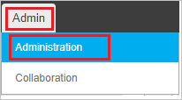
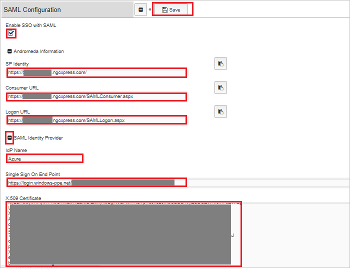
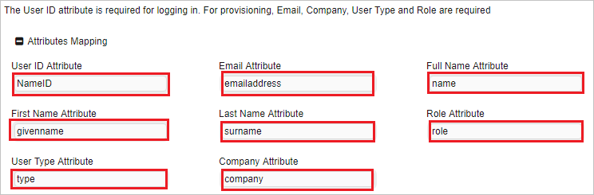

# Tutorial: Azure Active Directory integration with Andromeda

In this tutorial, you learn how to integrate Andromeda with Azure Active Directory (Azure AD).
Integrating Andromeda with Azure AD provides you with the following benefits:

* You can control in Azure AD who has access to Andromeda.
* You can enable your users to be automatically signed-in to Andromeda (Single Sign-On) with their Azure AD accounts.
* You can manage your accounts in one central location - the Azure portal.

If you want to know more details about SaaS app integration with Azure AD, see [What is application access and single sign-on with Azure Active Directory](https://docs.microsoft.com/azure/active-directory/active-directory-appssoaccess-whatis).
If you don't have an Azure subscription, [create a free account](https://azure.microsoft.com/free/) before you begin.

## Prerequisites

To configure Azure AD integration with Andromeda, you need the following items:

* An Azure AD subscription. If you don't have an Azure AD environment, you can get a [free account](https://azure.microsoft.com/free/)
* Andromeda single sign-on enabled subscription

## Scenario description

In this tutorial, you configure and test Azure AD single sign-on in a test environment.

* Andromeda supports **SP and IDP** initiated SSO
* Andromeda supports **Just In Time** user provisioning

## Adding Andromeda from the gallery

To configure the integration of Andromeda into Azure AD, you need to add Andromeda from the gallery to your list of managed SaaS apps.

**To add Andromeda from the gallery, perform the following steps:**

1. In the **[Azure portal](https://portal.azure.com)**, on the left navigation panel, click **Azure Active Directory** icon.

	

2. Navigate to **Enterprise Applications** and then select the **All Applications** option.

	

3. To add new application, click **New application** button on the top of dialog.

	

4. In the search box, type **Andromeda**, select **Andromeda** from result panel then click **Add** button to add the application.

	

## Configure and test Azure AD single sign-on

In this section, you configure and test Azure AD single sign-on with Andromeda based on a test user called **Britta Simon**.
For single sign-on to work, a link relationship between an Azure AD user and the related user in Andromeda needs to be established.

To configure and test Azure AD single sign-on with Andromeda, you need to complete the following building blocks:

1. **[Configure Azure AD Single Sign-On](#configure-azure-ad-single-sign-on)** - to enable your users to use this feature.
2. **[Configure Andromeda Single Sign-On](#configure-andromeda-single-sign-on)** - to configure the Single Sign-On settings on application side.
3. **[Create an Azure AD test user](#create-an-azure-ad-test-user)** - to test Azure AD single sign-on with Britta Simon.
4. **[Assign the Azure AD test user](#assign-the-azure-ad-test-user)** - to enable Britta Simon to use Azure AD single sign-on.
5. **[Create Andromeda test user](#create-andromeda-test-user)** - to have a counterpart of Britta Simon in Andromeda that is linked to the Azure AD representation of user.
6. **[Test single sign-on](#test-single-sign-on)** - to verify whether the configuration works.

### Configure Azure AD single sign-on

In this section, you enable Azure AD single sign-on in the Azure portal.

To configure Azure AD single sign-on with Andromeda, perform the following steps:

1. In the [Azure portal](https://portal.azure.com/), on the **Andromeda** application integration page, select **Single sign-on**.

    

2. On the **Select a Single sign-on method** dialog, select **SAML/WS-Fed** mode to enable single sign-on.

    

3. On the **Set up Single Sign-On with SAML** page, click **Edit** icon to open **Basic SAML Configuration** dialog.

	

4. On the **Basic SAML Configuration** section, if you wish to configure the application in **IDP** initiated mode, perform the following steps:

    

    a. In the **Identifier** text box, type a URL using the following pattern:
    `https://<tenantURL>.ngcxpress.com/`

    b. In the **Reply URL** text box, type a URL using the following pattern:
    `https://<tenantURL>.ngcxpress.com/SAMLConsumer.aspx`

5. Click **Set additional URLs** and perform the following step if you wish to configure the application in **SP** initiated mode:

    

    In the **Sign-on URL** text box, type a URL using the following pattern:
    `https://<tenantURL>.ngcxpress.com/SAMLLogon.aspx`

	> [!NOTE]
	> These values are not real. You will update the value with the actual Identifier, Reply URL, and Sign-On URL which is explained later in the tutorial.

6. Andromeda application expects the SAML assertions in a specific format. Configure the following claims for this application. You can manage the values of these attributes from the **User Attributes** section on application integration page. On the **Set up Single Sign-On with SAML** page, click **Edit** button to open **User Attributes** dialog.

	

	> [!Important]
	> Clear out the NameSpace definitions while setting these up.

7. In the **User Claims** section on the **User Attributes** dialog, edit the claims by using **Edit icon** or add the claims by using **Add new claim** to configure SAML token attribute as shown in the image above and perform the following steps: 

	| Name | Source Attribute|
	| ------ | -----------|
	| role 		  | App specific role |
	| type 		  | App Type |
	| company       | CompanyName |

	> [!NOTE]
	> There are not real values. These values are only for demo purpose, please use your organization roles.

	a. Click **Add new claim** to open the **Manage user claims** dialog.

	

	

	b. In the **Name** textbox, type the attribute name shown for that row.

	c. Leave the **Namespace** blank.

	d. Select Source as **Attribute**.

	e. From the **Source attribute** list, type the attribute value shown for that row.

	f. Click **Ok**

	g. Click **Save**.

8. On the **Set up Single Sign-On with SAML** page, in the **SAML Signing Certificate** section, click **Download** to download the **Certificate (Base64)** from the given options as per your requirement and save it on your computer.

	

9. On the **Set up Andromeda** section, copy the appropriate URL(s) as per your requirement.

	

	a. Login URL

	b. Azure AD Identifier

	c. Logout URL

### Configure Andromeda Single Sign-On

1. Sign-on to your Andromeda company site as administrator.

2. On the top of the menubar click **Admin** and navigate to **Administration**.

	

3. On the left side of tool bar under **Interfaces** section, click **SAML Configuration**.

	

4. On the **SAML Configuration** section page, perform the following steps:

	

	a. Check **Enable SSO with SAML**.

	b. Under **Andromeda Information** section, copy the **SP Identity** value and paste it into the **Identifier** textbox of **Basic SAML Configuration** section.

	c. Copy the **Consumer URL** value and paste it into the **Reply URL** textbox of **Basic SAML Configuration** section.

	d. Copy the **Logon URL** value and paste it into the **Sign-on URL** textbox of **Basic SAML Configuration** section.

	e. Under **SAML Identity Provider** section, type your IDP Name.

	f. In the **Single Sign On End Point** textbox, paste the value of **Login URL** which, you have copied from the Azure portal.

	g. Open the downloaded **Base64 encoded certificate** from Azure portal in notepad, paste it into the **X 509 Certificate** textbox.
	
	h. Map the following attributes with the respective value to facilitate SSO login from Azure AD. The **User ID** attribute is required for logging in. For provisioning, **Email**, **Company**, **UserType**, and **Role** are required. In this section, we define attributes mapping (name and values) which correlate to those defined within Azure portal

	

	i. Click **Save**.

### Create an Azure AD test user

The objective of this section is to create a test user in the Azure portal called Britta Simon.

1. In the Azure portal, in the left pane, select **Azure Active Directory**, select **Users**, and then select **All users**.

    

2. Select **New user** at the top of the screen.

    

3. In the User properties, perform the following steps.

    

    a. In the **Name** field enter **BrittaSimon**.
  
    b. In the **User name** field type `brittasimon@yourcompanydomain.extension`. For example, BrittaSimon@contoso.com

    c. Select **Show password** check box, and then write down the value that's displayed in the Password box.

    d. Click **Create**.

### Assign the Azure AD test user

In this section, you enable Britta Simon to use Azure single sign-on by granting access to Andromeda.

1. In the Azure portal, select **Enterprise Applications**, select **All applications**, then select **Andromeda**.

	

2. In the applications list, select **Andromeda**.

	

3. In the menu on the left, select **Users and groups**.

    

4. Click the **Add user** button, then select **Users and groups** in the **Add Assignment** dialog.

    

5. In the **Users and groups** dialog select **Britta Simon** in the Users list, then click the **Select** button at the bottom of the screen.

6. If you are expecting any role value in the SAML assertion then in the **Select Role** dialog select the appropriate role for the user from the list, then click the **Select** button at the bottom of the screen.

7. In the **Add Assignment** dialog click the **Assign** button.

### Create Andromeda test user

In this section, a user called Britta Simon is created in Andromeda. Andromeda supports just-in-time user provisioning, which is enabled by default. There is no action item for you in this section. If a user doesn't already exist in Andromeda, a new one is created after authentication. If you need to create a user manually, contact [Andromeda Client support team](https://www.ngcsoftware.com/support/).

### Test single sign-on 

In this section, you test your Azure AD single sign-on configuration using the Access Panel.

When you click the Andromeda tile in the Access Panel, you should be automatically signed in to the Andromeda for which you set up SSO. For more information about the Access Panel, see [Introduction to the Access Panel](https://docs.microsoft.com/azure/active-directory/active-directory-saas-access-panel-introduction).

## Additional Resources

- [List of Tutorials on How to Integrate SaaS Apps with Azure Active Directory](https://docs.microsoft.com/azure/active-directory/active-directory-saas-tutorial-list)

- [What is application access and single sign-on with Azure Active Directory?](https://docs.microsoft.com/azure/active-directory/active-directory-appssoaccess-whatis)

- [What is Conditional Access in Azure Active Directory?](https://docs.microsoft.com/azure/active-directory/conditional-access/overview)