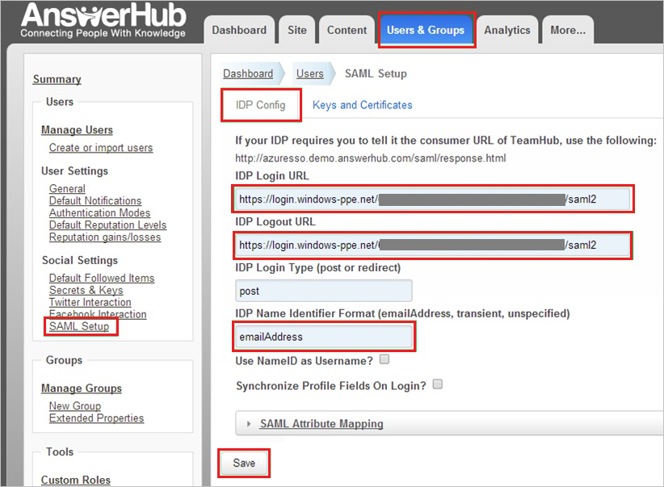
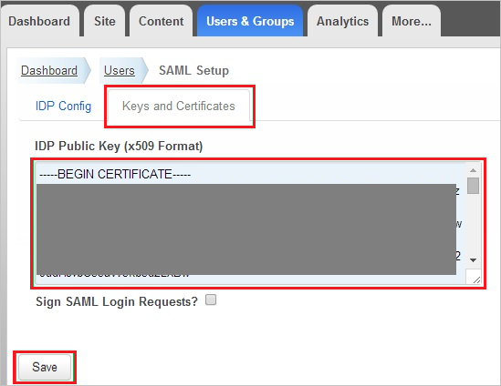

# Tutorial: Azure Active Directory integration with AnswerHub

In this tutorial, you learn how to integrate AnswerHub with Azure Active Directory (Azure AD).
Integrating AnswerHub with Azure AD provides these benefits:

* You can use Azure AD to control who has access to AnswerHub.
* You can let your users automatically sign in to AnswerHub with their Azure AD accounts (single sign-on).
* You can manage your accounts from a central location: the Azure portal.

To learn more about SaaS app integration with Azure AD, see [Single sign-on to applications in Azure Active Directory](https://docs.microsoft.com/azure/active-directory/active-directory-appssoaccess-whatis).
If you don't have an Azure subscription, [create a free account](https://azure.microsoft.com/free/) before you begin.

## Prerequisites

To configure Azure AD integration with AnswerHub, you need the following:

* An Azure AD subscription. If you don't have an Azure AD environment, you can begin a [one-month trial](https://azure.microsoft.com/pricing/free-trial/).
* An AnswerHub subscription that has single sign-on enabled.

## Scenario description

In this tutorial, you configure and test Azure AD single sign-on in a test environment.

* AnswerHub supports SP-initiated SSO.

## Add AnswerHub from the gallery

To set up the integration of AnswerHub into Azure AD, you need to add AnswerHub from the gallery to your managed SaaS apps.

**To add AnswerHub from the gallery:**

1. In the [Azure portal](https://portal.azure.com), in the left pane, select **Azure Active Directory**.

	

2. Go to **Enterprise Applications**, and then select **All Applications**.

	

3. To add an application, select **New application** at the top of the window.

	

4. In the search box, enter **AnswerHub**. Select **AnswerHub** in the results list, and then select **Add**.

	 

## Set up and test Azure AD single sign-on

In this section, you configure and test Azure AD single sign-on with AnswerHub by using a test user named Britta Simon.
For single sign-on, you need to establish a link between an Azure AD user and the corresponding user in AnswerHub.

To configure and test Azure AD single sign-on with AnswerHub, you need to complete these tasks:

1. [Configure Azure AD single sign-on](#configure-azure-ad-single-sign-on) to enable your users to use the feature.
2. [Configure AnswerHub single sign-on](#configure-answerhub-single-sign-on) to set up the single sign-on settings on the application side.
3. [Create an Azure AD test user](#create-an-azure-ad-test-user) named Britta Simon.
4. [Assign the Azure AD test user](#assign-the-azure-ad-test-user) to enable Britta Simon to use Azure AD single sign-on.
5. Create an AnswerHub test user that corresponds to and is linked to the Azure AD test user.
6. [Test single sign-on](#test-single-sign-on) to verify that the configuration works.

### Configure Azure AD single sign-on

In this section, you set up Azure AD single sign-on in the Azure portal.

**To configure Azure AD single sign-on with AnswerHub:**

1. In the [Azure portal](https://portal.azure.com/), on the **AnswerHub** application integration page, select **Single sign-on**.

    

2. In the **Select a Single sign-on method** dialog box, select **SAML/WS-Fed** mode to enable single sign-on.

    

3. On the **Set up Single Sign-On with SAML** page, select the edit icon to open the **Basic SAML Configuration** dialog box.

	

4. In the **Basic SAML Configuration** section, complete the following steps:

    

	a. In the **Sign on URL** box, enter a URL that has this pattern:
    `https://<company>.answerhub.com`

    b. In the **Identifier (Entity ID)** box, enter a URL that has this pattern:
    `https://<company>.answerhub.com`

	> [!NOTE]
	> These values aren't real. Update these values with the actual sign-on URL and identifier. Contact the [AnswerHub support team](mailto:success@answerhub.com) to get the values. You can also refer to the patterns shown in the **Basic SAML Configuration** section in the Azure portal.

5. On the **Set up Single Sign-On with SAML** page, in the **SAML Signing Certificate** section, select the **Download** link next to **Certificate (Base64)**, per your requirements, and save the certificate on your computer.

	

6. In the **Set up AnswerHub** section, copy the appropriate URL or URLs, based on your requirements.

	

   You can copy these URLs:
    - Login URL

	- Azure AD Identifier

	- Logout URL

### Configure AnswerHub single sign-on

In this section, you set up single sign-on for AnswerHub.  

**To configure AnswerHub single sign-on:**

1. In a different web browser window, sign in to your AnswerHub company site as an admin.

    > [!NOTE]
    > If you need help configuring AnswerHub, contact the [AnswerHub support team](mailto:success@answerhub.com.).

2. Go to **Administration**.

3. On the **User and Groups** tab, in the left pane, in the **Social Settings** section, select **SAML Setup**.

4. On the **IDP Config** tab, complete these steps:

      
  
    a. In the **IDP Login URL** box, paste the **Login URL** that you copied from the Azure portal.
  
    b. In the **IDP Logout URL** box, paste the **Logout URL** that you copied from the Azure portal.

    c. In the **IDP Name Identifier Format** box, enter the **Identifier** value selected in the **User Attributes** section on the Azure portal.
  
    d. Select **Keys and Certificates**.

5. In the **Keys and Certificates** section, complete these steps:

      

    a. Open the Base64-encoded certificate that you downloaded from the Azure portal in Notepad, copy its contents, and then paste the contents into the **IDP Public Key (x509 Format)** box.
  
    b. Select **Save**.

6. On the **IDP Config** tab, select **Save** again.

### Create an Azure AD test user

In this section, you create a test user named Britta Simon in the Azure portal.

**To create an Azure AD test user:**

1. In the Azure portal, in the left pane, select **Azure Active Directory**, select **Users**, and then select **All users**.

    

2. Select **New user** at the top of the screen.

    

3. In the user properties, complete these steps.

    

    a. In the **Name** box, enter **BrittaSimon**.
  
    b. In the **User name** box, enter **brittasimon\@<yourcompanydomain.extension>**.  
    For example, BrittaSimon@contoso.com.

    c. Select the **Show password** check box, and then write down the value that's displayed in the **Password** box.

    d. Select **Create**.

### Assign the Azure AD test user

In this section, you set up Britta Simon to use Azure AD single sign-on by granting her access to AnswerHub.

**To assign the Azure AD test user:**

1. In the Azure portal, select **Enterprise applications**, select **All applications**, and then select **AnswerHub**.

	

2. In the list of applications, select **AnswerHub**.

	

3. In the menu on the left, select **Users and groups**.

    

4. Select **Add user**, and then select **Users and groups** in the **Add Assignment** dialog box.

    

5. In the **Users and groups** dialog box, select **Britta Simon** in the **Users** list, and then select the **Select** button at the bottom of the screen.

6. If you're expecting a role value in the SAML assertion, in the **Select Role** dialog box, select the appropriate role for the user from the list. 

7. Select the **Select** button at the bottom of the screen.

8. In the **Add Assignment** dialog box, select **Assign**.

### Create an AnswerHub test user

To enable Azure AD users to sign in to AnswerHub, you need to add them in AnswerHub. In AnswerHub, this task is done manually.

**To set up a user account:**

1. Sign in to your **AnswerHub** company site as an admin.

2. Go to **Administration**.

3. Select the **Users & Groups** tab.

4. In the left pane, in the **Manage Users** section, select **Create or import users**, and then select **Users & Groups**.

   

5. In the appropriate boxes, enter the **Email address**, **Username**, and **Password** of a valid Azure AD account that you want to add, and then select **Save**.

> [!NOTE]
> You can use any other user account creation tool or API provided by AnswerHub to set up Azure AD user accounts.

### Test single sign-on

In this section, you test your Azure AD single sign-on configuration by using the access panel.

When you select the AnswerHub tile in the access panel, you should be automatically signed in to the AnswerHub for which you set up SSO. For more information about the access panel, see [Introduction to the access panel](https://docs.microsoft.com/azure/active-directory/active-directory-saas-access-panel-introduction).

## Additional resources

- [Tutorials for integrating SaaS apps with Azure Active Directory](https://docs.microsoft.com/azure/active-directory/active-directory-saas-tutorial-list)

- [What is application access and single sign-on with Azure Active Directory?](https://docs.microsoft.com/azure/active-directory/active-directory-appssoaccess-whatis)

- [What is Conditional Access in Azure Active Directory?](https://docs.microsoft.com/azure/active-directory/conditional-access/overview)

