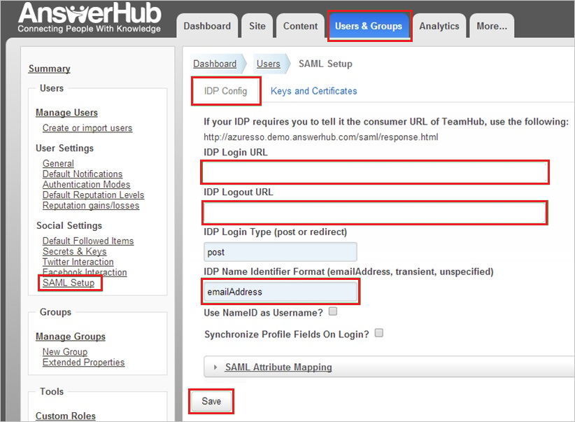
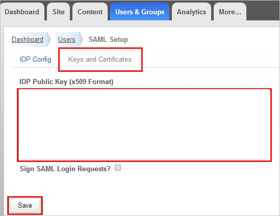
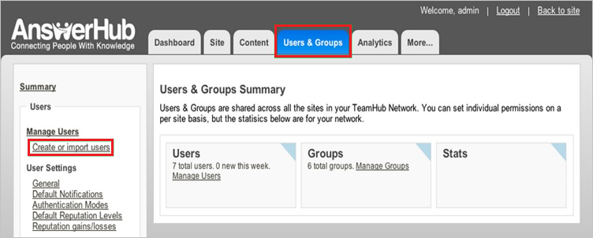

# Tutorial: Microsoft Entra SSO integration with AnswerHub

In this tutorial, you'll learn how to integrate AnswerHub with Microsoft Entra ID. When you integrate AnswerHub with Microsoft Entra ID, you can:

* Control in Microsoft Entra ID who has access to AnswerHub.
* Enable your users to be automatically signed-in to AnswerHub with their Microsoft Entra accounts.
* Manage your accounts in one central location.

## Prerequisites

To get started, you need the following items:

* A Microsoft Entra subscription. If you don't have a subscription, you can get a [free account](https://azure.microsoft.com/free/).
* AnswerHub single sign-on (SSO) enabled subscription.

## Scenario description

In this tutorial, you configure and test Microsoft Entra single sign-on in a test environment.

* AnswerHub supports SP-initiated SSO.

## Add AnswerHub from the gallery

To configure the integration of AnswerHub into Microsoft Entra ID, you need to add AnswerHub from the gallery to your list of managed SaaS apps.

1. Sign in to the [Microsoft Entra admin center](https://entra.microsoft.com) as at least a [Cloud Application Administrator](../roles/permissions-reference.md#cloud-application-administrator).
1. Browse to **Identity** > **Applications** > **Enterprise applications** > **New application**.
1. In the **Add from the gallery** section, type **AnswerHub** in the search box.
1. Select **AnswerHub** from results panel and then add the app. Wait a few seconds while the app is added to your tenant.

 Alternatively, you can also use the [Enterprise App Configuration Wizard](https://portal.office.com/AdminPortal/home?Q=Docs#/azureadappintegration). In this wizard, you can add an application to your tenant, add users/groups to the app, assign roles, as well as walk through the SSO configuration as well. [Learn more about Microsoft 365 wizards.](/microsoft-365/admin/misc/azure-ad-setup-guides)

## Set up and test Microsoft Entra SSO for AnswerHub

Configure and test Microsoft Entra SSO with AnswerHub using a test user called **B.Simon**. For SSO to work, you need to establish a link relationship between a Microsoft Entra user and the related user in AnswerHub.

To configure and test Microsoft Entra SSO with AnswerHub, perform the following steps:

1. **[Configure Microsoft Entra SSO](#configure-azure-ad-sso)** - to enable your users to use this feature.
    1. **[Create a Microsoft Entra test user](#create-an-azure-ad-test-user)** - to test Microsoft Entra single sign-on with B.Simon.
    1. **[Assign the Microsoft Entra test user](#assign-the-azure-ad-test-user)** - to enable B.Simon to use Microsoft Entra single sign-on.
1. **[Configure AnswerHub SSO](#configure-answerhub-sso)** - to configure the single sign-on settings on application side.
    1. **[Create AnswerHub test user](#create-answerhub-test-user)** - to have a counterpart of B.Simon in AnswerHub that is linked to the Microsoft Entra representation of user.
1. **[Test SSO](#test-sso)** - to verify whether the configuration works.

## Configure Microsoft Entra SSO

Follow these steps to enable Microsoft Entra SSO.

1. Sign in to the [Microsoft Entra admin center](https://entra.microsoft.com) as at least a [Cloud Application Administrator](../roles/permissions-reference.md#cloud-application-administrator).
1. Browse to **Identity** > **Applications** > **Enterprise applications** > **AnswerHub** > **Single sign-on**.
1. On the **Select a single sign-on method** page, select **SAML**.
1. On the **Set up single sign-on with SAML** page, click the pencil icon for **Basic SAML Configuration** to edit the settings.

   

1. In the **Basic SAML Configuration** section, complete the following steps:

    a. In the **Identifier (Entity ID)** box, enter a URL that has this pattern:
    `https://<company>.answerhub.com`
    
    b. In the **Sign on URL** box, enter a URL that has this pattern:
    `https://<company>.answerhub.com`

    > [!NOTE]
    > These values aren't real. Update these values with the actual Identifier and Sign on URL. Contact the [AnswerHub support team](mailto:success@answerhub.com) to get the values. You can also refer to the patterns shown in the **Basic SAML Configuration** section.

1. On the **Set up Single Sign-On with SAML** page, in the **SAML Signing Certificate** section, select the **Download** link next to **Certificate (Base64)**, per your requirements, and save the certificate on your computer.

    

1. In the **Set up AnswerHub** section, copy the appropriate URL or URLs, based on your requirements.

    

### Create a Microsoft Entra test user

In this section, you'll create a test user called B.Simon.

1. Sign in to the [Microsoft Entra admin center](https://entra.microsoft.com) as at least a [User Administrator](../roles/permissions-reference.md#user-administrator).
1. Browse to **Identity** > **Users** > **All users**.
1. Select **New user** > **Create new user**, at the top of the screen.
1. In the **User** properties, follow these steps:
   1. In the **Display name** field, enter `B.Simon`.  
   1. In the **User principal name** field, enter the username@companydomain.extension. For example, `B.Simon@contoso.com`.
   1. Select the **Show password** check box, and then write down the value that's displayed in the **Password** box.
   1. Select **Review + create**.
1. Select **Create**.

### Assign the Microsoft Entra test user

In this section, you'll enable B.Simon to use single sign-on by granting access to AnswerHub.

1. Sign in to the [Microsoft Entra admin center](https://entra.microsoft.com) as at least a [Cloud Application Administrator](../roles/permissions-reference.md#cloud-application-administrator).
1. Browse to **Identity** > **Applications** > **Enterprise applications** > **AnswerHub**.
1. In the app's overview page, select **Users and groups**.
1. Select **Add user/group**, then select **Users and groups** in the **Add Assignment** dialog.
   1. In the **Users and groups** dialog, select **B.Simon** from the Users list, then click the **Select** button at the bottom of the screen.
   1. If you are expecting a role to be assigned to the users, you can select it from the **Select a role** dropdown. If no role has been set up for this app, you see "Default Access" role selected.
   1. In the **Add Assignment** dialog, click the **Assign** button.

## Configure AnswerHub SSO

In this section, you set up single sign-on for AnswerHub.  

**To configure AnswerHub single sign-on:**

1. In a different web browser window, sign in to your AnswerHub company site as an admin.

    > [!NOTE]
    > If you need help configuring AnswerHub, contact the [AnswerHub support team](mailto:success@answerhub.com.).

2. Go to **Administration**.

3. On the **User and Groups** tab, in the left pane, in the **Social Settings** section, select **SAML Setup**.

4. On the **IDP Config** tab, complete these steps:

      

    a. In the **IDP Login URL** box, paste the **Login URL** that you copied.

    b. In the **IDP Logout URL** box, paste the **Logout URL** that you copied.

    c. In the **IDP Name Identifier Format** box, enter the **Identifier** value selected in the **User Attributes** section on the Azure portal.

    d. Select **Keys and Certificates**.

5. In the **Keys and Certificates** section, complete these steps:

      

    a. Open the Base64-encoded certificate that you downloaded in Notepad, copy its contents, and then paste the contents into the **IDP Public Key (x509 Format)** box.

    b. Select **Save**.

6. On the **IDP Config** tab, select **Save** again.

### Create AnswerHub test user

To enable Microsoft Entra users to sign in to AnswerHub, you need to add them in AnswerHub. In AnswerHub, this task is done manually.

**To set up a user account:**

1. Sign in to your **AnswerHub** company site as an admin.

2. Go to **Administration**.

3. Select the **Users & Groups** tab.

4. In the left pane, in the **Manage Users** section, select **Create or import users**, and then select **Users & Groups**.

    

5. In the appropriate boxes, enter the **Email address**, **Username**, and **Password** of a valid Microsoft Entra account that you want to add, and then select **Save**.

> [!NOTE]
> You can use any other user account creation tool or API provided by AnswerHub to set up Microsoft Entra user accounts.

## Test SSO

In this section, you test your Microsoft Entra single sign-on configuration with following options. 

* Click on **Test this application**, this will redirect to AnswerHub Sign-on URL where you can initiate the login flow. 

* Go to AnswerHub Sign-on URL directly and initiate the login flow from there.

* You can use Microsoft My Apps. When you click the AnswerHub tile in the My Apps, this will redirect to AnswerHub Sign-on URL. For more information, see [Microsoft Entra My Apps](/azure/active-directory/manage-apps/end-user-experiences#azure-ad-my-apps).

## Next steps

Once you configure AnswerHub you can enforce session control, which protects exfiltration and infiltration of your organization’s sensitive data in real time. Session control extends from Conditional Access. [Learn how to enforce session control with Microsoft Defender for Cloud Apps](/cloud-app-security/proxy-deployment-aad).
