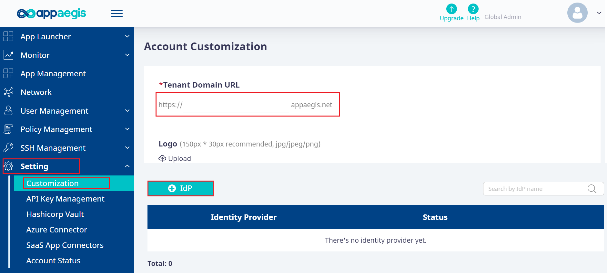
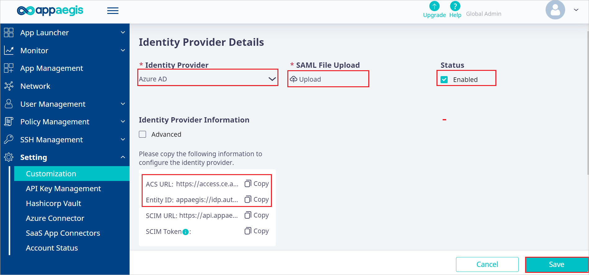

# Tutorial: Azure AD SSO integration with Appaegis Isolation Access Cloud

In this tutorial, you'll learn how to integrate Appaegis Isolation Access Cloud with Azure Active Directory (Azure AD). When you integrate Appaegis Isolation Access Cloud with Azure AD, you can:

* Control in Azure AD who has access to Appaegis Isolation Access Cloud.
* Enable your users to be automatically signed-in to Appaegis Isolation Access Cloud with their Azure AD accounts.
* Manage your accounts in one central location - the Azure portal.

## Prerequisites

To get started, you need the following items:

* An Azure AD subscription. If you don't have a subscription, you can get a [free account](https://azure.microsoft.com/free/).
* Appaegis Isolation Access Cloud single sign-on (SSO) enabled subscription.

## Scenario description

In this tutorial, you configure and test Azure AD SSO in a test environment.

* Appaegis Isolation Access Cloud supports **SP and IDP** initiated SSO.
* Appaegis Isolation Access Cloud supports **Just In Time** user provisioning.

## Adding Appaegis Isolation Access Cloud from the gallery

To configure the integration of Appaegis Isolation Access Cloud into Azure AD, you need to add Appaegis Isolation Access Cloud from the gallery to your list of managed SaaS apps.

1. Sign in to the Azure portal using either a work or school account, or a personal Microsoft account.
1. On the left navigation pane, select the **Azure Active Directory** service.
1. Navigate to **Enterprise Applications** and then select **All Applications**.
1. To add new application, select **New application**.
1. In the **Add from the gallery** section, type **Appaegis Isolation Access Cloud** in the search box.
1. Select **Appaegis Isolation Access Cloud** from results panel and then add the app. Wait a few seconds while the app is added to your tenant.

 Alternatively, you can also use the [Enterprise App Configuration Wizard](https://portal.office.com/AdminPortal/home?Q=Docs#/azureadappintegration). In this wizard, you can add an application to your tenant, add users/groups to the app, assign roles, as well as walk through the SSO configuration as well. [Learn more about Microsoft 365 wizards.](/microsoft-365/admin/misc/azure-ad-setup-guides)

## Configure and test Azure AD SSO for Appaegis Isolation Access Cloud

Configure and test Azure AD SSO with Appaegis Isolation Access Cloud using a test user called **B.Simon**. For SSO to work, you need to establish a link relationship between an Azure AD user and the related user in Appaegis Isolation Access Cloud.

To configure and test Azure AD SSO with Appaegis Isolation Access Cloud, perform the following steps:

1. **[Configure Azure AD SSO](#configure-azure-ad-sso)** - to enable your users to use this feature.
    1. **[Create an Azure AD test user](#create-an-azure-ad-test-user)** - to test Azure AD single sign-on with B.Simon.
    1. **[Assign the Azure AD test user](#assign-the-azure-ad-test-user)** - to enable B.Simon to use Azure AD single sign-on.
1. **[Configure Appaegis Isolation Access Cloud SSO](#configure-appaegis-isolation-access-cloud-sso)** - to configure the single sign-on settings on application side.
    1. **[Create Appaegis Isolation Access Cloud test user](#create-appaegis-isolation-access-cloud-test-user)** - to have a counterpart of B.Simon in Appaegis Isolation Access Cloud that is linked to the Azure AD representation of user.
1. **[Test SSO](#test-sso)** - to verify whether the configuration works.

## Configure Azure AD SSO

Follow these steps to enable Azure AD SSO in the Azure portal.

1. In the Azure portal, on the **Appaegis Isolation Access Cloud** application integration page, find the **Manage** section and select **single sign-on**.
1. On the **Select a single sign-on method** page, select **SAML**.
1. On the **Set up single sign-on with SAML** page, click the pencil icon for **Basic SAML Configuration** to edit the settings.

   

1. On the **Basic SAML Configuration** section, the user does not have to perform any step as the app is already pre-integrated with Azure.

1. Click **Set additional URLs** and perform the following steps if you wish to configure the application in **SP** initiated mode:

    a. In the **Sign-on URL** text box, type a URL using the following pattern:
    `https://<SUBDOMAIN>.appaegis.net`

    b. In the **Relay State** text box, type a value using the following pattern:
    `<RelayState>`

    > [!NOTE]
    > These values are not real. Update these values with the actual Sign-on URL and Relay State. Contact [Appaegis Isolation Access Cloud Client support team](mailto:support@appaegis.com) to get these values. You can also refer to the patterns shown in the **Basic SAML Configuration** section in the Azure portal.

1. Appaegis Isolation Access Cloud application expects the SAML assertions in a specific format, which requires you to add custom attribute mappings to your SAML token attributes configuration. The following screenshot shows the list of default attributes.

	

1. In addition to above, Appaegis Isolation Access Cloud application expects few more attributes to be passed back in SAML response which are shown below. These attributes are also pre-populated but you can review them as per your requirements.
	
	| Name | Source Attribute |
	| ---------| --------- |
	| email | user.userprincipalname |

1. On the **Set up single sign-on with SAML** page, in the **SAML Signing Certificate** section,  find **Federation Metadata XML** and select **Download** to download the certificate and save it on your computer.

	

1. On the **Set up Appaegis Isolation Access Cloud** section, copy the appropriate URL(s) based on your requirement.

	

### Create an Azure AD test user

In this section, you'll create a test user in the Azure portal called B.Simon.

1. From the left pane in the Azure portal, select **Azure Active Directory**, select **Users**, and then select **All users**.
1. Select **New user** at the top of the screen.
1. In the **User** properties, follow these steps:
   1. In the **Name** field, enter `B.Simon`.  
   1. In the **User name** field, enter the username@companydomain.extension. For example, `B.Simon@contoso.com`.
   1. Select the **Show password** check box, and then write down the value that's displayed in the **Password** box.
   1. Click **Create**.

### Assign the Azure AD test user

In this section, you'll enable B.Simon to use Azure single sign-on by granting access to Appaegis Isolation Access Cloud.

1. In the Azure portal, select **Enterprise Applications**, and then select **All applications**.
1. In the applications list, select **Appaegis Isolation Access Cloud**.
1. In the app's overview page, find the **Manage** section and select **Users and groups**.
1. Select **Add user**, then select **Users and groups** in the **Add Assignment** dialog.
1. In the **Users and groups** dialog, select **B.Simon** from the Users list, then click the **Select** button at the bottom of the screen.
1. If you are expecting a role to be assigned to the users, you can select it from the **Select a role** dropdown. If no role has been set up for this app, you see "Default Access" role selected.
1. In the **Add Assignment** dialog, click the **Assign** button.

## Configure Appaegis Isolation Access Cloud SSO

1. Log in to your Appaegis Isolation Access Cloud company site as an administrator.

1. Go to **Setting** > **Customization**, type a **Tenant Domain URL** in the textbox and click **+IdP** button.

    

1. In the **Identity Provider Details** page, perform the following steps.

     

    1. Select **Azure AD** from the dropdown in the **Identity Provider**.

    1. Copy **ACS URL** value, paste this value into the **Reply URL** text box in the **Basic SAML Configuration** section in the Azure portal.

    1. Copy **Entity ID** value, paste this value into the **Identifier** text box in the **Basic SAML Configuration** section in the Azure portal.

    1. Open the downloaded **Federation Metadata XML** from the Azure portal into Notepad and upload the file into the **SAML File Upload**.

    1. Enabled the **Status** checkbox and click **Save**.

### Create Appaegis Isolation Access Cloud test user

In this section, a user called Britta Simon is created in Appaegis Isolation Access Cloud. Appaegis Isolation Access Cloud supports just-in-time user provisioning, which is enabled by default. There is no action item for you in this section. If a user doesn't already exist in Appaegis Isolation Access Cloud, a new one is created after authentication.

## Test SSO 

In this section, you test your Azure AD single sign-on configuration with following options. 

#### SP initiated:

* Click on **Test this application** in Azure portal. This will redirect to Appaegis Isolation Access Cloud Sign on URL where you can initiate the login flow.  

* Go to Appaegis Isolation Access Cloud Sign-on URL directly and initiate the login flow from there.

#### IDP initiated:

* Click on **Test this application** in Azure portal and you should be automatically signed in to the Appaegis Isolation Access Cloud for which you set up the SSO. 

You can also use Microsoft My Apps to test the application in any mode. When you click the Appaegis Isolation Access Cloud tile in the My Apps, if configured in SP mode you would be redirected to the application sign on page for initiating the login flow and if configured in IDP mode, you should be automatically signed in to the Appaegis Isolation Access Cloud for which you set up the SSO. For more information about the My Apps, see [Introduction to the My Apps](../user-help/my-apps-portal-end-user-access.md).

## Next steps

Once you configure Appaegis Isolation Access Cloud you can enforce session control, which protects exfiltration and infiltration of your organization’s sensitive data in real time. Session control extends from Conditional Access. [Learn how to enforce session control with Microsoft Defender for Cloud Apps](/cloud-app-security/proxy-deployment-aad).
