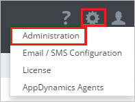
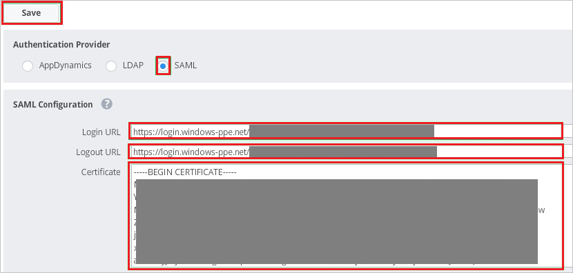

# Tutorial: Azure Active Directory integration with AppDynamics

In this tutorial, you learn how to integrate AppDynamics with Azure Active Directory (Azure AD).
Integrating AppDynamics with Azure AD provides you with the following benefits:

* You can control in Azure AD who has access to AppDynamics.
* You can enable your users to be automatically signed-in to AppDynamics (Single Sign-On) with their Azure AD accounts.
* You can manage your accounts in one central location - the Azure portal.

If you want to know more details about SaaS app integration with Azure AD, see [What is application access and single sign-on with Azure Active Directory](https://docs.microsoft.com/azure/active-directory/active-directory-appssoaccess-whatis).
If you don't have an Azure subscription, [create a free account](https://azure.microsoft.com/free/) before you begin.

## Prerequisites

To configure Azure AD integration with AppDynamics, you need the following items:

* An Azure AD subscription. If you don't have an Azure AD environment, you can get one-month trial [here](https://azure.microsoft.com/pricing/free-trial/)
* AppDynamics single sign-on enabled subscription

## Scenario description

In this tutorial, you configure and test Azure AD single sign-on in a test environment.

* AppDynamics supports **SP** initiated SSO

* AppDynamics supports **Just In Time** user provisioning

## Adding AppDynamics from the gallery

To configure the integration of AppDynamics into Azure AD, you need to add AppDynamics from the gallery to your list of managed SaaS apps.

**To add AppDynamics from the gallery, perform the following steps:**

1. In the **[Azure portal](https://portal.azure.com)**, on the left navigation panel, click **Azure Active Directory** icon.

	

2. Navigate to **Enterprise Applications** and then select the **All Applications** option.

	

3. To add new application, click **New application** button on the top of dialog.

	

4. In the search box, type **AppDynamics**, select **AppDynamics** from result panel then click **Add** button to add the application.

	 

## Configure and test Azure AD single sign-on

In this section, you configure and test Azure AD single sign-on with AppDynamics based on a test user called **Britta Simon**.
For single sign-on to work, a link relationship between an Azure AD user and the related user in AppDynamics needs to be established.

To configure and test Azure AD single sign-on with AppDynamics, you need to complete the following building blocks:

1. **[Configure Azure AD Single Sign-On](#configure-azure-ad-single-sign-on)** - to enable your users to use this feature.
2. **[Configure AppDynamics Single Sign-On](#configure-appdynamics-single-sign-on)** - to configure the Single Sign-On settings on application side.
3. **[Create an Azure AD test user](#create-an-azure-ad-test-user)** - to test Azure AD single sign-on with Britta Simon.
4. **[Assign the Azure AD test user](#assign-the-azure-ad-test-user)** - to enable Britta Simon to use Azure AD single sign-on.
5. **[Create AppDynamics test user](#create-appdynamics-test-user)** - to have a counterpart of Britta Simon in AppDynamics that is linked to the Azure AD representation of user.
6. **[Test single sign-on](#test-single-sign-on)** - to verify whether the configuration works.

### Configure Azure AD single sign-on

In this section, you enable Azure AD single sign-on in the Azure portal.

To configure Azure AD single sign-on with AppDynamics, perform the following steps:

1. In the [Azure portal](https://portal.azure.com/), on the **AppDynamics** application integration page, select **Single sign-on**.

    

2. On the **Select a Single sign-on method** dialog, select **SAML/WS-Fed** mode to enable single sign-on.

    

3. On the **Set up Single Sign-On with SAML** page, click **Edit** icon to open **Basic SAML Configuration** dialog.

	

4. On the **Basic SAML Configuration** section, perform the following steps:

    

	a. In the **Sign on URL** text box, type a URL using the following pattern:
    `https://<companyname>.saas.appdynamics.com?accountName=<companyname>`

    b. In the **Identifier (Entity ID)** text box, type a URL using the following pattern:
    `https://<companyname>.saas.appdynamics.com/controller`

	> [!NOTE]
	> These values are not real. Update these values with the actual Sign on URL and Identifier. Contact [AppDynamics Client support team](https://www.appdynamics.com/support/) to get these values. You can also refer to the patterns shown in the **Basic SAML Configuration** section in the Azure portal.

4. On the **Set up Single Sign-On with SAML** page, in the **SAML Signing Certificate** section, click **Download** to download the **Certificate (Base64)** from the given options as per your requirement and save it on your computer.

	

6. On the **Set up AppDynamics** section, copy the appropriate URL(s) as per your requirement.

	

	a. Login URL

	b. Azure Ad Identifier

	c. Logout URL

### Configure AppDynamics Single Sign-On

1. In a different web browser window, log in to your AppDynamics company site as an administrator.

1. In the toolbar on the top, click **Settings**, and then click **Administration**.

    

1. Click the **Authentication Provider** tab.

    

1. In the **Authentication Provider** section, perform the following steps:

   

   a. As **Authentication Provider**, select **SAML**.

   b. In the **Login URL** textbox, paste the value of **Login URL** which you have copied from Azure portal.

   c. In the **Logout URL** textbox, paste the value of **Logout URL** which you have copied from Azure portal.

   d. Open your base-64 encoded certificate in notepad, copy the content of it into your clipboard, and then paste it to the **Certificate** textbox

   e. Click **Save**.

### Create an Azure AD test user 

The objective of this section is to create a test user in the Azure portal called Britta Simon.

1. In the Azure portal, in the left pane, select **Azure Active Directory**, select **Users**, and then select **All users**.

    

2. Select **New user** at the top of the screen.

    

3. In the User properties, perform the following steps.

    

    a. In the **Name** field enter **BrittaSimon**.
  
    b. In the **User name** field type **brittasimon\@yourcompanydomain.extension**  
    For example, BrittaSimon@contoso.com

    c. Select **Show password** check box, and then write down the value that's displayed in the Password box.

    d. Click **Create**.

### Assign the Azure AD test user

In this section, you enable Britta Simon to use Azure single sign-on by granting access to AppDynamics.

1. In the Azure portal, select **Enterprise Applications**, select **All applications**, then select **AppDynamics**.

	

2. In the applications list, type and select **AppDynamics**.

	

3. In the menu on the left, select **Users and groups**.

    

4. Click the **Add user** button, then select **Users and groups** in the **Add Assignment** dialog.

    

5. In the **Users and groups** dialog select **Britta Simon** in the Users list, then click the **Select** button at the bottom of the screen.

6. If you are expecting any role value in the SAML assertion then in the **Select Role** dialog select the appropriate role for the user from the list, then click the **Select** button at the bottom of the screen.

7. In the **Add Assignment** dialog click the **Assign** button.

### Create AppDynamics test user

The objective of this section is to create a user called Britta Simon in AppDynamics. AppDynamics supports just-in-time provisioning, which is by default enabled. There is no action item for you in this section. A new user is created during an attempt to access AppDynamics if it doesn't exist yet.

>[!Note]
>If you need to create a user manually, contact [AppDynamics Client support team](https://www.appdynamics.com/support/).

### Test single sign-on 

In this section, you test your Azure AD single sign-on configuration using the Access Panel.

When you click the AppDynamics tile in the Access Panel, you should be automatically signed in to the AppDynamics for which you set up SSO. For more information about the Access Panel, see [Introduction to the Access Panel](https://docs.microsoft.com/azure/active-directory/active-directory-saas-access-panel-introduction).

## Additional Resources

- [List of Tutorials on How to Integrate SaaS Apps with Azure Active Directory](https://docs.microsoft.com/azure/active-directory/active-directory-saas-tutorial-list)

- [What is application access and single sign-on with Azure Active Directory?](https://docs.microsoft.com/azure/active-directory/active-directory-appssoaccess-whatis)

- [What is Conditional Access in Azure Active Directory?](https://docs.microsoft.com/azure/active-directory/conditional-access/overview)

