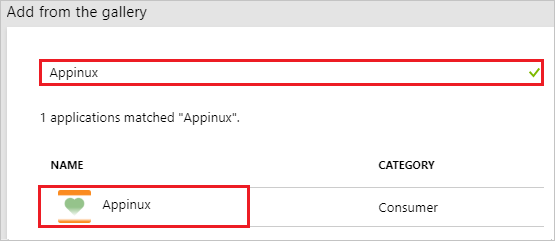
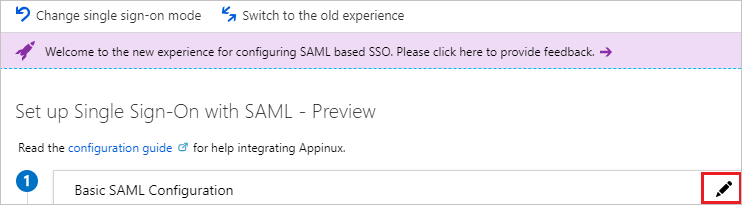
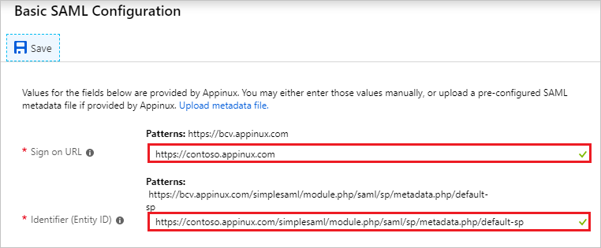
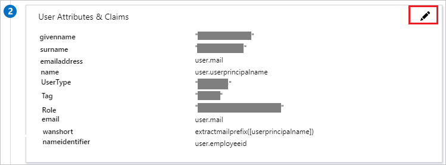
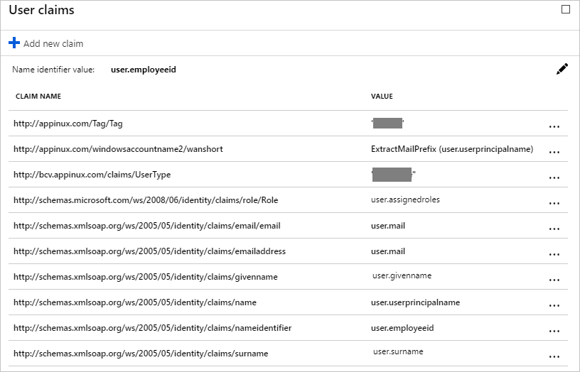
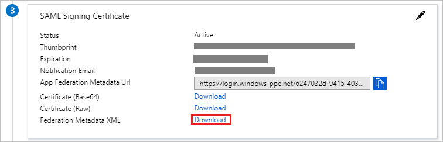

# Tutorial: Azure Active Directory integration with Appinux

In this tutorial, you learn how to integrate Appinux with Azure Active Directory (Azure AD).

Integrating Appinux with Azure AD provides you with the following benefits:

- You can control in Azure AD who has access to Appinux.
- You can enable your users to automatically get signed-on to Appinux (Single Sign-On) with their Azure AD accounts.
- You can manage your accounts in one central location - the Azure portal.

If you want to know more details about SaaS app integration with Azure AD, see [what is application access and single sign-on with Azure Active Directory](../manage-apps/what-is-single-sign-on.md)

## Prerequisites

To configure Azure AD integration with Appinux, you need the following items:

- An Azure AD subscription
- An Appinux single sign-on enabled subscription

> [!NOTE]
> To test the steps in this tutorial, we do not recommend using a production environment.

To test the steps in this tutorial, you should follow these recommendations:

- Do not use your production environment, unless it is necessary.
- If you don't have an Azure AD trial environment, you can [get a one-month trial](https://azure.microsoft.com/pricing/free-trial/).

## Scenario description

In this tutorial, you test Azure AD single sign-on in a test environment. 
The scenario outlined in this tutorial consists of two main building blocks:

1. Adding Appinux from the gallery
2. Configuring and testing Azure AD single sign-on

## Adding Appinux from the gallery

To configure the integration of Appinux into Azure AD, you need to add Appinux from the gallery to your list of managed SaaS apps.

**To add Appinux from the gallery, perform the following steps:**

1. In the **[Azure portal](https://portal.azure.com)**, on the left navigation panel, click **Azure Active Directory** icon. 

	![The Azure Active Directory button][1]

2. Navigate to **Enterprise applications**. Then go to **All applications**.

	![The Enterprise applications blade][2]

3. To add new application, click **New application** button on the top of dialog.

	![The New application button][3]

4. In the search box, type **Appinux**, select **Appinux** from result panel then click **Add** button to add the application.

	

## Configure and test Azure AD single sign-on

In this section, you configure and test Azure AD single sign-on with Appinux based on a test user called "Britta Simon".

For single sign-on to work, Azure AD needs to know what the counterpart user in Appinux is to a user in Azure AD. In other words, a link relationship between an Azure AD user and the related user in Appinux needs to be established.

To configure and test Azure AD single sign-on with Appinux, you need to complete the following building blocks:

1. **[Configuring Azure AD Single Sign-On](#configuring-azure-ad-single-sign-on)** - to enable your users to use this feature.
2. **[Creating an Azure AD test user](#creating-an-azure-ad-test-user)** - to test Azure AD single sign-on with Britta Simon.
3. **[Creating an Appinux test user](#creating-an-appinux-test-user)** - to have a counterpart of Britta Simon in Appinux that is linked to the Azure AD representation of user.
4. **[Assigning the Azure AD test user](#assigning-the-azure-ad-test-user)** - to enable Britta Simon to use Azure AD single sign-on.
5. **[Testing single sign-on](#testing-single-sign-on)** - to verify whether the configuration works.

### Configuring Azure AD single sign-on

In this section, you enable Azure AD single sign-on in the Azure portal and configure single sign-on in your Appinux application.

**To configure Azure AD single sign-on with Appinux, perform the following steps:**

1. In the Azure portal, on the **Appinux** application integration page, click **Single sign-on**.

	![Configure single sign-on link][4]

2. On the **Select a Single sign-on method** dialog, Click **Select** for **SAML** mode to enable single sign-on.

    

3. On the **Set up Single Sign-On with SAML** page, click **Edit** icon to open **Basic SAML Configuration** dialog.

	

4. On the **Basic SAML Configuration** section, perform the following steps:

	

    a. In the **Sign-on URL** textbox, type a URL using the following pattern: `https://<Appinux_SUBDOMAIN>.appinux.com`

	b. In the **Identifier** textbox, type a URL using the following pattern: `https://<Appinux_SUBDOMAIN>.appinux.com/simplesaml/module.php/saml/sp/metadata.php/default-sp`

	> [!NOTE]
	> These values are not real. Update these values with the actual Sign-On URL and Identifier. Contact [Appinux Client support team](https://support.appinux.com) to get these values.

5. Appinux application expects the SAML assertions in a specific format. Configure the following claims for this application. You can manage the values of these attributes from the **User Attributes** section on application integration page. On the **Set up Single Sign-On with SAML** page, click **Edit** button to open **User Attributes** dialog.

	

	

6. In the **User Claims** section on the **User Attributes** dialog, configure SAML token attribute as shown in the image above and perform the following steps:

	| **Name** | **Namespace** | **Source Attribute**|
	| ---------|---------------| --------- |
	| `givenname` | `http://schemas.xmlsoap.org/ws/2005/05/identity/claims` | `user.givenname` |
	| `surname` | `http://schemas.xmlsoap.org/ws/2005/05/identity/claims` | `user.surname` |
	| `emailaddress` | `http://schemas.xmlsoap.org/ws/2005/05/identity/claims` | `user.mail` |
	| `name` | `http://schemas.xmlsoap.org/ws/2005/05/identity/claims` | `user.userprincipalname` |
	| `UserType` | `http://bcv.appinux.com/claims` | `Provide the value as per your organization` |
	| `Tag` | `http://appinux.com/Tag` | `Provide the value as per your organization` |
	| `Role` | `http://schemas.microsoft.com/ws/2008/06/identity/claims/role` | `user.assignedroles` |
	| `email` | `http://schemas.xmlsoap.org/ws/2005/05/identity/claims/email` | `user.mail` |
	| `wanshort` | `http://appinux.com/windowsaccountname2` | `extractmailprefix([userprincipalname])` |
	| `nameidentifier` | `http://schemas.xmlsoap.org/ws/2005/05/identity/claims` | `user.employeeid` |

	a. Click **Add new claim** to open the **Manage user claims** dialog.

	

	

	b. In the **Name** textbox, type the attribute name shown for that row.

	c. In the **Namespace** textbox, type the namespace value shown for that row.

	d. Select Source as **Attribute**.

	e. From the **Source attribute** list, type the attribute value shown for that row.

	f. Click **Ok**

	g. Click **Save**.

7. On the **SAML Signing Certificate** page, in the **SAML Signing Certificate** section, click **Download** to download **Federation Metadata XML** and then save metadata file on your computer.

	 

8. To configure single sign-on on **Appinux** side, you need to send the downloaded **Metadata XML** to [Appinux support team](https://support.appinux.com). They set this setting to have the SAML SSO connection set properly on both sides.

### Creating an Azure AD test user

The objective of this section is to create a test user in the Azure portal called Britta Simon.

1. In the Azure portal, in the left pane, select **Azure Active Directory**, select **Users**, and then select **All users**.

	![Create Azure AD User][100]

2. Select **New user** at the top of the screen.

	 

3. In the User properties, perform the following steps.

	

    a. In the **Name** field, enter **BrittaSimon**.
  
    b. In the **User name** field, type **brittasimon@yourcompanydomain.extension**  
    For example, BrittaSimon@contoso.com

    c. Select **Properties**, select the **Show password** check box, and then write down the value that's displayed in the Password box.

    d. Select **Create**.

### Creating an Appinux test user

The objective of this section is to create a user called Britta Simon in Appinux. Appinux supports just-in-time provisioning, which is by default enabled. There is no action item for you in this section. A new user is created during an attempt to access Appinux if it doesn't exist yet.
>[!Note]
>If you need to create a user manually, contact [Appinux support team](https://support.appinux.com).

### Assigning the Azure AD test user

In this section, you enable Britta Simon to use Azure single sign-on by granting access to Appinux.

1. In the Azure portal, select **Enterprise Applications**, select **All applications**.

	![Assign User][201]

2. In the applications list, select **Appinux**.

	 

3. In the menu on the left, click **Users and groups**.

	![Assign User][202]

4. Click **Add** button. Then select **Users and groups** on **Add Assignment** dialog.

	![Assign User][203]

5. In the **Users and groups** dialog select **Britta Simon** in the Users list, then click the **Select** button at the bottom of the screen.

6. In the **Add Assignment** dialog select the **Assign** button.

### Testing single sign-on

In this section, you test your Azure AD single sign-on configuration using the Access Panel.

When you click the Appinux tile in the Access Panel, you should get automatically signed-on to your Appinux application.
For more information about the Access Panel, see [Introduction to the Access Panel](../user-help/active-directory-saas-access-panel-introduction.md).

## Additional resources

* [List of Tutorials on How to Integrate SaaS Apps with Azure Active Directory](tutorial-list.md)
* [What is application access and single sign-on with Azure Active Directory?](../manage-apps/what-is-single-sign-on.md)

<!--Image references-->

[1]: ./media/appinux-tutorial/tutorial_general_01.png
[2]: ./media/appinux-tutorial/tutorial_general_02.png
[3]: ./media/appinux-tutorial/tutorial_general_03.png
[4]: ./media/appinux-tutorial/tutorial_general_04.png

[100]: ./media/appinux-tutorial/tutorial_general_100.png

[200]: ./media/appinux-tutorial/tutorial_general_200.png
[201]: ./media/appinux-tutorial/tutorial_general_201.png
[202]: ./media/appinux-tutorial/tutorial_general_202.png
[203]: ./media/appinux-tutorial/tutorial_general_203.png
