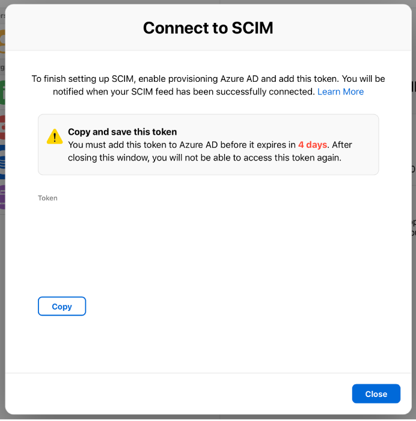

# Tutorial: Configure Apple School Manager for automatic user provisioning

This tutorial describes the steps you need to perform in both Apple School Manager and Microsoft Entra ID to configure automatic user provisioning. When configured, Microsoft Entra ID automatically provisions and de-provisions users to [Apple School Manager](https://school.apple.com/) using the Microsoft Entra provisioning service. For important details on what this service does, how it works, and frequently asked questions, see [Automate user provisioning and deprovisioning to SaaS applications with Microsoft Entra ID](../app-provisioning/user-provisioning.md). 

## Capabilities Supported
> [!div class="checklist"]
> * Create users in Apple School Manager
> * Remove users in Apple School Manager when they do not require access anymore
> * Keep specific user attributes synchronized between Microsoft Entra ID and Apple School Manager
> * [Single sign-on](../manage-apps/add-application-portal-setup-oidc-sso.md) to Apple School Manager (recommended).

## Prerequisites

The scenario outlined in this tutorial assumes that you already have the following prerequisites:

* [A Microsoft Entra tenant](../develop/quickstart-create-new-tenant.md) 
* A user account in Microsoft Entra ID with [permission](../roles/permissions-reference.md) to configure provisioning (for example, Application Administrator, Cloud Application Administrator, Application Owner, or Global Administrator). 
* An Apple School Manager account with the role of Administrator, Site Manager, or People Manager.

> [!NOTE]
> Token transfer to Microsoft Entra ID and  establishing a successful connection has to be completed in 4 calendar days or the process has to be started again.

## Step 1: Plan your provisioning deployment
1. Learn about [how the provisioning service works](../app-provisioning/user-provisioning.md).
2. Determine who will be in [scope for provisioning](../app-provisioning/define-conditional-rules-for-provisioning-user-accounts.md).
3. Determine what data to [map between Microsoft Entra ID and Apple School Manager](../app-provisioning/customize-application-attributes.md).

## Step 2: Configure Apple School Manager to support provisioning with Microsoft Entra ID

1. In Apple School Manager, sign in with an account that has the role of Administrator,  Site Manager, or People Manager.
2. Click Settings at the bottom of the sidebar click Data Source below Organization Settings, then click Connect to Data Source.
3. Click Connect next to SCIM, carefully read the warning, click Copy, then click Close.
[The Connect to SCIM window, which provides a token and a Copy button under it.]
Leave this window open to copy the Tenant URL from Apple School Manager to Microsoft Entra ID, which is: `https://federation.apple.com/feeds/school/scim`

    

    > [!NOTE]
    > The secret token shouldn’t be shared with anyone other than the Microsoft Entra administrator.

## Step 3: Add Apple School Manager from the Microsoft Entra application gallery

* Add Apple School Manager from the Microsoft Entra application gallery to start managing provisioning to Apple School Manager. If you have previously setup Apple School Manager for SSO, you can use the same application. However it is recommended that you create a separate app when testing out the integration initially.

* To add the Apple School Manager Microsoft Entra app with Microsoft tenants, the administrator of the tenants must go through the federated authentication setup process, including testing authentication. When authentication has succeeded, the Apple School Manager Microsoft Entra app is populated in the tenant and the administrator can federate domains and configure Apple School Manager to use SCIM (System for Cross-domain Identity Management) for directory sync.

   [Use federated authentication with MS Microsoft Entra ID in Apple School Manager](https://support.apple.com/en-ke/guide/apple-school-manager/axmb02f73f18/web)
   
## Step 4: Define who will be in scope for provisioning 

The Microsoft Entra provisioning service allows you to scope who will be provisioned based on assignment to the application and or based on attributes of the user / group. If you choose to scope who will be provisioned to your app based on assignment, you can use the following [steps](../manage-apps/assign-user-or-group-access-portal.md) to assign users and groups to the application. If you choose to scope who will be provisioned based solely on attributes of the user or group, you can use a scoping filter as described [here](../app-provisioning/define-conditional-rules-for-provisioning-user-accounts.md). 

* Start small. Test with a small set of users and groups before rolling out to everyone. When scope for provisioning is set to assigned users and groups, you can control this by assigning one or two users or groups to the app. When scope is set to all users and groups, you can specify an [attribute based scoping filter](../app-provisioning/define-conditional-rules-for-provisioning-user-accounts.md).

* If you need additional roles, you can [update the application manifest](../develop/howto-add-app-roles-in-azure-ad-apps.md) to add new roles.

## Step 5: Configure automatic user provisioning to Apple School Manager

1. Sign in to the [Microsoft Entra admin center](https://entra.microsoft.com) as at least a [Cloud Application Administrator](../roles/permissions-reference.md#cloud-application-administrator).
1. Browse to **Identity** > **Applications** > **Enterprise applications**

    

1. In the applications list, select **Apple School Manager**.

    

1. Select the **Provisioning** tab.

    

1. Set the **Provisioning Mode** to **Automatic**.

    

1. Under the **Admin Credentials** section, input the **SCIM 2.0 base URL and Access Token** values retrieved from Apple School Manager in **Tenant URL** and **Secret Token** respectively. Click **Test Connection** to ensure Microsoft Entra ID can connect to Apple School Manager. If the connection fails, ensure your Apple School Manager account has Admin permissions and try again.

    

   > [!NOTE]
   > If the connection is successful, Apple School Manager shows the SCIM connection as active. This process can take up to 60 seconds for Apple School Manager to reflect the latest connection status.

1. In the **Notification Email** field, enter the email address of a person or group who should receive the provisioning error notifications and check the checkbox - **Send an email notification when a failure occurs**.

    

1. Click **Save**.

1. Under the **Mappings** section, select **Synchronize Microsoft Entra users to Apple School Manager**.

1. Review the user attributes that are synchronized from Microsoft Entra ID to Apple School Manager in the **Attribute Mapping** section. The attributes selected as **Matching** properties are used to match the user accounts in Apple School Manager for update operations. Select the **Save** button to commit any changes.

   |Attribute|Type|
   |---|---|
   |active|Boolean|
   |userName|String|
   |name.givenName|String|
   |name.familyName|String|
   |name.givenName|String|
   |externalId|String|
   |locale|String|
   |timezone|String|
   |urn:ietf:params:scim:schemas:extension:enterprise:2.0:User:employeeNumber|String|
   |urn:ietf:params:scim:schemas:extension:enterprise:2.0:User:costCenter|String|
   |urn:ietf:params:scim:schemas:extension:enterprise:2.0:User:division|String|
   |urn:ietf:params:scim:schemas:extension:enterprise:2.0:User:department|String|

1. To configure scoping filters, refer to the following instructions provided in the [Scoping filter tutorial](../app-provisioning/define-conditional-rules-for-provisioning-user-accounts.md).

1. To enable the Microsoft Entra provisioning service for Apple School Manager, change the **Provisioning Status** to **On** in the Settings section.

    

1. Define the users and/or groups that you would like to provision to Apple School Manager by choosing the desired values in **Scope** in the **Settings** section.

    

1. When you are ready to provision, click **Save**.

    

This operation starts the initial synchronization of all users and/or groups defined in **Scope** in the **Settings** section. The initial sync takes longer to perform than subsequent syncs, which occur approximately every 40 minutes as long as the Microsoft Entra provisioning service is running.

## Step 6: Monitor your deployment

Once you've configured provisioning, use the following resources to monitor your deployment:

1. Use the [provisioning logs](../reports-monitoring/concept-provisioning-logs.md) to determine which users have been provisioned successfully or unsuccessfully
2. Check the [progress bar](../app-provisioning/application-provisioning-when-will-provisioning-finish-specific-user.md) to see the status of the provisioning cycle and how close it is to completion
3. If the provisioning configuration seems to be in an unhealthy state, the application will go into quarantine. Learn more about quarantine states [here](../app-provisioning/application-provisioning-quarantine-status.md).  

## Additional resources

* [Managing user account provisioning for Enterprise Apps](../app-provisioning/configure-automatic-user-provisioning-portal.md)
* [What is application access and single sign-on with Microsoft Entra ID?](../manage-apps/what-is-single-sign-on.md)
* [Review SCIM requirements for Apple School Manager](https://support.apple.com/guide/apple-school-manager/apdd88331cd6)
* [How a Person ID is used in Apple School Manager](https://support.apple.com/guide/apple-school-manager/apd69e1e48e9)
* [Use SCIM to import users into Apple School Manager](https://support.apple.com/guide/apple-school-manager/apd3ec7b95ad)
* [Resolve SCIM user account conflicts in Apple School Manager](https://support.apple.com/guide/apple-school-manager/apd313013d12)
* [Delete Microsoft Entra accounts that appear in Apple School Manager](https://support.apple.com/guide/apple-school-manager/apdaa5798fbe)
* [View SCIM activity in Apple School Manager](https://support.apple.com/guide/apple-school-manager/apd1bfd8dfde)
* [Manage existing SCIM token and connections in Apple School Manager](https://support.apple.com/guide/apple-school-manager/apdc9a823611)
* [Disconnect the SCIM connection in Apple School Manager](https://support.apple.com/guide/apple-school-manager/apd609be3a61)
* [Troubleshooting the SCIM connection in Apple School Manager](https://support.apple.com/guide/apple-school-manager/apd403a0f3bd)

## Next steps

* [Learn how to review logs and get reports on provisioning activity](../app-provisioning/check-status-user-account-provisioning.md)
