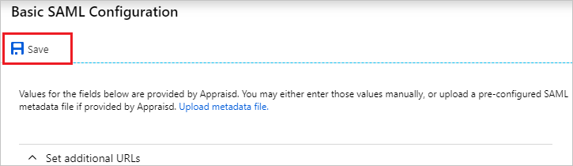
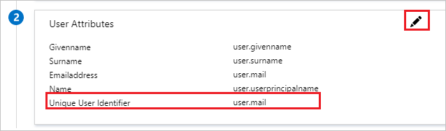
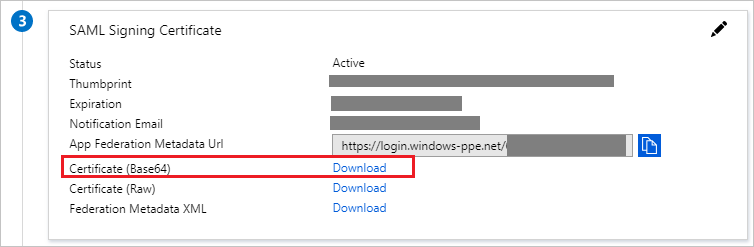
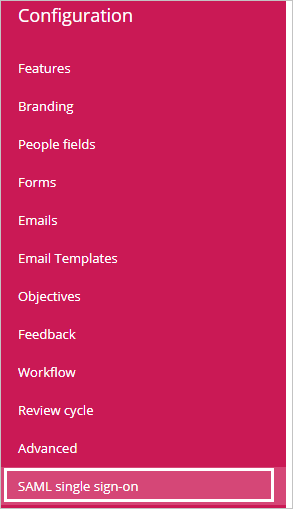
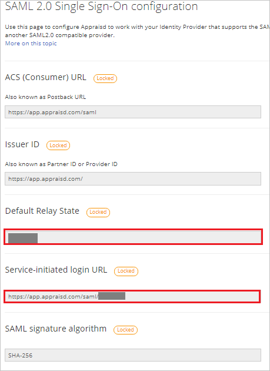
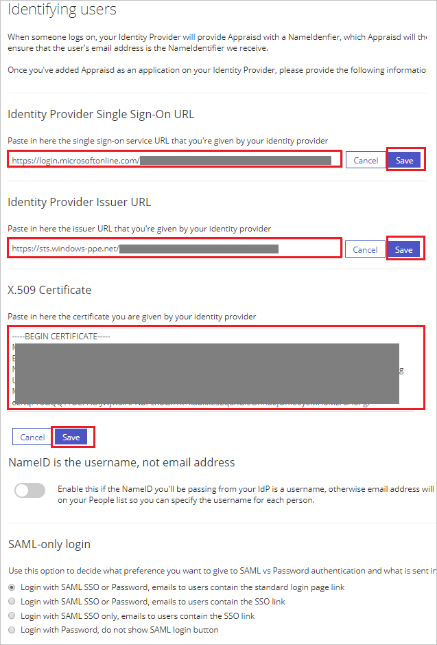
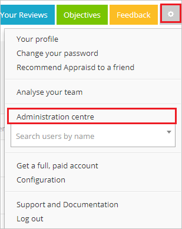
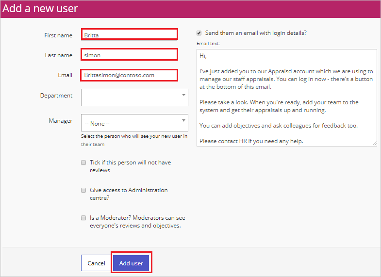
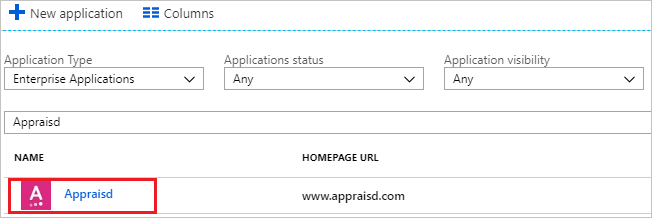

# Tutorial: Azure Active Directory integration with Appraisd

In this tutorial, you learn how to integrate Appraisd with Azure Active Directory (Azure AD).

Integrating Appraisd with Azure AD provides you with the following benefits:

- You can control in Azure AD who has access to Appraisd.
- You can enable your users to automatically get signed-on to Appraisd (Single Sign-On) with their Azure AD accounts.
- You can manage your accounts in one central location - the Azure portal.

If you want to know more details about SaaS app integration with Azure AD, see [what is application access and single sign-on with Azure Active Directory](../manage-apps/what-is-single-sign-on.md).

## Prerequisites

To configure Azure AD integration with Appraisd, you need the following items:

- An Azure AD subscription
- An Appraisd single sign-on enabled subscription

> [!NOTE]
> To test the steps in this tutorial, we do not recommend using a production environment.

To test the steps in this tutorial, you should follow these recommendations:

- Do not use your production environment, unless it is necessary.
- If you don't have an Azure AD trial environment, you can [get a one-month trial](https://azure.microsoft.com/pricing/free-trial/).

## Scenario description
In this tutorial, you test Azure AD single sign-on in a test environment. 
The scenario outlined in this tutorial consists of two main building blocks:

1. Adding Appraisd from the gallery
2. Configuring and testing Azure AD single sign-on

## Adding Appraisd from the gallery
To configure the integration of Appraisd into Azure AD, you need to add Appraisd from the gallery to your list of managed SaaS apps.

**To add Appraisd from the gallery, perform the following steps:**

1. In the **[Azure portal](https://portal.azure.com)**, on the left navigation panel, click **Azure Active Directory** icon. 

	

2. Navigate to **Enterprise applications**. Then go to **All applications**.

	
	
3. To add new application, click **New application** button on the top of dialog.

	

4. In the search box, type **Appraisd**, select **Appraisd** from result panel then click **Add** button to add the application.

	 

## Configure and test Azure AD single sign-on

In this section, you configure and test Azure AD single sign-on with Appraisd based on a test user called "Britta Simon".

For single sign-on to work, Azure AD needs to know what the counterpart user in Appraisd is to a user in Azure AD. In other words, a link relationship between an Azure AD user and the related user in Appraisd needs to be established.

To configure and test Azure AD single sign-on with Appraisd, you need to complete the following building blocks:

1. **[Configure Azure AD Single Sign-On](#configure-azure-ad-single-sign-on)** - to enable your users to use this feature.
2. **[Create an Azure AD test user](#create-an-azure-ad-test-user)** - to test Azure AD single sign-on with Britta Simon.
3. **[Create an Appraisd test user](#create-an-appraisd-test-user)** - to have a counterpart of Britta Simon in Appraisd that is linked to the Azure AD representation of user.
4. **[Assign the Azure AD test user](#assign-the-azure-ad-test-user)** - to enable Britta Simon to use Azure AD single sign-on.
5. **[Test single sign-on](#test-single-sign-on)** - to verify whether the configuration works.

### Configure Azure AD single sign-on

In this section, you enable Azure AD single sign-on in the Azure portal and configure single sign-on in your Appraisd application.

**To configure Azure AD single sign-on with Appraisd, perform the following steps:**

1. In the [Azure portal](https://portal.azure.com/), on the **Appraisd** application integration page, select **Single sign-on**.

    

2. On the **Select a Single sign-on method** dialog, select **SAML** mode to enable single sign-on.

    

3. On the **Set up Single Sign-On with SAML** page, click **Edit** button to open **Basic SAML Configuration** dialog.

	

4. On the **Basic SAML Configuration** section, perform the following steps, if you wish to configure the application in **IDP** initiated mode:

    

	a. Click **Set additional URLs**. 

	b. In the **Relay State** text box, type a URL: `<TENANTCODE>`

	c. If you wish to configure the application in **SP** initiated mode, in the **Sign-on URL** text box, type a URL using the following pattern:
    `https://app.appraisd.com/saml/<TENANTCODE>`

    > [!NOTE]
	> You get the actual Sign-on URL and Relay State value on the Appraisd SSO Configuration page which is explained later in the tutorial.
	
5. Appraisd application expects the SAML assertions in a specific format. Configure the following claims for this application. You can manage the values of these attributes from the **User Attributes** section on application integration page. Click **Edit** button to open **User Attributes** dialog.

	

6. In the **User Claims** section on the **User Attributes** dialog, configure SAML token attribute as shown in the image above and perform the following steps:
    
	a. Click **Edit** button to open the **Manage user claims** dialog.

	

	

	b. From the **Source attribute** list, select the attribute value.

	c. Click **Save**. 

7. In the **SAML Signing Certificate** section, click **Download** to download the **Certificate (Base64)** and save it on your computer.

	 

8. On the **Set up Appraisd** section, copy the appropriate URL as per your requirement.

	a. Login URL

	b. Azure Ad Identifier

	c. Logout URL

	

9. In a different web browser window, sign in to Appraisd as a Security Administrator.

10. On the top right of the page, click on **Settings** icon, then navigate to **Configuration**.

	

11. From the Left side of menu, click on **SAML single sign-on**.

	

12. On the **SAML 2.0 Single Sign-On configuration** page, perform the following steps:
	
	

	a. Copy the **Default Relay State** value and paste it in **Relay State** textbox in **Basic SAML Configuration** on Azure portal.

	b. Copy the **Service-initiated login URL** value and paste it in **Sign-on URL** textbox in **Basic SAML Configuration** on Azure portal.

13. Scroll down the same page under **Identifying users**, perform the following steps:

	

	a. In the **Identity Provider Single Sign-On URL** textbox, paste the value of **Login URL**, which you have copied from the Azure portal and click **Save**.

	b. In the **Identity Provider Issuer URL** textbox, paste the value of **Azure Ad Identifier**, which you have copied from the Azure portal and click **Save**.

	c. In Notepad, open the base-64 encoded certificate that you downloaded from the Azure portal, copy its content, and then paste it into the **X.509 Certificate** box and click **Save**.

### Create an Azure AD test user

The objective of this section is to create a test user in the Azure portal called Britta Simon.

1. In the Azure portal, in the left pane, select **Azure Active Directory**, select **Users**, and then select **All users**.

    

2. Select **New user** at the top of the screen.

    

3. In the User properties, perform the following steps.

    

    a. In the **Name** field, enter **BrittaSimon**.
  
    b. In the **User name** field type **brittasimon@yourcompanydomain.extension**  
    For example, BrittaSimon@contoso.com

    c. Select **Properties**, select the **Show password** check box, and then write down the value that's displayed in the Password box.

    d. Select **Create**.
 
### Create an Appraisd test user

To enable Azure AD users sign in to Appraisd, they must be provisioned into Appraisd. In Appraisd, provisioning is a manual task.

**To provision a user account, perform the following steps:**

1. Sign in to Appraisd as a Security Administrator.

2. On the top right of the page, click on **Settings** icon, then navigate to **Administration centre**.

	

3. In the toolbar at the top of the page, click **People**, then navigate to **Add a new user**.

	

4. On the **Add a new user** page, perform the following steps:

	
	
	a. In **First name** text box, enter the first name of user like **Britta**.

	b. In **Last name** text box, enter the last name of user like **simon**.

	c. In **Email** text box, enter the email of user like **Brittasimon@contoso.com**.

	d. Click **Add user**.

### Assign the Azure AD test user

In this section, you enable Britta Simon to use Azure single sign-on by granting access to Appraisd.

1. In the Azure portal, select **Enterprise Applications**, select **All applications**.

	

2. In the applications list, select **Appraisd**.

	

3. In the menu on the left, select **Users and groups**.

    

4. Select the **Add** button, then select **Users and groups** in the **Add Assignment** dialog.

    

4. In the **Users and groups** dialog select **Britta Simon** in the Users list, then click the **Select** button at the bottom of the screen.

5. In the **Add Assignment** dialog, select the **Assign** button.
	
### Test single sign-on

In this section, you test your Azure AD single sign-on configuration using the Access Panel.

When you click the Appraisd tile in the Access Panel, you should get automatically signed-on to your Appraisd application.
For more information about the Access Panel, see [Introduction to the Access Panel](../active-directory-saas-access-panel-introduction.md). 

## Additional resources

* [List of Tutorials on How to Integrate SaaS Apps with Azure Active Directory](tutorial-list.md)
* [What is application access and single sign-on with Azure Active Directory?](../manage-apps/what-is-single-sign-on.md)
