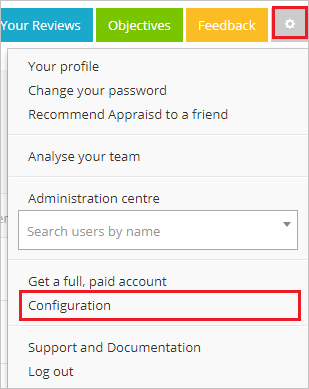
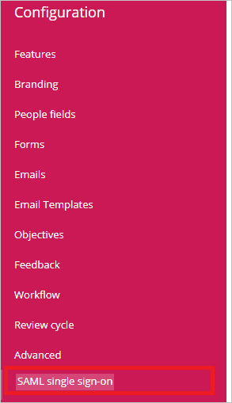
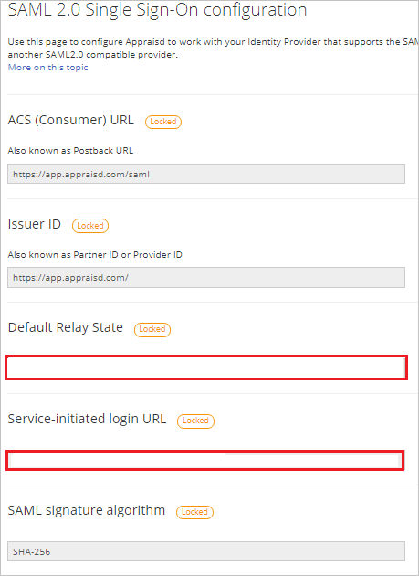
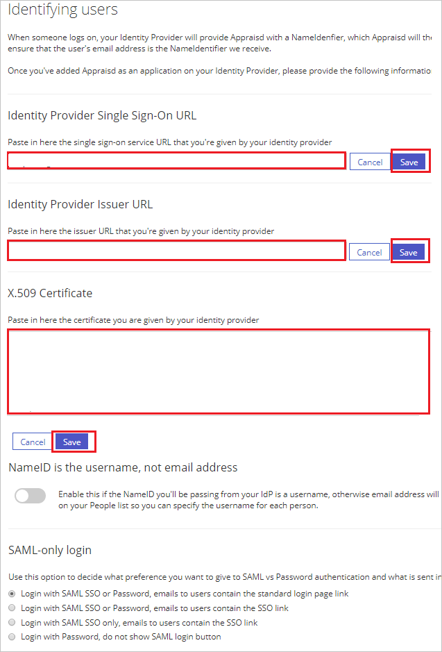
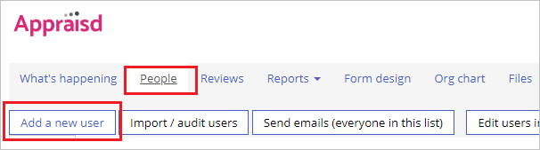

# Tutorial: Integrate Appraisd with Microsoft Entra ID

In this tutorial, you'll learn how to integrate Appraisd with Microsoft Entra ID. When you integrate Appraisd with Microsoft Entra ID, you can:

* Control in Microsoft Entra ID who has access to Appraisd.
* Enable your users to be automatically signed-in to Appraisd with their Microsoft Entra accounts.
* Manage your accounts in one central location.

## Prerequisites

To get started, you need the following items:

* A Microsoft Entra subscription. If you don't have a subscription, you can get a [free account](https://azure.microsoft.com/free/).
* Appraisd single sign-on (SSO) enabled subscription.

## Scenario description

In this tutorial, you configure and test Microsoft Entra SSO in a test environment. 

* Appraisd supports **SP and IDP** initiated SSO.

## Add Appraisd from the gallery

To configure the integration of Appraisd into Microsoft Entra ID, you need to add Appraisd from the gallery to your list of managed SaaS apps.

1. Sign in to the [Microsoft Entra admin center](https://entra.microsoft.com) as at least a [Cloud Application Administrator](../roles/permissions-reference.md#cloud-application-administrator).
1. Browse to **Identity** > **Applications** > **Enterprise applications** > **New application**.
1. In the **Add from the gallery** section, type **Appraisd** in the search box.
1. Select **Appraisd** from results panel and then add the app. Wait a few seconds while the app is added to your tenant.

 Alternatively, you can also use the [Enterprise App Configuration Wizard](https://portal.office.com/AdminPortal/home?Q=Docs#/azureadappintegration). In this wizard, you can add an application to your tenant, add users/groups to the app, assign roles, as well as walk through the SSO configuration as well. [Learn more about Microsoft 365 wizards.](/microsoft-365/admin/misc/azure-ad-setup-guides)

## Configure and test Microsoft Entra SSO for Appraisd

Configure and test Microsoft Entra SSO with Appraisd using a test user called **B. Simon**. For SSO to work, you need to establish a link relationship between a Microsoft Entra user and the related user in Appraisd.

To configure and test Microsoft Entra SSO with Appraisd, perform the following steps:

1. **[Configure Microsoft Entra SSO](#configure-azure-ad-sso)** - to enable your users to use this feature.
    1. **[Create a Microsoft Entra test user](#create-an-azure-ad-test-user)** - to test Microsoft Entra single sign-on with B.Simon.
    1. **[Assign the Microsoft Entra test user](#assign-the-azure-ad-test-user)** - to enable B.Simon to use Microsoft Entra single sign-on.
1. **[Configure Appraisd SSO](#configure-appraisd-sso)** - to configure the single sign-on settings on application side.
    1. **[Create Appraisd test user](#create-appraisd-test-user)** - to have a counterpart of B.Simon in Appraisd that is linked to the Microsoft Entra representation of user.
1. **[Test SSO](#test-sso)** - to verify whether the configuration works.

## Configure Microsoft Entra SSO

Follow these steps to enable Microsoft Entra SSO.

1. Sign in to the [Microsoft Entra admin center](https://entra.microsoft.com) as at least a [Cloud Application Administrator](../roles/permissions-reference.md#cloud-application-administrator).
1. Browse to **Identity** > **Applications** > **Enterprise applications** > **Appraisd** application integration page, find the **Manage** section and select **Single sign-on**.
1. On the **Select a Single sign-on method** page, select **SAML**.
1. On the **Set up Single Sign-On with SAML** page, click the pencil icon for **Basic SAML Configuration** to edit the settings.

   

1. On the **Basic SAML Configuration** section, the application is pre-configured and the necessary URLs are already pre-populated with Azure. The user needs to save the configuration by clicking the Save button and perform the following steps:

    a. Click **Set additional URLs**.

	b. In the **Relay State** text box, type the value: `<TENANTCODE>`

	c. If you wish to configure the application in **SP** initiated mode, in the **Sign-on URL** text box, type a URL using the following pattern:
    `https://app.appraisd.com/saml/<TENANTCODE>`

    > [!NOTE]
	> You get the actual Sign-on URL and Relay State value on the Appraisd SSO Configuration page which is explained later in the tutorial.

1. Appraisd application expects the SAML assertions in a specific format, which requires you to add custom attribute mappings to your SAML token attributes configuration. The following screenshot shows the list of default attributes, where as **nameidentifier** is mapped with **user.userprincipalname**. Appraisd application expects **nameidentifier** to be mapped with **user.mail**, so you need to edit the attribute mapping by clicking on **Edit** icon and change the attribute mapping.

	

1. On the **Set up Single Sign-On with SAML** page, in the **SAML Signing Certificate** section, find **Certificate (Base64)** and select **Download** to download the certificate and save it on your computer.

   

1. On the **Set up Appraisd** section, copy the appropriate URL(s) based on your requirement.

   

### Create a Microsoft Entra test user

In this section, you'll create a test user called B. Simon.

1. Sign in to the [Microsoft Entra admin center](https://entra.microsoft.com) as at least a [User Administrator](../roles/permissions-reference.md#user-administrator).
1. Browse to **Identity** > **Users** > **All users**.
1. Select **New user** > **Create new user**, at the top of the screen.
1. In the **User** properties, follow these steps:
   1. In the **Display name** field, enter `B.Simon`.  
   1. In the **User principal name** field, enter the username@companydomain.extension. For example, `B.Simon@contoso.com`.
   1. Select the **Show password** check box, and then write down the value that's displayed in the **Password** box.
   1. Select **Review + create**.
1. Select **Create**.

### Assign the Microsoft Entra test user

In this section, you'll enable B. Simon to use Azure single sign-on by granting access to Appraisd.

1. Sign in to the [Microsoft Entra admin center](https://entra.microsoft.com) as at least a [Cloud Application Administrator](../roles/permissions-reference.md#cloud-application-administrator).
1. Browse to **Identity** > **Applications** > **Enterprise applications** > **Appraisd**.
1. In the app's overview page, find the **Manage** section and select **Users and groups**.
1. Select **Add user**, then select **Users and groups** in the **Add Assignment** dialog.
1. In the **Users and groups** dialog, select **B. Simon** from the Users list, then click the **Select** button at the bottom of the screen.
1. If you're expecting any role value in the SAML assertion, in the **Select Role** dialog, select the appropriate role for the user from the list and then click the **Select** button at the bottom of the screen.
1. In the **Add Assignment** dialog, click the **Assign** button.

## Configure Appraisd SSO

1. In a different web browser window, sign in to your Appraisd company site as an administrator

4. On the top right of the page, click on **Settings** icon, then navigate to **Configuration**.

	

5. From the Left side of menu, click on **SAML single sign-on**.

	

6. On the **SAML 2.0 Single Sign-On configuration** page, perform the following steps:

	

	a. Copy the **Default Relay State** value and paste it in **Relay State** textbox in **Basic SAML Configuration** on Azure portal.

	b. Copy the **Service-initiated login URL** value and paste it in **Sign-on URL** textbox in **Basic SAML Configuration** on Azure portal.

7. Scroll down the same page under **Identifying users**, perform the following steps:

	

	a. In the **Identity Provider Single Sign-On URL** textbox, paste the value of **Login URL**, which you have copied and click **Save**.

	b. In the **Identity Provider Issuer URL** textbox, paste the value of **Microsoft Entra Identifier**, which you have copied and click **Save**.

	c. In Notepad, open the base-64 encoded certificate that you downloaded, copy its content, and then paste it into the **X.509 Certificate** box and click **Save**.

### Create Appraisd test user

To enable Microsoft Entra users sign in to Appraisd, they must be provisioned into Appraisd. In Appraisd, provisioning is a manual task.

**To provision a user account, perform the following steps:**

1. Sign in to Appraisd as a Security Administrator.

2. On the top right of the page, click on **Settings** icon, then navigate to **Administration center**.

	

3. In the toolbar at the top of the page, click **People**, then navigate to **Add a new user**.

	

4. On the **Add a new user** page, perform the following steps:

	

	a. In **First name** text box, enter the first name of user like **Britta**.

	b. In **Last name** text box, enter the last name of user like **simon**.

	c. In **Email** text box, enter the email of user like `B. Simon@contoso.com`.

	d. Click **Add user**.

## Test SSO

In this section, you test your Microsoft Entra single sign-on configuration with following options. 

#### SP initiated:

* Click on **Test this application**, this will redirect to Appraisd Sign on URL where you can initiate the login flow.  

* Go to Appraisd Sign-on URL directly and initiate the login flow from there.

#### IDP initiated:

* Click on **Test this application**, and you should be automatically signed in to the Appraisd for which you set up the SSO. 

You can also use Microsoft My Apps to test the application in any mode. When you click the Appraisd tile in the My Apps, if configured in SP mode you would be redirected to the application sign on page for initiating the login flow and if configured in IDP mode, you should be automatically signed in to the Appraisd for which you set up the SSO. For more information about the My Apps, see [Introduction to the My Apps](https://support.microsoft.com/account-billing/sign-in-and-start-apps-from-the-my-apps-portal-2f3b1bae-0e5a-4a86-a33e-876fbd2a4510).

## Next steps

Once you configure Appraisd you can enforce session control, which protects exfiltration and infiltration of your organization’s sensitive data in real time. Session control extends from Conditional Access. [Learn how to enforce session control with Microsoft Defender for Cloud Apps](/cloud-app-security/proxy-deployment-aad).
