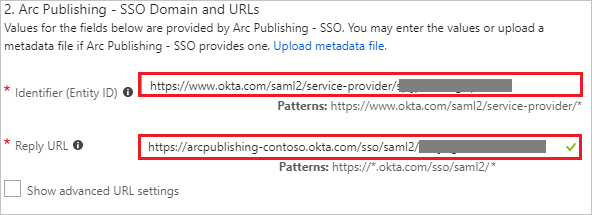
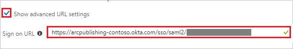
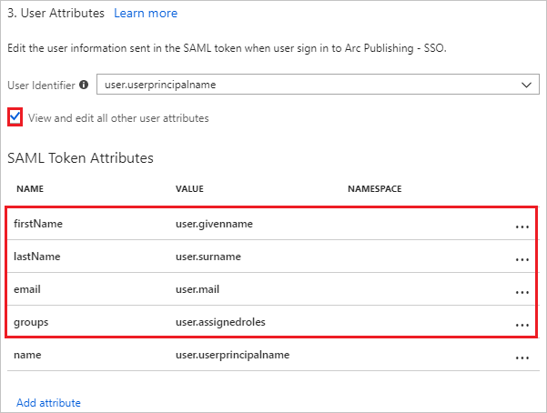
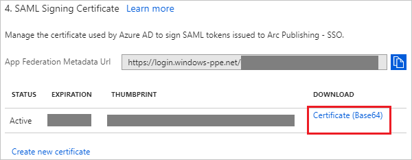
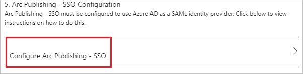

# Tutorial: Azure Active Directory integration with Arc Publishing - SSO

In this tutorial, you learn how to integrate Arc Publishing - SSO with Azure Active Directory (Azure AD).

Integrating Arc Publishing - SSO with Azure AD provides you with the following benefits:

- You can control in Azure AD who has access to Arc Publishing - SSO.
- You can enable your users to automatically get signed-on to Arc Publishing - SSO (Single Sign-On) with their Azure AD accounts.
- You can manage your accounts in one central location - the Azure portal.

If you want to know more details about SaaS app integration with Azure AD, see [what is application access and single sign-on with Azure Active Directory](../manage-apps/what-is-single-sign-on.md).

## Prerequisites

To configure Azure AD integration with Arc Publishing - SSO, you need the following items:

- An Azure AD subscription
- An Arc Publishing - SSO single sign-on enabled subscription

> [!NOTE]
> To test the steps in this tutorial, we do not recommend using a production environment.

To test the steps in this tutorial, you should follow these recommendations:

- Do not use your production environment, unless it is necessary.
- If you don't have an Azure AD trial environment, you can [get a one-month trial](https://azure.microsoft.com/pricing/free-trial/).

## Scenario description
In this tutorial, you test Azure AD single sign-on in a test environment. 
The scenario outlined in this tutorial consists of two main building blocks:

1. Adding Arc Publishing - SSO from the gallery
1. Configuring and testing Azure AD single sign-on

## Adding Arc Publishing - SSO from the gallery
To configure the integration of Arc Publishing - SSO into Azure AD, you need to add Arc Publishing - SSO from the gallery to your list of managed SaaS apps.

**To add Arc Publishing - SSO from the gallery, perform the following steps:**

1. In the **[Azure portal](https://portal.azure.com)**, on the left navigation panel, click **Azure Active Directory** icon. 

	![The Azure Active Directory button][1]

1. Navigate to **Enterprise applications**. Then go to **All applications**.

	![The Enterprise applications blade][2]
	
1. To add new application, click **New application** button on the top of dialog.

	![The New application button][3]

1. In the search box, type **Arc Publishing - SSO**, select **Arc Publishing - SSO** from result panel then click **Add** button to add the application.

	

## Configure and test Azure AD single sign-on

In this section, you configure and test Azure AD single sign-on with Arc Publishing - SSO based on a test user called "Britta Simon".

For single sign-on to work, Azure AD needs to know what the counterpart user in Arc Publishing - SSO is to a user in Azure AD. In other words, a link relationship between an Azure AD user and the related user in Arc Publishing - SSO needs to be established.

To configure and test Azure AD single sign-on with Arc Publishing - SSO, you need to complete the following building blocks:

1. **[Configure Azure AD Single Sign-On](#configure-azure-ad-single-sign-on)** - to enable your users to use this feature.
1. **[Create an Azure AD test user](#create-an-azure-ad-test-user)** - to test Azure AD single sign-on with Britta Simon.
1. **[Create an Arc Publishing - SSO test user](#create-an-arc-publishing---sso-test-user)** - to have a counterpart of Britta Simon in Arc Publishing - SSO that is linked to the Azure AD representation of user.
1. **[Assign the Azure AD test user](#assign-the-azure-ad-test-user)** - to enable Britta Simon to use Azure AD single sign-on.
1. **[Test single sign-on](#test-single-sign-on)** - to verify whether the configuration works.

### Configure Azure AD single sign-on

In this section, you enable Azure AD single sign-on in the Azure portal and configure single sign-on in your Arc Publishing - SSO application.

**To configure Azure AD single sign-on with Arc Publishing - SSO, perform the following steps:**

1. In the Azure portal, on the **Arc Publishing - SSO** application integration page, click **Single sign-on**.

	![Configure single sign-on link][4]

1. On the **Single sign-on** dialog, select **Mode** as	**SAML-based Sign-on** to enable single sign-on.
 
	

1. On the **Arc Publishing - SSO Domain and URLs** section, perform the following steps if you wish to configure the application in **IDP** initiated mode:

	

	1. In the **Identifier** textbox, type a URL using the following pattern: `https://www.okta.com/saml2/service-provider/<Unique ID>`

	1. In the **Reply URL** textbox, type a URL using the following pattern: `https://arcpublishing-<Customer>.okta.com/sso/saml2/<Unique ID>`

1. Check **Show advanced URL settings** and perform the following step if you wish to configure the application in **SP** initiated mode:

	

    In the **Sign-on URL** textbox, type a URL using the following pattern: `https://arcpublishing-<Customer>.okta.com/sso/saml2/<Unique ID>`
	 
	> [!NOTE] 
	> These values are not real. Update these values with the actual Identifier, Reply URL, and Sign-On URL. Contact [Arc Publishing - SSO Client support team](mailto:inf@washpost.com) to get these values. 

1. Arc Publishing - SSO application expects the SAML assertions in a specific format. Configure the following claims for this application. You can manage the values of these attributes from the **User Attributes** section on application integration page. The following screenshot shows an example for this.
	
	

1. In the **User Attributes** section on the **Single sign-on** dialog, configure SAML token attribute as shown in the image above and perform the following steps:
    
	| Attribute Name | Attribute Value |
	| ---------------| --------------- |    
	| firstName | user.givenname |
	| lastName | user.surname |
	| email | user.mail |
	| groups | user.assignedroles |

	1. Click **Add attribute** to open the **Add Attribute** dialog.

	 

	 
	
	1. In the **Name** textbox, type the attribute name shown for that row.
	
	1. From the **Value** list, type the attribute value shown for that row.

	1. Leave the **Namespace** blank.
	
	1. Click **Ok**

	> [!NOTE]
	> Here the **groups** attribute is mapped with **user.assignedroles**. These are custom roles created in Azure AD to map the group names back in application. You can find more guidance [here](https://docs.microsoft.com/azure/active-directory/active-directory-enterprise-app-role-management) on how to create custom roles in Azure AD. 

1. On the **SAML Signing Certificate** section, click **Certificate (Base64)** and then save the certificate file on your computer.

	 

1. Click **Save** button.

	
	
1. On the **Arc Publishing - SSO Configuration** section, click **Configure Arc Publishing - SSO** to open **Configure sign-on** window. Copy the **Sign-Out URL, SAML Entity ID, and SAML Single Sign-On Service URL** from the **Quick Reference section.**

	 

1. To configure single sign-on on **Arc Publishing - SSO** side, you need to send the downloaded **Certificate (Base64), Sign-Out URL, SAML Entity ID, and SAML Single Sign-On Service URL** to [Arc Publishing - SSO support team](mailto:inf@washpost.com). They set this setting to have the SAML SSO connection set properly on both sides.

### Create an Azure AD test user

The objective of this section is to create a test user in the Azure portal called Britta Simon.

   ![Create an Azure AD test user][100]

**To create a test user in Azure AD, perform the following steps:**

1. In the Azure portal, in the left pane, click the **Azure Active Directory** button.

    

1. To display the list of users, go to **Users and groups**, and then click **All users**.

    

1. To open the **User** dialog box, click **Add** at the top of the **All Users** dialog box.

    

1. In the **User** dialog box, perform the following steps:

    

    1. In the **Name** box, type **BrittaSimon**.

    1. In the **User name** box, type the email address of user Britta Simon.

    1. Select the **Show Password** check box, and then write down the value that's displayed in the **Password** box.

    1. Click **Create**.
 
### Create an Arc Publishing - SSO test user

The objective of this section is to create a user called Britta Simon in Arc Publishing - SSO. Arc Publishing - SSO supports just-in-time provisioning, which is by default enabled. There is no action item for you in this section. A new user is created during an attempt to access Arc Publishing - SSO if it doesn't exist yet.

>[!Note]
>If you need to create a user manually, contact [Arc Publishing - SSO support team](mailto:inf@washpost.com).

### Assign the Azure AD test user

In this section, you enable Britta Simon to use Azure single sign-on by granting access to Arc Publishing - SSO.

![Assign the user role][200] 

**To assign Britta Simon to Arc Publishing - SSO, perform the following steps:**

1. In the Azure portal, open the applications view, and then navigate to the directory view and go to **Enterprise applications** then click **All applications**.

	![Assign User][201] 

1. In the applications list, select **Arc Publishing - SSO**.

	  

1. In the menu on the left, click **Users and groups**.

	![The "Users and groups" link][202]

1. Click **Add** button. Then select **Users and groups** on **Add Assignment** dialog.

	![The Add Assignment pane][203]

1. On **Users and groups** dialog, select **Britta Simon** in the Users list.

1. Click **Select** button on **Users and groups** dialog.

1. Click **Assign** button on **Add Assignment** dialog.
	
### Test single sign-on

In this section, you test your Azure AD single sign-on configuration using the Access Panel.

When you click the Arc Publishing - SSO tile in the Access Panel, you should get automatically signed-on to your Arc Publishing - SSO application.
For more information about the Access Panel, see [Introduction to the Access Panel](../user-help/active-directory-saas-access-panel-introduction.md). 

## Additional resources

* [List of Tutorials on How to Integrate SaaS Apps with Azure Active Directory](tutorial-list.md)
* [What is application access and single sign-on with Azure Active Directory?](../manage-apps/what-is-single-sign-on.md)

<!--Image references-->

[1]: ./media/arc-tutorial/tutorial_general_01.png
[2]: ./media/arc-tutorial/tutorial_general_02.png
[3]: ./media/arc-tutorial/tutorial_general_03.png
[4]: ./media/arc-tutorial/tutorial_general_04.png

[100]: ./media/arc-tutorial/tutorial_general_100.png

[200]: ./media/arc-tutorial/tutorial_general_200.png
[201]: ./media/arc-tutorial/tutorial_general_201.png
[202]: ./media/arc-tutorial/tutorial_general_202.png
[203]: ./media/arc-tutorial/tutorial_general_203.png

