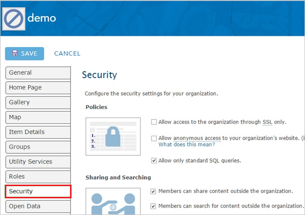
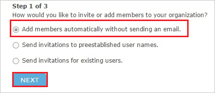

# Tutorial: Azure Active Directory integration with ArcGIS Online

In this tutorial, you'll learn how to integrate ArcGIS Online with Azure Active Directory (Azure AD). When you integrate ArcGIS Online with Azure AD, you can:

* Control in Azure AD who has access to ArcGIS Online.
* Enable your users to be automatically signed-in to ArcGIS Online with their Azure AD accounts.
* Manage your accounts in one central location - the Azure portal.

## Prerequisites

To get started, you need the following items:

* An Azure AD subscription. If you don't have a subscription, you can get a [free account](https://azure.microsoft.com/free/).
* ArcGIS Online single sign-on (SSO) enabled subscription.

> [!NOTE]
> This integration is also available to use from Azure AD US Government Cloud environment. You can find this application in the Azure AD US Government Cloud Application Gallery and configure it in the same way as you do from public cloud.

## Scenario description

In this tutorial, you configure and test Azure AD single sign-on in a test environment.

* ArcGIS Online supports **SP** initiated SSO.

## Add ArcGIS Online from the gallery

To configure the integration of ArcGIS Online into Azure AD, you need to add ArcGIS Online from the gallery to your list of managed SaaS apps.

1. Sign in to the Azure portal using either a work or school account, or a personal Microsoft account.
1. On the left navigation pane, select the **Azure Active Directory** service.
1. Navigate to **Enterprise Applications** and then select **All Applications**.
1. To add new application, select **New application**.
1. In the **Add from the gallery** section, type **ArcGIS Online** in the search box.
1. Select **ArcGIS Online** from results panel and then add the app. Wait a few seconds while the app is added to your tenant.

## Configure and test Azure AD SSO for ArcGIS Online

Configure and test Azure AD SSO with ArcGIS Online using a test user called **B.Simon**. For SSO to work, you need to establish a link relationship between an Azure AD user and the related user in ArcGIS Online.

To configure and test Azure AD SSO with ArcGIS Online, perform the following steps:

1. **[Configure Azure AD SSO](#configure-azure-ad-sso)** - to enable your users to use this feature.
    1. **[Create an Azure AD test user](#create-an-azure-ad-test-user)** - to test Azure AD single sign-on with B.Simon.
    1. **[Assign the Azure AD test user](#assign-the-azure-ad-test-user)** - to enable B.Simon to use Azure AD single sign-on.
1. **[Configure ArcGIS Online SSO](#configure-arcgis-online-sso)** - to configure the single sign-on settings on application side.
    1. **[Create ArcGIS Online test user](#create-arcgis-online-test-user)** - to have a counterpart of B.Simon in ArcGIS Online that is linked to the Azure AD representation of user.
1. **[Test SSO](#test-sso)** - to verify whether the configuration works.

## Configure Azure AD SSO

Follow these steps to enable Azure AD SSO in the Azure portal.

1. In the Azure portal, on the **ArcGIS Online** application integration page, find the **Manage** section and select **single sign-on**.
1. On the **Select a single sign-on method** page, select **SAML**.
1. On the **Set up single sign-on with SAML** page, click the pencil icon for **Basic SAML Configuration** to edit the settings.

   

4. On the **Basic SAML Configuration** section, perform the following steps:

    a. In the **Sign on URL** text box, type a URL using the following pattern:
    `https://<companyname>.maps.arcgis.com`

    b. In the **Identifier (Entity ID)** text box, type a URL using the following pattern:
    `<companyname>.maps.arcgis.com`

    > [!NOTE]
    > These values are not real. Update these values with the actual Sign on URL and Identifier. Contact [ArcGIS Online Client support team](https://support.esri.com/en/) to get these values. You can also refer to the patterns shown in the **Basic SAML Configuration** section in the Azure portal.

5. On the **Set up Single Sign-On with SAML** page, in the **SAML Signing Certificate** section, click **Download** to download the **Federation Metadata XML** from the given options as per your requirement and save it on your computer.

    

6. To automate the configuration within **ArcGIS Online**, you need to install **My Apps Secure Sign-in browser extension** by clicking **Install the extension**.

    

7. After adding extension to the browser, click on **setup ArcGIS Online** will direct you to the ArcGIS Online application. From there, provide the admin credentials to sign into ArcGIS Online. The browser extension will automatically configure the application for you and automate steps in section **Configure ArcGIS Online Single Sign-On**.

### Create an Azure AD test user 

In this section, you'll create a test user in the Azure portal called B.Simon.

1. From the left pane in the Azure portal, select **Azure Active Directory**, select **Users**, and then select **All users**.
1. Select **New user** at the top of the screen.
1. In the **User** properties, follow these steps:
   1. In the **Name** field, enter `B.Simon`.  
   1. In the **User name** field, enter the username@companydomain.extension. For example, `B.Simon@contoso.com`.
   1. Select the **Show password** check box, and then write down the value that's displayed in the **Password** box.
   1. Click **Create**.

### Assign the Azure AD test user

In this section, you'll enable B.Simon to use Azure single sign-on by granting access to ArcGIS Online.

1. In the Azure portal, select **Enterprise Applications**, and then select **All applications**.
1. In the applications list, select **ArcGIS Online**.
1. In the app's overview page, find the **Manage** section and select **Users and groups**.
1. Select **Add user**, then select **Users and groups** in the **Add Assignment** dialog.
1. In the **Users and groups** dialog, select **B.Simon** from the Users list, then click the **Select** button at the bottom of the screen.
1. If you are expecting a role to be assigned to the users, you can select it from the **Select a role** dropdown. If no role has been set up for this app, you see "Default Access" role selected.
1. In the **Add Assignment** dialog, click the **Assign** button.

## Configure ArcGIS Online SSO

1. If you want to setup ArcGIS Online manually, open a new web browser window and log into your ArcGIS company site as an administrator and perform the following steps:

2. Click **EDIT SETTINGS**.

    

3. Click **Security**.

    

4. Under **Enterprise Logins**, click **SET IDENTITY PROVIDER**.

    

5. On the **Set Identity Provider** configuration page, perform the following steps:

    

    a. In the **Name** textbox, type your organization’s name.

    b. For **Metadata for the Enterprise Identity Provider will be supplied using**, select **A File**.

    c. To upload your downloaded metadata file, click **Choose file**.

    d. Click **SET IDENTITY PROVIDER**.

### Create ArcGIS Online test user

In order to enable Azure AD users to log into ArcGIS Online, they must be provisioned into ArcGIS Online.  
In the case of ArcGIS Online, provisioning is a manual task.

**To provision a user account, perform the following steps:**

1. Log in to your **ArcGIS** tenant.

2. Click **INVITE MEMBERS**.

    

3. Select **Add members automatically without sending an email**, and then click **NEXT**.

    

4. On the **Members** dialog page, perform the following steps:

    

     a. Enter the **Email**, **First Name**, and **Last Name** of a valid Azure AD account you want to provision.

     b. Click **ADD AND REVIEW**.
5. Review the data you have entered, and then click **ADD MEMBERS**.

    

    > [!NOTE]
    > The Azure Active Directory account holder will receive an email and follow a link to confirm their account before it becomes active.

## Test SSO

In this section, you test your Azure AD single sign-on configuration with following options. 

* Click on **Test this application** in Azure portal. This will redirect to ArcGIS Online Sign-on URL where you can initiate the login flow. 

* Go to ArcGIS Online Sign-on URL directly and initiate the login flow from there.

* You can use Microsoft My Apps. When you click the ArcGIS Online tile in the My Apps, this will redirect to ArcGIS Online Sign-on URL. For more information about the My Apps, see [Introduction to the My Apps](../user-help/my-apps-portal-end-user-access.md).

## Next steps

Once you configure ArcGIS Online you can enforce session control, which protects exfiltration and infiltration of your organization’s sensitive data in real time. Session control extends from Conditional Access. [Learn how to enforce session control with Microsoft Cloud App Security](/cloud-app-security/proxy-deployment-any-app).