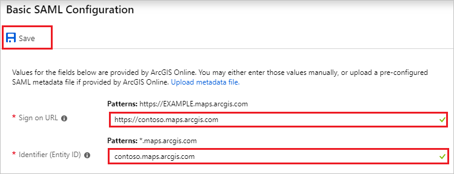
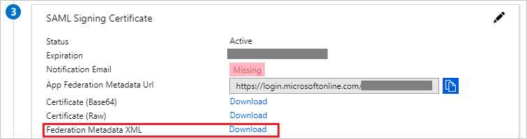
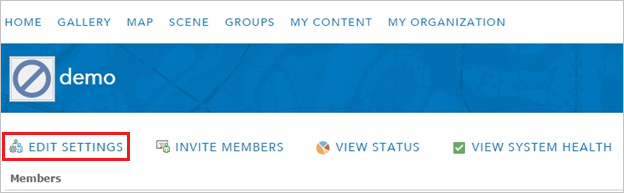
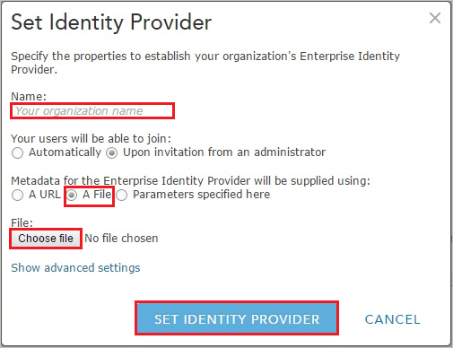
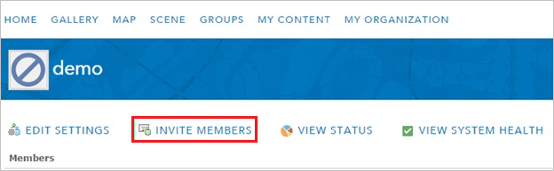
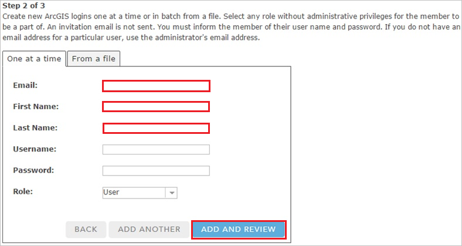
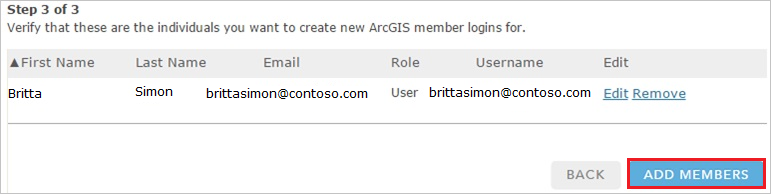
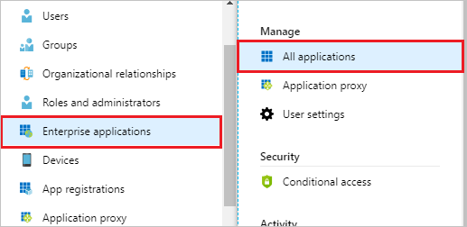

# Tutorial: Azure Active Directory integration with ArcGIS Online

In this tutorial, you learn how to integrate ArcGIS Online with Azure Active Directory (Azure AD).

Integrating ArcGIS Online with Azure AD provides you with the following benefits:

- You can control in Azure AD who has access to ArcGIS Online.
- You can enable your users to automatically get signed-on to ArcGIS Online (Single Sign-On) with their Azure AD accounts.
- You can manage your accounts in one central location - the Azure portal.

If you want to know more details about SaaS app integration with Azure AD, see [what is application access and single sign-on with Azure Active Directory](../manage-apps/what-is-single-sign-on.md).

## Prerequisites

To configure Azure AD integration with ArcGIS Online, you need the following items:

- An Azure AD subscription
- An ArcGIS Online single sign-on enabled subscription

> [!NOTE]
> To test the steps in this tutorial, we do not recommend using a production environment.

To test the steps in this tutorial, you should follow these recommendations:

- Do not use your production environment, unless it is necessary.
- If you don't have an Azure AD trial environment, you can [get a one-month trial](https://azure.microsoft.com/pricing/free-trial/).

## Scenario description

In this tutorial, you test Azure AD single sign-on in a test environment.
The scenario outlined in this tutorial consists of two main building blocks:

1. Adding ArcGIS Online from the gallery
2. Configuring and testing Azure AD single sign-on

## Adding ArcGIS Online from the gallery

To configure the integration of ArcGIS Online into Azure AD, you need to add ArcGIS Online from the gallery to your list of managed SaaS apps.

**To add ArcGIS Online from the gallery, perform the following steps:**

1. In the **[Azure portal](https://portal.azure.com)**, on the left navigation panel, click **Azure Active Directory** icon. 

	

2. Navigate to **Enterprise applications**. Then go to **All applications**.

	
	
3. To add new application, click **New application** button on the top of dialog.

	

4. In the search box, type **ArcGIS Online**, select **ArcGIS Online** from result panel then click **Add** button to add the application.

	 

## Configure and test Azure AD single sign-on

In this section, you configure and test Azure AD single sign-on with ArcGIS Online based on a test user called "Britta Simon".

For single sign-on to work, Azure AD needs to know what the counterpart user in ArcGIS Online is to a user in Azure AD. In other words, a link relationship between an Azure AD user and the related user in ArcGIS Online needs to be established.

In ArcGIS Online, assign the value of the **user name** in Azure AD as the value of the **Username** to establish the link relationship.

To configure and test Azure AD single sign-on with ArcGIS Online, you need to complete the following building blocks:

1. **[Configure Azure AD Single Sign-On](#configure-azure-ad-single-sign-on)** - to enable your users to use this feature.
2. **[Create an Azure AD test user](#create-an-azure-ad-test-user)** - to test Azure AD single sign-on with Britta Simon.
3. **[Create an ArcGIS Online test user](#create-an-arcgis-online-test-user)** - to have a counterpart of Britta Simon in ArcGIS Online that is linked to the Azure AD representation of user.
4. **[Assign the Azure AD test user](#assign-the-azure-ad-test-user)** - to enable Britta Simon to use Azure AD single sign-on.
5. **[Test single sign-on](#test-single-sign-on)** - to verify whether the configuration works.

### Configure Azure AD single sign-on

In this section, you enable Azure AD single sign-on in the Azure portal and configure single sign-on in your ArcGIS Online application.

**To configure Azure AD single sign-on with ArcGIS Online, perform the following steps:**

1. In the [Azure portal](https://portal.azure.com/), on the **ArcGIS Online** application integration page, select **Single sign-on**.

    

2. Click **Change Single sign-on mode** on top of the screen to select the **SAML** mode.

	  

3. On the **Select a Single sign-on method** dialog, Click **Select** for **SAML** mode to enable single sign-on.

    

4. On the **Set up Single Sign-On with SAML** page, click **Edit** button to open **Basic SAML Configuration** dialog.

	

5. On the **Basic SAML Configuration** section, perform the following steps:

	a. In the **Sign-on URL** text box, type a URL using the following pattern:
    `https://<companyname>.maps.arcgis.com`.

    b. In the **Identifier** text box, type a URL using the following pattern:
    `<companyname>.maps.arcgis.com`.

    

	> [!NOTE] 
	> These values are not real. Update these values with the actual Sign-On URL and Identifier. Contact [ArcGIS Online Client support team](http://support.esri.com/en/) to get these values.

6. On the **SAML Signing Certificate** section, Click on **Download** to download **Federation Metadata XML** and then save the xml file on your computer.

    

7. To automate the configuration within **ArcGIS Online**, you need to install **My Apps Secure Sign-in browser extension** by clicking **Install the extension**.

	

8. After adding extension to the browser, click on **setup ArcGIS Online** will direct you to the ArcGIS Online application. From there, provide the admin credentials to sign into ArcGIS Online. The browser extension will automatically configure the application for you and automate steps 9-13.

9. If you want to setup ArcGIS Online manually, open a new web browser window and log into your ArcGIS company site as an administrator and perform the following steps:

10. Click **EDIT SETTINGS**.

    

11. Click **Security**.

    

12. Under **Enterprise Logins**, click **SET IDENTITY PROVIDER**.

    

13. On the **Set Identity Provider** configuration page, perform the following steps:

    

    a. In the **Name** textbox, type your organization’s name.

    b. For **Metadata for the Enterprise Identity Provider will be supplied using**, select **A File**.

    c. To upload your downloaded metadata file, click **Choose file**.

    d. Click **SET IDENTITY PROVIDER**.

### Create an Azure AD test user 

The objective of this section is to create a test user in the Azure portal called Britta Simon.

1. In the Azure portal, in the left pane, select **Azure Active Directory**, select **Users**, and then select **All users**.

    

2. Select **New user** at the top of the screen.

    

3. In the User properties, perform the following steps.

    

    a. In the **Name** field enter **BrittaSimon**.
  
    b. In the **User name** field type **brittasimon@yourcompanydomain.extension**  
    For example, BrittaSimon@contoso.com

    c. Select **Properties**, select the **Show password** check box, and then write down the value that's displayed in the Password box.

    d. Select **Create**.

### Create an ArcGIS Online test user

In order to enable Azure AD users to log into ArcGIS Online, they must be provisioned into ArcGIS Online.  
In the case of ArcGIS Online, provisioning is a manual task.

**To provision a user account, perform the following steps:**

1. Log in to your **ArcGIS** tenant.

2. Click **INVITE MEMBERS**.
   
    

3. Select **Add members automatically without sending an email**, and then click **NEXT**.
   
    

4. On the **Members** dialog page, perform the following steps:
   
     
    
	 a. Enter the **Email**, **First Name**, and **Last Name** of a valid AAD account you want to provision.
  
     b. Click **ADD AND REVIEW**.
5. Review the data you have entered, and then click **ADD MEMBERS**.
   
    
		
	> [!NOTE]
    > The Azure Active Directory account holder will receive an email and follow a link to confirm their account before it becomes active.

### Assign the Azure AD test user

In this section, you enable Britta Simon to use Azure single sign-on by granting access to ArcGIS Online.

1. In the Azure portal, select **Enterprise Applications**, select **All applications**.

	

2. In the applications list, select **ArcGIS Online**.

	

3. In the menu on the left, select **Users and groups**.

    

4. Select the **Add** button, then select **Users and groups** in the **Add Assignment** dialog.

    

4. In the **Users and groups** dialog select **Britta Simon** in the Users list, then click the **Select** button at the bottom of the screen.

5. In the **Add Assignment** dialog select the **Assign** button.

### Test single sign-on

In this section, you test your Azure AD single sign-on configuration using the Access Panel.

When you click the ArcGIS Online tile in the Access Panel, you should get automatically signed-on to your ArcGIS Online application.
For more information about the Access Panel, see [Introduction to the Access Panel](../user-help/active-directory-saas-access-panel-introduction.md).

## Additional resources

* [List of Tutorials on How to Integrate SaaS Apps with Azure Active Directory](tutorial-list.md)
* [What is application access and single sign-on with Azure Active Directory?](../manage-apps/what-is-single-sign-on.md)

