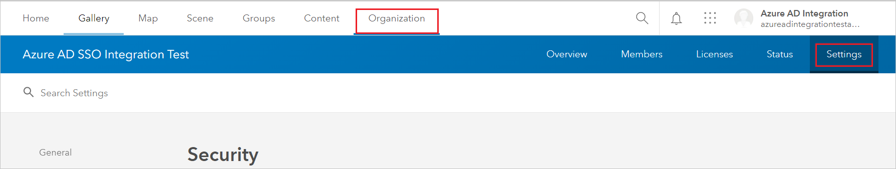
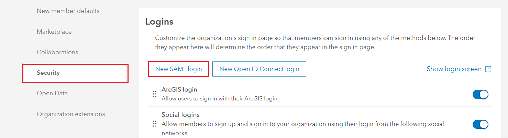
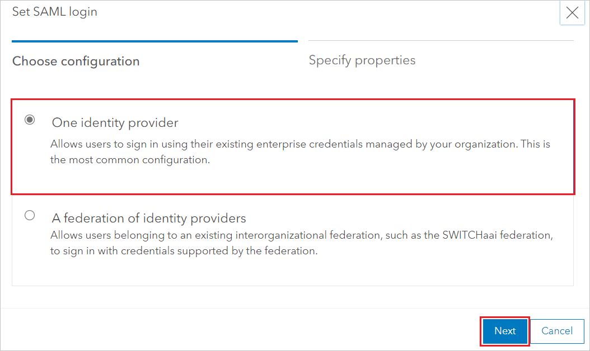
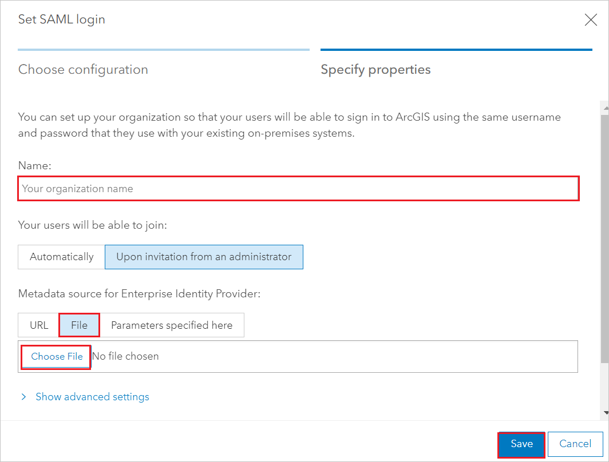
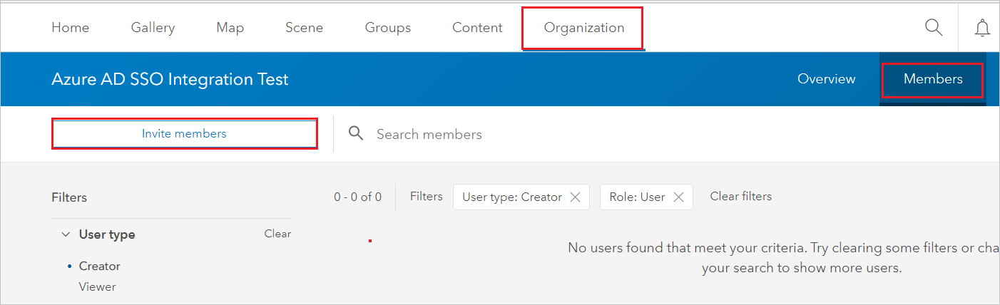
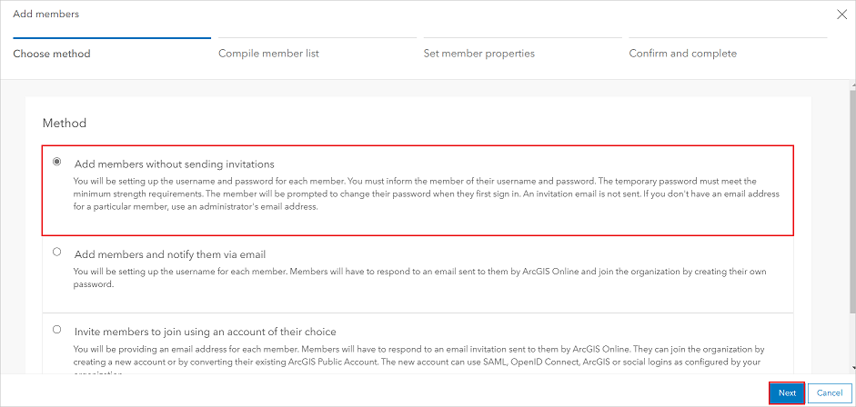
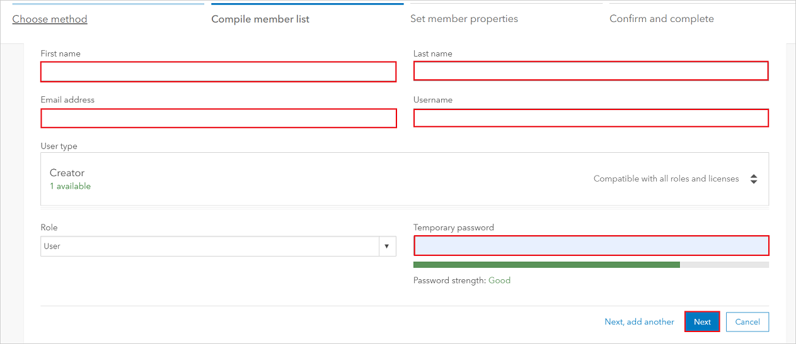
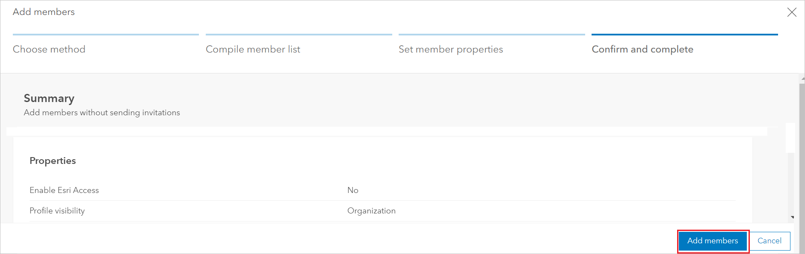

# Tutorial: Microsoft Entra integration with ArcGIS Online

In this tutorial, you'll learn how to integrate ArcGIS Online with Microsoft Entra ID. When you integrate ArcGIS Online with Microsoft Entra ID, you can:

* Control in Microsoft Entra ID who has access to ArcGIS Online.
* Enable your users to be automatically signed-in to ArcGIS Online with their Microsoft Entra accounts.
* Manage your accounts in one central location.

## Prerequisites

To get started, you need the following items:

* A Microsoft Entra subscription. If you don't have a subscription, you can get a [free account](https://azure.microsoft.com/free/).
* ArcGIS Online single sign-on (SSO) enabled subscription.

> [!NOTE]
> This integration is also available to use from Microsoft Entra US Government Cloud environment. You can find this application in the Microsoft Entra US Government Cloud Application Gallery and configure it in the same way as you do from public cloud.

## Scenario description

In this tutorial, you configure and test Microsoft Entra single sign-on in a test environment.

* ArcGIS Online supports **SP** initiated SSO.

## Add ArcGIS Online from the gallery

To configure the integration of ArcGIS Online into Microsoft Entra ID, you need to add ArcGIS Online from the gallery to your list of managed SaaS apps.

1. Sign in to the [Microsoft Entra admin center](https://entra.microsoft.com) as at least a [Cloud Application Administrator](../roles/permissions-reference.md#cloud-application-administrator).
1. Browse to **Identity** > **Applications** > **Enterprise applications** > **New application**.
1. In the **Add from the gallery** section, type **ArcGIS Online** in the search box.
1. Select **ArcGIS Online** from results panel and then add the app. Wait a few seconds while the app is added to your tenant.

 Alternatively, you can also use the [Enterprise App Configuration Wizard](https://portal.office.com/AdminPortal/home?Q=Docs#/azureadappintegration). In this wizard, you can add an application to your tenant, add users/groups to the app, assign roles, as well as walk through the SSO configuration as well. [Learn more about Microsoft 365 wizards.](/microsoft-365/admin/misc/azure-ad-setup-guides)

## Configure and test Microsoft Entra SSO for ArcGIS Online

Configure and test Microsoft Entra SSO with ArcGIS Online using a test user called **B.Simon**. For SSO to work, you need to establish a link relationship between a Microsoft Entra user and the related user in ArcGIS Online.

To configure and test Microsoft Entra SSO with ArcGIS Online, perform the following steps:

1. **[Configure Microsoft Entra SSO](#configure-azure-ad-sso)** - to enable your users to use this feature.
    1. **[Create a Microsoft Entra test user](#create-an-azure-ad-test-user)** - to test Microsoft Entra single sign-on with B.Simon.
    1. **[Assign the Microsoft Entra test user](#assign-the-azure-ad-test-user)** - to enable B.Simon to use Microsoft Entra single sign-on.
1. **[Configure ArcGIS Online SSO](#configure-arcgis-online-sso)** - to configure the single sign-on settings on application side.
    1. **[Create ArcGIS Online test user](#create-arcgis-online-test-user)** - to have a counterpart of B.Simon in ArcGIS Online that is linked to the Microsoft Entra representation of user.
1. **[Test SSO](#test-sso)** - to verify whether the configuration works.

## Configure Microsoft Entra SSO

Follow these steps to enable Microsoft Entra SSO.

1. Sign in to the [Microsoft Entra admin center](https://entra.microsoft.com) as at least a [Cloud Application Administrator](../roles/permissions-reference.md#cloud-application-administrator).
1. Browse to **Identity** > **Applications** > **Enterprise applications** > **ArcGIS Online** > **Single sign-on**.
1. On the **Select a single sign-on method** page, select **SAML**.
1. On the **Set up single sign-on with SAML** page, click the pencil icon for **Basic SAML Configuration** to edit the settings.

   

1. On the **Basic SAML Configuration** section, perform the following steps:

    a. In the **Identifier (Entity ID)** text box, type a URL using the following pattern:
    `<COMPANY_NAME>.maps.arcgis.com`

    b. In the **Reply URL** text box, type a URL using the following pattern:
    `https://<SUBDOMAIN>.maps.arcgis.com/sharing/rest/oauth2/saml/signin`

    c. In the **Sign on URL** text box, type a URL using the following pattern:
    `https://<COMPANY_NAME>.maps.arcgis.com`

    > [!NOTE]
    > These values are not real. Update these values with the actual Identifier, Reply URL and Sign on URL. Contact [ArcGIS Online Client support team](https://support.esri.com/en/) to get these values. You can also refer to the patterns shown in the **Basic SAML Configuration** section.

1. On the **Set up Single Sign-On with SAML** page, in the **SAML Signing Certificate** section, click **Download** to download the **Federation Metadata XML** from the given options as per your requirement and save it on your computer.

    

1. To automate the configuration within **ArcGIS Online**, you need to install **My Apps Secure Sign-in browser extension** by clicking **Install the extension**.

    

1. After adding extension to the browser, click on **setup ArcGIS Online** will direct you to the ArcGIS Online application. From there, provide the admin credentials to sign into ArcGIS Online. The browser extension will automatically configure the application for you and automate steps in section **Configure ArcGIS Online Single Sign-On**.

### Create a Microsoft Entra test user 

In this section, you'll create a test user called B.Simon.

1. Sign in to the [Microsoft Entra admin center](https://entra.microsoft.com) as at least a [User Administrator](../roles/permissions-reference.md#user-administrator).
1. Browse to **Identity** > **Users** > **All users**.
1. Select **New user** > **Create new user**, at the top of the screen.
1. In the **User** properties, follow these steps:
   1. In the **Display name** field, enter `B.Simon`.  
   1. In the **User principal name** field, enter the username@companydomain.extension. For example, `B.Simon@contoso.com`.
   1. Select the **Show password** check box, and then write down the value that's displayed in the **Password** box.
   1. Select **Review + create**.
1. Select **Create**.

### Assign the Microsoft Entra test user

In this section, you'll enable B.Simon to use single sign-on by granting access to ArcGIS Online.

1. Sign in to the [Microsoft Entra admin center](https://entra.microsoft.com) as at least a [Cloud Application Administrator](../roles/permissions-reference.md#cloud-application-administrator).
1. Browse to **Identity** > **Applications** > **Enterprise applications** > **ArcGIS Online**.
1. In the app's overview page, select **Users and groups**.
1. Select **Add user/group**, then select **Users and groups** in the **Add Assignment** dialog.
   1. In the **Users and groups** dialog, select **B.Simon** from the Users list, then click the **Select** button at the bottom of the screen.
   1. If you are expecting a role to be assigned to the users, you can select it from the **Select a role** dropdown. If no role has been set up for this app, you see "Default Access" role selected.
   1. In the **Add Assignment** dialog, click the **Assign** button.

## Configure ArcGIS Online SSO

1. In a different web browser window, sign in to your ArcGIS Online company site as an administrator

2. Go to the **Organization** -> **Settings**. 

    

3. In the left menu, click **Security** and select **New SAML login** in the Logins tab.

    

4. In the **Set SAML login** window, choose the configuration as **One identity provider** and click **Next**.

    

5. On the **Specify properties** tab, perform the following steps:

    

    a. In the **Name** textbox, type your organization’s name.

    b. For **Metadata source for Enterprise Identity Provider**, select **File**.

    c. Click on **Choose File** to upload the **Federation Metadata XML** file, which you have downloaded previously.

    d. Click **Save**.

### Create ArcGIS Online test user

In order to enable Microsoft Entra users to log into ArcGIS Online, they must be provisioned into ArcGIS Online.  
In the case of ArcGIS Online, provisioning is a manual task.

**To provision a user account, perform the following steps:**

1. Log in to your **ArcGIS** tenant.

2. Go to the **Organization** -> **Members** and click **Invite members**.

    

3. Select **Add members without sending invitations** method, and then click **Next**.

    

1. In the **Compile member list**, select **New member** and click **Next**.

4. Fill the required fields in the following page and click **Next**.

    

5. In the next page, select the member you want to add and click **Next**. 

1. Set the required member properties in the next page and click **Next**.

1. In the **Confirm and complete** tab, click **Add members** .

    

    > [!NOTE]
    > The Microsoft Entra account holder will receive an email and follow a link to confirm their account before it becomes active.

## Test SSO

In this section, you test your Microsoft Entra single sign-on configuration with following options. 

* Click on **Test this application**, this will redirect to ArcGIS Online Sign-on URL where you can initiate the login flow. 

* Go to ArcGIS Online Sign-on URL directly and initiate the login flow from there.

* You can use Microsoft My Apps. When you click the ArcGIS Online tile in the My Apps, this will redirect to ArcGIS Online Sign-on URL. For more information about the My Apps, see [Introduction to the My Apps](https://support.microsoft.com/account-billing/sign-in-and-start-apps-from-the-my-apps-portal-2f3b1bae-0e5a-4a86-a33e-876fbd2a4510).

## Next steps

Once you configure ArcGIS Online you can enforce session control, which protects exfiltration and infiltration of your organization’s sensitive data in real time. Session control extends from Conditional Access. [Learn how to enforce session control with Microsoft Defender for Cloud Apps](/cloud-app-security/proxy-deployment-any-app).
