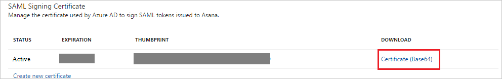
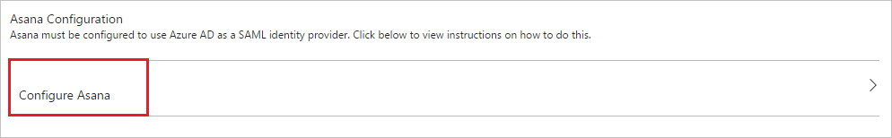
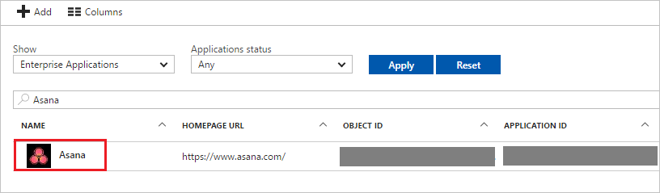

# Tutorial: Azure Active Directory integration with Asana

In this tutorial, you learn how to integrate Asana with Azure Active Directory (Azure AD).

Integrating Asana with Azure AD provides you with the following benefits:

- You can control in Azure AD who has access to Asana
- You can enable your users to automatically get signed-on to Asana (Single Sign-On) with their Azure AD accounts
- You can manage your accounts in one central location - the Azure portal

If you want to know more details about SaaS app integration with Azure AD, see [what is application access and single sign-on with Azure Active Directory](../manage-apps/what-is-single-sign-on.md).

## Prerequisites

To configure Azure AD integration with Asana, you need the following items:

- An Azure AD subscription
- An Asana single-sign on enabled subscription

> [!NOTE]
> To test the steps in this tutorial, we do not recommend using a production environment.

To test the steps in this tutorial, you should follow these recommendations:

- Do not use your production environment, unless it is necessary.
- If you don't have an Azure AD trial environment, you can [get a one-month trial](https://azure.microsoft.com/pricing/free-trial/).

## Scenario description
In this tutorial, you test Azure AD single sign-on in a test environment.
The scenario outlined in this tutorial consists of two main building blocks:

1. Adding Asana from the gallery
1. Configuring and testing Azure AD single sign-on

## Adding Asana from the gallery
To configure the integration of Asana into Azure AD, you need to add Asana from the gallery to your list of managed SaaS apps.

**To add Asana from the gallery, perform the following steps:**

1. In the **[Azure portal](https://portal.azure.com)**, on the left navigation panel, click **Azure Active Directory** icon. 

	![The Azure Active Directory button][1]

1. Navigate to **Enterprise applications**. Then go to **All applications**.

	![The Enterprise applications blade][2]

1. To add new application, click **New application** button on the top of dialog.

	![The New application button][3]

1. In the search box, type **Asana**, select **Asana** from result panel then click **Add** button to add the application.

	

## Configure and test Azure AD single sign-on

In this section, you configure and test Azure AD single sign-on with Asana based on a test user called "Britta Simon."

For single sign-on to work, Azure AD needs to know what the counterpart user in Asana is to a user in Azure AD. In other words, a link relationship between an Azure AD user and the related user in Asana needs to be established.

In Asana, assign the value of the **user name** in Azure AD as the value of the **Username** to establish the link relationship.

To configure and test Azure AD single sign-on with Asana, you need to complete the following building blocks:

1. **[Configure Azure AD Single Sign-On](#configure-azure-ad-single-sign-on)** - to enable your users to use this feature.
1. **[Create an Azure AD test user](#create-an-azure-ad-test-user)** - to test Azure AD single sign-on with Britta Simon.
1. **[Create an Asana test user](#create-an-asana-test-user)** - to have a counterpart of Britta Simon in Asana that is linked to the Azure AD representation of user.
1. **[Assign the Azure AD test user](#assign-the-azure-ad-test-user)** - to enable Britta Simon to use Azure AD single sign-on.
1. **[Test single sign-on](#test-single-sign-on)** - to verify whether the configuration works.

### Configure Azure AD single sign-on

In this section, you enable Azure AD single sign-on in the Azure portal and configure single sign-on in your Asana application.

**To configure Azure AD single sign-on with Asana, perform the following steps:**

1. In the Azure portal, on the **Asana** application integration page, click **Single sign-on**.

	![Configure Single Sign-On][4]

1. On the **Single sign-on** dialog, select **Mode** as **SAML-based Sign-on** to enable single sign-on.

	

1. On the **Asana Domain and URLs** section, perform the following steps:

	

    a. In the **Sign-on URL** textbox, type URL: `https://app.asana.com/`

	b. In the **Identifier** textbox, type value: `https://app.asana.com/`

1. On the **SAML Signing Certificate** section, click **Certificate(Base64)** and then save the certificate file on your computer.

	

1. Click **Save** button.

	

1. On the **Asana Configuration** section, click **Configure Asana** to open **Configure sign-on** window. Copy the **SAML Single Sign-On Service URL** from the **Quick Reference section.**

	

1. In a different browser window, sign-on to your Asana application. To configure SSO in Asana, access the workspace settings by clicking the workspace name on the top right corner of the screen. Then, click on **\<your workspace name\> Settings**.

    

1. On the **Organization settings** window, click **Administration**. Then, click **Members must log in via SAML** to enable the SSO configuration. The perform the following steps:

      

     a. In the **Sign-in page URL** textbox, paste the **SAML Single Sign-On Service URL**.

     b. Right click the certificate downloaded from Azure portal, then open the certificate file using Notepad or your preferred text editor. Copy the content between the begin and the end certificate title and paste it in the **X.509 Certificate** textbox.

1. Click **Save**. Go to [Asana guide for setting up SSO](https://asana.com/guide/help/premium/authentication#gl-saml) if you need further assistance.

### Create an Azure AD test user

The objective of this section is to create a test user in the Azure portal called Britta Simon.

![Create an Azure AD test user][100]

**To create a test user in Azure AD, perform the following steps:**

1. In the **Azure portal**, on the left navigation pane, click **Azure Active Directory** icon.

	 

1. To display the list of users, go to **Users and groups** and click **All users**.

	

1. To open the **User** dialog, click **Add** on the top of the dialog.

	

1. On the **User** dialog page, perform the following steps:

	

    a. In the **Name** textbox, type **BrittaSimon**.

    b. In the **User name** textbox, type the **email address** of BrittaSimon.

	c. Select **Show Password** and write down the value of the **Password**.

    d. Click **Create**.

### Create an Asana test user

The objective of this section is to create a user called Britta Simon in Asana. Asana supports automatic user provisioning, which is by default enabled. You can find more details [here](asana-provisioning-tutorial.md) on how to configure automatic user provisioning.

**If you need to create user manually, please perform following steps:**

In this section, you create a user called Britta Simon in Asana.

1. On **Asana**, go to the **Teams** section on the left panel. Click the plus sign button.

    

1. Type the email britta.simon@contoso.com in the text box and then select **Invite**.

1. Click **Send Invite**. The new user will receive an email into her email account. She will need to create and validate the account.

### Assign the Azure AD test user

In this section, you enable Britta Simon to use Azure single sign-on by granting access to Asana.

![Assign the user role][200]

**To assign Britta Simon to Asana, perform the following steps:**

1. In the Azure portal, open the applications view, and then navigate to the directory view and go to **Enterprise applications** then click **All applications**.

	![Assign User][201]

1. In the applications list, select **Asana**.

	

1. In the menu on the left, click **Users and groups**.

	![The "Users and groups" link][202]

1. Click **Add** button. Then select **Users and groups** on **Add Assignment** dialog.

	![The Add Assignment pane][203]

1. On **Users and groups** dialog, select **Britta Simon** in the Users list.

1. Click **Select** button on **Users and groups** dialog.

1. Click **Assign** button on **Add Assignment** dialog.

### Test single sign-on

The objective of this section is to test your Azure AD single sign-on.

Go to Asana login page. In the Email address textbox, insert the email address britta.simon@contoso.com. Leave the password textbox in blank and then click **Log In**. You will be redirected to Azure AD login page. Complete your Azure AD credentials. Now, you are logged in on Asana.

## Additional resources

* [List of Tutorials on How to Integrate SaaS Apps with Azure Active Directory](tutorial-list.md)
* [What is application access and single sign-on with Azure Active Directory?](../manage-apps/what-is-single-sign-on.md)
* [Configure User Provisioning](asana-provisioning-tutorial.md)

<!--Image references-->

[1]: ./media/asana-tutorial/tutorial_general_01.png
[2]: ./media/asana-tutorial/tutorial_general_02.png
[3]: ./media/asana-tutorial/tutorial_general_03.png
[4]: ./media/asana-tutorial/tutorial_general_04.png

[100]: ./media/asana-tutorial/tutorial_general_100.png

[200]: ./media/asana-tutorial/tutorial_general_200.png
[201]: ./media/asana-tutorial/tutorial_general_201.png
[202]: ./media/asana-tutorial/tutorial_general_202.png
[203]: ./media/asana-tutorial/tutorial_general_203.png
[10]: ./media/asana-tutorial/tutorial_general_060.png
[11]: ./media/asana-tutorial/tutorial_general_070.png