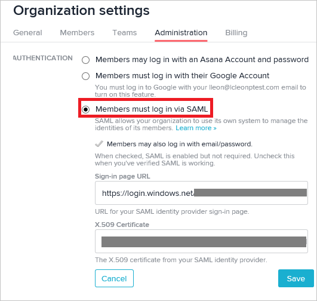

# Tutorial: Azure Active Directory integration with Asana

In this tutorial, you learn how to integrate Asana with Azure Active Directory (Azure AD).
Integrating Asana with Azure AD provides you with the following benefits:

* You can control in Azure AD who has access to Asana.
* You can enable your users to be automatically signed-in to Asana (Single Sign-On) with their Azure AD accounts.
* You can manage your accounts in one central location - the Azure portal.

If you want to know more details about SaaS app integration with Azure AD, see [What is application access and single sign-on with Azure Active Directory](https://docs.microsoft.com/azure/active-directory/active-directory-appssoaccess-whatis).
If you don't have an Azure subscription, [create a free account](https://azure.microsoft.com/free/) before you begin.

## Prerequisites

To configure Azure AD integration with Asana, you need the following items:

* An Azure AD subscription. If you don't have an Azure AD environment, you can get one-month trial [here](https://azure.microsoft.com/pricing/free-trial/)
* Asana single sign-on enabled subscription

## Scenario description

In this tutorial, you configure and test Azure AD single sign-on in a test environment.

* Asana supports **SP** initiated SSO

* Asana supports [**Automated** user provisioning](asana-provisioning-tutorial.md)

## Adding Asana from the gallery

To configure the integration of Asana into Azure AD, you need to add Asana from the gallery to your list of managed SaaS apps.

**To add Asana from the gallery, perform the following steps:**

1. In the **[Azure portal](https://portal.azure.com)**, on the left navigation panel, click **Azure Active Directory** icon.

	

2. Navigate to **Enterprise Applications** and then select the **All Applications** option.

	

3. To add new application, click **New application** button on the top of dialog.

	

4. In the search box, type **Asana**, select **Asana** from result panel then click **Add** button to add the application.

	 

## Configure and test Azure AD single sign-on

In this section, you configure and test Azure AD single sign-on with Asana based on a test user called **Britta Simon**.
For single sign-on to work, a link relationship between an Azure AD user and the related user in Asana needs to be established.

To configure and test Azure AD single sign-on with Asana, you need to complete the following building blocks:

1. **[Configure Azure AD Single Sign-On](#configure-azure-ad-single-sign-on)** - to enable your users to use this feature.
2. **[Configure Asana Single Sign-On](#configure-asana-single-sign-on)** - to configure the Single Sign-On settings on application side.
3. **[Create an Azure AD test user](#create-an-azure-ad-test-user)** - to test Azure AD single sign-on with Britta Simon.
4. **[Assign the Azure AD test user](#assign-the-azure-ad-test-user)** - to enable Britta Simon to use Azure AD single sign-on.
5. **[Create Asana test user](#create-asana-test-user)** - to have a counterpart of Britta Simon in Asana that is linked to the Azure AD representation of user.
6. **[Test single sign-on](#test-single-sign-on)** - to verify whether the configuration works.

### Configure Azure AD single sign-on

In this section, you enable Azure AD single sign-on in the Azure portal.

To configure Azure AD single sign-on with Asana, perform the following steps:

1. In the [Azure portal](https://portal.azure.com/), on the **Asana** application integration page, select **Single sign-on**.

    

2. On the **Select a Single sign-on method** dialog, select **SAML/WS-Fed** mode to enable single sign-on.

    

3. On the **Set up Single Sign-On with SAML** page, click **Edit** icon to open **Basic SAML Configuration** dialog.

	

4. On the **Basic SAML Configuration** section, perform the following steps:

    

	a. In the **Sign on URL** text box, type URL:
    `https://app.asana.com/`

    b. In the **Identifier (Entity ID)** text box, type URL:
    `https://app.asana.com/`

5. On the **Set up Single Sign-On with SAML** page, in the **SAML Signing Certificate** section, click **Download** to download the **Certificate (Base64)** from the given options as per your requirement and save it on your computer.

	

6. On the **Set up Asana** section, copy the appropriate URL(s) as per your requirement.

	

	a. Login URL

	b. Azure Ad Identifier

	c. Logout URL

### Configure Asana Single Sign-On

1. In a different browser window, sign-on to your Asana application. To configure SSO in Asana, access the workspace settings by clicking the workspace name on the top right corner of the screen. Then, click on **\<your workspace name\> Settings**.

    

2. On the **Organization settings** window, click **Administration**. Then, click **Members must log in via SAML** to enable the SSO configuration. The perform the following steps:

      

    a. In the **Sign-in page URL** textbox, paste the **Login URL**.

    b. Right click the certificate downloaded from Azure portal, then open the certificate file using Notepad or your preferred text editor. Copy the content between the begin and the end certificate title and paste it in the **X.509 Certificate** textbox.

3. Click **Save**. Go to [Asana guide for setting up SSO](https://asana.com/guide/help/premium/authentication#gl-saml) if you need further assistance.

### Create an Azure AD test user

The objective of this section is to create a test user in the Azure portal called Britta Simon.

1. In the Azure portal, in the left pane, select **Azure Active Directory**, select **Users**, and then select **All users**.

    

2. Select **New user** at the top of the screen.

    

3. In the User properties, perform the following steps.

    

    a. In the **Name** field enter **BrittaSimon**.
  
    b. In the **User name** field type **brittasimon\@yourcompanydomain.extension**  
    For example, BrittaSimon@contoso.com

    c. Select **Show password** check box, and then write down the value that's displayed in the Password box.

    d. Click **Create**.

### Assign the Azure AD test user

In this section, you enable Britta Simon to use Azure single sign-on by granting access to Asana.

1. In the Azure portal, select **Enterprise Applications**, select **All applications**, then select **Asana**.

	

2. In the applications list, select **Asana**.

	

3. In the menu on the left, select **Users and groups**.

    

4. Click the **Add user** button, then select **Users and groups** in the **Add Assignment** dialog.

    

5. In the **Users and groups** dialog select **Britta Simon** in the Users list, then click the **Select** button at the bottom of the screen.

6. If you are expecting any role value in the SAML assertion then in the **Select Role** dialog select the appropriate role for the user from the list, then click the **Select** button at the bottom of the screen.

7. In the **Add Assignment** dialog click the **Assign** button.

### Create Asana test user

The objective of this section is to create a user called Britta Simon in Asana. Asana supports automatic user provisioning, which is by default enabled. You can find more details [here](asana-provisioning-tutorial.md) on how to configure automatic user provisioning.

**If you need to create user manually, please perform following steps:**

In this section, you create a user called Britta Simon in Asana.

1. On **Asana**, go to the **Teams** section on the left panel. Click the plus sign button.

    

2. Type the email of the user like **britta.simon\@contoso.com** in the text box and then select **Invite**.

3. Click **Send Invite**. The new user will receive an email into their email account. user will need to create and validate the account.

### Test single sign-on

In this section, you test your Azure AD single sign-on configuration using the Access Panel.

When you click the Asana tile in the Access Panel, you should be automatically signed in to the Asana for which you set up SSO. For more information about the Access Panel, see [Introduction to the Access Panel](https://docs.microsoft.com/azure/active-directory/active-directory-saas-access-panel-introduction).

## Additional Resources

- [List of Tutorials on How to Integrate SaaS Apps with Azure Active Directory](https://docs.microsoft.com/azure/active-directory/active-directory-saas-tutorial-list)

- [What is application access and single sign-on with Azure Active Directory?](https://docs.microsoft.com/azure/active-directory/active-directory-appssoaccess-whatis)

- [What is Conditional Access in Azure Active Directory?](https://docs.microsoft.com/azure/active-directory/conditional-access/overview)

- [Configure User Provisioning](asana-provisioning-tutorial.md)
