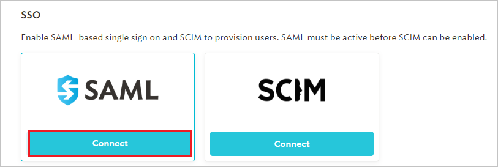
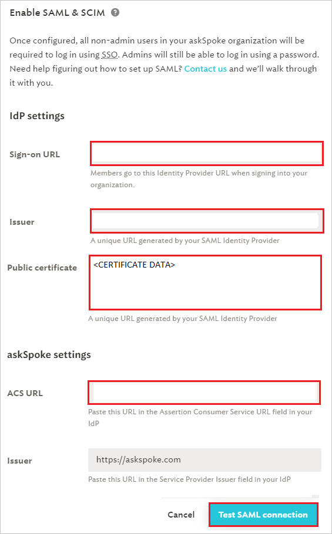

# Tutorial: Microsoft Entra single sign-on (SSO) integration with askSpoke

In this tutorial, you'll learn how to integrate askSpoke with Microsoft Entra ID. When you integrate askSpoke with Microsoft Entra ID, you can:

* Control in Microsoft Entra ID who has access to askSpoke.
* Enable your users to be automatically signed-in to askSpoke with their Microsoft Entra accounts.
* Manage your accounts in one central location.

## Prerequisites

To get started, you need the following items:

* A Microsoft Entra subscription. If you don't have a subscription, you can get a [free account](https://azure.microsoft.com/free/).
* askSpoke single sign-on (SSO) enabled subscription.

## Scenario description

In this tutorial, you configure and test Microsoft Entra SSO in a test environment.

* askSpoke supports **SP and IDP** initiated SSO.
* askSpoke supports **Just In Time** user provisioning.
* askSpoke supports [Automated user provisioning](askspoke-provisioning-tutorial.md).

> [!NOTE]
> Identifier of this application is a fixed string value so only one instance can be configured in one tenant.

## Add askSpoke from the gallery

To configure the integration of askSpoke into Microsoft Entra ID, you need to add askSpoke from the gallery to your list of managed SaaS apps.

1. Sign in to the [Microsoft Entra admin center](https://entra.microsoft.com) as at least a [Cloud Application Administrator](../roles/permissions-reference.md#cloud-application-administrator).
1. Browse to **Identity** > **Applications** > **Enterprise applications** > **New application**.
1. In the **Add from the gallery** section, type **askSpoke** in the search box.
1. Select **askSpoke** from results panel and then add the app. Wait a few seconds while the app is added to your tenant.

 Alternatively, you can also use the [Enterprise App Configuration Wizard](https://portal.office.com/AdminPortal/home?Q=Docs#/azureadappintegration). In this wizard, you can add an application to your tenant, add users/groups to the app, assign roles, as well as walk through the SSO configuration as well. [Learn more about Microsoft 365 wizards.](/microsoft-365/admin/misc/azure-ad-setup-guides)

## Configure and test Microsoft Entra SSO for askSpoke

Configure and test Microsoft Entra SSO with askSpoke using a test user called **B.Simon**. For SSO to work, you need to establish a link relationship between a Microsoft Entra user and the related user in askSpoke.

To configure and test Microsoft Entra SSO with askSpoke, perform the following steps:

1. **[Configure Microsoft Entra SSO](#configure-azure-ad-sso)** - to enable your users to use this feature.
    1. **[Create a Microsoft Entra test user](#create-an-azure-ad-test-user)** - to test Microsoft Entra single sign-on with B.Simon.
    1. **[Assign the Microsoft Entra test user](#assign-the-azure-ad-test-user)** - to enable B.Simon to use Microsoft Entra single sign-on.
1. **[Configure askSpoke SSO](#configure-askspoke-sso)** - to configure the single sign-on settings on application side.
    1. **[Create askSpoke test user](#create-askspoke-test-user)** - to have a counterpart of B.Simon in askSpoke that is linked to the Microsoft Entra representation of user.
1. **[Test SSO](#test-sso)** - to verify whether the configuration works.

## Configure Microsoft Entra SSO

Follow these steps to enable Microsoft Entra SSO.

1. Sign in to the [Microsoft Entra admin center](https://entra.microsoft.com) as at least a [Cloud Application Administrator](../roles/permissions-reference.md#cloud-application-administrator).
1. Browse to **Identity** > **Applications** > **Enterprise applications** > **askSpoke** > **Single sign-on**.
1. On the **Select a single sign-on method** page, select **SAML**.
1. On the **Set up single sign-on with SAML** page, click the pencil icon for **Basic SAML Configuration** to edit the settings.

   

1. On the **Basic SAML Configuration** section, if you wish to configure the application in **IDP** initiated mode, enter the values for the following fields:

    In the **Reply URL** text box, type a URL using the following pattern:
    `https://<SUBDOMAIN>.askspoke.com/saml/callback`

	> [!NOTE]
	> The Reply URL value is not real. Update this value with the actual Reply URL. Contact [askSpoke Client support team](mailto:support@askspoke.com) to get this value. You can also refer to the patterns shown in the **Basic SAML Configuration** section.

1. Click **Set additional URLs** and perform the following step if you wish to configure the application in **SP** initiated mode:

    In the **Sign-on URL** text box, type the URL:
    `https://askspoke.com/login`

1. askSpoke application expects the SAML assertions in a specific format, which requires you to add custom attribute mappings to your SAML token attributes configuration. The following screenshot shows the list of default attributes.

	

1. In addition to above, askSpoke application expects few more attributes to be passed back in SAML response which are shown below. These attributes are also pre populated but you can review them as per your requirements.

	| Name |  Source Attribute|
	| ---------------| --------- |
	| firstName | user.givenname |
    | lastName | user.surname |

1. On the **Set up single sign-on with SAML** page, in the **SAML Signing Certificate** section,  find **Certificate (Base64)** and select **Download** to download the certificate and save it on your computer.

	

1. On the **Set up askSpoke** section, copy the appropriate URL(s) based on your requirement.

	

### Create a Microsoft Entra test user

In this section, you'll create a test user called B.Simon.

1. Sign in to the [Microsoft Entra admin center](https://entra.microsoft.com) as at least a [User Administrator](../roles/permissions-reference.md#user-administrator).
1. Browse to **Identity** > **Users** > **All users**.
1. Select **New user** > **Create new user**, at the top of the screen.
1. In the **User** properties, follow these steps:
   1. In the **Display name** field, enter `B.Simon`.  
   1. In the **User principal name** field, enter the username@companydomain.extension. For example, `B.Simon@contoso.com`.
   1. Select the **Show password** check box, and then write down the value that's displayed in the **Password** box.
   1. Select **Review + create**.
1. Select **Create**.

### Assign the Microsoft Entra test user

In this section, you'll enable B.Simon to use single sign-on by granting access to askSpoke.

1. Sign in to the [Microsoft Entra admin center](https://entra.microsoft.com) as at least a [Cloud Application Administrator](../roles/permissions-reference.md#cloud-application-administrator).
1. Browse to **Identity** > **Applications** > **Enterprise applications** > **askSpoke**.
1. In the app's overview page, select **Users and groups**.
1. Select **Add user/group**, then select **Users and groups** in the **Add Assignment** dialog.
   1. In the **Users and groups** dialog, select **B.Simon** from the Users list, then click the **Select** button at the bottom of the screen.
   1. If you are expecting a role to be assigned to the users, you can select it from the **Select a role** dropdown. If no role has been set up for this app, you see "Default Access" role selected.
   1. In the **Add Assignment** dialog, click the **Assign** button.

## Configure askSpoke SSO

1. In a different web browser window, sign into askSpoke website as an administrator.

1. Click on **Settings** tab from the left navigation pane.

    

1. Scroll down to **SSO** and click on **Connect**.

    

1. On the **Enable SAML & SCIM** section, perform the following steps:

    

    1. In the **Sign-on URL** textbox, paste **Login URL** value, which you copied previously.

    1. In the **Issuer** textbox, paste **Microsoft Entra Identifier** value, which you copied previously.

    1. Open the downloaded **Certificate(Base64)** file into Notepad and copy content of certificate file and paste it into the **Public certificate** textbox.

    1. Copy **ACS URL** value and paste it into **Reply URL** textbox in the **Basic SAML Configuration** section.

    1. Click **Test SAML connection**.

### Create askSpoke test user

In this section, a user called B.Simon is created in askSpoke. askSpoke supports just-in-time provisioning, which is enabled by default. There is no action item for you in this section. If a user doesn't already exist in askSpoke, a new one is created when you attempt to access askSpoke.

askSpoke also supports automatic user provisioning, you can find more details [here](./askspoke-provisioning-tutorial.md) on how to configure automatic user provisioning.

## Test SSO

In this section, you test your Microsoft Entra single sign-on configuration with following options. 

#### SP initiated:

* Click on **Test this application**, this will redirect to askspoke Sign on URL where you can initiate the login flow.  

* Go to askspoke Sign-on URL directly and initiate the login flow from there.

#### IDP initiated:

* Click on **Test this application**, and you should be automatically signed in to the askspoke for which you set up the SSO. 

You can also use Microsoft My Apps to test the application in any mode. When you click the askspoke tile in the My Apps, if configured in SP mode you would be redirected to the application sign-on page for initiating the login flow and if configured in IDP mode, you should be automatically signed in to the askspoke for which you set up the SSO. For more information, see [Microsoft Entra My Apps](/azure/active-directory/manage-apps/end-user-experiences#azure-ad-my-apps).

## Next steps

Once you configure askspoke you can enforce session control, which protects exfiltration and infiltration of your organization’s sensitive data in real time. Session control extends from Conditional Access. [Learn how to enforce session control with Microsoft Defender for Cloud Apps](/cloud-app-security/proxy-deployment-aad).
