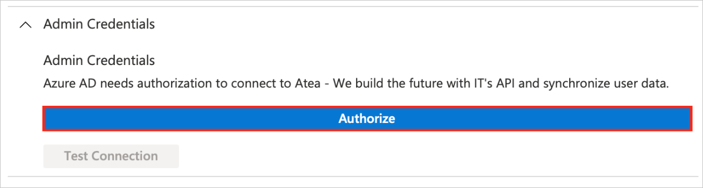
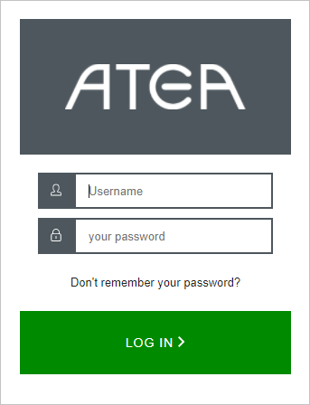
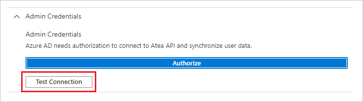

# Tutorial: Configure Atea for automatic user provisioning

This tutorial describes the steps you need to do in both Atea and Microsoft Entra ID to configure automatic user provisioning. When configured, Microsoft Entra ID automatically provisions and de-provisions users and groups to [Atea](https://www.atea.com/) using the Microsoft Entra provisioning service. For important details on what this service does, how it works and frequently asked questions refer [Automate user provisioning and deprovisioning to SaaS applications with Microsoft Entra ID](../app-provisioning/user-provisioning.md). 

## Capabilities supported
> [!div class="checklist"]
> * Create users in Atea
> * Remove users in Atea when they do not require access anymore
> * Keep user attributes synchronized between Microsoft Entra ID and Atea

## Prerequisites

The scenario outlined in this tutorial assumes that you already have the following prerequisites:

* [A Microsoft Entra tenant](../develop/quickstart-create-new-tenant.md) 
* A user account in Microsoft Entra ID with [permission](../roles/permissions-reference.md) to configure provisioning (for example, Application Administrator, Cloud Application administrator, Application Owner, or Global Administrator). 
* A user account in Atea with Admin permissions.

## Step 1: Plan your provisioning deployment
1. Learn about [how the provisioning service works](../app-provisioning/user-provisioning.md).
2. Determine who will be in [scope for provisioning](../app-provisioning/define-conditional-rules-for-provisioning-user-accounts.md).
3. Determine what data to [map between Microsoft Entra ID and Atea](../app-provisioning/customize-application-attributes.md). 

## Step 2: Configure Atea to support provisioning with Microsoft Entra ID

Contact [Atea support](mailto:sso.support@atea.com) to configure Atea to support provisioning with Microsoft Entra ID.

## Step 3: Add Atea from the Microsoft Entra application gallery

Add Atea from the Microsoft Entra application gallery to start managing provisioning to Atea. If you have previously setup Atea for SSO, you can use the same application. However it's recommended that you create a separate app when testing out the integration initially. Learn more about adding an application from the gallery [here](../manage-apps/add-application-portal.md). 

## Step 4: Define who will be in scope for provisioning 

The Microsoft Entra provisioning service allows you to scope who will be provisioned based on assignment to the application and or based on attributes of the user and group. If you choose to scope who will be provisioned to your app based on assignment, you can use the following [steps](../manage-apps/assign-user-or-group-access-portal.md) to assign users and groups to the application. If you choose to scope who will be provisioned based solely on attributes of the user or group, you can use a scoping filter as described [here](../app-provisioning/define-conditional-rules-for-provisioning-user-accounts.md). 

* Start small. Test with a small set of users and groups before rolling out to everyone. When scope for provisioning is set to assigned users and groups, you can control this by assigning one or two users or groups to the app. When scope is set to all users and groups, you can specify an [attribute based scoping filter](../app-provisioning/define-conditional-rules-for-provisioning-user-accounts.md).

* If you need additional roles, you can [update the application manifest](../develop/howto-add-app-roles-in-azure-ad-apps.md) to add new roles.

## Step 5: Configure automatic user provisioning to Atea 

This section guides you through the steps to configure the Microsoft Entra provisioning service to create, update, and disable users and groups in Atea, based on user and group assignments in Microsoft Entra ID.

### To configure automatic user provisioning for Atea in Microsoft Entra ID:

1. Sign in to the [Microsoft Entra admin center](https://entra.microsoft.com) as at least a [Cloud Application Administrator](../roles/permissions-reference.md#cloud-application-administrator).
1. Browse to **Identity** > **Applications** > **Enterprise applications**

	

1. In the applications list, select **Atea**.

	

3. Select the **Provisioning** tab.

	

4. Set the **Provisioning Mode** to **Automatic**.

	

5. In the **Admin Credentials** section, select **Authorize**. It opens an Atea login dialog box in a new browser window.

 	 

6. On the Atea's log in dialog, sign in to your Atea's tenant and verify your identity.
       
      

7. Upon completing steps 5 and 6, click **Test Connection** to ensure Microsoft Entra ID can connect to Atea. If the connection fails, ensure your Atea has Admin permissions and try again.
        
      

8. In the **Notification Email** field, enter the email address of a person or group who should receive the provisioning error notifications. And then select the **Send an email notification when a failure occurs** check box.

	

9. Select **Save**.

10. Under the **Mappings** section, select **Synchronize Microsoft Entra users to Atea**.

11. Review the user attributes that are synchronized from Microsoft Entra ID to Atea in the **Attribute-Mapping** section. The attributes selected as **Matching** properties are used to match the user accounts in Atea for update operations. If you choose to change the [matching target attribute](../app-provisioning/customize-application-attributes.md), you'll need to ensure that the Atea API supports filtering users based on that attribute. Select the **Save** button to commit any changes.

      Attribute|Type|Supported for filtering|Required by LawVu|
      |---|---|---|---|
      |userName|String|&check;|&check;|
      |active|Boolean||&check;|
      |emails[type eq "work"].value|String||&check;|
      |name.givenName|String|||
      |name.familyName|String|||
      |name.formatted|String||&check;|
      |phoneNumbers[type eq "mobile"].value|String|||
      |locale|String|||

12. To configure scoping filters, refer to the following instructions provided in the [Scoping filter tutorial](../app-provisioning/define-conditional-rules-for-provisioning-user-accounts.md).

13. To enable the Microsoft Entra provisioning service for Atea, change the **Provisioning Status** to **On** in the **Settings** section.

	

14. Define the users and groups that you would like to provision to Atea by choosing the relevant value in **Scope** in the **Settings** section.

	

15. When you're ready to provision, click **Save**.

	

This operation starts the initial synchronization cycle of all users and groups defined in **Scope** in the **Settings** section. The initial cycle takes longer to complete than next cycles, which occur approximately every 40 minutes as long as the Microsoft Entra provisioning service is running. 

## Step 6: Monitor your deployment
Once you've configured provisioning, use the following resources to monitor your deployment:

* Use the [provisioning logs](../reports-monitoring/concept-provisioning-logs.md) to determine which users have been provisioned successfully or unsuccessfully.
* Check the [progress bar](../app-provisioning/application-provisioning-when-will-provisioning-finish-specific-user.md) to see the status of the provisioning cycle and how close it's to completion.
* If the provisioning configuration seems to be in an unhealthy state, the application will go into quarantine. Learn more about quarantine states [here](../app-provisioning/application-provisioning-quarantine-status.md).  

## Change Log
* 10/25/2022 - Drop core user attribute **nickName**. 
* 10/25/2022 - Changed the mapping of core user attribute **name.formatted** to **Join(" ", [givenName], [surname]) -> name.formatted**.
* 10/25/2022 - Domain name of all OAuth config urls of Atea app changed to Atea owned domain.

## Additional resources

* [Managing user account provisioning for Enterprise Apps](../app-provisioning/configure-automatic-user-provisioning-portal.md)
* [What is application access and single sign-on with Microsoft Entra ID?](../manage-apps/what-is-single-sign-on.md)

## Next steps

* [Learn how to review logs and get reports on provisioning activity](../app-provisioning/check-status-user-account-provisioning.md)
