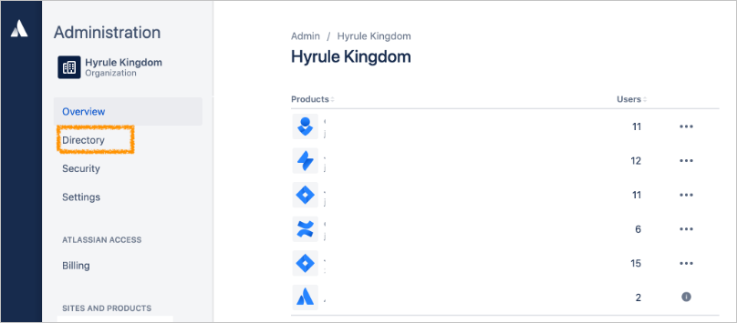

# Tutorial: Configure Atlassian Cloud for automatic user provisioning

The objective of this tutorial is to demonstrate the steps to be performed in Atlassian Cloud and Azure Active Directory (Azure AD) to configure Azure AD to automatically provision and de-provision users and/or groups to [Atlassian Cloud](https://www.atlassian.com/licensing/cloud). For important details on what this service does, how it works, and frequently asked questions, see [Automate user provisioning and deprovisioning to SaaS applications with Azure Active Directory](../manage-apps/user-provisioning.md). 

## Capabilities supported
> [!div class="checklist"]
> * Create users in Atlassian Cloud
> * Remove users in Atlassian Cloud when they do not require access anymore
> * Keep user attributes synchronized between Azure AD and Atlassian Cloud
> * Provision groups and group memberships in Atlassian Cloud
> * [Single sign-on](https://docs.microsoft.com/azure/active-directory/saas-apps/atlassian-cloud-tutorial) to Atlassian Cloud (recommended)

## Prerequisites

The scenario outlined in this tutorial assumes that you already have the following prerequisites:

* [An Azure AD tenant](https://docs.microsoft.com/azure/active-directory/develop/quickstart-create-new-tenant).
* A user account in Azure AD with [permission](https://docs.microsoft.com/azure/active-directory/users-groups-roles/directory-assign-admin-roles) to configure provisioning (e.g. Application Administrator, Cloud Application administrator, Application Owner, or Global Administrator).
* [An Atlassian Cloud tenant](https://www.atlassian.com/licensing/cloud)
* A user account in Atlassian Cloud with Admin permissions.

## Step 1. Plan your provisioning deployment
1. Learn about [how the provisioning service works](https://docs.microsoft.com/azure/active-directory/manage-apps/user-provisioning).
2. Determine who will be in [scope for provisioning](https://docs.microsoft.com/azure/active-directory/manage-apps/define-conditional-rules-for-provisioning-user-accounts).
3. Determine what data to [map between Azure AD and Atlassian Cloud](https://docs.microsoft.com/azure/active-directory/manage-apps/customize-application-attributes).

## Step 2. Configure Atlassian Cloud to support provisioning with Azure AD

1. Navigate to [Atlassian Organization Manager](https://admin.atlassian.com) **> select the org > directory**.

	

2. Click **User Provisioning** and click on **Create a directory**. Copy the **Directory base URL** and **Bearer Token** which will be entered in the **Tenant URL** and **Secret Token** fields in the Provisioning tab of your Atlassian Cloud application in the Azure AD portal respectively.

	
	
	

## Step 3. Add Atlassian Cloud from the Azure AD application gallery

Add Atlassian Cloud from the Azure AD application gallery to start managing provisioning to Atlassian Cloud. If you have previously setup Atlassian Cloud for SSO you can use the same application. However it is recommended that you create a separate app when testing out the integration initially. Learn more about adding an application from the gallery [here](https://docs.microsoft.com/azure/active-directory/manage-apps/add-gallery-app). 

## Step 4. Define who will be in scope for provisioning 

The Azure AD provisioning service allows you to scope who will be provisioned based on assignment to the application and or based on attributes of the user / group. If you choose to scope who will be provisioned to your app based on assignment, you can use the following [steps](../manage-apps/assign-user-or-group-access-portal.md) to assign users and groups to the application. If you choose to scope who will be provisioned based solely on attributes of the user or group, you can use a scoping filter as described [here](https://docs.microsoft.com/azure/active-directory/manage-apps/define-conditional-rules-for-provisioning-user-accounts). 

* When assigning users and groups to Atlassian Cloud, you must select a role other than **Default Access**. Users with the Default Access role are excluded from provisioning and will be marked as not effectively entitled in the provisioning logs. If the only role available on the application is the default access role, you can [update the application manifest](https://docs.microsoft.com/azure/active-directory/develop/howto-add-app-roles-in-azure-ad-apps) to add additional roles. 

* Start small. Test with a small set of users and groups before rolling out to everyone. When scope for provisioning is set to assigned users and groups, you can control this by assigning one or two users or groups to the app. When scope is set to all users and groups, you can specify an [attribute based scoping filter](https://docs.microsoft.com/azure/active-directory/manage-apps/define-conditional-rules-for-provisioning-user-accounts). 

## Step 5. Configuring automatic user provisioning to Atlassian Cloud 

This section guides you through the steps to configure the Azure AD provisioning service to create, update, and disable users and/or groups in Atlassian Cloud based on user and/or group assignments in Azure AD.

### To configure automatic user provisioning for Atlassian Cloud in Azure AD:

1. Sign in to the [Azure portal](https://portal.azure.com) and select **Enterprise Applications**, select **All applications**, then select **Atlassian Cloud**.

	

2. In the applications list, select **Atlassian Cloud**.

	

3. Select the **Provisioning** tab.

	

4. Set the **Provisioning Mode** to **Automatic**.

	

5. Under the **Admin Credentials** section, input the **Tenant URL** and **Secret Token** retrieved earlier from your Atlassian Cloud's account. Click **Test Connection** to ensure Azure AD can connect to Atlassian Cloud. If the connection fails, ensure your Atlassian Cloud account has Admin permissions and try again.

	

6. In the **Notification Email** field, enter the email address of a person or group who should receive the provisioning error notifications and check the checkbox - **Send an email notification when a failure occurs**.

	

7. Click **Save**.

8. Under the **Mappings** section, select **Synchronize Azure Active Directory Users to Atlassian Cloud**.

9. Review the user attributes that are synchronized from Azure AD to Atlassian Cloud in the **Attribute Mapping** section. The attributes selected as **Matching** properties are used to match the user accounts in Atlassian Cloud for update operations. Select the **Save** button to commit any changes.

   |Attribute|Type|
   |---|---|
   |userName|String|
   |active|Boolean|
   |name.familyName|String|
   |name.givenName|String|
   |emails[type eq "work"].value|String|   

10. Under the **Mappings** section, select **Synchronize Azure Active Directory Groups to Atlassian Cloud**.

11. Review the group attributes that are synchronized from Azure AD to Atlassian Cloud in the **Attribute Mapping** section. The attributes selected as **Matching** properties are used to match the groups in Atlassian Cloud for update operations. Select the **Save** button to commit any changes.

      |Attribute|Type|
      |---|---|
      |displayName|String|
      |externalId|String|
      |members|Reference|

12. To configure scoping filters, refer to the following instructions provided in the [Scoping filter tutorial](../app-provisioning/define-conditional-rules-for-provisioning-user-accounts.md).

13. To enable the Azure AD provisioning service for Atlassian Cloud, change the **Provisioning Status** to **On** in the **Settings** section.

	

14. Define the users and/or groups that you would like to provision to Atlassian Cloud by choosing the desired values in **Scope** in the **Settings** section.

	

16. When you are ready to provision, click **Save**.

	

This operation starts the initial synchronization of all users and/or groups defined in **Scope** in the **Settings** section. The initial sync takes longer to perform than subsequent syncs, which occur approximately every 40 minutes as long as the Azure AD provisioning service is running.

## Step 6. Monitor your deployment
Once you've configured provisioning, use the following resources to monitor your deployment:

1. Use the [provisioning logs](https://docs.microsoft.com/azure/active-directory/reports-monitoring/concept-provisioning-logs) to determine which users have been provisioned successfully or unsuccessfully
2. Check the [progress bar](https://docs.microsoft.com/azure/active-directory/manage-apps/application-provisioning-when-will-provisioning-finish-specific-user) to see the status of the provisioning cycle and how close it is to completion
3. If the provisioning configuration seems to be in an unhealthy state, the application will go into quarantine. Learn more about quarantine states [here](https://docs.microsoft.com/azure/active-directory/manage-apps/application-provisioning-quarantine-status).  

## Connector Limitations

* Atlassian Cloud allows provisioning of users only from [verified domains](https://confluence.atlassian.com/cloud/organization-administration-938859734.html).
* Atlassian Cloud does not support group renames today. This means that any changes to the displayName of a group in Azure AD will not be updated and reflected in Atlassian Cloud.
* The value of the **mail** user attribute in Azure AD is only populated if the user has a Microsoft Exchange Mailbox. If the user does not have one, it is recommended to map a different desired attribute to the **emails** attribute in Atlassian Cloud.

## Change log

* 06/15/2020 - Added support for batch PATCH for groups.

## Additional resources

* [Managing user account provisioning for Enterprise Apps](../app-provisioning/configure-automatic-user-provisioning-portal.md)
* [What is application access and single sign-on with Azure Active Directory?](../manage-apps/what-is-single-sign-on.md)

## Next steps

* [Learn how to review logs and get reports on provisioning activity](../app-provisioning/check-status-user-account-provisioning.md)

<!--Image references-->
[1]: ./media/atlassian-cloud-provisioning-tutorial/tutorial-general-01.png
[2]: ./media/atlassian-cloud-provisioning-tutorial/tutorial-general-02.png
[3]: ./media/atlassian-cloud-provisioning-tutorial/tutorial-general-03.png