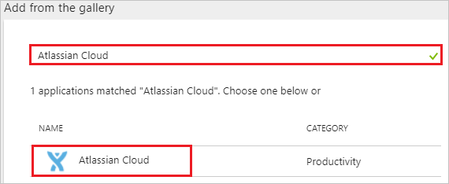
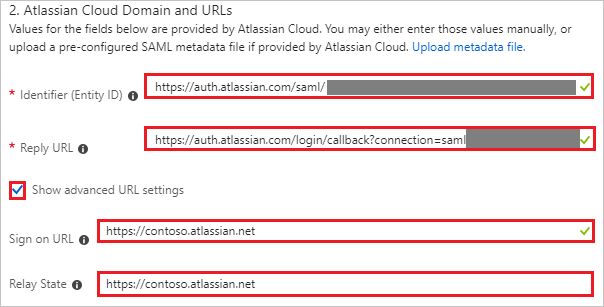
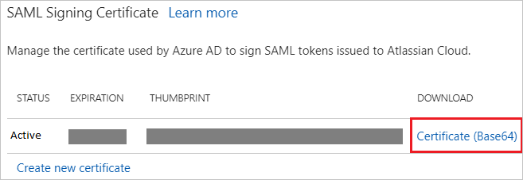
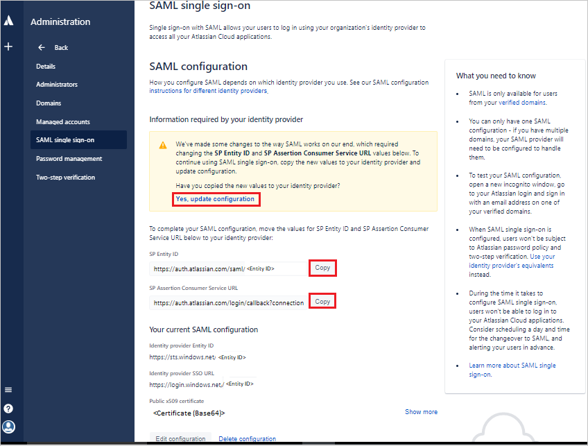
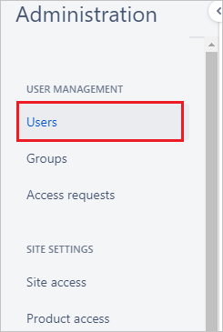
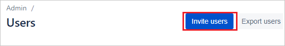

# Tutorial: Azure Active Directory integration with Atlassian Cloud

In this tutorial, you learn how to integrate Atlassian Cloud with Azure Active Directory (Azure AD).

Integrating Atlassian Cloud with Azure AD provides you with the following benefits:

- You can control in Azure AD who has access to Atlassian Cloud.
- You can enable your users to be signed on automatically (single sign-on) to Atlassian Cloud with their Azure AD accounts.
- You can manage your accounts in one central location, the Azure portal.

For more information about software as a service (SaaS) app integration with Azure AD, see [What is application access and single sign-on with Azure Active Directory?](../manage-apps/what-is-single-sign-on.md).

## Prerequisites

To configure Azure AD integration with Atlassian Cloud, you need the following items:

- An Azure AD subscription.
- To enable Security Assertion Markup Language (SAML) single sign-on for Atlassian Cloud products, you need to set up Atlassian Access. Learn more about [Atlassian Access]( https://www.atlassian.com/enterprise/cloud/identity-manager).

> [!NOTE]
> When you test the steps in this tutorial, we recommend that you not use a production environment.

To test the steps in this tutorial, follow these recommendations:

- Do not use your production environment, unless it is necessary.
- If you don't have an Azure AD trial environment, you can [get a one-month trial](https://azure.microsoft.com/pricing/free-trial/).

## Scenario description
In this tutorial, you test Azure AD single sign-on in a test environment.
The scenario outlined in the tutorial consists of two main building blocks:

* Adding Atlassian Cloud from the gallery
* Configuring and testing Azure AD single sign-on

## Add Atlassian Cloud from the gallery
To configure the integration of Atlassian Cloud with Azure AD, add Atlassian Cloud from the gallery to your list of managed SaaS apps by doing the following:

1. In the [Azure portal](https://portal.azure.com), in the left pane, select the **Azure Active Directory** button.

	![The Azure Active Directory button][1]

2. Select **Enterprise applications** > **All applications**.

	![The Enterprise applications pane][2]
	
3. To add an application, select **New application**.

	![The "New application" button][3]

4. In the search box, type **Atlassian Cloud**, in the results list, select **Atlassian Cloud**, and then select **Add**.

	

## Configure and test Azure AD single sign-on

In this section, you configure and test Azure AD single sign-on with Atlassian Cloud, based on a test user named *Britta Simon*.

For single sign-on to work, Azure AD needs to identify the Atlassian Cloud user and its counterpart in Azure AD. In other words, you must establish a link relationship between an Azure AD user and the related user in Atlassian Cloud.

To establish the link relationship, assign as the Atlassian Cloud *Username* the same value that's assigned to the Azure AD *user name*.

To configure and test Azure AD single sign-on with Atlassian Cloud, you need to complete the building blocks in the following sections.

### Configure Azure AD single sign-on

In this section, you enable Azure AD single sign-on in the Azure portal and configure single sign-on in your Atlassian Cloud application.

To configure Azure AD single sign-on with Atlassian Cloud, do the following:

1. In the Azure portal, in the **Atlassian Cloud** application integration pane, select **Single sign-on**.

	![Configure Single sign-on link][4]

2. In the **Single sign-on** window, in the **Single Sign-on Mode** box, select **SAML-based Sign-on**.

	

3. To configure the application in **IDP-initiated** mode, under **Atlassian Cloud Domain and URLs**, do the following:

	
	
	a. In the **Identifier** box, type a URL with the following pattern: `https://auth.atlassian.com/saml/<unique ID>`.
	
	b. In the **Reply URL** box, type a URL with the following pattern: `https://auth.atlassian.com/login/callback?connection=saml-<unique ID>`.

	c. Check **Show advanced URL settings**.

	d. In the **Relay State** box, type a URL with the following pattern: `https://<instancename>.atlassian.net`.

	> [!NOTE]
	> The preceding values are not real. Update these values with the actual identifier and reply URL. You will get these real values from the Atlassian Cloud SAML Configuration screen which is explained later in the tutorial.

4. To configure the application in SP-initiated mode, select the **Show advanced URL settings** and then, in the **Sign on URL** box, type a URL with the following pattern: `https://<instancename>.atlassian.net`.

	

	> [!NOTE]
	> The preceding Sign on URL value is not real. Update the value with the actual Sign on URL. Contact [Atlassian Cloud Client support team](https://support.atlassian.com/) to get this value.

5. Under **SAML Signing Certificate**, select **Certificate(Base64)**, and then save the certificate file on your computer.

	

6. Your Atlassian Cloud application expects to find the SAML assertions in a specific format, which requires you to add custom attribute mappings to your SAML Token Attributes configuration. 

	By default, the **User Identifier** value is mapped to user.userprincipalname. Change this value to map to user.mail. You can also choose any other appropriate value according to your organization's setup but, in most of the cases, email should work.

	

7. Select **Save**.

	

8. To open the **Configure sign-on** window, in the **Atlassian Cloud Configuration** section, select **Configure Atlassian Cloud**.

9. In the **Quick Reference** section, copy the **SAML Entity ID** and **SAML Single Sign-On Service URL**.

	

10. To get SSO configured for your application, sign in to the Atlassian portal with administrator credentials.

11. You need to verify your domain before going to configure single sign-on. For more information, see [Atlassian domain verification](https://confluence.atlassian.com/cloud/domain-verification-873871234.html) document.

12. In the left pane, select **SAML single sign-on**. If you haven't already done so, subscribe to Atlassian Identity Manager.

	

13. In the **Add SAML configuration** window, do the following:

	

	a. In the **Identity provider Entity ID** box, paste the SAML entity ID that you copied from the Azure portal.

    b. In the **Identity provider SSO URL** box, paste the SAML single sign-on service URL that you copied from the Azure portal.

    c. Open the downloaded certificate from the Azure portal in a .txt file, copy the value (without the *Begin Certificate* and *End Certificate* lines), and then paste it in the **Public X509 certificate** box.
    
    d. Select **Save Configuration**.
     
14. To ensure that you have set up the correct URLs, update the Azure AD settings by doing the following:

    

	a. In the SAML window, copy the **SP Identity ID** and then, in the Azure portal, under Atlassian Cloud **Domain and URLs**, paste it in the **Identifier** box.
	
	b. In the SAML window, copy the **SP Assertion Consumer Service URL** and then, in the Azure portal, under Atlassian Cloud **Domain and URLs**, paste it in the **Reply URL** box. The sign-on URL is the tenant URL of your Atlassian Cloud.

	> [!NOTE]
	> If you're an existing customer, after you update the **SP Identity ID** and **SP Assertion Consumer Service URL** values in the Azure portal, select **Yes, update configuration**. If you're a new customer, you can skip this step.
	
15. In the Azure portal, select **Save**.

	

### Create an Azure AD test user

In this section, you create test user Britta Simon in the Azure portal by doing the following:

   ![Create an Azure AD test user][100]

1. In the Azure portal, in the left pane, select the **Azure Active Directory** button.

    

2. To display the list of users, select **Users and groups** > **All users**.

    

3. In the **All Users** window, select **Add**.

    

4. In the **User** window, do the following:

    

    a. In the **Name** box, type **BrittaSimon**.

    b. In the **User name** box, type the email address of user Britta Simon.

    c. Select the **Show Password** check box, and then write down the value that's displayed in the **Password** box.

    d. Select **Create**.

### Create an Atlassian Cloud test user

To enable Azure AD users to sign in to Atlassian Cloud, provision the user accounts manually in Atlassian Cloud by doing the following:

1. In the **Administration** pane, select **Users**.

	

2. To create a user in Atlassian Cloud, select **Invite user**.

	

3. In the **Email address** box, enter the user's email address, and then assign the application access.

	

4. To send an email invitation to the user, select **Invite users**. An email invitation is sent to the user and, after accepting the invitation, the user is active in the system.

>[!NOTE]
>You can also bulk-create users by selecting the **Bulk Create** button in the **Users** section.

### Assign the Azure AD test user

In this section, you enable user Britta Simon to use Azure single sign-on by granting access to Atlassian Cloud. To do so, do the following:

![Assign the user role][200]

1. In the Azure portal, open the **Applications** view, go to the directory view, and then select **Enterprise applications** > **All applications**.

	![Assign User][201]

2. In the **Applications** list, select **Atlassian Cloud**.

	

3. In the left pane, select **Users and groups**.

	![The "Users and groups" link][202]

4. Select **Add** and then, in the **Add Assignment** pane, select **Users and groups**.

	![The Add Assignment pane][203]

5. In the **Users and groups** window, in the **Users** list, select **Britta Simon**.

6. In the **Users and groups** window, select **Select**.

7. In the **Add Assignment** window, select **Assign**.
	
### Test single sign-on

In this section, you test your Azure AD single sign-on configuration by using the Access Panel.

When you select the **Atlassian Cloud** tile in the Access Panel, you should be signed on automatically to your Atlassian Cloud application.
For more information about the Access Panel, see [Introduction to the Access Panel](../user-help/active-directory-saas-access-panel-introduction.md). 

## Additional resources

* [List of tutorials on how to integrate SaaS apps with Azure Active Directory](tutorial-list.md)
* [What is application access and single sign-on with Azure Active Directory?](../manage-apps/what-is-single-sign-on.md)

<!--Image references-->

[1]: ./media/atlassian-cloud-tutorial/tutorial_general_01.png
[2]: ./media/atlassian-cloud-tutorial/tutorial_general_02.png
[3]: ./media/atlassian-cloud-tutorial/tutorial_general_03.png
[4]: ./media/atlassian-cloud-tutorial/tutorial_general_04.png

[100]: ./media/atlassian-cloud-tutorial/tutorial_general_100.png

[200]: ./media/atlassian-cloud-tutorial/tutorial_general_200.png
[201]: ./media/atlassian-cloud-tutorial/tutorial_general_201.png
[202]: ./media/atlassian-cloud-tutorial/tutorial_general_202.png
[203]: ./media/atlassian-cloud-tutorial/tutorial_general_203.png
