# Tutorial: Integrate Atlassian Cloud with Azure Active Directory

In this tutorial, you'll learn how to integrate Atlassian Cloud with Azure Active Directory (Azure AD). When you integrate Atlassian Cloud with Azure AD, you can:

* Control in Azure AD who has access to Atlassian Cloud.
* Enable your users to be automatically signed-in to Atlassian Cloud with their Azure AD accounts.
* Manage your accounts in one central location - the Azure portal.

## Prerequisites

To get started, you need the following items:

* An Azure AD subscription. If you don't have a subscription, you can get one-month free trial [here](https://azure.microsoft.com/pricing/free-trial/).
* Atlassian Cloud single sign-on (SSO) enabled subscription.
* To enable Security Assertion Markup Language (SAML) single sign-on for Atlassian Cloud products, you need to set up Atlassian Access. Learn more about [Atlassian Access]( https://www.atlassian.com/enterprise/cloud/identity-manager).

> [!NOTE]
> This integration is also available to use from Azure AD US Government Cloud environment. You can find this application in the Azure AD US Government Cloud Application Gallery and configure it in the same way as you do from public cloud.

## Scenario description

In this tutorial, you configure and test Azure AD SSO in a test environment. 

* Atlassian Cloud supports **SP and IDP** initiated SSO
* Atlassian Cloud supports [Automatic user provisioning and deprovisioning](atlassian-cloud-provisioning-tutorial.md)

## Adding Atlassian Cloud from the gallery

To configure the integration of Atlassian Cloud into Azure AD, you need to add Atlassian Cloud from the gallery to your list of managed SaaS apps.

1. Sign in to the Azure portal using either a work or school account, or a personal Microsoft account.
1. On the left navigation pane, select the **Azure Active Directory** service.
1. Navigate to **Enterprise Applications** and then select **All Applications**.
1. To add new application, select **New application**.
1. In the **Add from the gallery** section, type **Atlassian Cloud** in the search box.
1. Select **Atlassian Cloud** from results panel and then add the app. Wait a few seconds while the app is added to your tenant.

## Configure and test Azure AD SSO

Configure and test Azure AD SSO with Atlassian Cloud using a test user called **B.Simon**. For SSO to work, you need to establish a link relationship between an Azure AD user and the related user in Atlassian Cloud.

To configure and test Azure AD SSO with Atlassian Cloud, perform the following steps:

1. **[Configure Azure AD with Atlassian Cloud SSO](#configure-azure-ad-sso)** - to enable your users to use Azure AD based SAML SSO with Atlassian Cloud.
    1. **[Create an Azure AD test user](#create-an-azure-ad-test-user)** - to test Azure AD single sign-on with B.Simon.
    1. **[Assign the Azure AD test user](#assign-the-azure-ad-test-user)** - to enable B.Simon to use Azure AD single sign-on.
1. **[Create Atlassian Cloud test user](#create-atlassian-cloud-test-user)** - to have a counterpart of B.Simon in Atlassian Cloud that is linked to the Azure AD representation of user.
1. **[Test SSO](#test-sso)** - to verify whether the configuration works.

### Configure Azure AD SSO

Follow these steps to enable Azure AD SSO in the Azure portal.

1. To automate the configuration within Atlassian Cloud, you need to install **My Apps Secure Sign-in browser extension** by clicking **Install the extension**.

    

1. After adding extension to the browser, click on **Set up Atlassian Cloud** will direct you to the Atlassian Cloud application. From there, provide the admin credentials to sign into Atlassian Cloud. The browser extension will automatically configure the application for you.

    

1. If you want to setup Atlassian Cloud manually, log in to your Atlassian Cloud company site as an administrator and perform the following steps.

1. Before you start go to your Atlassian product instance and copy/save the Instance URL
   > [!NOTE]
   > url should fit `https://<instancename>.atlassian.net` pattern

   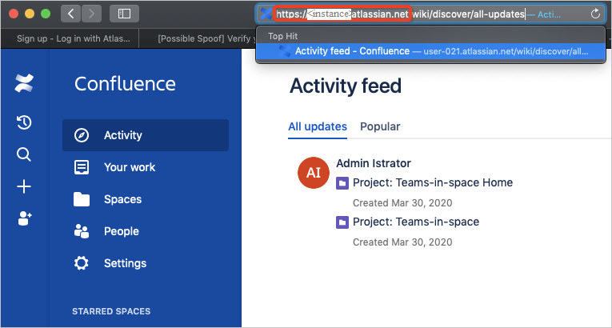

1. Open the [Atlassian Admin Portal](https://admin.atlassian.com/) and click on your organization name

   

1. You need to verify your domain before going to configure single sign-on. For more information, see [Atlassian domain verification](https://confluence.atlassian.com/cloud/domain-verification-873871234.html) document.
1. From the Atlassian Admin Portal Screen select **Security** from the left drawer

   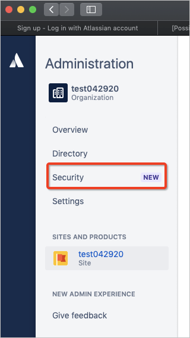

1. From the Atlassian Admin Portal Security Screen select **SAML single sign** on from the left drawer

   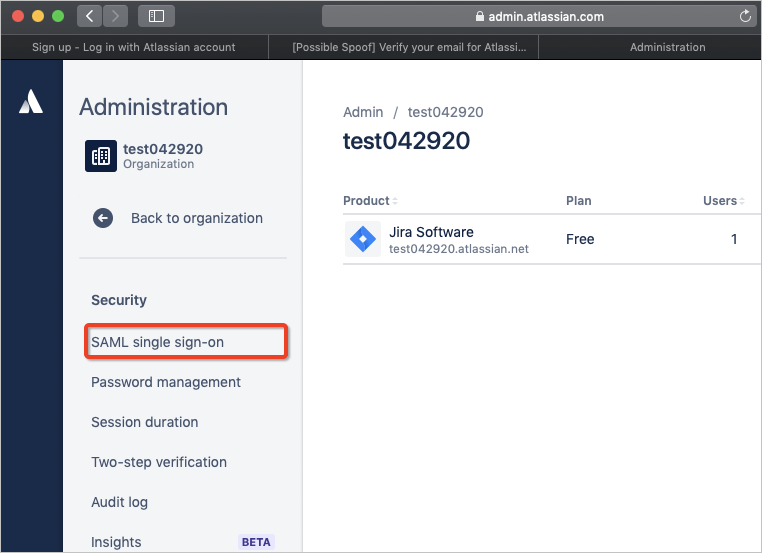

1. Click on **Add SAML Configuration** and keep the page open

   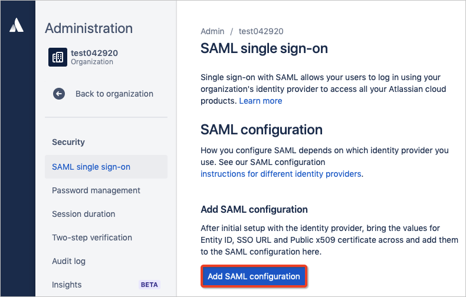

   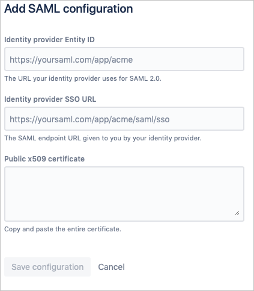

1. In the Azure portal, on the **Atlassian Cloud** application integration page, find the **Manage** section and select **Set up single sign-on**.

   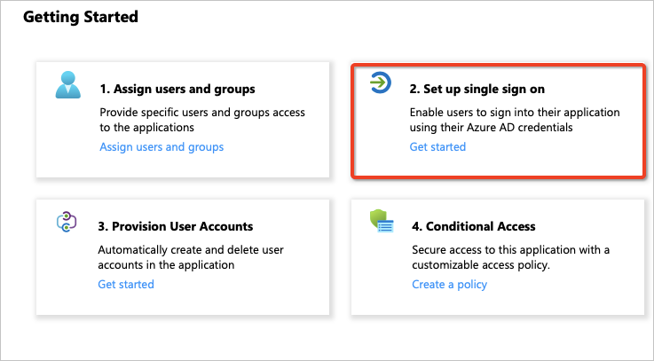

1. On the **Select a Single sign-on method** page, select **SAML**.

   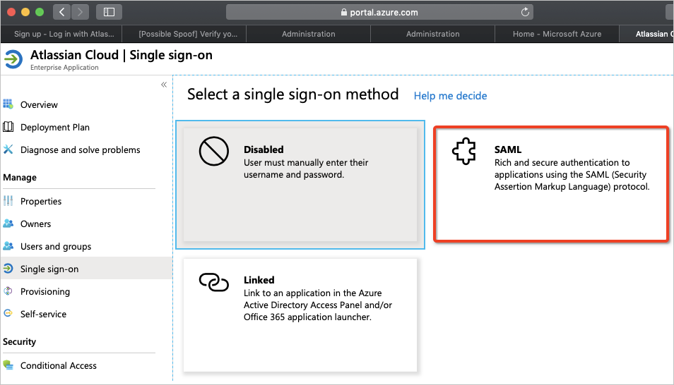

1. On the **Set up Single Sign-On with SAML** page, scroll down to **Set Up Atlassian Cloud**
   
   a. Click on **Configuration URLs**

   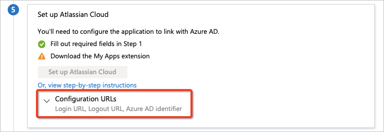
   
   b. Copy **Azure AD Identifier** value from Azure portal, paste it in the **Identity Provider Entity ID** textbox in Atlassian
   
   c. Copy **Login URL** value from Azure portal, paste it in the **Identity Provider SSO URL** textbox in Atlassian

   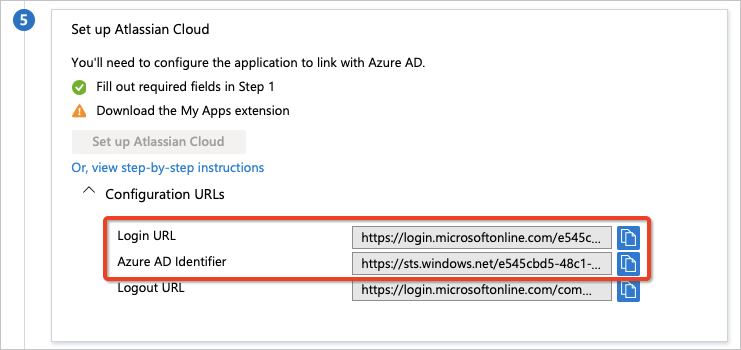

   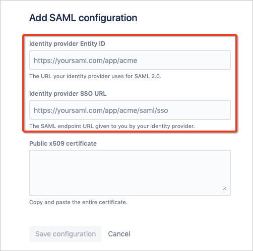

1. On the **Set up Single Sign-On with SAML** page, in the **SAML Signing Certificate** section, find **Certificate (Base64)** and select **Download** to download the certificate and save it on your computer.

   

   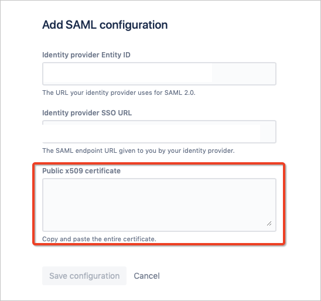

1. **Add/Save** the SAML Configuration in Atlassian

1. If you wish to configure the application in **IDP** initiated mode, edit the **Basic SAML Configuration** section of the **Set up Single Sign-On with SAML** page in Azure and open the **SAML single sign-on page** on the Atlassian Admin Portal

   a. Copy **SP Entity ID** value from Atlassian, paste it in the **Identifier (Entity ID)** box in Azure and set it as default
   
   b. Copy **SP Assertion Consumer Service URL** value from Atlassian, paste it in the **Reply URL (Assertion Consumer Service URL)** box in Azure and set it as default
   
   c. Copy your **Instance URL** value, which you copied at step 1 and paste it in the **Relay State** box in Azure

   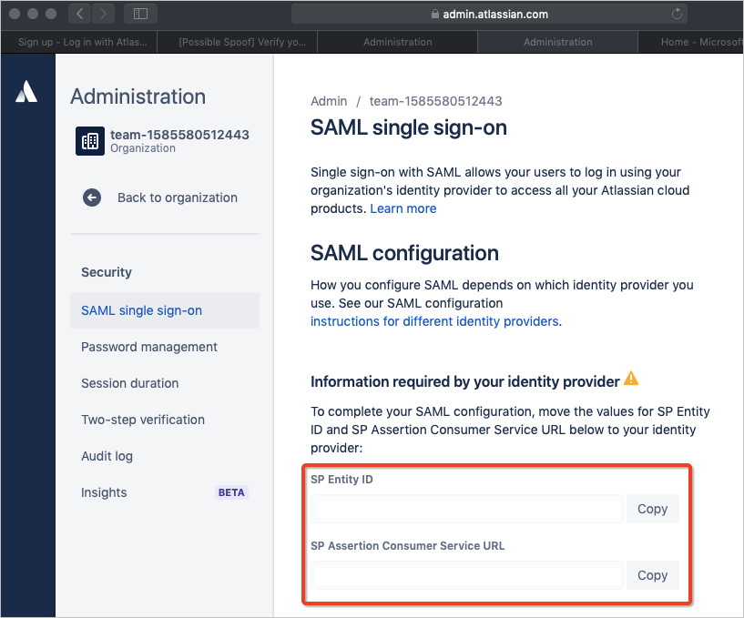

   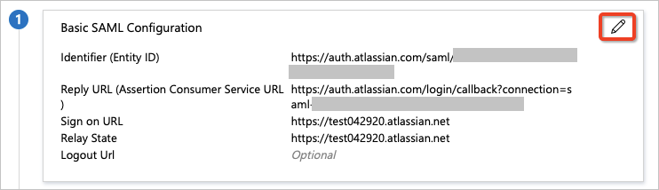

   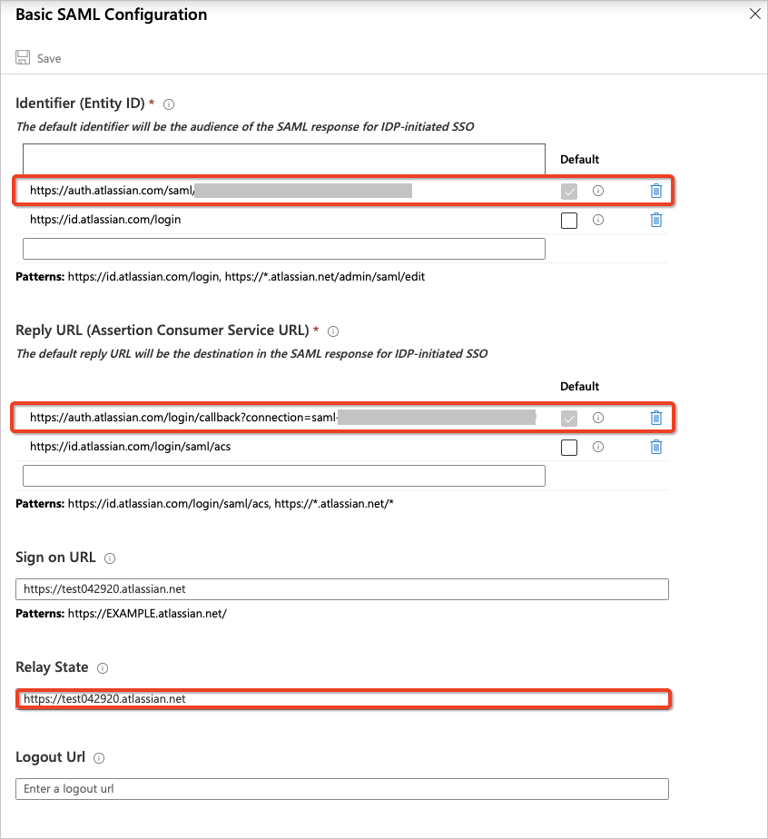
   
1. If you wish to configure the application in **SP** initiated mode, edit the **Basic SAML Configuration** section of the **Set up Single Sign-On with SAML** page in Azure. Copy your **Instance URL** (from step 1)  and paste it in the **Sign On URL** box in Azure

   

   
   
1. Your Atlassian Cloud application expects the SAML assertions in a specific format, which requires you to add custom attribute mappings to your SAML token attributes configuration. You can edit the attribute mapping by clicking on **Edit** icon. 

   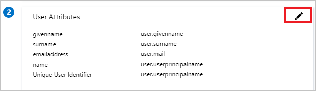
   
   1. Attribute mapping for an Azure AD tenant with a Microsoft 365 license
      
      a. Click on the **Unique User Identifier (Name ID)** claim

      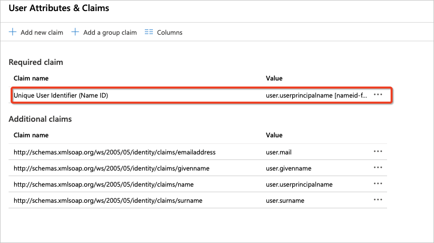
      
      b. Atlassian Cloud expects the **nameidentifier** (**Unique User Identifier**) to be mapped to the user's email (**user.email**). Edit the **Source attribute** and change it to **user.mail**. Save the changes to the claim.

      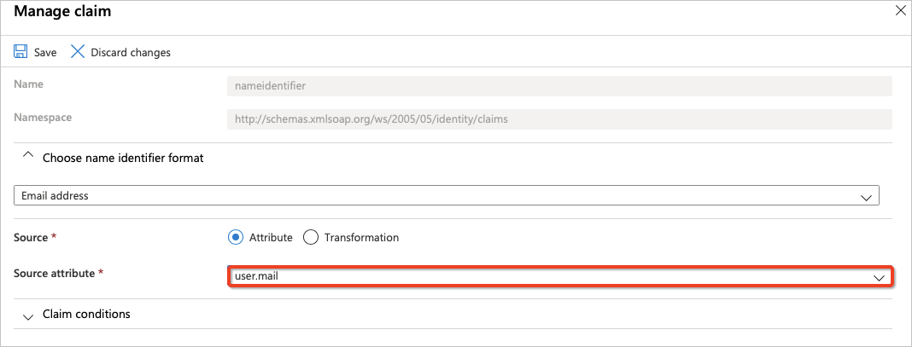
      
      c. The final attribute mappings should look as follows.

      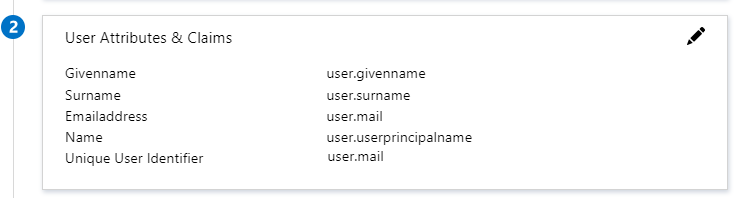
      
   1. Attribute mapping for an Azure AD tenant without a Microsoft 365 license 

      a. Click on the `http://schemas.xmlsoap.org/ws/2005/05/identity/claims/emailaddress` claim.

      
         
      b. While Azure does not populate the **user.mail** attribute for users created in Azure AD tenants without Microsoft 365 licenses and stores the email for such users in **userprincipalname** attribute. Atlassian Cloud expects the **nameidentifier** (**Unique User Identifier**) to be mapped to the user's email (**user.userprincipalname**).  Edit the **Source attribute**  and change it to **user.userprincipalname**. Save the changes to the claim.

      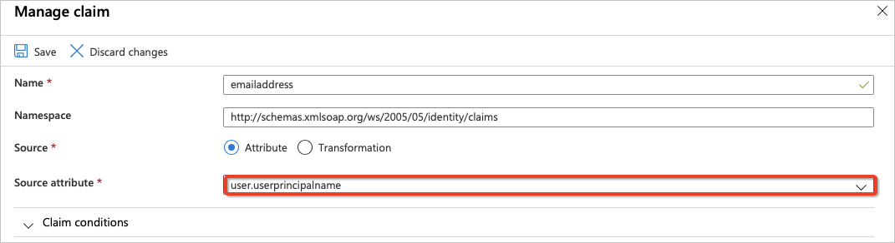
         
      c. The final attribute mappings should look as follows.

      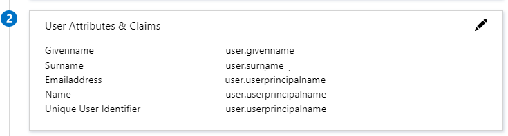
     
### Create an Azure AD test user

In this section, you'll create a test user in the Azure portal called B.Simon.

1. From the left pane in the Azure portal, select **Azure Active Directory**, select **Users**, and then select **All users**.
1. Select **New user** at the top of the screen.
1. In the **User** properties, follow these steps:
   1. In the **Name** field, enter `B.Simon`.  
   1. In the **User name** field, enter the username@companydomain.extension. For example, `B.Simon@contoso.com`.
   1. Select the **Show password** check box, and then write down the value that's displayed in the **Password** box.
   1. Click **Create**.

### Assign the Azure AD test user

In this section, you'll enable B.Simon to use Azure single sign-on by granting access to Atlassian Cloud.

1. In the Azure portal, select **Enterprise Applications**, and then select **All applications**.
1. In the applications list, select **Atlassian Cloud**.
1. In the app's overview page, find the **Manage** section and select **Users and groups**.
1. Select **Add user**, then select **Users and groups** in the **Add Assignment** dialog.
1. In the **Users and groups** dialog, select **B.Simon** from the Users list, then click the **Select** button at the bottom of the screen.
1. If you are expecting a role to be assigned to the users, you can select it from the **Select a role** dropdown. If no role has been set up for this app, you see "Default Access" role selected.
1. In the **Add Assignment** dialog, click the **Assign** button.

### Create Atlassian Cloud test user

To enable Azure AD users to sign in to Atlassian Cloud, provision the user accounts manually in Atlassian Cloud by doing the following:

1. In the **Administration** pane, select **Users**.

    

1. To create a user in Atlassian Cloud, select **Invite user**.

    

1. In the **Email address** box, enter the user's email address, and then assign the application access.

    

1. To send an email invitation to the user, select **Invite users**. An email invitation is sent to the user and, after accepting the invitation, the user is active in the system.

> [!NOTE]
> You can also bulk-create users by selecting the **Bulk Create** button in the **Users** section.

### Test SSO

In this section, you test your Azure AD single sign-on configuration with following options. 

#### SP initiated:

* Click on **Test this application** in Azure portal. This will redirect to Atlassian Cloud Sign on URL where you can initiate the login flow.  

* Go to Atlassian Cloud Sign-on URL directly and initiate the login flow from there.

#### IDP initiated:

* Click on **Test this application** in Azure portal and you should be automatically signed in to the Atlassian Cloud for which you set up the SSO 

You can also use Microsoft Access Panel to test the application in any mode. When you click the Atlassian Cloud tile in the Access Panel, if configured in SP mode you would be redirected to the application sign on page for initiating the login flow and if configured in IDP mode, you should be automatically signed in to the Atlassian Cloud for which you set up the SSO. For more information about the Access Panel, see [Introduction to the Access Panel](../user-help/my-apps-portal-end-user-access.md).

## Next steps

Once you configure Atlassian Cloud you can enforce session control, which protects exfiltration and infiltration of your organization's sensitive data in real time. Session control extends from Conditional Access. [Learn how to enforce session control with Microsoft Cloud App Security](/cloud-app-security/proxy-deployment-any-app).