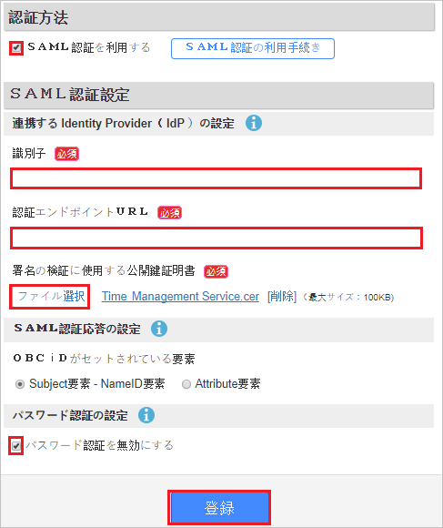
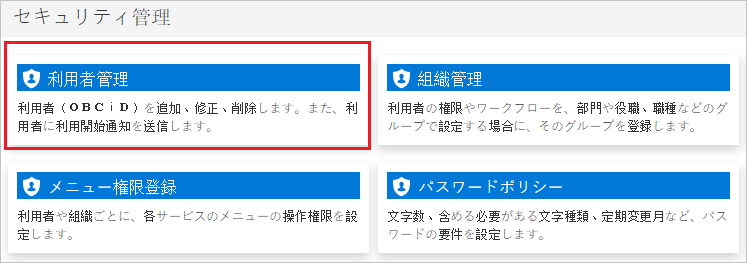
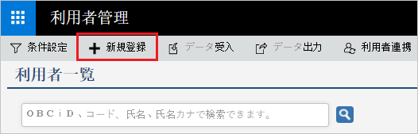

# Tutorial: Azure Active Directory integration with Attendance Management Services

In this tutorial, you'll learn how to integrate Attendance Management Services with Azure Active Directory (Azure AD). When you integrate Attendance Management Services with Azure AD, you can:

* Control in Azure AD who has access to Attendance Management Services.
* Enable your users to be automatically signed-in to Attendance Management Services with their Azure AD accounts.
* Manage your accounts in one central location - the Azure portal.

## Prerequisites

To configure Azure AD integration with Attendance Management Services, you need the following items:

* An Azure AD subscription. If you don't have an Azure AD environment, you can get a [free account](https://azure.microsoft.com/free/).
* Attendance Management Services single sign-on enabled subscription.

## Scenario description

In this tutorial, you configure and test Azure AD single sign-on in a test environment.

* Attendance Management Services supports **SP** initiated SSO.

## Add Attendance Management Services from the gallery

To configure the integration of Attendance Management Services into Azure AD, you need to add Attendance Management Services from the gallery to your list of managed SaaS apps.

1. Sign in to the Azure portal using either a work or school account, or a personal Microsoft account.
1. On the left navigation pane, select the **Azure Active Directory** service.
1. Navigate to **Enterprise Applications** and then select **All Applications**.
1. To add new application, select **New application**.
1. In the **Add from the gallery** section, type **Attendance Management Services** in the search box.
1. Select **Attendance Management Services** from results panel and then add the app. Wait a few seconds while the app is added to your tenant.

## Configure and test Azure AD SSO for Attendance Management Services

Configure and test Azure AD SSO with Attendance Management Services using a test user called **B.Simon**. For SSO to work, you need to establish a link relationship between an Azure AD user and the related user in Attendance Management Services.

To configure and test Azure AD SSO with Attendance Management Services, perform the following steps:

1. **[Configure Azure AD SSO](#configure-azure-ad-sso)** - to enable your users to use this feature.
    1. **[Create an Azure AD test user](#create-an-azure-ad-test-user)** - to test Azure AD single sign-on with B.Simon.
    1. **[Assign the Azure AD test user](#assign-the-azure-ad-test-user)** - to enable B.Simon to use Azure AD single sign-on.
1. **[Configure Attendance Management Services SSO](#configure-attendance-management-services-sso)** - to configure the single sign-on settings on application side.
    1. **[Create Attendance Management Services test user](#create-attendance-management-services-test-user)** - to have a counterpart of B.Simon in Attendance Management Services that is linked to the Azure AD representation of user.
1. **[Test SSO](#test-sso)** - to verify whether the configuration works.

## Configure Azure AD SSO

Follow these steps to enable Azure AD SSO in the Azure portal.

1. In the Azure portal, on the **Attendance Management Services** application integration page, find the **Manage** section and select **single sign-on**.
1. On the **Select a single sign-on method** page, select **SAML**.
1. On the **Set up single sign-on with SAML** page, click the pencil icon for **Basic SAML Configuration** to edit the settings.

   

4. On the **Basic SAML Configuration** section, perform the following steps:

    a. In the **Identifier (Entity ID)** text box, type a URL using the following pattern:
    `https://id.obc.jp/<TENANT_INFORMATION>/`

	b. In the **Sign on URL** text box, type a URL using the following pattern:
    `https://id.obc.jp/<TENANT_INFORMATION>/`

	> [!NOTE]
	> These values are not real. Update these values with the actual Identifier and Sign on URL. Contact [Attendance Management Services Client support team](https://www.obcnet.jp/) to get these values. You can also refer to the patterns shown in the **Basic SAML Configuration** section in the Azure portal.

5. On the **Set up Single Sign-On with SAML** page, in the **SAML Signing Certificate** section, click **Download** to download the **Certificate (Base64)** from the given options as per your requirement and save it on your computer.

	

6. On the **Set up Attendance Management Services** section, copy the appropriate URL(s) as per your requirement.

	

### Create an Azure AD test user

In this section, you'll create a test user in the Azure portal called B.Simon.

1. From the left pane in the Azure portal, select **Azure Active Directory**, select **Users**, and then select **All users**.
1. Select **New user** at the top of the screen.
1. In the **User** properties, follow these steps:
   1. In the **Name** field, enter `B.Simon`.  
   1. In the **User name** field, enter the username@companydomain.extension. For example, `B.Simon@contoso.com`.
   1. Select the **Show password** check box, and then write down the value that's displayed in the **Password** box.
   1. Click **Create**.

### Assign the Azure AD test user

In this section, you'll enable B.Simon to use Azure single sign-on by granting access to Attendance Management Services.

1. In the Azure portal, select **Enterprise Applications**, and then select **All applications**.
1. In the applications list, select **Attendance Management Services**.
1. In the app's overview page, find the **Manage** section and select **Users and groups**.
1. Select **Add user**, then select **Users and groups** in the **Add Assignment** dialog.
1. In the **Users and groups** dialog, select **B.Simon** from the Users list, then click the **Select** button at the bottom of the screen.
1. If you are expecting a role to be assigned to the users, you can select it from the **Select a role** dropdown. If no role has been set up for this app, you see "Default Access" role selected.
1. In the **Add Assignment** dialog, click the **Assign** button.

## Configure Attendance Management Services SSO

1. In a different browser window, sign-on to your Attendance Management Services company site as administrator.

1. Click on **SAML authentication** under the **Security management section**.

	

1. Perform the following steps:

	

	a. Select **Use SAML authentication**.

	b. In the **Identifier** textbox, paste the value of **Azure AD Identifier** value, which you have copied from Azure portal.

	c. In the **Authentication endpoint URL** textbox, paste the value of **Login URL** value, which you have copied from Azure portal.

	d. Click **Select a file** to upload the certificate which you downloaded from Azure AD.

	e. Select **Disable password authentication**.

	f. Click **Registration**.

### Create Attendance Management Services test user

To enable Azure AD users to sign in to Attendance Management Services, they must be provisioned into Attendance Management Services. In the case of Attendance Management Services, provisioning is a manual task.

**To provision a user account, perform the following steps:**

1. Sign in to your Attendance Management Services company site as an administrator.

1. Click on **User management** under the **Security management section**.

	

1. Click **New rules login**.

    

1. In the **OBCiD information** section, perform the following steps:

	

	a. In the **OBCiD** textbox, type the email of user like `BrittaSimon@contoso.com`.

	b. In the **Password** textbox, type the password of user.

	c. Click **Registration**

## Test SSO

In this section, you test your Azure AD single sign-on configuration with following options. 

* Click on **Test this application** in Azure portal. This will redirect to Attendance Management Services Sign-on URL where you can initiate the login flow. 

* Go to Attendance Management Services Sign-on URL directly and initiate the login flow from there.

* You can use Microsoft My Apps. When you click the Attendance Management Services tile in the My Apps, this will redirect to Attendance Management Services Sign-on URL. For more information about the My Apps, see [Introduction to the My Apps](../user-help/my-apps-portal-end-user-access.md).

## Next steps

Once you configure Attendance Management Services you can enforce session control, which protects exfiltration and infiltration of your organization’s sensitive data in real time. Session control extends from Conditional Access. [Learn how to enforce session control with Microsoft Cloud App Security](/cloud-app-security/proxy-deployment-aad).
