# Tutorial: Microsoft Entra integration with Amazon Web Services

In this tutorial, you learn how to integrate Microsoft Entra ID with Amazon Web Services (AWS) (legacy tutorial).

This integration provides the following benefits:

- You can control in Microsoft Entra ID who has access to AWS.
- You can enable your users to automatically sign in to AWS by using single sign-on (SSO) with their Microsoft Entra accounts.
- You can manage your accounts in one central location, the Azure portal.

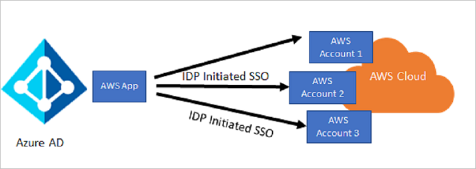

> [!NOTE]
> We recommend that you _not_ connect one AWS app to all your AWS accounts. Instead, we recommend that you use [Microsoft Entra SSO integration with AWS](./amazon-web-service-tutorial.md) to configure multiple instances of your AWS account to multiple instances of AWS apps in Microsoft Entra ID.

We recommend that you _not_ connect one AWS app to all your AWS accounts, for the following reasons:

- Use this approach only if you have a small number of AWS accounts and roles, because this model isn't scalable as the number of AWS accounts and the roles within them increase. The approach doesn't use AWS role-import functionality with Microsoft Entra user provisioning, so you have to manually add, update, or delete the roles.

- You have to use the Microsoft Graph Explorer approach to patch all the roles to the app. We don’t recommend using the manifest file approach.

- Customers report that after they've added ~1,200 app roles for a single AWS app, any further operation on the app starts throwing the errors related to size. There is a hard size limit to the application object.

- You have to manually update the roles as they get added in any of the accounts. This is unfortunately a _replace_ approach, not an _append_ approach. Also, if your account numbers are growing, this becomes an _n_ &times; _n_ relationship with accounts and roles.

- All the AWS accounts use the same federation metadata XML file. At the time of certificate rollover, updating the certificate on all the AWS accounts at the same time can be a massive exercise.

## Prerequisites

To configure Microsoft Entra integration with AWS, you need the following items:

- A Microsoft Entra subscription. If you don't have a Microsoft Entra subscription, you can get a [one-month trial](https://azure.microsoft.com/pricing/free-trial/).
- An AWS SSO-enabled subscription.

> [!NOTE]
> We do not recommend that you test the steps in this tutorial in a production environment unless it is necessary.

## Scenario description

In this tutorial, you configure and test Microsoft Entra SSO in a test environment.

AWS supports SP-initiated and IDP-initiated SSO.

## Add AWS from the gallery

To configure the integration of AWS into Microsoft Entra ID, you add AWS from the gallery to your list of managed software as a service (SaaS) apps.

1. Sign in to the [Microsoft Entra admin center](https://entra.microsoft.com) as at least a [Cloud Application Administrator](../roles/permissions-reference.md#cloud-application-administrator).
1. Browse to **Identity** > **Applications** > **Enterprise applications** > **New application**.
1. In the **Add from the gallery** section, type **Amazon Web Services** in the search box.
1. In the results list, select **Amazon Web Services**, and then add the app. In a few seconds, the app is added to your tenant.

1. Go to the **Properties** pane, and then copy the value that's displayed in the **Object ID** box.

   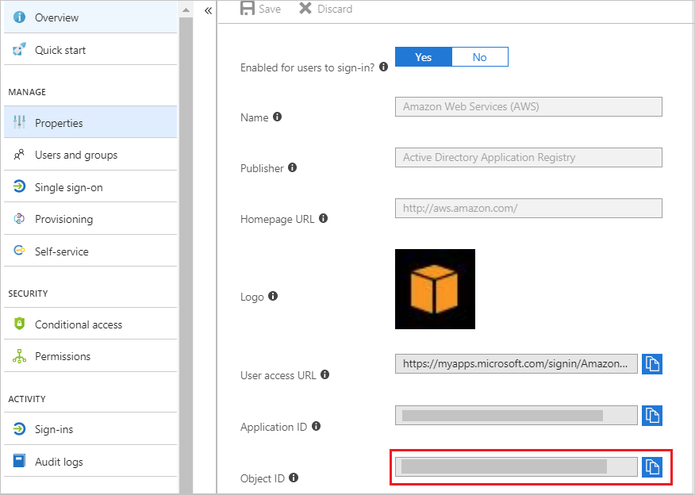

<a name='configure-and-test-azure-ad-sso'></a>

## Configure and test Microsoft Entra SSO

In this section, you configure and test Microsoft Entra single sign-on with AWS based on a test user called "Britta Simon."

For single sign-on to work, Microsoft Entra ID needs to know what the counterpart user in AWS is to the Microsoft Entra user. In other words, a link relationship between the Microsoft Entra user and the same user in AWS needs to be established.

In AWS, assign the value of the **user name** in Microsoft Entra ID as the value of the AWS **Username** to establish the link relationship.

To configure and test Microsoft Entra single sign-on with AWS, do the following:

1. **[Configure Microsoft Entra SSO](#configure-azure-ad-sso)** to enable your users to use this feature.
1. **[Configure AWS SSO](#configure-aws-sso)** to configure SSO settings on the application side.
1. **[Test SSO](#test-sso)** to verify that the configuration works.

<a name='configure-azure-ad-sso'></a>

### Configure Microsoft Entra SSO

In this section, you enable Microsoft Entra SSO in the Azure portal and configure SSO in your AWS application by doing the following:

1. Sign in to the [Microsoft Entra admin center](https://entra.microsoft.com) as at least a [Cloud Application Administrator](../roles/permissions-reference.md#cloud-application-administrator).
1. Browse to **Identity** > **Applications** > **Enterprise applications** >
 **Amazon Web Services (AWS)**.
1. select **Single sign-on**.

   

1. On the **Select a single sign-on method** pane, select **SAML/WS-Fed** mode to enable single sign-on.

   

1. On the **Set up Single Sign-On with SAML** pane, select the **Edit** button (pencil icon).

   

1. The **Basic SAML Configuration** pane opens. Skip this section, because the app is preintegrated with Azure. Select **Save**.

   The AWS application expects the SAML assertions in a specific format. You can manage the values of these attributes from the **User Attributes & Claims** section on the **Application integration** page.

1. On the **Set up Single Sign-On with SAML** page, select the **Edit** button.

   

1. In the **User Claims** section of the **User Attributes** pane, configure the SAML token attribute by using the values in the following table:

   | Name            | Source attribute                                                            | Namespace                                |
   | --------------- | --------------------------------------------------------------------------- | ---------------------------------------- |
   | RoleSessionName | user.userprincipalname                                                      | `https://aws.amazon.com/SAML/Attributes` |
   | Role            | user.assignedroles                                                          | `https://aws.amazon.com/SAML/Attributes` |
   | SessionDuration | "provide a value from 900 seconds (15 minutes) to 43200 seconds (12 hours)" | `https://aws.amazon.com/SAML/Attributes` |

   a. Select **Add new claim** and then, on the **Manage user claims** pane, do the following:

   

   

   b. In the **Name** box, enter the attribute name.

   c. In the **Namespace** box, enter the namespace value.

   d. For the **Source**, select **Attribute**.

   e. In the **Source attribute** drop-down list, select the attribute.

   f. Select **Ok**, and then select **Save**.

   > [!NOTE]
   > For more information about roles in Microsoft Entra ID, see [Add app roles to your application and receive them in the token](../develop/howto-add-app-roles-in-azure-ad-apps.md#app-roles-ui).

1. On the **Set up Single Sign-On with SAML** page, in the **SAML Signing Certificate** section, select **Download** to download the federation metadata XML file, and then save it to your computer.

   

### Configure AWS SSO

1. In a new browser window, sign in to your AWS company site as administrator.

1. Select the **AWS Home** icon.

   ![Screenshot of the "AWS Home" icon.][11]

1. On the **AWS services** pane, under **Security, Identity & Compliance**, select **IAM (Identity & Access Management)**.

   ![Screenshot of the "Identity and Access Management" link on the "AWS Services" pane.][12]

1. On the left pane, select **Identity Providers**, and then select **Create Provider**.

   ![Screenshot of the "Create Provider" button.][13]

1. On the **Configure Provider** pane, do the following:

   ![Screenshot of the "Configure Provider" pane.][14]

   a. In the **Provider Type** drop-down list, select **SAML**.

   b. In the **Provider Name** box, enter a provider name (for example. _WAAD_).

   c. Next to the **Metadata Document** box, select **Choose File** to upload your downloaded federation metadata XML file to the Azure portal.

   d. Select **Next Step**.

1. On the **Verify Provider Information** pane, select **Create**.

   ![Screenshot of the "Verify Provider Information" pane.][15]

1. On the left pane, select **Roles**, and then select **Create role**.

   ![Screenshot of the "Create role" button on the Roles pane.][16]

   > [!NOTE]
   > The combined length of the role Amazon Resource Name (ARN) and the SAML provider ARN for a role that's being imported must be 240 or fewer characters.

1. On the **Create role** page, do the following:

   ![Screenshot of the "SAML 2.0 federation" trusted entity button on the "Create role" page.][19]

   a. Under **Select type of trusted entity**, select **SAML 2.0 federation**.

   b. Under **Choose a SAML 2.0 provider**, select the SAML provider that you created previously (for example, _WAAD_)

   c. Select **Allow programmatic and AWS Management Console access**.

   d. Select **Next: Permissions**.

1. In the search box, enter **Administrator Access**, select the **AdministratorAccess** check box, and then select **Next: Tags**.

   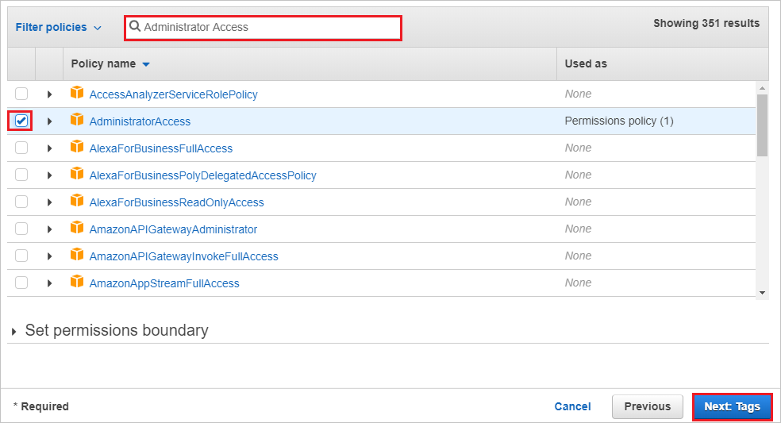

1. On the **Add tags (optional)** pane, do the following:

   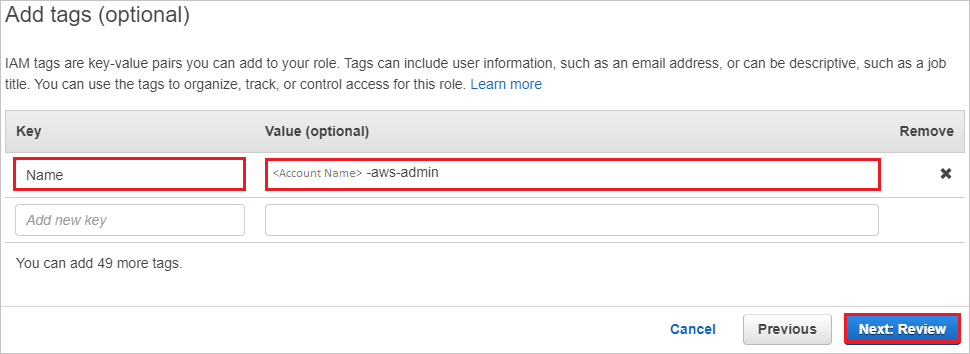

   a. In the **Key** box, enter the key name (for example, _Azureadtest_).

   b. In the **Value (optional)** box, enter the key value in the following format: `<accountname-aws-admin>`. The account name should be in all lowercase letters.

   c. Select **Next: Review**.

1. On the **Review** pane, do the following:

   ![Screenshot of the Review pane, with the "Role name" and "Role description" boxes highlighted.][34]

   a. In the **Role name** box, enter the value in the following format: `<accountname-aws-admin>`.

   b. In the **Role description** box, enter the value that you used for the role name.

   c. Select **Create role**.

   d. Create as many roles as you need, and map them to the identity provider.

   > [!NOTE]
   > Similarly, you can create other roles, such as _accountname-finance-admin_, _accountname-read-only-user_, _accountname-devops-user_, or _accountname-tpm-user_, each with a different policy attached to it. You can change these role policies later, according to the requirements for each AWS account. It's a good idea to keep the same policies for each role across the AWS accounts.

1. Be sure to note the account ID for the AWS account either from the Amazon Elastic Compute Cloud (Amazon EC2) properties pane or the IAM dashboard, as shown in the following screenshot:

   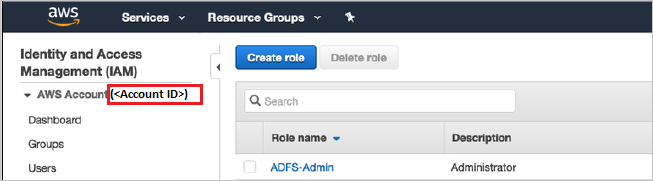

1. Sign in to the [Azure portal](https://portal.azure.com/), and then browse to **Groups**.

1. Create new groups with the same name as that of the IAM roles you created earlier, and then note the value in the **Object Id** box of each of these new groups.

   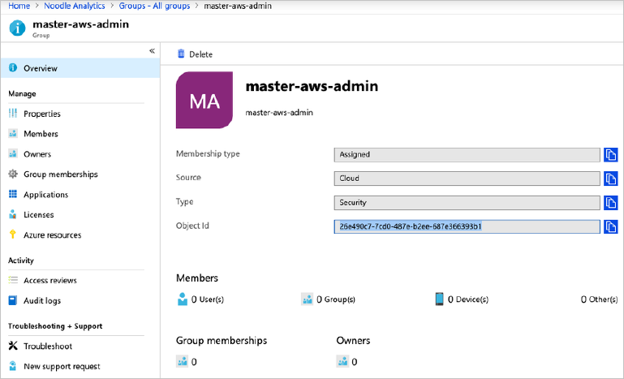

1. Sign out of the current AWS account, and then sign in to another account where you want to configure SSO with Microsoft Entra ID.

1. After you've created all the roles in the accounts, they're displayed in the **Roles** list for those accounts.

   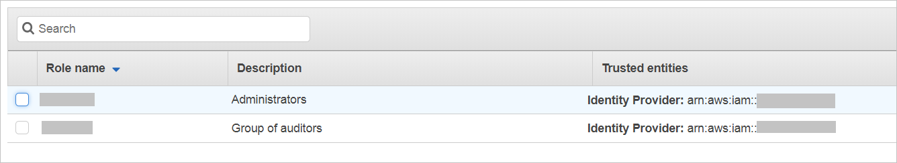

You next need to capture all the role ARNs and trusted entities for all roles across all accounts. You'll need to map them manually with the Microsoft Entra application. To do so:

1. Select each role to copy its role ARN and trusted entity values. You'll need them for all the roles that you'll create in Microsoft Entra ID.

   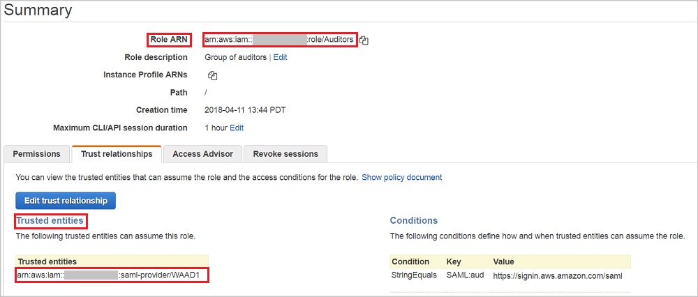

1. Repeat the preceding step for all the roles in all the accounts, and then store them in a text file in the following format: `<Role ARN>,<Trusted entities>`.

1. Open [Microsoft Graph Explorer](https://developer.microsoft.com/graph/graph-explorer), and then do the following:

   a. Sign in to the Microsoft Graph Explorer site with the Global Administrator or Co-admin credentials for your tenant.

   b. You need sufficient permissions to create the roles. Select **modify permissions**.

   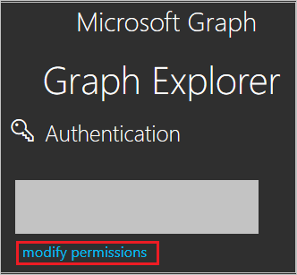

   c. In the permissions list, if you don't already have the permissions that are shown in the following screenshot, select each one, and then select **Modify Permissions**.

   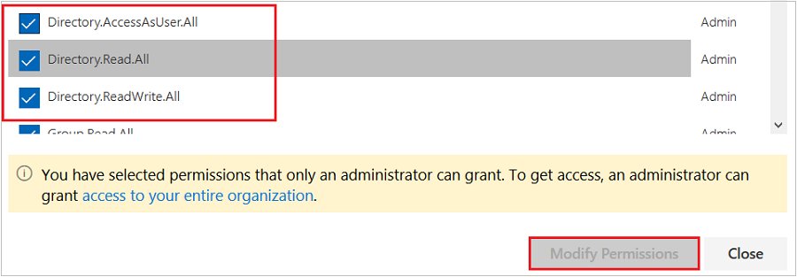

   d. Sign in to Graph Explorer again, and accept the site usage conditions.

   e. At the top of the pane, select **GET** for the method, select **beta** for the version, and then, in the query box, enter either of the following:

   - To fetch all the service principals from your tenant, use `https://graph.microsoft.com/beta/servicePrincipals`.
   - If you're using multiple directories, use `https://graph.microsoft.com/beta/contoso.com/servicePrincipals`, which contains your primary domain.

   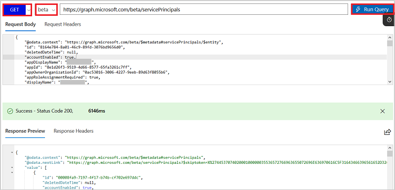

   f. From the list of service principals, get the one you need to modify.

   You can also search the application for all the listed service principals by selecting Ctrl+F. To get a specific service principal, include in the query the service principal object ID, which you copied earlier from the Microsoft Entra Properties pane, as shown here:

   `https://graph.microsoft.com/beta/servicePrincipals/<objectID>`.

   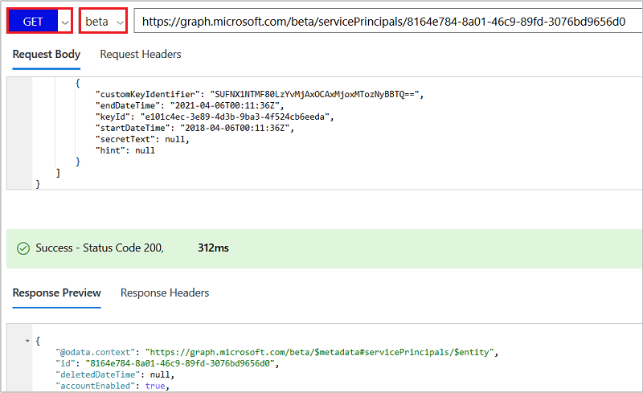

   g. Extract the appRoles property from the service principal object.

   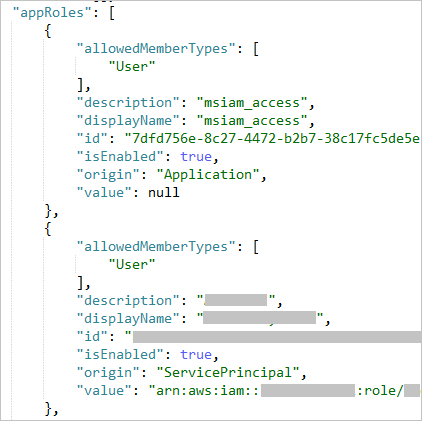

   h. You now need to generate new roles for your application.

   i. The following JSON code is an example of an appRoles object. Create a similar object to add the roles you want for your application.

   ```
   {
   "appRoles": [
       {
           "allowedMemberTypes": [
               "User"
           ],
           "description": "msiam_access",
           "displayName": "msiam_access",
           "id": "7dfd756e-8c27-4472-b2b7-38c17fc5de5e",
           "isEnabled": true,
           "origin": "Application",
           "value": null
       },
       {
           "allowedMemberTypes": [
               "User"
           ],
           "description": "Admin,WAAD",
           "displayName": "Admin,WAAD",
           "id": "4aacf5a4-f38b-4861-b909-bae023e88dde",
           "isEnabled": true,
           "origin": "ServicePrincipal",
           "value": "arn:aws:iam::12345:role/Admin,arn:aws:iam::12345:saml-provider/WAAD"
       },
       {
           "allowedMemberTypes": [
               "User"
           ],
           "description": "Auditors,WAAD",
           "displayName": "Auditors,WAAD",
           "id": "bcad6926-67ec-445a-80f8-578032504c09",
           "isEnabled": true,
           "origin": "ServicePrincipal",
           "value": "arn:aws:iam::12345:role/Auditors,arn:aws:iam::12345:saml-provider/WAAD"
       }    ]
   }
   ```

   > [!Note]
   > You can add new roles only after you've added _msiam_access_ for the patch operation. You can also add as many roles as you want, depending on your organization's needs. Microsoft Entra ID sends the _value_ of these roles as the claim value in the SAML response.

   j. In Microsoft Graph Explorer, change the method from **GET** to **PATCH**. Patch the service principal object with the roles you want by updating the appRoles property, like the one shown in the preceding example. Select **Run Query** to execute the patch operation. A success message confirms the creation of the role for your AWS application.

   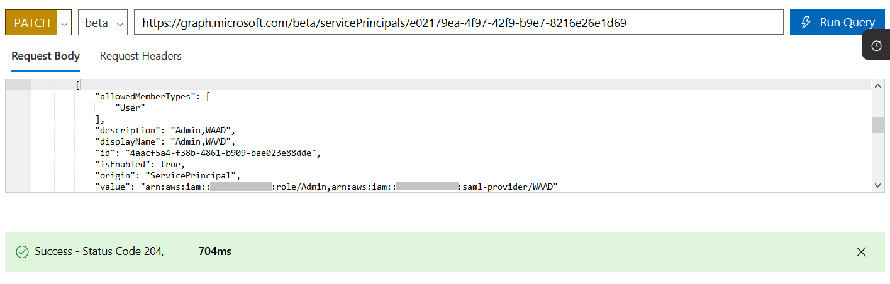

1. After the service principal is patched with more roles, you can assign users and groups to their respective roles. You do this in the Azure portal by going to the AWS application and then selecting the **Users and Groups** tab at the top.

1. We recommend that you create a new group for every AWS role so that you can assign that particular role in the group. This one-to-one mapping means that one group is assigned to one role. You can then add the members who belong to that group.

1. After you've created the groups, select the group and assign it to the application.

   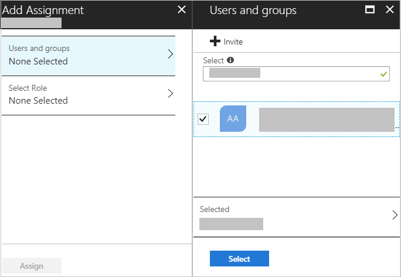

   > [!Note]
   > Nested groups are not supported when you assign groups.

1. To assign the role to the group, select the role, and then select **Assign**.

   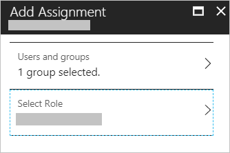

   > [!Note]
   > After you've assigned the roles, you can view them by refreshing your Azure portal session.

### Test SSO

In this section, you test your Microsoft Entra single sign-on configuration by using Microsoft My Apps.

When you select the **AWS** tile in My Apps, the AWS application page opens with an option to select the role.


You can also verify the SAML response to see the roles being passed as claims.


For more information about My Apps, see [Sign in and start apps from the My Apps portal](https://support.microsoft.com/account-billing/sign-in-and-start-apps-from-the-my-apps-portal-2f3b1bae-0e5a-4a86-a33e-876fbd2a4510).

## Next steps

After you configure AWS you can enforce session control, which protects the exfiltration and infiltration of your organization’s sensitive data in real time. Session control extends from Conditional Access. For more information, see [Learn how to enforce session control with Microsoft Defender for Cloud Apps](/cloud-app-security/proxy-deployment-aad).

<!--Image references-->

[11]: ./media/aws-multi-accounts-tutorial/ic795031.png
[12]: ./media/aws-multi-accounts-tutorial/ic795032.png
[13]: ./media/aws-multi-accounts-tutorial/ic795033.png
[14]: ./media/aws-multi-accounts-tutorial/ic795034.png
[15]: ./media/aws-multi-accounts-tutorial/ic795035.png
[16]: ./media/aws-multi-accounts-tutorial/ic795022.png
[17]: ./media/aws-multi-accounts-tutorial/ic795023.png
[18]: ./media/aws-multi-accounts-tutorial/ic795024.png
[19]: ./media/aws-multi-accounts-tutorial/ic795025.png
[32]: ./media/aws-multi-accounts-tutorial/ic7950251.png
[33]: ./media/aws-multi-accounts-tutorial/ic7950252.png
[35]: ./media/aws-multi-accounts-tutorial/tutorial-amazonwebservices-provisioning.png
[34]: ./media/aws-multi-accounts-tutorial/config3.png
[36]: ./media/aws-multi-accounts-tutorial/tutorial-amazonwebservices-securitycredentials.png
[37]: ./media/aws-multi-accounts-tutorial/tutorial-amazonwebservices-securitycredentials-continue.png
[38]: ./media/aws-multi-accounts-tutorial/tutorial-amazonwebservices-createnewaccesskey.png
[39]: ./media/aws-multi-accounts-tutorial/tutorial-amazonwebservices-provisioning-automatic.png
[40]: ./media/aws-multi-accounts-tutorial/tutorial-amazonwebservices-provisioning-testconnection.png
[41]: ./media/aws-multi-accounts-tutorial/
