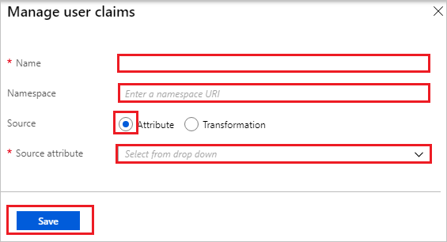

# Tutorial: Azure Active Directory integration with multiple Amazon Web Services (AWS) accounts

In this tutorial, you learn how to integrate Azure Active Directory (Azure AD) with multiple accounts of Amazon Web Services (AWS).

Integrating Amazon Web Services (AWS) with Azure AD provides you with the following benefits:

- You can control in Azure AD who has access to Amazon Web Services (AWS).
- You can enable your users to automatically get signed-on to Amazon Web Services (AWS) (Single Sign-On) with their Azure AD accounts.
- You can manage your accounts in one central location - the Azure portal.

If you want to know more details about SaaS app integration with Azure AD, see [what is application access and single sign-on with Azure Active Directory](../manage-apps/what-is-single-sign-on.md).


>[!NOTE]
>Please note connecting one AWS app to all your AWS accounts is not our recommended approach. Instead we recommend you to use [this](https://docs.microsoft.com/azure/active-directory/saas-apps/amazon-web-service-tutorial) approach to configure multiple instances of AWS account to Multiple instances of AWS apps in Azure AD.

**Please note that we do not recommend to use this approach for following reasons:**

* You have to use the Graph Explorer approach to patch all the roles to the app. We don’t recommend using the manifest file approach.

* We have seen customers reporting that after adding ~1200 app roles for a single AWS app, any operation on the app started throwing the errors related to size. There is a hard limit of size on the application object.

* You have to manually update the role as the roles get added in any of the accounts, which is a Replace approach and not Append unfortunately. Also if your accounts are growing then this becomes n x n relationship with accounts and roles.

* All the AWS accounts will be using the same Federation Metadata XML file and at the time of certificate rollover you have to drive this massive exercise to update the Certificate on all the AWS accounts at the same time

## Prerequisites

To configure Azure AD integration with Amazon Web Services (AWS), you need the following items:

- An Azure AD basic or premium subscription
- Amazon Web Services (AWS) multiple single sign-on enabled accounts

> [!NOTE]
> To test the steps in this tutorial, we do not recommend using a production environment.

To test the steps in this tutorial, you should follow these recommendations:

- Do not use your production environment, unless it is necessary.
- If you don't have an Azure AD trial environment, you can [get a one-month trial](https://azure.microsoft.com/pricing/free-trial/).

## Scenario description
In this tutorial, you test Azure AD single sign-on in a test environment. 
The scenario outlined in this tutorial consists of two main building blocks:

1. Adding Amazon Web Services (AWS) from the gallery
2. Configuring and testing Azure AD single sign-on

## Adding Amazon Web Services (AWS) from the gallery
To configure the integration of Amazon Web Services (AWS) into Azure AD, you need to add Amazon Web Services (AWS) from the gallery to your list of managed SaaS apps.

**To add Amazon Web Services (AWS) from the gallery, perform the following steps:**

1. In the **[Azure portal](https://portal.azure.com)**, on the left navigation panel, click **Azure Active Directory** icon. 

	

2. Navigate to **Enterprise applications**. Then go to **All applications**.

	
	
3. To add new application, click **New application** button on the top of dialog.

	

4. In the search box, type **Amazon Web Services (AWS)**, select **Amazon Web Services (AWS)** from result panel then click **Add** button to add the application.

	 _addfromgallery.png)

5. Once the application is added, go to **Properties** page and copy the **Object ID**.

	_properties.png)

## Configure and test Azure AD single sign-on

In this section, you configure and test Azure AD single sign-on with Amazon Web Services (AWS) based on a test user called "Britta Simon".

For single sign-on to work, Azure AD needs to know what the counterpart user in Amazon Web Services (AWS) is to a user in Azure AD. In other words, a link relationship between an Azure AD user and the related user in Amazon Web Services (AWS) needs to be established.

In Amazon Web Services (AWS), assign the value of the **user name** in Azure AD as the value of the **Username** to establish the link relationship.

To configure and test Azure AD single sign-on with Amazon Web Services (AWS), you need to complete the following building blocks:

1. **[Configure Azure AD Single Sign-On](#configure-azure-ad-single-sign-on)** - to enable your users to use this feature.
2. **[Test single sign-on](#test-single-sign-on)** - to verify whether the configuration works.

### Configure Azure AD single sign-on

In this section, you enable Azure AD single sign-on in the Azure portal and configure single sign-on in your Amazon Web Services (AWS) application.

**To configure Azure AD single sign-on with Amazon Web Services (AWS), perform the following steps:**

1. In the [Azure portal](https://portal.azure.com/), on the **Amazon Web Services (AWS)** application integration page, select **Single sign-on**.

    

2. On the **Select a Single sign-on method** dialog, select **SAML** mode to enable single sign-on.

    

3. On the **Set up Single Sign-On with SAML** page, click **Edit** button to open **Basic SAML Configuration** dialog.

	

4. On the **Basic SAML Configuration** section, the user does not have to perform any step as the app is already pre-integrated with Azure.

    _url.png)

5. Amazon Web Services (AWS) application expects the SAML assertions in a specific format. Configure the following claims for this application. You can manage the values of these attributes from the **User Attributes & Claims** section on application integration page. On the **Set up Single Sign-On with SAML** page, click **Edit** button to open **User Attributes & Claims** dialog.

	

6. In the **User Claims** section on the **User Attributes & Claims** dialog, configure SAML token attribute as shown in the image above and perform the following steps:
    
	| Name  | Source Attribute  | Namespace |
	| --------------- | --------------- | --------------- |
	| RoleSessionName | user.userprincipalname | https://aws.amazon.com/SAML/Attributes |
	| Role 			  | user.assignedroles |  https://aws.amazon.com/SAML/Attributes |
	| SessionDuration 			  | "provide a value between 900 seconds (15 minutes) to 43200 seconds (12 hours)" |  https://aws.amazon.com/SAML/Attributes |

	a. Click **Add new claim** to open the **Manage user claims** dialog.

	

	

	b. In the **Name** textbox, type the attribute name shown for that row.

	c. Enter the **Namespace** value.

	d. Select Source as **Attribute**.

	e. From the **Source attribute** list, type the attribute value shown for that row.

	f. Click **Save**.

7. On the **Set up Single Sign-On with SAML** page, in the **SAML Signing Certificate** section, click **Download** to download the **Federation Metadata XML** and save it on your computer.

	_certificate.png) 

8. In a different browser window, sign-on to your Amazon Web Services (AWS) company site as administrator.

9. Click **AWS Home**.

    ![Configure Single Sign-On home][11]

10. Click **Identity and Access Management**.

    ![Configure Single Sign-On Identity][12]

11. Click **Identity Providers**, and then click **Create Provider**.

    ![Configure Single Sign-On Provider][13]

12. On the **Configure Provider** dialog page, perform the following steps:

    ![Configure Single Sign-On dialog][14]

	a. As **Provider Type**, select **SAML**.

	b. In the **Provider Name** textbox, type a provider name (for example: *WAAD*).

	c. To upload your downloaded **metadata file** from Azure portal, click **Choose File**.

	d. Click **Next Step**.

13. On the **Verify Provider Information** dialog page, click **Create**.

    ![Configure Single Sign-On Verify][15]

14. Click **Roles**, and then click **Create role**.

    ![Configure Single Sign-On Roles][16]

15. On the **Create role** page, perform the following steps:  

    ![Configure Single Sign-On Trust][19]

    a. Select **SAML 2.0 federation** under **Select type of trusted entity**.

	b. Under **Choose a SAML 2.0 Provider section**, select the **SAML provider** you have created previously (for example: *WAAD*)

	c. Select **Allow programmatic and AWS Management Console access**.
  
    d. Click **Next: Permissions**.

16. On the **Attach Permissions Policies** dialog, you don't need to attach any policy. Click **Next: Review**.  

    ![Configure Single Sign-On Policy][33]

17. On the **Review** dialog, perform the following steps:

    ![Configure Single Sign-On Review][34]

	a. In the **Role name** textbox, enter your Role name.

	b. In the **Role description** textbox, enter the description.

    c. Click **Create Role**.

    d. Create as many roles as needed and map them to the Identity Provider.

18. Sign out from current AWS account and login with other account where you want to configure single sign on with Azure AD.

19. Perform step-9 to step-17 to create multiple roles that you want to setup for this account. If you have more than two accounts, please perform the same steps for all the accounts to create roles for them.

20. Once all the roles are created in the accounts, they show up in the **Roles** list for those accounts.

	_listofroles.png)

21. We need to capture all the Role ARN and Trusted Entities for all the roles across all the accounts, which we need to map manually with Azure AD application. 

22. Click on the roles to copy **Role ARN** and **Trusted Entities** values. You need these values for all the roles that you need to create in Azure AD.

	_role_summary.png)

23. Perform the above step for all the roles in all the accounts and store all of them in format **Role ARN,Trusted entities** in a notepad.

24. Open [Azure AD Graph Explorer](https://developer.microsoft.com/graph/graph-explorer) in another window.

	a. Sign in to the Graph Explorer site using the Global Admin/Co-admin credentials for your tenant.

	b. You need to have sufficient permissions to create the roles. Click on **modify permissions** to get the required permissions.

	

	c. Select following permissions from the list (if you don't have these already) and click "Modify Permissions" 

	

	d. This will ask you to login again and accept the consent. After accepting the consent, you are logged into the Graph Explorer again.

	e. Change the version dropdown to **beta**. To fetch all the Service Principals from your tenant, use the following query:

	 `https://graph.microsoft.com/beta/servicePrincipals`

	If you are using multiple directories, then you can use following pattern, which has your primary domain in it
	`https://graph.microsoft.com/beta/contoso.com/servicePrincipals`

	

	f. From the list of Service Principals fetched, get the one you need to modify. You can also use the Ctrl+F to search the application from all the listed ServicePrincipals. You can use following query by using the **Object id** which you have copied from Azure AD Properties page to get to the respective Service Principal.

	`https://graph.microsoft.com/beta/servicePrincipals/<objectID>`.

	

	g. Extract the appRoles property from the service principal object.

	

	h. You now need to generate new roles for your application. 

	i. Below JSON is an example of appRoles object. Create a similar object to add the roles you want for your application.

	```
	{
	"appRoles": [
        {
            "allowedMemberTypes": [
                "User"
            ],
            "description": "msiam_access",
            "displayName": "msiam_access",
            "id": "7dfd756e-8c27-4472-b2b7-38c17fc5de5e",
            "isEnabled": true,
            "origin": "Application",
            "value": null
        },
        {
            "allowedMemberTypes": [
                "User"
            ],
            "description": "Admin,WAAD",
            "displayName": "Admin,WAAD",
            "id": "4aacf5a4-f38b-4861-b909-bae023e88dde",
            "isEnabled": true,
            "origin": "ServicePrincipal",
            "value": "arn:aws:iam::12345:role/Admin,arn:aws:iam::12345:saml-provider/WAAD"
        },
        {
            "allowedMemberTypes": [
                "User"
            ],
            "description": "Auditors,WAAD",
            "displayName": "Auditors,WAAD",
            "id": "bcad6926-67ec-445a-80f8-578032504c09",
            "isEnabled": true,
            "origin": "ServicePrincipal",
            "value": "arn:aws:iam::12345:role/Auditors,arn:aws:iam::12345:saml-provider/WAAD"
        }    ]
	}
	```

	> [!Note]
	> You can only add new roles after the **msiam_access** for the patch operation. Also, you can add as many roles as you want per your Organization need. Azure AD will send the **value** of these roles as the claim value in SAML response.

	j. Go back to your Graph Explorer and change the method from **GET** to **PATCH**. Patch the Service Principal object to have desired roles by updating appRoles property similar to the one shown above in the example. Click **Run Query** to execute the patch operation. A success message confirms the creation of the role for your Amazon Web Services application.

	

25. After the Service Principal is patched with more roles, you can assign Users/Groups to the respective roles. This can be done by going to portal and navigating to the Amazon Web Services application. Click on the **Users and Groups** tab on the top. 

26. We recommend you to create new groups for every AWS role so that you can assign that particular role in that group. Note that this is one to one mapping for one group to one role. You can then add the members who belong to that group.

27. Once the Groups are created, select the group and assign to the application.

	

> [!Note]
> Nested groups are not supported when assigning groups.

28. To assign the role to the group, select the role and click on **Assign** button in the bottom of the page.

	

> [!Note]
> Please note that you need to refresh your session in Azure portal to see new roles.

### Test single sign-on

In this section, you test your Azure AD single sign-on configuration using the Access Panel.

When you click the Amazon Web Services (AWS) tile in the Access Panel, you should get Amazon Web Services (AWS) application page with option to select the role.

_test_screen.png)

You can also verify the SAML response to see the roles being passed as claims.

_test_saml.png)

For more information about the Access Panel, see [Introduction to the Access Panel](../active-directory-saas-access-panel-introduction.md). 

## Additional resources

* [List of Tutorials on How to Integrate SaaS Apps with Azure Active Directory](tutorial-list.md)
* [What is application access and single sign-on with Azure Active Directory?](../manage-apps/what-is-single-sign-on.md)

<!--Image references-->

[11]: ./media/aws-multi-accounts-tutorial/ic795031.png
[12]: ./media/aws-multi-accounts-tutorial/ic795032.png
[13]: ./media/aws-multi-accounts-tutorial/ic795033.png
[14]: ./media/aws-multi-accounts-tutorial/ic795034.png
[15]: ./media/aws-multi-accounts-tutorial/ic795035.png
[16]: ./media/aws-multi-accounts-tutorial/ic795022.png
[17]: ./media/aws-multi-accounts-tutorial/ic795023.png
[18]: ./media/aws-multi-accounts-tutorial/ic795024.png
[19]: ./media/aws-multi-accounts-tutorial/ic795025.png
[32]: ./media/aws-multi-accounts-tutorial/ic7950251.png
[33]: ./media/aws-multi-accounts-tutorial/ic7950252.png
[35]: ./media/aws-multi-accounts-tutorial/tutorial_amazonwebservices_provisioning.png
[34]: ./media/aws-multi-accounts-tutorial/ic7950253.png
[36]: ./media/aws-multi-accounts-tutorial/tutorial_amazonwebservices_securitycredentials.png
[37]: ./media/aws-multi-accounts-tutorial/tutorial_amazonwebservices_securitycredentials_continue.png
[38]: ./media/aws-multi-accounts-tutorial/tutorial_amazonwebservices_createnewaccesskey.png
[39]: ./media/aws-multi-accounts-tutorial/tutorial_amazonwebservices_provisioning_automatic.png
[40]: ./media/aws-multi-accounts-tutorial/tutorial_amazonwebservices_provisioning_testconnection.png
[41]: ./media/aws-multi-accounts-tutorial/